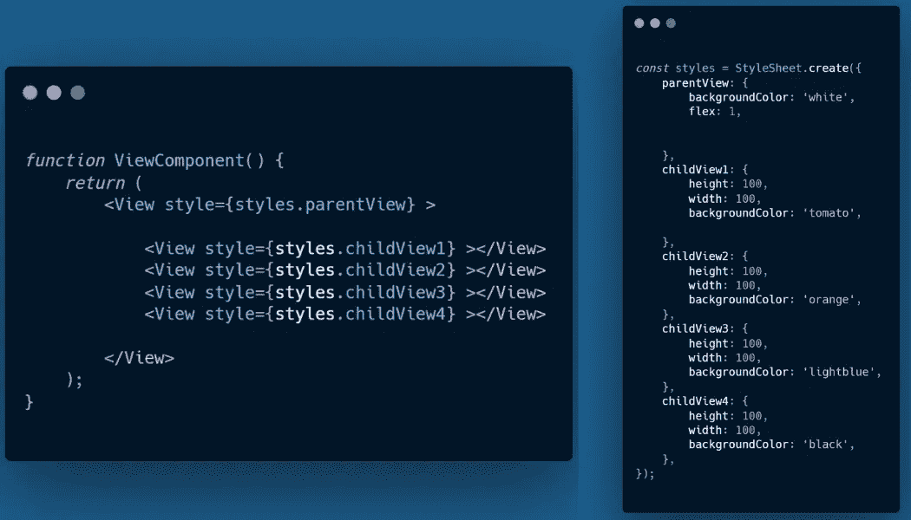

# 在 React Native 中定位和排列视图组件

> 原文：<https://javascript.plainenglish.io/view-component-in-react-native-positioning-arranging-feac009b5661?source=collection_archive---------2----------------------->

## 对齐项目并构建出色的视图组件

几年前，当我开始学习 React Native 时，在视图组件中对齐项目曾经是一个很大的疑问，像 **alignItems** 、**align content**&**justify content**这样的道具在开始时总是有相同的意义，但通过正确的方法，随着一些实践，它真的很容易理解。在理解如何在**视图**组件中对齐和排列项目的同时，我们将查看一些实践。

> 在我们深入概念之前，注意我们需要定义**宽度&高度**或**背景颜色**来渲染一个视图，否则你不会观察到屏幕上正在渲染的任何东西。

## 弯曲

flex 属性决定了项目将如何填充主轴上的可用区域，在 **React Native** 中，flex 的工作方式与在 **CSS** 中不同，这里 flex 只是一个数字而不是一个字符串，并根据 [**Yoga**](https://github.com/facebook/yoga) *(实现 flexbox 的跨平台布局引擎)*布局引擎工作。

*   Flex 是一个正数，它使组件灵活，组件的大小总是与其 **flex 值**成比例。
*   例如，带有 flex:2 的组件将占据两倍于带有 flex:1 的组件的位置。
*   当 flex 为 0 时，组件根据其**高度** & **宽度**属性调整大小。
*   当 flex: -1 时，组件尺寸通常根据其**高度** & **宽度**确定，但是如果没有足够的空间容纳组件，它将收缩到其高度&宽度的最小可能值(**最小高度&最小宽度**)。

***例如:***

我们有一个普通的视图组件，带有 **flex:** 1 和**background color:**‘番茄’

**A Basic View Component**

但是如果我们做一些改变，设置 **flex: 0.5** ，视图组件只覆盖了一半的可用空间。

## 弯曲方向

flexDirection 属性控制容器的子容器的增长方向， ***行*** 从左到右， ***列*** 从上到下。

*   **行:**从左到右对齐子项。
*   **列:**上下对齐子节点 ***(默认值)*** 。
*   **row-reverse:** 从右向左对齐子节点。
*   **列-反转:**从下到上对齐子项。

注意，如果我们没有定义 **flexDirection** ，默认情况下，它在 **React Native 中被设置为 ***列*** 。**为了便于理解，我们举了一个例子，我们在一个 **parentView** 组件中呈现了 4 个 **childView** 组件，然后我们在 parentView 组件中定义了 flexDirection。

> 请注意，我们没有为 parentView 中的**列** *定义 flexDirection，因为默认情况下已经定义了它*

当我们将 flexDirection 定义为 row 时，我们的 4 个**子视图**组件就会以 row 的方式排列。

## 调整内容

描述子元素如何在容器的主轴内对齐，我们可以使用该属性在容器内水平对齐子元素，并将 **flexDirection** 设置为 row，反之亦然。

*   **flex-start:** 将子项与容器主轴的起点对齐。
*   **flex-end:** 将子项与容器主轴的末端对齐。
*   **中心:**在容器主轴的中心对齐子对象。
*   **space-between:** 在容器的主轴上均匀分布子元素。

例如，在上面的演示中，如果我们将 **justifyContent** 定义为***space-between***，那么所有的 4 个 **childView** 组件都会占用这个空间。

## alignItems

该属性类似于 **justifyContent** ，但是这里的项目沿着**横轴**对齐，而不是像我们在 justifyContent 中那样沿着主轴对齐项目。

*   **flex-start:** 在容器横轴的起点对齐。
*   **弯曲端:**对准容器横轴的末端。
*   **中心:**对准容器横轴的中心。
*   基线:沿着一条共同的基线对齐。
*   **拉伸:**(默认值):拉伸子对象，以匹配容器横轴的高度。

## 自我调整

该属性与 alignItems 非常相似，但我们可以使用该属性对齐单个子组件，而不是对齐父容器中的子组件，因为它覆盖了父容器设置的任何选项。

例如，我们可以通过将 **alignSelf** 定义为 **flex-end** 来将红色容器移动到屏幕的末端。

## align 内容

该属性定义了沿着**横轴**的线分布，并且仅当使用 **flexWrap** 将项目包装成多条线时有效。请注意，仅当您将 flexWrap 应用到父容器时，它才起作用。

例如，如果我们将***felx wrap:***wrap&align content:center 应用到我们的 **parentView** 组件，我们将获得以下结果。

