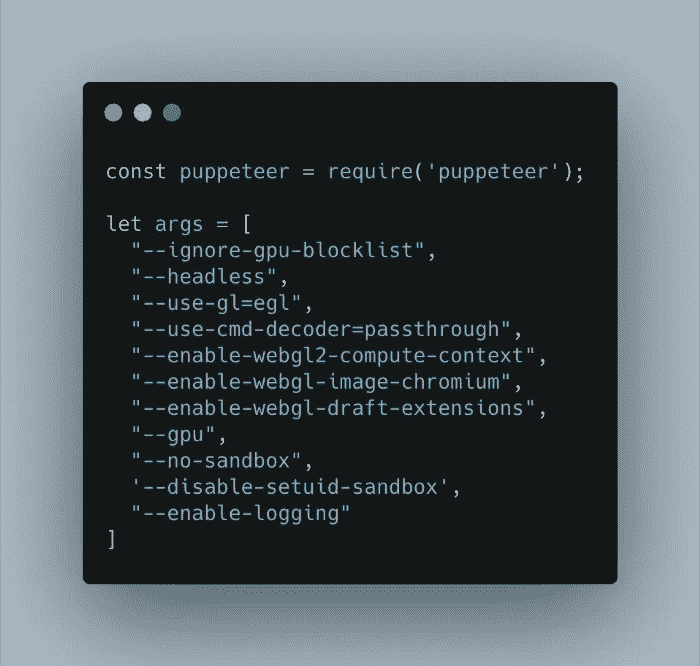
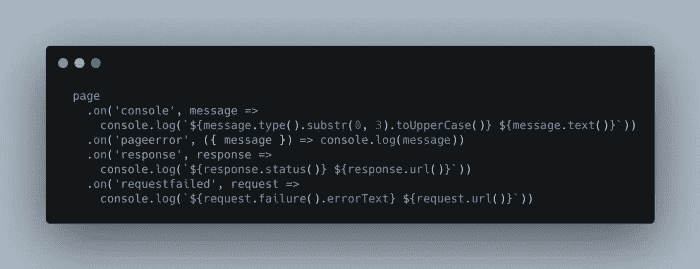
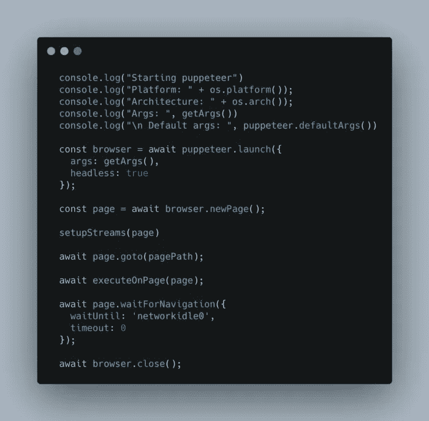

# 使用 Headless Chrome 和 Docker 运行 GPU 计算

> 原文：<https://javascript.plainenglish.io/visit-websites-without-opening-the-browser-9ee3cf18abdd?source=collection_archive---------5----------------------->

## 了解如何使用 headless Chrome、简单 JavaScript 和 Docker 容器与网站交互。


Photo by [Kevin Bhagat](https://unsplash.com/@kevnbhagat?utm_source=medium&utm_medium=referral) on [Unsplash](https://unsplash.com?utm_source=medium&utm_medium=referral)

您可能需要以编程方式访问某个网站。出于不同的原因，它可能会有所帮助。这里有几个例子:

1.  快速准确地测试网站的行为，无需手动刷新或检查。您可以自动化与网站的交互，如按钮点击、表单提交、UI 测试等。
2.  收集服务器端渲染图。
3.  生成网站截图。
4.  测试 chrome 扩展。
5.  将这个过程集成到您的测试管道中。使用 Selenium 和 Cypress 之类的测试框架可能不会有问题。
6.  以编程方式对浏览器进行更精细的控制；例如，强制 GPU 用于图形计算，启用不同的渲染器，绘制扩展等。
7.  根据网站 UI 内容制作工具。

这个设置有三个主要部分:puppeteer，一个非强制的 docker 容器，以及您想要访问的网站。

我用 Nvidia Tesla GPU 在 Ubuntu 20.04 上测试了以下代码。

# 操纵木偶的人

> *puppet er 是一个节点库，它提供了一个高级 API 来控制 Chrome 或通过* [*DevTools 协议*](https://chromedevtools.github.io/devtools-protocol/) *的 Chrome。木偶师默认运行* [*无头*](https://developers.google.com/web/updates/2017/04/headless-chrome) *，但可以配置为运行全(无头)铬或铬。*

第一步是包含木偶师并定义所需的参数。

确保使用无头选项。请注意，目前在 Mac 上，即使在 headless 模式下，它也会启动一个实例，然后很快隐藏它，因此在该平台上的性能是有问题的。

```
--headless
```

选择 GPU 进程应该使用哪个 GL 也很重要。选项包括:

*   **桌面**:用户已经安装的任何桌面 OpenGL(Linux 和 Mac 默认)。
*   **egl** :用户安装的任何 EGL/gles 2(Windows 默认——实际角度)。
*   **swift shader**:swift shader 软件渲染程序。

```
--use-gl=egl
```

以下是对所有可能选项的精彩描述:[https://Peter . sh/experiments/chromium-command-line-switches/](https://peter.sh/experiments/chromium-command-line-switches/)



在构建设置时，一个有用的步骤是将控制台日志从 web 应用程序重定向到 puppeteer 标准输出。如下图所示，page 对象可以通过挂钩控制台、页面错误流等进行重定向。



请注意，您可以使用下面的函数访问一组默认参数。确保检查它们，如果某些内容对您的设置无效，请覆盖它们。

```
puppeteer.defaultArgs()
```

然后您可以使用 *launch* 函数启动 puppeteer 并传递参数。返回的对象是浏览器的句柄。

使用浏览器句柄，您可以开始与网站进行交互。几个常见的步骤是在浏览器中打开一个新页面，使用 *newpage* 函数获得一个新的页面对象。页面对象具有用于访问网站的 *goto* 功能。

您可以使用页面句柄上的函数进行异步交互，例如 *waitforNavigation* ，它会一直等到页面刷新。

最后，别忘了使用 *browser.close()* 关闭浏览器。



# 码头工人

一个重要的任务是将 Nvidia 驱动程序暴露给 Docker 容器。我发现最简单的方法是将您的容器基于 Nvidia open GL 映像，例如:

```
nvidia/opengl:1.2-glvnd-devel-ubuntu20.04
```

完整的代码如下。确保安装所有的 chrome 依赖项。你不需要在系统范围内单独安装 Chrome，因为木偶师包下载了一个兼容的 Chrome 二进制文件。但我认为安装 Chrome 更容易获得所有的依赖项。此外，您需要安装可能与下面不同的任何附加依赖项。我安装了基本的 Unix 工具、字体、节点、npm 等。

# 前端服务器

一旦你设置好木偶和码头，你可以访问任何网站。一个例子是你的网站呈现一些用户界面。您可以访问该网站，并从您的 JavaScript 脚本舒适的截图:)

下面的 HTML 创建了一个简单的三 JS 场景并渲染了一些着色器。

在本地主机服务器上提供服务后访问网站的代码非常简单:

```
const page = await browser.newPage(); 
await page.goto(pagePath); 
await page.screenshot({path: outputName + '.png'}); 
await page.pdf({path: outputName + '.pdf'})
```

我在 GPU 上同时运行 64 个木偶师实例并捕获网站内容，取得了相当好的性能。docker 和 puppeteer 选项可能会进一步优化以加快渲染速度，但可能会过于特定于内容。

*更多内容请看*[***plain English . io***](http://plainenglish.io/)