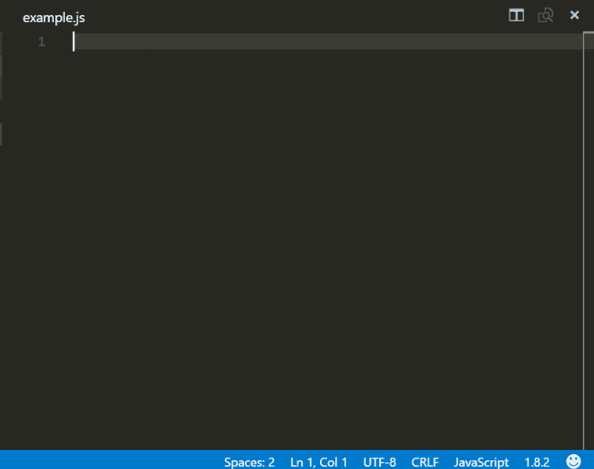

# VS 代码片段:通过快捷方式提高生产力

> 原文：<https://javascript.plainenglish.io/visual-studio-code-snippets-boost-productivity-with-shortcuts-d38154303af8?source=collection_archive---------11----------------------->

作为开发人员，我们总是希望更有效率。谁不喜欢用较少的击键次数编写更多的代码呢？代码片段提供的正是这一点。让我们在这篇文章中更深入地探究 Visual Studio 代码片段的细节。

代码片段指的是常见的功能，或者是文件结构，或者是非常适合死记硬背和样板文件的模板。这不是什么新鲜事。传统上，我们将它们存储在一个文件中，并手动将它们复制粘贴到任何需要的地方。

你们中的一些人可能会对拥有一个可以复制粘贴的文件而摇头。我们是现代程序员。我们用 Google 和 Stack Overflow 来做那些事情！我也不反对。但是代码片段不仅仅指我们从堆栈溢出中复制的一行代码(好吧，我们可能会复制更多，但是嘘！).但是当我提到代码片段时，我通常指的是相对较大的代码片段。

进化的下一步是自动热键，这是一种键盘组合，允许将特定的片段粘贴到编辑器中。但是我们总是可以更进一步？

## Visual Studio 代码段



Visual Studio 代码片段不仅仅是在当前指针位置粘贴代码。在讨论这些新奇的东西之前，让我们先看看如何创建一个 Visual Studio 代码片段。

# 创建代码片段

在键盘上按 Ctrl(或 Cmd) + Shift + P 打开 VS 代码中的命令面板。然后，我们可以搜索“配置用户片段”选项。它允许我们选择想要创建代码片段的语言。对于我们的例子，我们将选择 JavaScript。

打开的代码片段编辑器显示一条注释，告诉我们如何自己创建 Visual Studio 代码片段。代码段文件是 JSON 文件，用户可以定义无限数量的自定义 Visual Studio 代码段。如果我们想添加一些的话，它们支持 C 风格的代码注释。

片段由 4 部分组成:

*   **Name:** 智能感知将为该代码段显示什么(也是 JSON 对象的键)
*   **前缀:**触发代码片段的字符组合
*   **正文:**要复制的内容
*   **描述:**代码段的可选描述(显示在 Intellisense 的工具提示中)

从我们自己的“Hello World”片段开始:

```
{
  "hello world": {
    "prefix": "hello",
    "body": "Hello World"
  }
}
```

每当我们调用 hello world 语句时，上面的代码片段都会产生一个 hello world 语句。主体也可以是字符串数组，这样我们就可以把它分成多行。

# 调用代码段的方法

1.  我们可以再次使用命令面板，选择“插入代码片段”,然后选择我们希望插入的代码片段。
2.  我们可以使用智能感知来帮助我们。我们可以键入我们之前指定的前缀，然后使用 Ctrl 和 Space 的键盘组合来插入代码片段，并从显示的列表中选择它。
3.  我们可以为一个单独的代码片段分配一个自定义的键盘快捷键。我们可以在键盘设置中为代码片段分配一个键绑定。
    在命令面板的“打开键盘设置(JSON)”选项中，我们可以添加一个绑定:

```
[
    {
        "key": "ctrl+k 1",
        "command": "editor.action.insertSnippet",
        "when": "editorTextFocus",
        "args": {
            "langId": "javascript",
            "name": "hello"
        }
    }
]
```

但是一个简单的 hello world 片段有什么用呢？Visual Studio 代码片段远不止这些！让我们深入了解一下。

# 向代码段添加变量

我们可以使用诸如所选文本、系统日期、剪贴板内容、环境变量等值。让我们将 hello world 字符串放在注释块中。

```
{
  "hello world": {
    "prefix": "hello-world",
    "body": "$BLOCK_COMMENT_START Hello World $BLOCK_COMMENT_END"
  }
}
```

上面的代码片段将在 JavaScript 文件中插入字符串`/* Hello World */`。但是在 HTML 文件中，它会插入:`<!-- Hello World -->`

同样，我们可以使用`TM_SELECTED_TEXT`插入当前选中的文本，`CLIPBOARD`复制剪贴板，`CURRENT_YEAR`当前年份和类似的变量。

# 使用制表位的动态片段

我们不只是从网上复制粘贴东西。我们也改变了一些东西，对吗？

我们按照自己喜欢的方式给变量命名。

Visual Studio 代码片段允许我们拥有不同种类的动态代码片段，让我们感觉像一个向导一样的体验。我们可以:

# 制表位

我们可以用 tab 键按顺序圈出编号的停靠点。它们是由一个美元符号指定的，后面跟着我们想把它们圈起来的顺序。这些可以使用`$1`、`$2`等进行声明。

`$0`是最终的光标位置。如果指定，VS 代码在到达这个位置时退出代码段模式。

```
{
    "Hello variable": {
        prefix: "div",
        body: ["Hello ","$1", "$0"]
    }
}
```

# 占位符

焦点上覆盖默认值的制表位。它们被写成一个美元符号，后面跟一个花括号，花括号包含位置和值，用冒号分隔。

示例声明:`${1:default}`

# 选择

它为用户提供了一个选择。当关注这些值时，会出现一个值下拉列表供选择。示例声明:`${1|one,two,three|}`

```
"Console Choice": {
    "prefix": "console-ch",
    "body": "console.${1|log,warning,error|}('$2');",
}
```

# 镜像制表位

相同的制表位可以在代码段内的多个位置使用。是的，for 循环中的“I”变量就是最好的例子。对其中一个站点的任何编辑都会更新所有站点。

示例:`import ${2:${1:module}} from '${1:module}'$0`

或者我们最喜欢的 for 循环可以写成:(“\t”是为了格式化和缩进而添加的)。

```
"for ": {
    "prefix": "forarr",
    "body": [
        "for (let ${index} = 0; ${index} < ${array}.length; ${index}++) {",
        "\tconst ${element} = ${array}[${index}];",
        "\t$0",
        "}"
    ],
},
```

# 应用变换

我们甚至可以对变量或占位符应用正则表达式转换。格式是:

```
${variable or placeholder/regex/replacement string/flags}
```

如果你知道正则表达式，这可能很容易理解。

例如:

```
${CLIPBOARD/(.*)/${1:/upcase}/}
```

将以大写形式粘贴剪贴板中的内容。

# 结论

既然我们知道了一切皆有可能，我们可能会想制作大量的片段。有一个[工具](https://snippet-generator.app/)可以帮助我们。Snippet Generator 是一个允许我们使用可视化界面这样做的网站。或者我们可以在 VS 代码市场中搜索代码片段。外面有成千上万的人。我最喜欢的是[eses 7 React/Redux/graph QL/React-Native snippets](https://marketplace.visualstudio.com/items?itemName=dsznajder.es7-react-js-snippets)。

这就是 Visual Studio 代码片段的全部内容！通过少量的配置，我们可以使 VS 代码更加强大，并根据我们的工作流程对其进行调整。请在下面的评论中告诉我们你打算创建哪些自定义代码片段？

*原载于 2021 年 2 月 11 日 https://www.wisdomgeek.com*[](https://www.wisdomgeek.com/development/programming/visual-studio-code-snippets-boost-productivity-with-shortcuts/)**。**