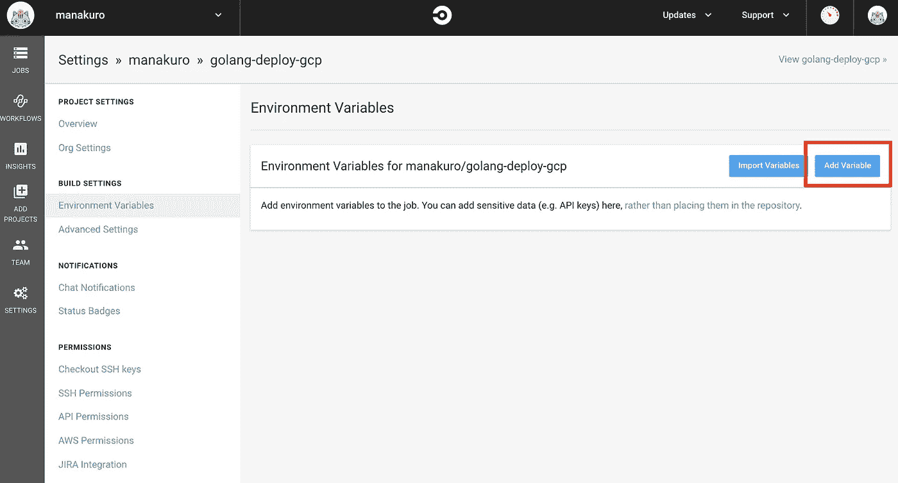
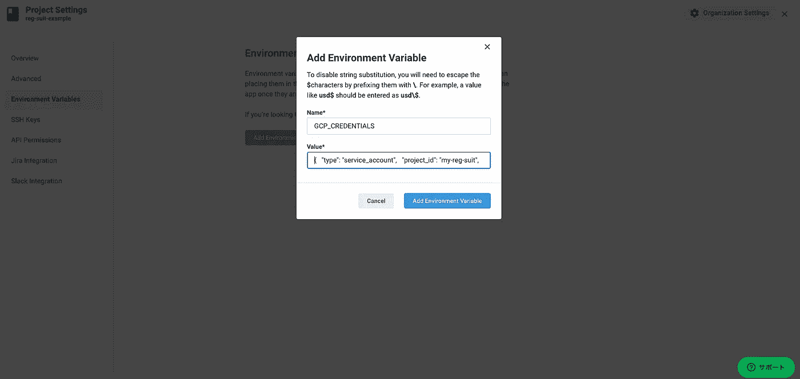
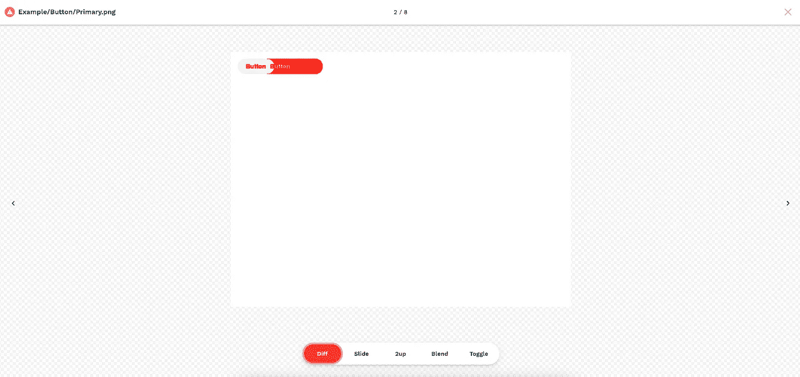

# 用故事书和服装进行视觉测试

> 原文：<https://javascript.plainenglish.io/visual-testing-with-storybook-and-reg-suit-82219101afb?source=collection_archive---------8----------------------->

## 为你的用户界面引入自动视觉测试


在这篇文章中，我将向你展示如何使用 reg-suit 进行视觉测试。

你的应用程序在组件和布局上可能有无数不同的状态。那么就很难找到每一个用户界面的变化，你会忘记它们应该是什么样子。

为了避免这种情况，自动 UI 测试对于您的工作流是必要的。

[reg-suit](https://github.com/reg-viz/reg-suit) 是一款视觉测试工具，允许您:

*   将用户界面更改与前一次进行比较
*   检查由 HTML 生成的报告
*   如果用户界面发生变化，在 CI 服务期间获得 PR 通知

# 回购示例

以下是最终代码库的参考:

[](https://github.com/manakuro/reg-suit-example) [## mana kuro/reg-suit-示例

github.com](https://github.com/manakuro/reg-suit-example) 

# 内容

*   设置 React 应用程序
*   设置故事书
*   设置 storycap
*   设置注册套装
*   建立 CircleCI

# 设置 React 应用程序

为了快速启动，我们使用`[create-react-app](https://github.com/facebook/create-react-app)`来设置 React 应用程序:

```
npx create-react-app reg-suit-app --template typescript
```

安装后，通过运行以下命令运行开发服务器:

```
yarn start
```

您将看到欢迎页面:


Welcome page

# 设置故事书

接下来，我们将设置故事书。

要安装故事书，请在项目根目录下运行 CLI:

```
npx sb init
```

安装后，运行服务器:

```
yarn storybook
```

你会看到有一些例子的页面，像这样:


# 设置 storycap

storycap 是一个抓取你的故事书文件并截图的工具。使用 reg-suit，需要截图来比较 UI 的快照。

安装它:

```
yarn add -D storycap
```

并运行故事书服务器:

```
yarn storybook
```

另一个终端，运行 storycap:

```
npx storycap http://localhost:6006
```


完成后，故事书组件的图像在`__screenshots__`文件夹中生成。

你可以用`--serverCmd`选项来执行这个过程，就像这样:

```
npx storycap http://localhost:6006 --serverCmd "start-storybook -p 6006"
```

但是现在，上面的故事书@6.1.0 出现了一些问题。

因此，我们将分离任务，并通过一个命令来运行它。

首先，安装一些依赖项:

```
yarn add -D cross-spawn
```

让我们制作脚本文件，`scripts/storycap.js`:

将脚本添加到 package.json:

```
"scripts": {
  ...
  "screenshot": "node ./scripts/storycap.js"
},
```

然后运行这个:

```
yarn screenshot
```

你可以看到图像是以同样的方式生成的。

# 设置注册套装

既然我们已经准备好了截图，那么接下来我们将设置注册套装。

reg-suit 需要您准备:

*   云存储帐户(S3 或 GCS)
*   GitHub 应用程序的客户端 ID

在这篇文章中，我们将使用 GCS 作为存储服务，并在 GitHub 应用程序中安装 reg-suit 应用程序，以在您的 PR 上通知结果。

## 设置云 SDK

如果您已经有一个帐户并安装了 SDK，请跳过这一部分。

为了快速启动 GCS，我们使用 Google 中提供的 SDK。

按照说明进行设置:

[](https://cloud.google.com/sdk/docs/quickstart?hl=en) [## 快速入门:云 SDK 入门|云 SDK 文档

cloud.google.com](https://cloud.google.com/sdk/docs/quickstart?hl=en) 

或者只运行这个:

```
curl [https://sdk.cloud.google.com](https://sdk.cloud.google.com/) | zsh
```

安装后，初始化 gcloud 帐户:

```
gcloud init
```

之后，您可以看到配置列表:

```
$ gcloud config list[core]
account = xxx@gmail.com
disable_usage_reporting = TrueYour active configuration is: [default]
```

确保您的帐户已激活:

```
$ gcloud auth list

Credentialed Accounts
ACTIVE  ACCOUNT
*       xxx@gmail.comTo set the active account, run:
$ gcloud config set account `ACCOUNT`
```

## 创建项目

接下来，创建一个项目。在这篇文章中，我们创建了一个名为`my-reg-suit`的项目，但是你可以随意命名。

```
gcloud projects create my-reg-suit
```

要使用一些 Google API，我们需要启用计费设置。

如果您还没有付费帐户，请先设置它:

[](https://cloud.google.com/billing/docs/how-to/manage-billing-account) [## 创建、修改或关闭您的云付费帐户| Google Cloud

### 本文中描述的以下主题仅适用于 Google Workspace 帐户云计费帐户支付…

cloud.google.com](https://cloud.google.com/billing/docs/how-to/manage-billing-account) 

确保您的账单账户:

```
$ gcloud beta billing accounts listACCOUNT_ID            NAME              OPEN  MASTER_ACCOUNT_ID
xxxxx-xxxxx-xxxxx  xxxx  True
```

## 启用计费帐户

接下来，将您的项目与您的账单账户挂钩:

```
gcloud beta billing projects link my-reg-suit --billing-account {ACCOUNT_ID}
```

`ACCOUNT_ID`应该是你在上面得到的账单账户。

## 创建服务帐户

要访问 GCS，我们将创建一个将在 CI 工作流中使用的服务帐户。

创建一个名为`reg-suit`的服务帐户:

```
gcloud iam service-accounts create reg-suit --display-name reg-suit
```

确保帐户已创建:

```
gcloud iam service-accounts list
```

接下来，我们将帐户设置为访问 GCS 的角色`roles/storage.admin`:

```
gcloud projects add-iam-policy-binding \
my-reg-suit \
--member serviceAccount:reg-suit@my-reg-suit.iam.gserviceaccount.com \
--role roles/storage.admin
```

## 下载凭据密钥

接下来，我们将下载一个凭证密钥，以允许 reg-suit 创建 GCS 存储桶。

让我们导出凭据密钥:

```
gcloud iam service-accounts keys create \
--iam-account reg-suit@my-reg-suit.iam.gserviceaccount.com \
~/.keys/reg-suit-key.json
```

现在你可以在`~/.keys/reg-suit-key.json`看到证书 json 文件。

## 初始化注册套装

现在我们已经准备好设置注册诉讼。

让我们用这个命令初始化它:

```
GOOGLE_APPLICATION_CREDENTIALS=~/.keys/reg-suit-key.json \
npx reg-suit init \
--use-yarn
```

运行后，提示会出现，并选择这些插件。

```
**reg-keygen-git-hash-plugin**
**reg-publish-gcs-plugin**
**reg-notify-github-plugin**
```

并填写信息:

```
? **Working directory of reg-suit.** .reg? **Append ".reg" entry to your .gitignore file.** Yes? **Directory contains actual images.** __screenshots__? **Threshold, ranges from 0 to 1\. Smaller value makes the comparison more sensitive.** 0[reg-suit] info Set up reg-notify-github-plugin:? **notify-github plugin requires a client ID of reg-suit GitHub app. Open installation window in your browser** Yes
```

在`notify-github plugin`的问题之后，你会被重定向到 GitHub 中 reg-suit app 的安装页面，像这样:


并配置您的存储库。

之后，您可以在[https://reg-viz.github.io/gh-app/index.html](https://reg-viz.github.io/gh-app/index.html)获得客户 ID，如下所示:


复制 id 并粘贴到提示符下。

```
? **This repositoriy's client ID of reg-suit GitHub app** {client id}
```

并继续提示:

```
? **Create a new GCS bucket** Yes...? **Update configuration file** Yes? **Copy sample images to working dir** No
```

之后，`regconfig.json`将在根文件夹下生成:

```
{
  "core": {
    "workingDir": ".reg",
    "actualDir": "__screenshots__",
    "thresholdRate": 0,
    "addIgnore": true,
    "ximgdiff": {
      "invocationType": "client"
    }
  },
  "plugins": {
    "reg-keygen-git-hash-plugin": true,
    "reg-notify-github-plugin": {
      "clientId": "xxxx"
    },
    "reg-publish-gcs-plugin": {
      "bucketName": "xxx"
    }
  }
}
```

现在您可以通过以下方式运行 reg-suit:

```
GOOGLE_APPLICATION_CREDENTIALS=~/.keys/reg-suit-key.json npx reg-suit run
```

# 建立 CircleCI

接下来，让我们在 CI 流程中设置并运行它。

首先，我们将在 CircleCI 中将凭证密钥注册为环境变量。

转到您的项目，`Environment Variables`和`Add Environment Variable`:



复制 json:

```
cat ~/.keys/reg-suit-key.json | pbcopy
```

并创建`GCP_CREDENTIALS`并粘贴值:



接下来，创建`.circleci/config.yml`:

并将脚本添加到 package.json:

```
"scripts": {
  ...
 **"visual-testing": "reg-suit run"**
},
```

# 做视觉测试

既然我们已经准备好了所有的设置。

让我们试一试，看看效果如何。

对按钮组件进行一些修改，如下所示:


我们在样式中添加了`width: 200`。

当您按下它时，reg-suit 会自动将快照与以前的组件版本进行比较，以查找更改。

如果发现一些变化，你会在你的 PR 中得到通知，就像这样。


这里可以看到 PR [。](https://github.com/manakuro/reg-suit-example/pull/2)

并点击链接，可以看到报告:



如您所见，按钮组件扩展了宽度。

当您对更改感到满意时，就可以合并代码了。

这使得查看 UI 更改变得简单，并且一眼就能快速确认。

# 结论

如今组件驱动开发已经成为前端开发的主流。

自动 UI 检查使您能够专注于构建功能，并为您的用户带来一致的 UI。

如果你负担得起， [Chromatic](https://www.chromatic.com/) 将是另一个选择，但 reg-suit 是一个免费的开源项目。如果你想尝试视觉测试，reg-suit 是个不错的选择。

[](https://github.com/manakuro/reg-suit-example) [## mana kuro/reg-suit-示例

github.com](https://github.com/manakuro/reg-suit-example)