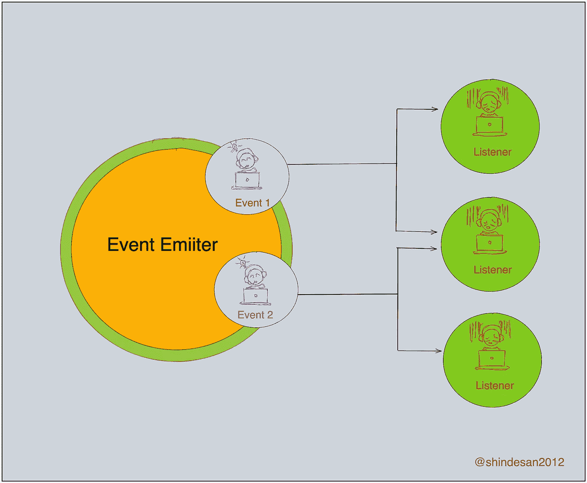
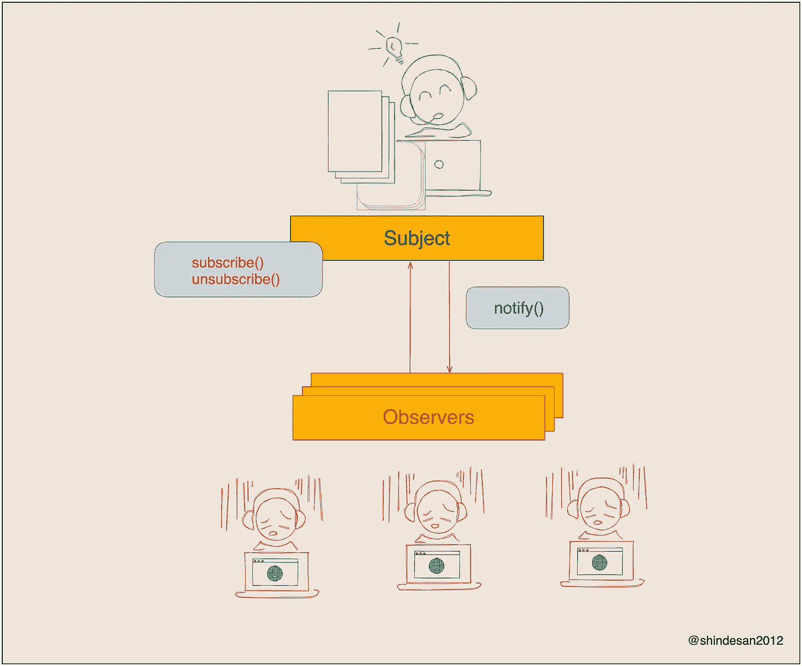
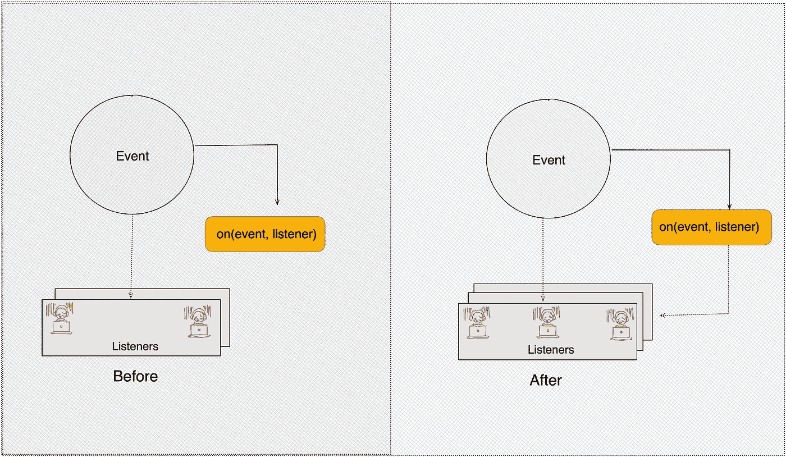
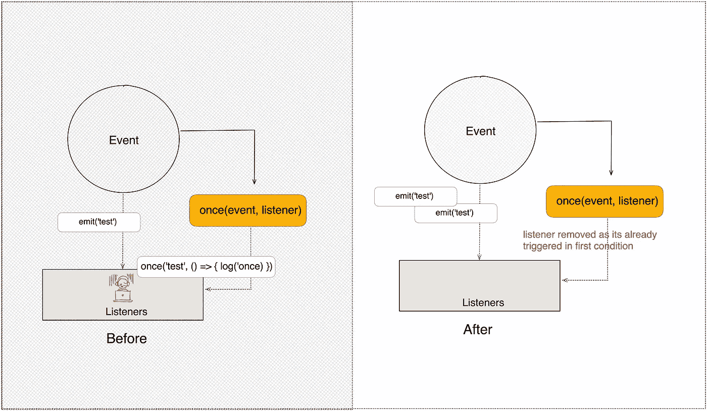
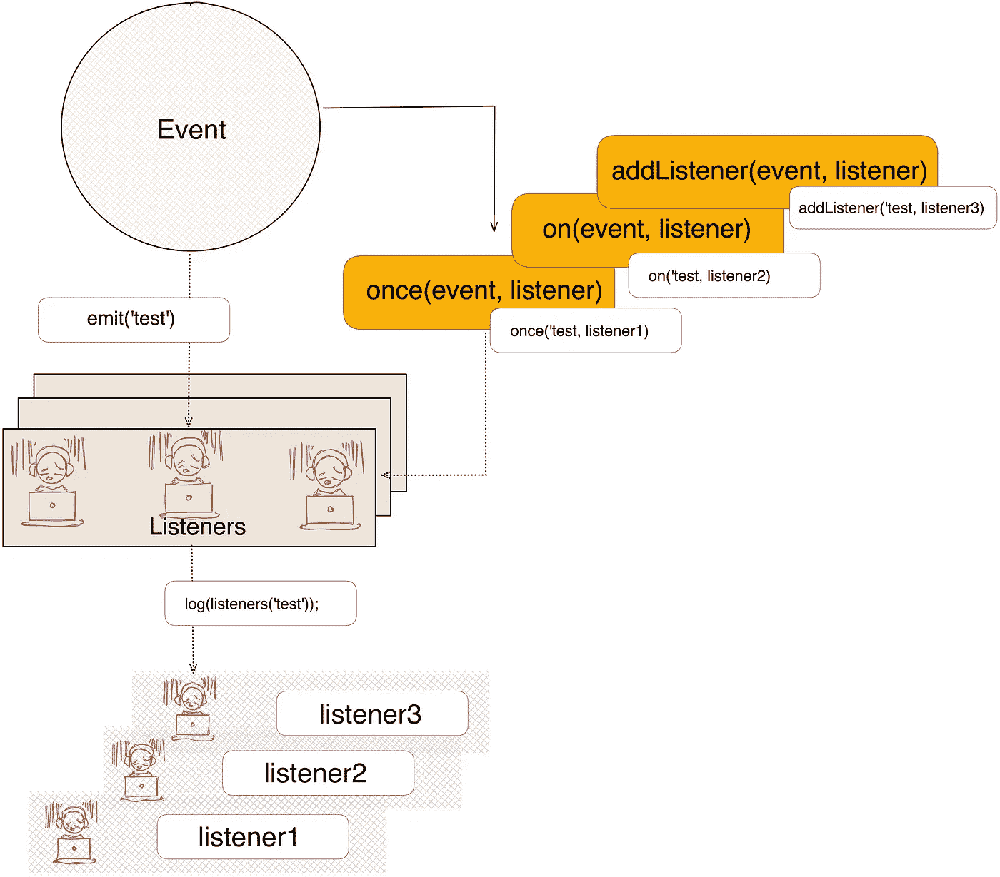

# Node.js 事件发射器的可视化

> 原文：<https://javascript.plainenglish.io/visualization-of-node-js-event-emitter-4f7c9fe3a477?source=collection_archive---------4----------------------->

# 事件发射器的基本概述

正如我们所知，官方页面将 Node.js 描述为“一个异步的**事件驱动的** JavaScript 运行时。”

> 作为异步事件驱动的 JavaScript 运行时，Node.js 旨在构建可伸缩的网络应用。



Basic of Event Emitter

EventEmitter 是由 events 模块提供的对象。它将函数与事件绑定在一起。然后，这个绑定函数用于处理事件并相应地执行操作。我们可以在应用程序的任何部分发出事件，并有一个监听它的函数设置。

**观察者模式**内置在节点 js 核心中，可以通过 **EventEmitter** 类获得。

## 观察者模式

观察者是一种行为模式，这意味着关注对象之间的通信。

观察者模式有两个组成部分

1.  **Subject** —状态发生变化时能够通知的组件。
2.  **观察者** —可以监听主题通知的组件。



Observer Pattern

**观察者模式**是一种[软件设计模式](https://en.wikipedia.org/wiki/Design_pattern_(computer_science))，其中一个名为**主题**的[对象](https://en.wikipedia.org/wiki/Object_(computer_science)#Objects_in_object-oriented_programming)维护一个名为**观察者**的依赖者列表，并自动通知它们任何状态变化，通常通过调用它们的[方法](https://en.wikipedia.org/wiki/Method_(computer_science))之一。

[](https://en.wikipedia.org/wiki/Observer_pattern) [## 观察者模式-维基百科

### 观察者模式是一种软件设计模式，在这种模式中，一个名为 subject 的对象维护着它的…

en.wikipedia.org](https://en.wikipedia.org/wiki/Observer_pattern) 

**event emitter 的基本方法**

**1。on(事件，监听器)**

*   将侦听器添加到指定事件的侦听器数组的末尾。

```
const EventEmitter = require('events')

const myEvent = new EventEmitter();

myEvent.on('test', () => console.log('Test from on'));

myEvent.prependListener('test', () => console.log('Test from prependListener'));

myEvent.emit('test');

// Prints:
//   Test from on
//   Test from prependListener
```

*   默认情况下，事件侦听器按照添加的顺序被调用。可以使用**emitter . prepend listener()**方法替代将事件监听器添加到监听器数组的开头。



**on(event, listener)**

**2。一次(事件，听者)**

*   为事件添加一次性侦听器。该侦听器仅在下一次触发事件时被调用，之后将被移除。

```
const EventEmitter = require('events')

const myEvent = new EventEmitter();

myEvent.once('test', () => console.log('Test from once'));

myEvent.emit('test');

// Prints:
//   Test from once
```

*   为名为 eventName 的事件添加一次性侦听器函数。下次触发 eventName 时，将删除该侦听器，然后调用它。



**once(event, listener)**

**3。emit(event，[arg1]，[arg2]，[…])**

*   使用提供的参数按顺序执行每个侦听器。如果事件有侦听器，则返回 true，否则返回 false。

```
const EventEmitter = require('events')

const myEvent = new EventEmitter();

// First listener
myEvent.on('test', () => {
  console.log('First test listener');
});

// Second listener
myEvent.on('test', (arg1, arg2) => {
  console.log(`Second test listener with parameters ${arg1}, ${arg2}`);
});

// Third listener
myEvent.on('test', (...args) => {
  const parameters = args.join(', ');
  console.log(`Third test listener with parameters ${parameters}`);
});

myEvent.emit('test', 1,2,3);

// Prints : 
// First test listener
// Second test listener with parameters 1, 2
// Third test listener with parameters 1, 2, 3
```

*   按照注册顺序同步调用为名为 eventName 的事件注册的每个侦听器，并将提供的参数传递给每个侦听器。



**emit(event, [arg1], [arg2], […])**

**4。removeListener(事件，监听器)**

*   从指定事件的侦听器数组中移除一个侦听器。

```
const EventEmitter = require('events');

const myEvent = new EventEmitter();

const callbackA = () => {
  console.log('A');
  myEvent.removeListener('event', callbackB);
};

const callbackB = () => {
  console.log('B');
};

myEvent.on('event', callbackA);

myEvent.on('event', callbackB);

// callbackA removes listener callbackB but it will still be called.
// Internal listener array at time of emit [callbackA, callbackB]
myEvent.emit('event');
// Prints:
//   A
//   B

// callbackB is now removed.
// Internal listener array [callbackA]
myEvent.emit('event');
// Prints:
//   A
```

**5。remove all listeners([事件])**

*   移除所有侦听器或指定事件的侦听器。
*   删除代码中其他地方添加的侦听器是一种不好的做法，特别是当 EventEmitter 实例是由其他组件或模块(例如套接字或文件流)创建的时候。

**6。setMaxListeners(n)**

*   默认情况下，如果为特定事件添加了 10 个以上的侦听器，EventEmitters 将打印一条警告。

```
const EventEmitter = require('events')

const myEvent = new EventEmitter();

myEvent.on('test', () => console.log('Test from on'));
myEvent.once('test', () => {
  // do stuff
  console.log('getMaxListeners Before', myEvent.getMaxListeners());
  myEvent.setMaxListeners(Math.max(myEvent.getMaxListeners() - 1, 0));
  console.log('getMaxListeners After', myEvent.getMaxListeners());
});
myEvent.emit('test');

// Prints :
// Test from on
// getMaxListeners Before 10
// getMaxListeners After 9
```

*   这是一个有用的缺省值，有助于发现内存泄漏。

**7。监听器(事件)**

*   返回指定事件的侦听器数组。
*   返回名为 eventName 的事件的侦听器数组的副本。

```
const EventEmitter = require('events')

const myEvent = new EventEmitter();

myEvent.on('test', function testListeners() { console.log('Test the myEvent.listeners'); });
myEvent.emit('test');
const eventListeners = myEvent.listeners('test');
console.log('listeners', eventListeners);

// Prints :
// Test the myEvent.listeners
// listeners [ [Function: testListeners] ]
```

**参考文献**

 [## 事件| Node.js v16.3.0 文档

### Node.js 核心 API 的大部分都是围绕惯用的异步事件驱动架构构建的，其中某些种类…

nodejs.org](https://nodejs.org/api/events.html) [](https://refactoring.guru/design-patterns/observer) [## 观察者

### 也称为:事件订阅者、侦听器观察者是一种行为设计模式，它允许您定义订阅…

重构大师](https://refactoring.guru/design-patterns/observer) 

**Essential methods of the EventEmitter**

*更多内容请看*[***plain English . io***](http://plainenglish.io/)