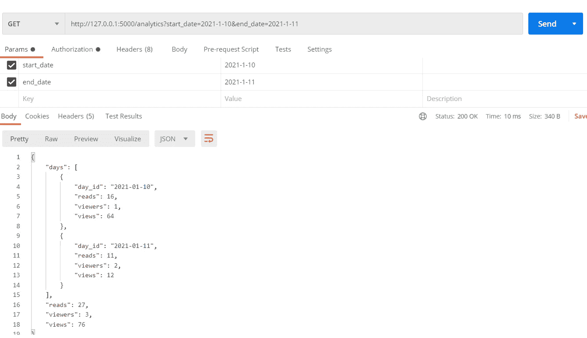
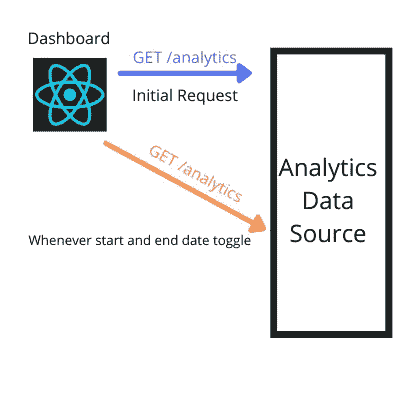
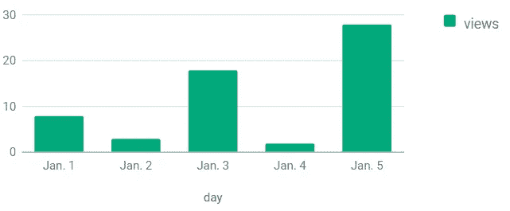

# 使用 React 仪表板可视化网站使用情况

> 原文：<https://javascript.plainenglish.io/visualize-website-usage-with-a-react-dashboard-fb2b206ec0cc?source=collection_archive---------10----------------------->

## 通过仪表板鸟瞰您的网站使用情况


Photo by [Myriam Jessier](https://unsplash.com/@mjessier) on [Unsplash](https://unsplash.com/photos/VCtI-0qlVgA)

*本文是* [*用 PostgreSQL 和 Flask*](https://ramapitchala.medium.com/track-website-usage-with-postgresql-and-flask-53f583249911) *追踪网站使用情况的续篇。在那篇文章中，我们创建了一个记录使用数据的服务。然而，在本文中，我们将通过一个仪表板来赋予使用数据以生命。*

# 介绍

收集数据很重要，但数据中的主要洞察力是通过可视化提取的。回顾一下，在前传中， [*使用 PostgreSQL 和 Flask*](https://ramapitchala.medium.com/track-website-usage-with-postgresql-and-flask-53f583249911) *，*跟踪网站使用情况，我们的目标是跟踪每天的浏览量、阅读量(用户在网站上停留至少 10 秒钟)和独立观众的数量。我们可以通过提供端点`/view`和`/read`来跟踪这些指标，网站可以调用。此外，我们创建了一个名为`/analytics`的端点，它将返回提供开始和结束日期的每天的上述指标。我们将利用`/analytics`端点创建一个仪表板来查看这些拆分。

## 议程

*   概念想法
*   设置
*   构建仪表板
*   结论

# 概念想法


Photo by [Riccardo Annandale](https://unsplash.com/@pavement_special) on [Unsplash](https://unsplash.com/photos/7e2pe9wjL9M)

让我首先提供一个使用`/analytics`的例子。

看看这个:



Photo by Author

如您所见，我们可以切换`start_date`和`end_date`并获取每天的数据。这将是我的仪表板的数据源。然而，如果你还没有从[前传](https://ramapitchala.medium.com/track-website-usage-with-postgresql-and-flask-53f583249911)中构建出服务，这完全没问题。相反，您可以使用自己的自定义数据源来驱动仪表板。

让我们浏览一下工作流程。在我们的仪表板中，我们将首先向数据源发出请求。然后，一旦我们有了数据，我们将创建一个条形图来显示视图，阅读和独特的观众每天是如何变化的。此外，我们将有开始和结束日期切换。如果它们被更改，我们将再次请求并更新条形图。

下面是表示该过程的图表:



Photo by Author

下面是仪表板最后的样子:

Gif by Author

有了这些，让我们开始有趣的部分，编码！

# 设置

让我们从创建一个新的 React 项目开始。我将使用打字稿。

```
npx create-react-app usage --typescript
```

移动到项目目录并安装以下内容:

```
npm install react react-google-charts react-scripts react-dom react-datepicker @types/react-datepicker typescript
```

# 构建仪表板

在`src/`文件夹中，制作`Types.ts`。让我们定义我们将在整个应用程序中使用的常见类型。

```
export type Day = {
    day_id: string,
    views: number,
    reads: number,
    viewers: number
}export type UsageData = {
    days: Day[],
    views: number,
    reads: number,
    viewers: number
}
```

在`src/`文件夹中，创建另一个名为`api`的文件夹。导航进入`src/api`，做`Usage.ts`。

获取分析数据的代码将放在这里。如前所述，这一部分会根据您获取数据的方式而有所不同。

基本上，提供一个`start`和`end`，我构造请求 URL 并向`/analytics`端点发出 GET 请求。是托管我的服务的地方。请随意在`getUsage`方法中集成您自己的数据源。

导航回`src/`并创建`ui/`。进入`src/ui`并创建`Graph.tsx`。我们将使用 [react-google-charts](https://react-google-charts.com/) 库来构建条形图。让我们制作`Graph`组件。

`data`具有类型`any[]`的原因是因为 react-google-charts 要求条形图的数据格式。查看构建条形图的文档，了解原因:

[](https://react-google-charts.com/bar-chart) [## 条形图

### 用谷歌图表呈现任何图表并作出反应

react-google-charts.com](https://react-google-charts.com/bar-chart) 

为了提供一个具体的例子，假设`data`如下:

```
const data = [['day', 'views'],['Jan. 1', 8],
              ['Jan. 2', 3],['Jan. 3', 18],
              ['Jan. 4', 2],['Jan. 5', 38]];
```

如果我将它传递到`Graph`的道具中，输出如下:



Photo by Author

我们将重用这个组件来呈现视图、阅读量和唯一查看者的条形图。完成图表后，让我们继续构建仪表板。

首先，在同一文件夹中，创建`Dashboard.css`。在那里，放入以下样式:

```
.tab{
    display: inline-block;
    color: grey;
}.tab:hover{
    cursor: pointer;
    color: black;
}
```

这些样式将应用于仪表板预览中的“视图”、“阅读”和“查看者”选项卡。CSS 完成后，让我们构建`Dashboard`组件。创建`Dashboard.tsx`。

这个组件是这个项目中最复杂的部分。因此，我们将从 imports 和 utility 变量开始一点一点地介绍它。

```
import UsageApi from "../api/Usage";
import Graph from "./Graph";
import DatePicker from "react-datepicker";
import { useState, useEffect } from "react";
import {Day} from "../Types";
import "react-datepicker/dist/react-datepicker.css";
import "./Dashboard.css";const months = ["Jan.", "Feb.", "Mar.", "Apr.", "May.", "Jun.", "Jul.", "Aug.", "Sep.", "Oct.", "Nov.", "Dec."];
```

我们还需要创建一些实用函数。例如，我们将使用 JavaScript Date 类来创建和操作日期。如果有一个函数能够提供日期的深层副本，将会非常有用。

```
const copyDate = (date:Date) => {
    return new Date(date.getFullYear(), date.getMonth(),   date.getDate());
}
```

此外，我必须创建一个名为`format`的函数，当提供一个类型为`day`的数组、一个开始和结束日期以及用户希望在条形图中可视化的指标时，该函数应该返回一个数组，该数组可以作为`data`属性传递给`Graph`。同样，格式化数据所必须经历的步骤将取决于您的数据源。对于我的情况，考虑这个例子:

假设我向`/analytics`发送一个请求，开始日期为 2021 年 1 月 27 日，结束日期为 2021 年 1 月 30 日。假设这是返回的数据:

```
[{
    "day_id": "2021-01-28",
    "reads": 1,
    "viewers": 1,
    "views": 2
},
{
    "day_id": "2021-01-30",
    "reads": 1,
    "viewers": 1,
    "views": 2
}]
```

*免责声明:之所以没有 2021–01–27 和 2021–01–29 的任何数据，是因为在那几天没有人访问我的网站。*

在我们的仪表板设计中，我们只显示用户选择的指标的细分。假设在这个场景中，用户希望看到视图的可视化。下面是`format`应该返回的内容:

```
[["day", "views"],
 ["Jan. 27", 0],
 ["Jan. 28", 2],
 ["Jan. 29", 0],
 ["Jan. 30", 2]]
```

相反，如果他们想要查看读数的显示，将会返回以下内容:

```
[["day", "reads"],
 ["Jan. 27", 0],
 ["Jan. 28", 1],
 ["Jan. 29", 0],
 ["Jan. 30", 1]]
```

我希望这消除了关于`format`功能的疑问。如果它的目的仍然模糊不清，一旦我们完全构建出仪表板，它将变得更加清晰。而且，如果你的数据源和我的不一样，这个函数对你来说可能也不一样。就这样，下面是我的`format`函数:

为了说明输出中没有记录访问的日子，我决定创建`index`并利用它来遍历`days`。算法不重要。我主要想表达的是，我需要转换从`/analytics`获得的数据，以便呈现实际的条形图。

效用函数完成后，让我们制作`Dashboard`组件。

```
const Dashboard = () => {}
```

让我们从声明组件中的状态变量开始:

```
const [data, setData] = useState<Day[]>([]);
const [isLoading, setIsLoading] = useState<boolean>(true);const currentDay = new Date();
const [end, setEnd] = useState<Date>(currentDay);

const startDay = copyDate(currentDay);
startDay.setMonth(startDay.getMonth() - 1);
const [start, setStart] = useState<Date>(startDay);const [metric, setMetric] = useState("views");
const [metricData, setMetricData] = useState<any>({views: 0, reads:0, viewers:0})
```

`data`代表我们通过调用`/analytics`得到的`day[]`。`loading`只是在我们等待`/analytics`请求完成的时候呈现一个加载组件。`end`指结束日期，`start`指开始日期。默认情况下，`start`会比`end`早一个月。`metric`指用户希望在条形图中可视化的字段。`metricData`是一个对象，它存储了在`start` 和`end`之间的时间段内的总浏览量、阅读量和观看者数。

如果`start`和`end`发生变化，我们需要用新的开始和结束日期从`/analytics`中检索数据，并更新我们的组件状态。

```
useEffect(() => {
        UsageApi.getUsage(start, end).then(({days, views, reads, viewers}) => {
            setData(days);
            setMetricData({views:views, reads:reads, viewers:viewers})
        }).finally(() => {
            setIsLoading(false);
        })
    }, [start, end]);
```

现在让我们来构建选项卡，以便在不同的指标之间进行筛选。以下是我所说的标签:

我将创建一个名为`getTabs`的方法，它将返回选项卡的 div。

```
const getTabs = () => {
        const metrics = ["views", "reads", "viewers"];
        return metrics.map((m) => {
            let textStyle: any = {
                margin: "10px"
            };
            if(metric === m){
                textStyle.color = "black";
                textStyle.textDecoration = "underline";
            }
            return <div className="tab" style={textStyle} onClick={()=>{
                setMetric(m);
            }}>
                {`${metricData[m]} ${m}`}
            </div>
        });
    }
```

在选项卡被点击的情况下，条形图显示的指标将不得不改变。因此，这就是为什么我们需要在对`onClick`的回调中使用`setMetric`。

最后，剩下的就是返回组件将呈现的内容。

让我们单独构建主要部分，然后将它们放在一起。

为了构建日期选择器，我们将使用 [react-datepicker](https://reactdatepicker.com/) 。这个日期选择器库允许我们直观地选择日期，处理日期选择，并过滤无效的日期。以下是对应于开始日期的日期选择器:

`onChange` prop 用于处理用户从日历下拉列表中选择新的开始日期的情况。因为我们必须保证结束日期总是晚于开始日期，所以我们必须更新`end`，以防用户选择晚于`end`的日期。

结束日期的日期选取器与开始日期的日期选取器非常相似。

对于这个日期选择器，我们必须确保用户永远不能选择早于当前开始日期的结束日期。我们可以用`filterDate`道具做到这一点。我们将只允许用户选择等于或晚于我们的开始日期的日期。

最后，我们需要调用`getTabs`方法来呈现我们的指标选择选项卡，并使用`Graph`来呈现条形图。这就是`format`函数的用武之地。

```
<div>
      {getTabs()}
      <Graph data={format(data, start, end, metric)} />
 </div>
```

以下是添加了上述内容的完整退货声明:

该文件的最后一步是导出`Dashboard`。在文件末尾添加以下内容。

```
export default Dashboard;
```

官方的最后一步是在`/src`更新`App.tsx`。

运行`npm start`启动仪表板。

Gif on [Giphy](https://giphy.com/gifs/nba-expression-3ohs4lEkyu8j5ZV1V6https://giphy.com/gifs/nba-expression-3ohs4lEkyu8j5ZV1V6)

那是一个包裹！

如果您想查看完整的项目，请查看以下资源库。

[](https://github.com/Ramko9999/Medium-React-Dashboard) [## ramko 9999/Medium-React-仪表板

### 通过在 GitHub 上创建一个帐户，为 ramko 9999/Medium-React-Dashboard 开发做出贡献。

github.com](https://github.com/Ramko9999/Medium-React-Dashboard) 

# 结论

随着仪表板的完成，我们现在已经构建了一个端到端的分析系统。在[前传](https://ramapitchala.medium.com/track-website-usage-with-postgresql-and-flask-53f583249911)中，我们构建了 API，现在，通过这个仪表板，我们有了一种可视化原始数据的方法。虽然我提出并实现的解决方案可能很简单，但我希望它能唤起您的好奇心，并作为您未来努力的蓝图。**总之，** **非常感谢你的坚持！**

# 其他酷博客

[](https://medium.com/javascript-in-plain-english/zero-to-hero-chrome-extensions-4060520daf59) [## 从零到英雄:Chrome 扩展

### 以编程方式挖掘浏览器的全部功能！

medium.com](https://medium.com/javascript-in-plain-english/zero-to-hero-chrome-extensions-4060520daf59) [](https://medium.com/swlh/build-a-dynamic-portfolio-with-the-github-api-6d74081e5164) [## 使用 Github API 构建动态投资组合

### 简介:

medium.com](https://medium.com/swlh/build-a-dynamic-portfolio-with-the-github-api-6d74081e5164) [](https://ramapitchala.medium.com/track-website-usage-with-postgresql-and-flask-53f583249911) [## 使用 PostgreSQL 和 Flask 跟踪网站使用情况

### 你的网站有多少浏览量？让我们建造一个追踪器！

ramapitchala.medium.com](https://ramapitchala.medium.com/track-website-usage-with-postgresql-and-flask-53f583249911) 

# 资源

**react-google-charts:**

[](https://react-google-charts.com/bar-chart) [## 条形图

### 用谷歌图表呈现任何图表并作出反应

react-google-charts.com](https://react-google-charts.com/bar-chart) 

**react-datepicker:**

 [## 由 HackerOne 制作的 React Datepicker

### React 的一个简单且可重用的 datepicker 组件。

reactdatepicker.com](https://reactdatepicker.com/)