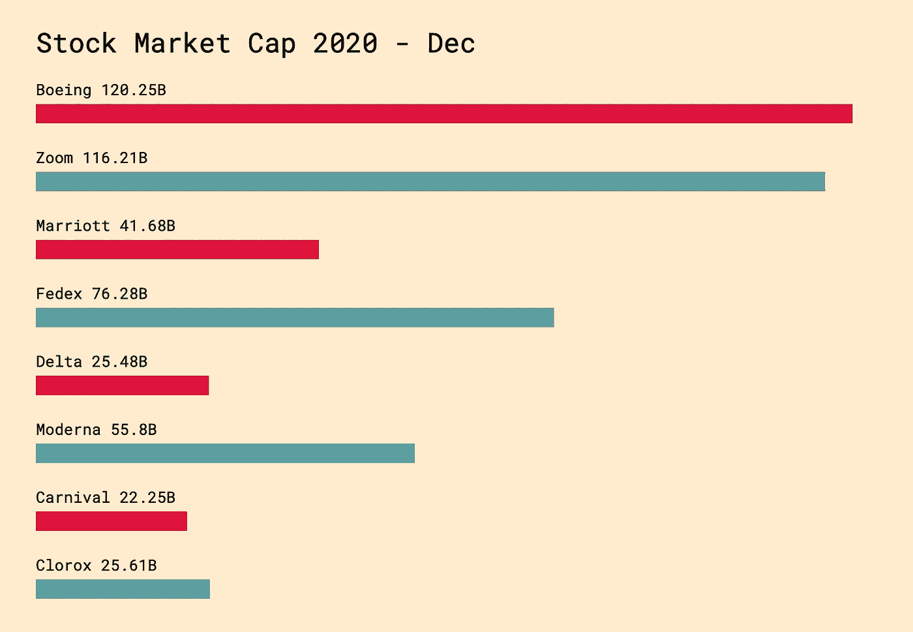
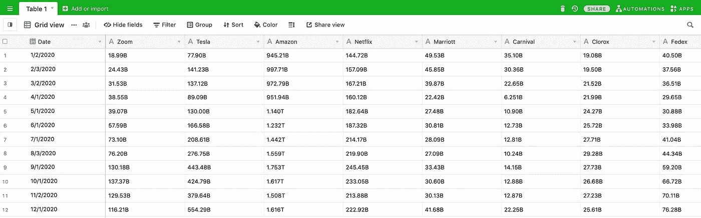
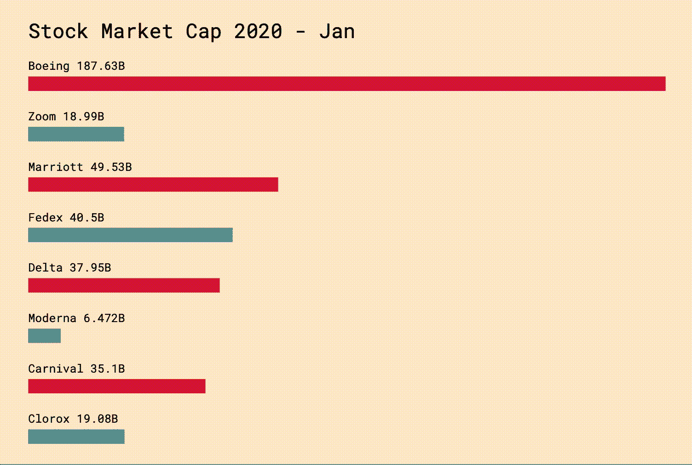

# 使用 D3 可视化冠状病毒对股票市场的影响

> 原文：<https://javascript.plainenglish.io/visualizing-the-stock-market-using-d3-c99e349506e7?source=collection_archive---------8----------------------->

## Zoom 与波音公司交换位置。



在这史无前例的一年里，我们从办公室工作转向远程工作，从旅行转向家庭娱乐，股票市场引起了注意。这个数据集为用 D3 构建可视化提供了一个很好的机会，所以我想分享我在这个过程中采取的步骤。

1.  **收集和格式化数据**

创建任何类型的可视化的第一步是找到它的数据源，以及构建它所必需的工具。在网上搜索了一番后，我在 ycharts.com 每个月的第一个交易日使用了市值，并把它保存到了我的 Airtable 数据库中。



**2。创建标题**

接下来，我通过向 h1 元素添加初始文本来创建 d3 选择。

```
const title = d3.select("#data-viz").append("h1");title.text("Stock Market Cap 2020 - Jan")
```

这应该会使一个静态元素出现在 DOM 上，就像您要将它添加到 html 文件中一样。然而，有趣的部分是使用 d3 的`textTween`函数使它随时间而变化。

```
const months = [ "Jan", "Feb", "Mar", "Apr", "May", "Jun", "Jul", "Aug", "Sep", "Oct", "Nov", "Dec" ];function updateTitle(selection) {
  selection
    .transition()
    .duration(5000)
    .textTween(() => (t) => {
        const index = d3.interpolateNumber(0, 11)(t).toFixed(0);           
        return `Stock Market Cap 2020 - ${months[index]}`;
    });
}title.text("Stock Market Cap 2020 - Jan").call(updateTitle);
```

`.transition()`链方法现在将创建一个持续时间为 5 秒的过渡。在随后的`.textTween`函数中，回调现在将传递一个参数 *t* ，其中开始时 t = 0，结束时 t = 1。D3 还提供了漂亮的插值助手，这样我们可以用时间来索引月份。

**2。为每个公司追加 SVG 并绑定数据**

现在，对于可视化的实质，我做了一个新的选择，并使用步骤 1 中的数据通过`.data()`方法将它们绑定到选择。

```
const data = [{name: 'Boeing', fill: 'crimson', ...}, ...];const selection = d3.select("#data-viz").selectAll("rect");selection
  .data(data)
  .enter()
  .append("div") // label
  .append("svg") 
  .append("rect") // bar
  .attr("fill", (d) => d.fill)
```

代码片段应该生成与数据数组中提供的项目数量相等的`div`和`svg`元素。将为这些元素中的每一个调用`.attr`方法，其中颜色将通过数据数组中提供的对象的`fill`键的值来确定。这样就更容易区分在 2020 年获利的公司和亏损的公司。

**3。最后一步！添加过渡以显示随时间的变化。**

类似于我在标题中使月份随时间变化的方式，我通过链接更多的转换函数使每个公司的宽度和标签的值动态变化。

```
const timing = 5000;function updateLabel(selection) {
   selection
     .append("text")
     .attr("class", "label")
     .transition()
     .duration(timing)
 **.textTween((d) => (t) => {
         const index = d3.interpolateNumber(0, 11)(t).toFixed(0);
         return `${d.name}\n\n${d[index]}B`;
     });**function updateWidth(selection) {
   selection
     .transition()
     .duration(timing)
 **.attrTween((d) => (t) => {
         const index = d3.interpolateNumber(0, 11)(t).toFixed(0);
         return `${d[i] * 7}px`;
     });**selection
  .data(data)
  .enter()
  .append("div") // label
 **.call(updateText)**  .append("svg") 
  .append("rect") // bar
  .attr("fill", (d) => d.fill)
 **.call(updateWidth)**
```

请注意，两个更新函数之间的唯一区别是，一个函数的目标是文本，另一个函数的目标是属性以及它们的调用顺序。否则，它们都依赖于绑定到元素的数据和插值时间。

这就是最终产品，用[代码沙箱](https://8k5rt.csb.app/)制作而成。

