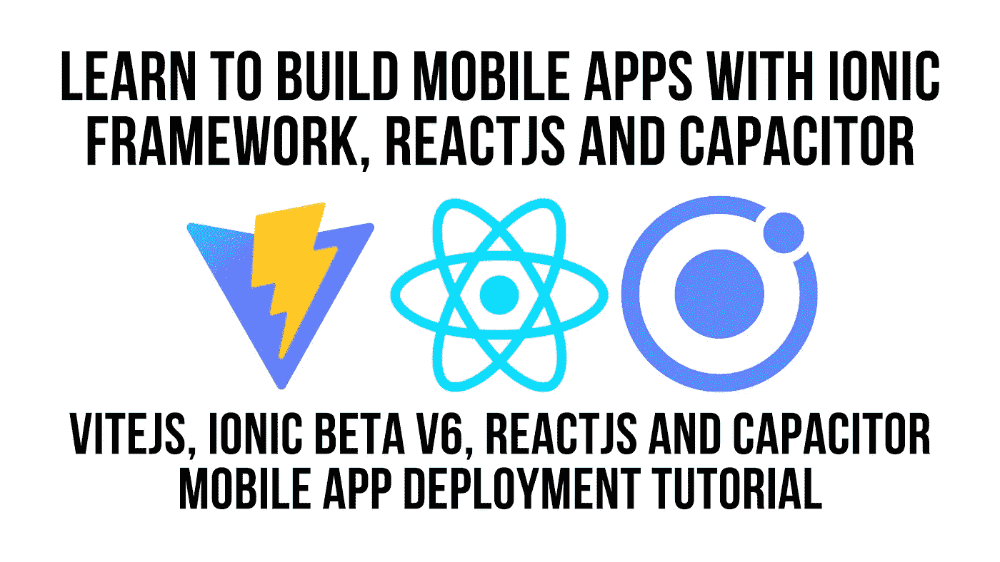

# 使用 Ionic、ViteJS、React 和 Capacitor 构建移动应用

> 原文：<https://javascript.plainenglish.io/vitejs-ionic-framework-beta-v6-reactjs-and-capacitor-mobile-device-deployment-5b6ac7e5d249?source=collection_archive---------12----------------------->



由于 Ionic 已经宣布了 v6 的测试版，我想看看我是否可以开始使用 Ionic 框架和带有 [ViteJS](https://vitejs.dev/guide/#scaffolding-your-first-vite-project) 的电容器。

即使您不使用 [Ionic ReactJS 组件](https://ionicframework.com/docs/react)，该视频也将向您展示如何使用 [Ionic Capacitor](https://capacitorjs.com/) 将您的 ViteJS 应用部署到移动设备上

> 如果您正在寻找 VueJS 集成，我在这里为您提供了帮助。 [ViteJS 离子框架和 VueJS](https://www.youtube.com/watch?v=JnfAH1gXVdU)

在这个视频中，我采用的方法是按照说明在 ViteJS 中创建一个 ReactJS 项目，然后添加带有 npm 的 Ionic 包，然后粘贴到所需的样式中，这样就成功了！！

## 录像

[ViteJS、Ionic Framework Beta v6、ReactJS 和 Capacitor 移动设备部署教程— YouTube](https://www.youtube.com/watch?v=uVjPBiNz5yk)

## 从这里开始

我们使用命令`npm init vite@latest`让事情运转起来，见下面的输出。

```
Aarons-iMac:vite aaronksaunders$ **npm init vite@latest**
npx: installed 6 in 2.281s
✔ Project name: … vite-ionic-react
✔ Select a framework: › react
✔ Select a variant: › react-ts

Scaffolding project in /Users/aaronksaunders/dev/projects/vite/vite-ionic-react...

Done. Now run:

  cd vite-ionic-react
  npm install
  npm run dev

Aarons-iMac:vite aaronksaunders$ **cd vite-ionic-react/**
Aarons-iMac:vite-ionic-react aaronksaunders$ **npm install**
Aarons-iMac:vite-ionic-react aaronksaunders$ **npm i @ionic/react@next  @ionic/react-router@next react-router react-router-dom**
```

既然项目已经建立并运行，我们需要使它成为一个 Ionic React 项目。通过用以下代码替换`App.jsx`中的现有代码，添加一些 ionic 特定代码

```
import React, { useState } from "react";
import logo from "./logo.svg";
import "./App.css";
import {
  IonContent,
  IonPage,
  IonRouterOutlet,
  IonApp,
  IonToolbar,
  IonHeader,
  IonButtons,
  IonBackButton,
  IonButton,
  IonTitle,
  IonItem,
  IonLabel,
} from "@ionic/react";
import { IonReactRouter } from "@ionic/react-router";
import { Redirect, Route, useHistory } from "react-router-dom";

/* Core CSS required for Ionic components to work properly */
import "@ionic/react/css/core.css";

/* Basic CSS for apps built with Ionic */
import "@ionic/react/css/normalize.css";
import "@ionic/react/css/structure.css";
import "@ionic/react/css/typography.css";

/* Optional CSS utils that can be commented out */
import "@ionic/react/css/padding.css";
import "@ionic/react/css/float-elements.css";
import "@ionic/react/css/text-alignment.css";
import "@ionic/react/css/text-transformation.css";
import "@ionic/react/css/flex-utils.css";
import "@ionic/react/css/display.css";

function App() {
  return (
    <IonApp>
      <IonReactRouter>
        <IonRouterOutlet>
          <Route path="/home" component={HomePage} exact={true} />
          <Route path="/detail" component={DetailPage} exact={true} />
          <Route path="/" exact={true}>
            <Redirect to="/home" />
          </Route>
        </IonRouterOutlet>
      </IonReactRouter>
    </IonApp>
  );
}

function HomePage() {
  const history = useHistory();
  const nextPage = () => {
    history.push("/detail");
  };

  return (
    <IonPage>
      <IonHeader>
        <IonToolbar>
          <IonTitle>Home</IonTitle>
        </IonToolbar>
      </IonHeader>
      <IonContent className="ion-padding">
        <h1>HOME PAGE</h1>
        <IonButton onClick={nextPage}>NEXT PAGE</IonButton>
      </IonContent>
    </IonPage>
  );
}

function DetailPage() {
  return (
    <IonPage>
      <IonHeader>
        <IonToolbar>
          <IonButtons slot="start">
            <IonBackButton></IonBackButton>
          </IonButtons>
          <IonTitle>Detail Page</IonTitle>
        </IonToolbar>
      </IonHeader>
      <IonContent className="ion-padding">
        <h1>DETAIL</h1>
        <IonItem details>
          <IonLabel>More Information</IonLabel>
        </IonItem>
      </IonContent>
    </IonPage>
  );
}

export default App;
```

更新`index.html`，替换`viewport`标签以确保页面正确呈现。

```
<meta
   name="viewport"
   content="viewport-fit=cover, width=device-width, initial-scale=1.0, minimum-scale=1.0, maximum-scale=1.0, user-scalable=no"
/>
```

你现在可以运行应用程序，看看它作为一个网站正常工作之前，我们在设备上安装，在项目目录中键入以下命令。

```
vite
```

您应该看到您的 ionic 项目运行时有一个主页和一个详细页面。

## 在设备上运行应用程序

我们现在要添加电容器到项目中，这样我们就可以在设备上部署，我只是在这里做 IOS，但类似的方法将与 Android 一起工作

```
npm install @capacitor/core
npm install @capacitor/cli --save-dev
npx cap init --web-dir dist
```

注意`npx cap init`命令末尾的`--web-dir dist`。这是必需的，因为 vite 将它的构建输出打包到`dist`目录中。

接下来运行命令来构建应用程序

```
vite build
```

现在要运行 IOS，我们需要安装平台代码，然后将其添加到项目配置中

```
npm install @capacitor/ios
npx cap add ios
```

然后运行应用程序在设备上查看

```
npx cap run ios
```

## 运行电容带电重载

输入下面的命令，当提示输入项目类型时，选择`custom`

```
ionic init
```

然后修改`package.json`文件的脚本部分。我们需要这样做，以便 Ionic 知道如何构建 web 应用程序...可能有另一种方法来实现这一点，但我不确定在这一点上。下面的新代码是`"ionic:serve": "vite"`

```
"scripts": {
  "dev": "vite",
  "build": "vite build",
  "serve": "vite preview",
  **"ionic:serve": "vite"**
},
```

现在，您可以运行下面的命令来运行设备上的应用程序，并在您对网站进行更改时使用 live reload。

```
ionic cap run ios --livereload --external
```

*更多内容尽在*[***plain English . io***](http://plainenglish.io)