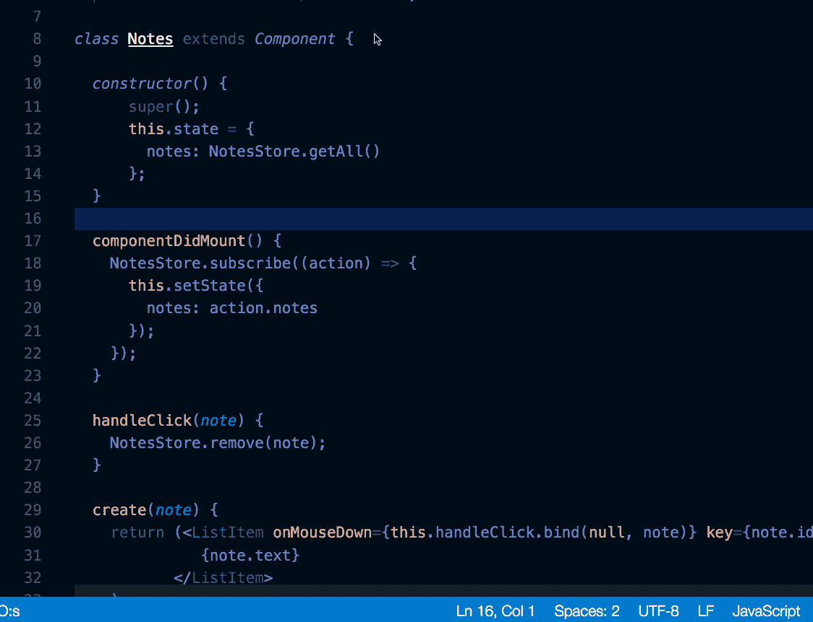
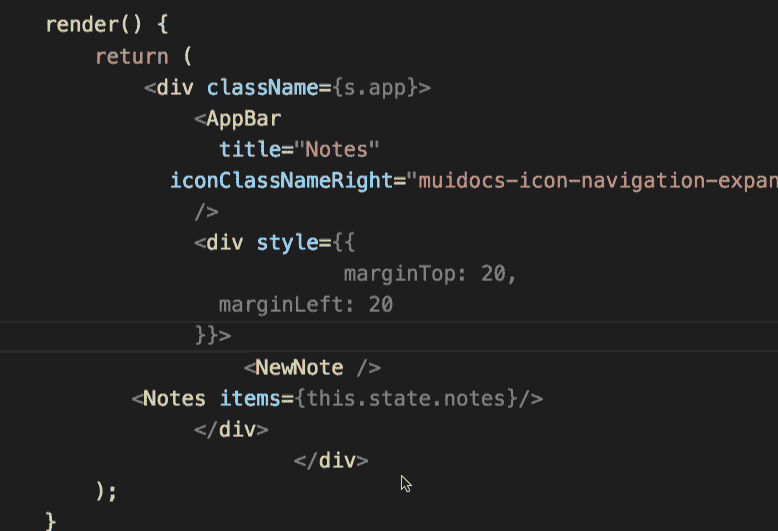

# 每个开发人员都应该知道的 VS 代码快捷键

> 原文：<https://javascript.plainenglish.io/vs-code-shortcuts-every-developer-should-know-91c7116d195b?source=collection_archive---------13----------------------->

## VS 代码快捷方式，没有它我无法编码

By FAM

每个开发人员在编码时都有自己常用的快捷键。这篇文章涵盖了我最常用的 VS 代码快捷方式，没有它们我就无法编写代码！

对于好奇的开发人员来说，这可能有助于提高其他开发人员的工作效率，因为他们已经有了自己最喜欢的日常使用的快捷方式。请与我们分享！

让我们的故事开始吧…让我们看看 VS 代码快捷键的魔力！

# 向上/向下移动代码行

我多次使用的超级重要的快捷方式。上下移动整行代码。你所需要做的就是把你的光标放在你想要移动的行上，点击`Alt` + `Up`向上移动或者`Alt` + `Down`向下移动。

[VS code](https://code.visualstudio.com/)

# 向上/向下复制代码行

现在，和以前一样，除了你复制一行，向上或向下，而不是移动它。你需要把光标放在你要复制的那一行，然后按`Shift` + `Alt` + `Up`或者`Shift` + `Alt` + `Down`。

[VS code](https://code.visualstudio.com/)

# 重命名符号

谁没有用一个随机的名字让代码先工作再清洗整个代码。你经常做的一件有价值的事情是重命名你的变量。要重命名一个变量，选择它并按下`F2`。写一个新名字，然后按回车键。和 booom，所有变量都将被更新。

[VS code](https://code.visualstudio.com/)

# 格式化您的代码

看到你的整个代码被格式化和良好的缩进，用你的手去做只会令人沮丧。每个开发人员每次接触代码时都会改变格式。VS 代码可以通过按下`Shift` + `Alt` + `F`来选择整个文件，或者按下`Ctrl`+`K`+`Ctrl`+`F`来选择代码。

[VS code](https://code.visualstudio.com/)

# 多个光标

这是我很久以前在崇高编辑器中用过的一个老把戏。用`Alt` + `Click`在 VS 代码上也是可以的。在 Windows 上是`Alt` + `Click`。

它是如何工作的？按住`Alt`需要将光标添加到想要选择的位置。您会在每个选定的位置看到一个光标。然后，您可以键入您想要的内容。它将出现在您之前选择的每个位置。

[VS code](https://code.visualstudio.com/)

# 注释和取消注释

出于几个原因，当你想对一段代码或一个部分进行注释时，知道快捷键是非常有效的。对于某一行，将光标放在您想要注释的行上，然后按`Ctrl` + `Alt` + `/`。对于区段，选择代码区段，按`Ctrl` + `Alt` + `/`。这个快捷方式就像一个开关。您可以用它来添加和删除注释。

[vs code](https://www.google.com/url?sa=i&url=https%3A%2F%2Fstackoverflow.com%2Fquestions%2F44858100%2Fvisual-studio-code-html-wrong-comment-type%2F52100419&psig=AOvVaw2wTg-Fy10QXUraB4A9szUw&ust=1638871326491000&source=images&cd=vfe&ved=0CAsQjRxqFwoTCICh3M31zvQCFQAAAAAdAAAAABAI)

# 转到错误和警告

VS code 的工作之一就是让编码变得有趣。按下`Ctrl` + `Shift` + `M`可以打开`Problems`标签。

然后，您可以快速跳转到项目中的错误和警告并修复它们。这是一旦你发现它，你就离不开它的事情之一！

[VS code](https://code.visualstudio.com/)

这些快捷方式是我日常工作中使用最频繁的。你可以学习更多，并在你的编码习惯中实现它们。它是如此强大，你不会马上看到它，但你的生产力会随着时间的推移而显现出来！要查看 VS 代码的完整快捷方式，请按`Ctrl` + `K` + `Ctrl` + `S`。

[VS code](https://code.visualstudio.com/)

更有趣的是，你可以创建自己的快捷方式。除非你知道自己在做什么，否则我不推荐。每次更换笔记本电脑或重装 VS 代码，都必须添加自己的。

所有 VS 代码[快捷键](https://code.visualstudio.com/shortcuts/keyboard-shortcuts-windows.pdf)。

# 这些捷径你都应该知道吧？

**不，**诀窍是在编码时观察自己的行为和习惯。如果你有一些重复的动作，那么知道它们的捷径肯定会提高你的工作效率。

我想在这篇文章中分享的 ***消息*** 是，发现这些捷径可能会让你意识到，你需要考虑一下，并改进你的编码习惯和编码方式。编码是关于持续改进的。 ***人无完人！***

> 我今天的故事到此结束，我希望你喜欢它，并从中吸取教训，❤

如果我的作品 ***打动了你，*** 如果你 ***喜欢它，*** 如果你觉得它 ***值得*** ，请你 [**成为付费会员来支持我，你的一部分费用会寄给我。**](https://famzil.medium.com/membership)

> 对我来说这意味着整个世界，我的触摸创造了这个世界上有价值的小东西…谢谢你，❤

对我来说这意味着整个世界，我的触摸创造了这个世界上有价值的小东西…谢谢你，❤

如果你喜欢看我的文章…并且想收到我的文章(我不每天发表，这样就不会给你发垃圾邮件。你可以随时退订，没有问题)♥️

 [## 如果你喜欢看我的文章… ♥️

### 如果你喜欢读我的文章… ♥️，当我的文章发表时，欢迎你第一个得到通知…

famzil.medium.com](https://famzil.medium.com/subscribe) 

亲爱的读者，感谢你在我生命中的存在。让我们在 [**上取得联系**](https://medium.com/@famzil/)**[**Linkedin**](https://www.linkedin.com/in/fatima-amzil-9031ba95/)**[**脸书**](https://www.facebook.com/The-Front-End-World)**[**insta gram**](https://www.instagram.com/the_frontend_world/)**[**YouTube**](https://www.youtube.com/channel/UCaxr-f9r6P1u7Y7SKFHi12g)**或**********

****参见我的关于网络要素和一般文化的电子书。****

*****更多内容看* [***说白了就是***](http://plainenglish.io/) ***。*** *报名参加我们的* [***免费每周简讯这里***](http://newsletter.plainenglish.io/) ***。*******