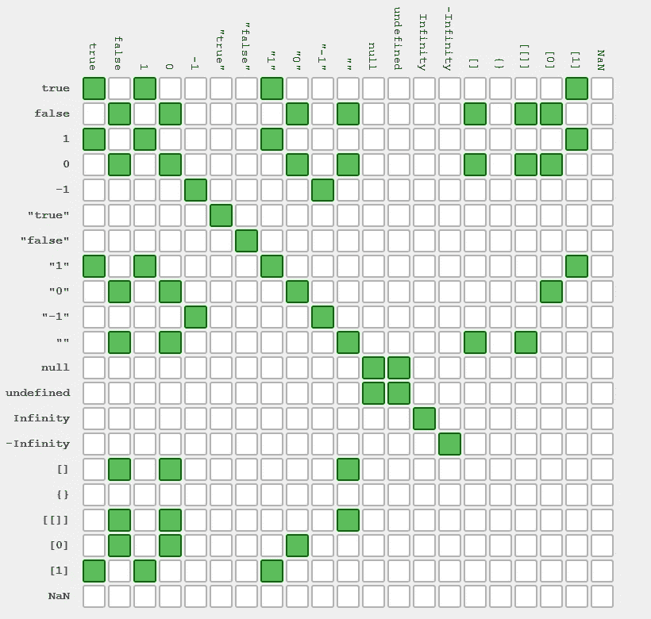
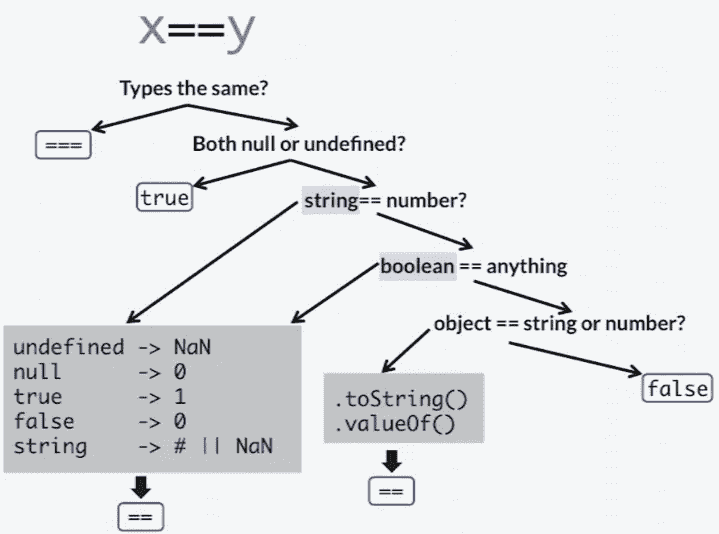
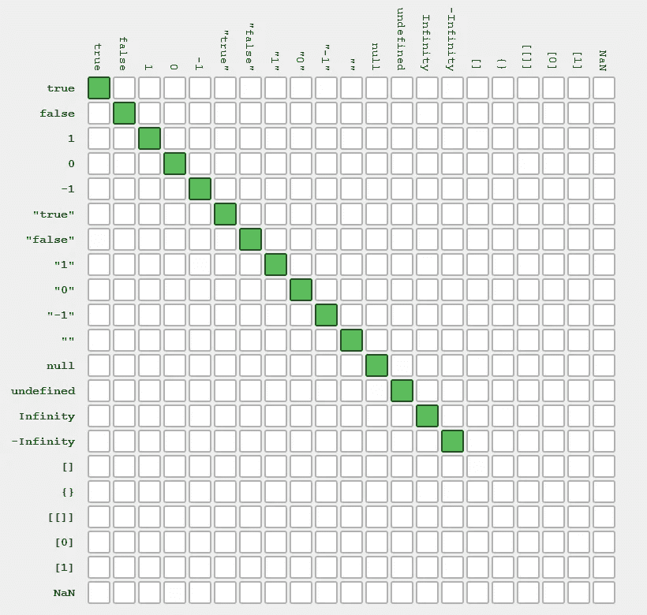
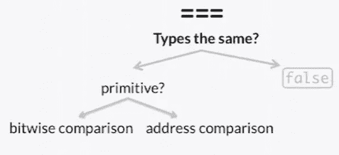
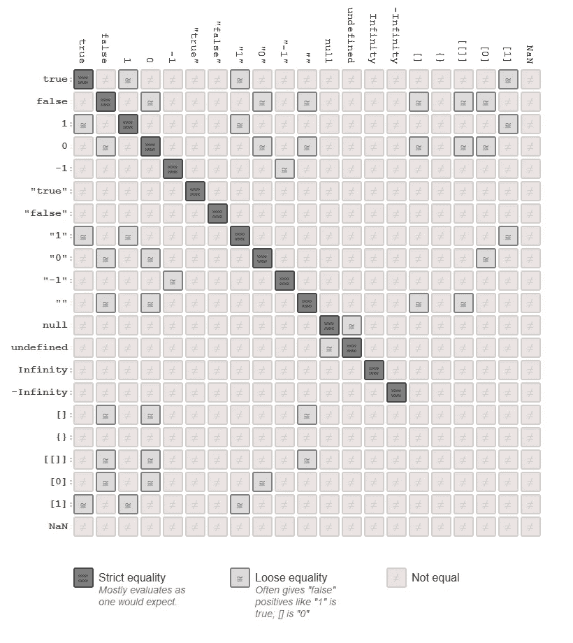

# JavaScript 中的==' vs. '=== ':抽象与严格相等的深入指南

> 原文：<https://javascript.plainenglish.io/vs-in-javascript-2977631d00db?source=collection_archive---------17----------------------->

你用过 JSLint 吗？如果是，当您使用`==`而不是`===`时，您可能会遇到多个警告。


从技术上讲，JSLint 是一个静态代码分析工具。它被精心设计来分析用 JavaScript 编写的代码，以一种更技术性的方式，而不是固执己见的方式。随着时间的推移，图书馆演变成了 ESLint。ESLint 允许开发者添加自定义规则。今天，ESLint 是一个工业标准。全球的开发人员都使用它来了解他们代码的质量——以及如何使他们的解决方案变得更好。

ESLint 最常抛出的建议之一是用`===`代替`==`。

这是为什么呢？

**你可以把==看作是平等的一种抽象形式。**

你可以把===看作是等式的一种严格形式。

# 抽象版本(==)

对于我们的讨论，让我们把“==”当作抽象的等式。

在比较变量之前，JavaScript 中的抽象等式对变量做了大量的运算。首先，它参与类型转换。让我们用一个简单的问题来理解这个。

“ **null** 是否等于“ **undefined** ”？

Null 被赋给没有任何值的变量。另一方面，undefined 用于标识编译时不存在的变量。无论是空的还是未定义的，在整个 JavaScript 架构中都有一个非常独特的用途。尽管开发人员不理解它们之间的区别，但他们经常互换使用。如果你以一种肤浅的方式来看，null 可以等于 undefined。因为在这两种情况下，您都在尝试识别一个不存在或没有值的变量——这间接意味着它不存在。如果你的目的是做一个简单的检查，看看变量中值的存在——使用抽象比较就足够了。

为什么？ **Null == undefined 返回 true！**



从上面的矩阵中可以看出，使用我们的抽象等式运算符进行比较是非线性的。事实上，这是一个复杂的故事，有太多的如果和但是需要考虑。这就像在 JavaScript 中比较两个变量的主观方式。你需要理解变量的最终推论是什么。它会以“真”或“假”结束，而在这两者之间没有什么被认为是抽象的平等。这就是为什么 **true == 1 返回 true** 和 **"" == []也返回 true** ！

对于 JavaScript 初学者来说，抽象等式的规则是不可记忆的，而且相当复杂。所以，千万不要试图去记忆上面的图表。相反，要理解为什么抽象的等式操作符会有这样的行为。



# 严格相等(===)

现在，让我们学习 JavaScript 中的严格相等。

严格的平等并不意味着“同值同型”。相反，它检查两个操作数是否引用同一个对象，如果是 value，两者应该具有相同的值。

```
var a = [1,2,3];
var b = [1,2,3];
var c = a;

var ab_eq = (a === b); This will return false. Even though both the objects are off the same type and value
var ac_eq = (a === c); This will return true, because both the objects refer to the same memory
```

这个相等运算符不参与任何附加运算。它不执行任何类型转换。而且，它不会将值简化为一种常见的形式。相反，它接受显示的值，并对它们进行检查。这意味着 **null === undefined 永远不会返回 true，**当你使用严格等式时。

如果两个值完全不同，特别是在它们的类型上，那么响应将会非常快。



使用严格相等的比较是相当线性的。如果你在你的代码中使用它，总是严格到严格相等。特别是，如果您知道正在处理的响应的数据类型。当然，如果你已经掌握了抽象等式中的时髦转换——你可以选择！

## 例外

现在，JavaScript 中的字符串有一个小小的例外。如果每个内存索引中的长度和字符都相同，您会期望严格相等运算符返回 true。嗯，并不总是这样。

```
**Case 1:**
var a = "12" + "3";
var b = "123";

console.log(a === b); 
The above will return true, because both a and b are equal in terms of value and type**Case 2:**
var a = new String("123");
var b = "123";
console.log(a === b);
The above will return false, even though it appears to be equal in value. **Why**?
```

在第二种情况下，创建了一个新的字符串，这反过来又创建了一个对象，其行为类似于一个字符串。如果你试图用一个字符串对象来比较一个原始字符串，在严格相等的情况下，你一定会看到“假”。



## 严格相等的摘要

这里有一个简单的备忘单，可以帮助您理解严格的等式运算符。

> ***对于值类型(数字):***
> `a === b`如果`a`和`b`具有相同的值并且属于同一类型，则返回 true
> 
> ***对于引用类型:***
> `a === b`如果`a`和`b`引用完全相同的对象，则返回 true
> 
> ***对于字符串:***
> `a === b`如果`a`和`b`都是字符串并且包含完全相同的字符，则返回 true

# 结论

在 JavaScript 中比较两个值时，我总是使用===。它更加清晰，并且代码随着时间的推移变得不那么模糊。

此外，这里有一个矩阵，为您比较了抽象和严格的等式运算符。希望这能帮助你想象这两者之间的区别。



*更多内容请看*[***plain English . io***](http://plainenglish.io/)