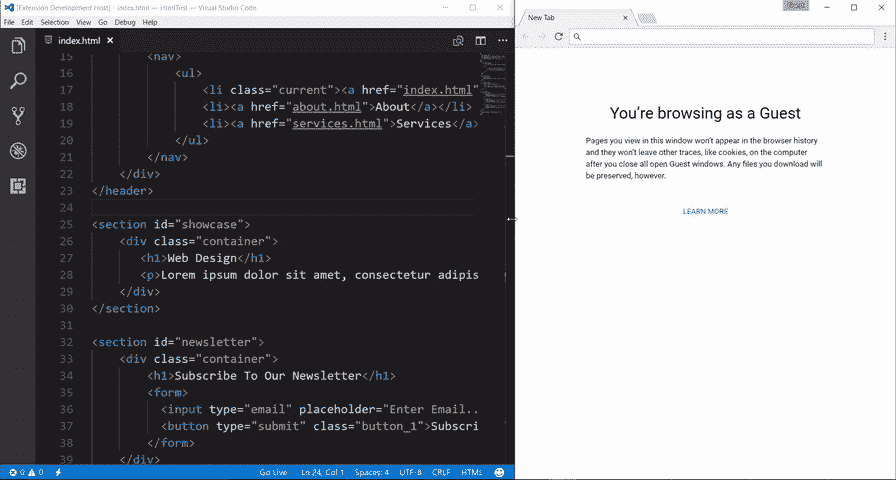

# 每个开发人员都应该使用的 12 个 VSCode 扩展

> 原文：<https://javascript.plainenglish.io/vscode-extensions-that-every-developer-should-use-aeece40beb21?source=collection_archive---------3----------------------->

## VSCode 扩展

## 这些非常好的扩展将有助于解决任何类型的问题，并使您的工作流程更加舒适

Photo by [Joshua Reddekopp](https://unsplash.com/@joshuaryanphoto?utm_source=unsplash&utm_medium=referral&utm_content=creditCopyText) on [Unsplash](https://unsplash.com/?utm_source=unsplash&utm_medium=referral&utm_content=creditCopyText)

VSCode 实际上是每一种编程语言中最受欢迎和公认的 IDE 之一，在我看来，它是最好的。我试图从成千上万的扩展中找到最好的，并展示给你看。其中一些将帮助你调试你的代码，一些将增加许多有用的功能，一些将使你的代码更漂亮和可读。

# [1。美化](https://marketplace.visualstudio.com/items?itemName=HookyQR.beautify)

如果你在前面没有空格和制表符的情况下写代码，或者相反写了太多的制表符，你的代码会变得越来越大。**美化**将很容易地帮助你解决任何类型的可读代码等问题。你需要的一切是:按 F1 并选择“美化文件”。它会自动修复你想要的东西。

Beautify

# [2。Python](https://marketplace.visualstudio.com/items?itemName=ms-python.python)

如果您使用的 Python 是您应该安装的第一个扩展，它允许您在 VSCode 中运行和调试您的代码，您只需按下“运行和调试”按钮，或者设置您自己的工作流来更快地完成它。

Python

# [3。C/C++](https://marketplace.visualstudio.com/items?itemName=ms-vscode.cpptools)

与“Python”相同，但已经适用于 C 和 C++。它还可以帮助你在你的 VSCode 上运行和调试你的代码，甚至使用 AI 来让你更快地编写你的 C/C++代码。

C/C++

# [4。支架对着色机](https://marketplace.visualstudio.com/items?itemName=CoenraadS.bracket-pair-colorizer)

正如你可能从标题中注意到的，它会自动给你的括号着色(不管是方括号还是圆括号)。它确实有助于你阅读你的代码，因为你并不总是知道函数在哪里结束，或者你忘记了在哪里写括号，现在它会显示一个错误。

Bracket Pair Colorizer

# [5。ESLint](https://marketplace.visualstudio.com/items?itemName=dbaeumer.vscode-eslint)

ESLint 分析您的 JavaScript 代码以快速找到错误，并告诉您应该写什么。当它定义了一个错误，它会有一个红色的下划线，你可以很容易地自己修复它。

ESLint

# [6。Visual Studio IntelliCode](https://marketplace.visualstudio.com/items?itemName=VisualStudioExptTeam.vscodeintellicode)

如果 ESLint 可以帮助您找到 JavaScript 代码中的错误，那么 Visual Studio IntelliCode 可以帮助您找到 Python 代码中的错误。此外，这是一个非常有用的扩展，我自己也用了好几个月

Visual Studio IntelliCode

# 7 .[。JavaScript (ES6)代码片段](https://marketplace.visualstudio.com/items?itemName=xabikos.JavaScriptSnippets)

我最喜欢的 JavaScript 扩展。当你在代码中写了一些东西，却忘记了调用函数的方式时，它会自动让你写下来，你只需按下回车键。

JavaScript (ES6) code snippets

# [8。直播服务器](https://marketplace.visualstudio.com/items?itemName=ritwickdey.LiveServer)

当你写你的 HTML，CSS，或者 JavaScript 文件时，你可以按下你的 VSCode 窗口底部的“Go Live ”,它会自动将你的修改添加到网页上，而不需要重新加载，等等。

Live Server

# [9。素材图标主题](https://marketplace.visualstudio.com/items?itemName=PKief.material-icon-theme)

材质图标主题将图标添加到 VSCode 窗口顶部的文件和文件夹中，您可以非常轻松地在它们之间移动。

Material Icon Theme

# 10。一个黑暗职业

又多了一个扩展，让你的 VSCode 工作空间更加舒适美观。它把你的标准主题变成了难以置信的新主题。您可以将标准字体更改为其他字体，甚至是斜体

One Dark Pro

# [11。路径智能感知](https://marketplace.visualstudio.com/items?itemName=christian-kohler.path-intellisense)

当我们需要在我们的“href”或者“src”标签上或者在你的 Python 文件中写一个路径的时候，它会为你提供一个已经存在的文件的路径。

Path Intellisense

# [12。存在不一致](https://marketplace.visualstudio.com/items?itemName=icrawl.discord-vscode)

我添加这个扩展只是为了好玩。当你写代码的时候，它会显示你的状态，你的朋友可以看到。

Discord Presence

# 结论

我过去和现在都在使用这些扩展进行 Web 开发、Python 开发、C++，而不仅仅是。我希望您喜欢这篇文章，并且这些扩展对您有用

*更多内容请看*[***plain English . io***](https://plainenglish.io/)