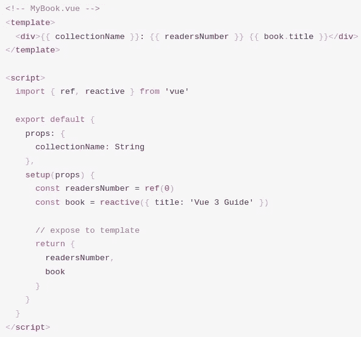
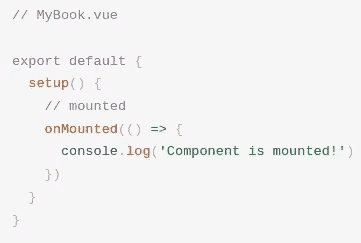
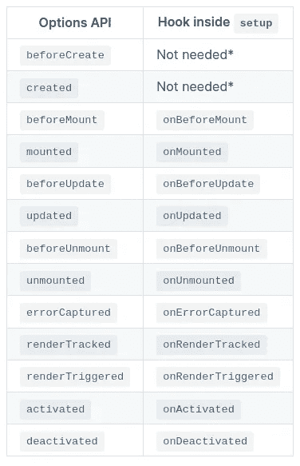
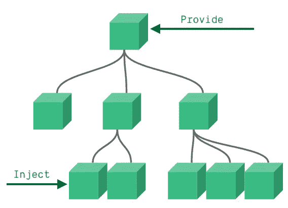
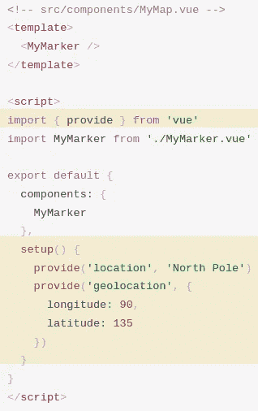
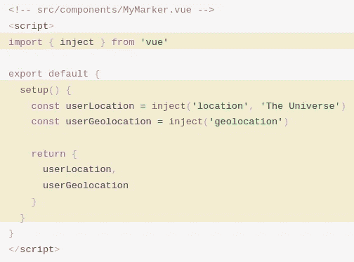
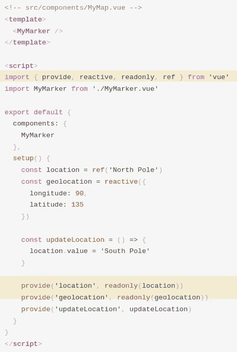
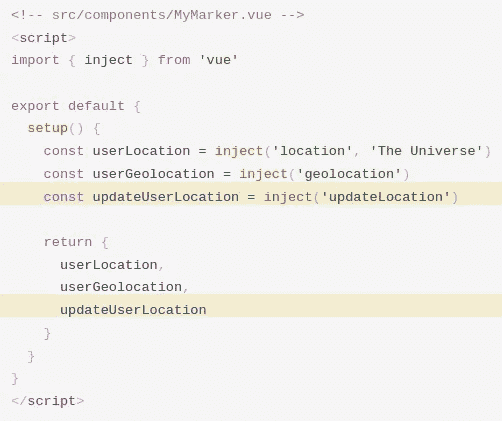

# 简单地说，Vue 3 组合 API

> 原文：<https://javascript.plainenglish.io/vue-3-composition-api-in-a-nutshell-8144244942c1?source=collection_archive---------10----------------------->

## 与 options API 相比的区别和优势。

Photo by [Arnold Francisca](https://unsplash.com/@clark_fransa?utm_source=medium&utm_medium=referral) on [Unsplash](https://unsplash.com?utm_source=medium&utm_medium=referral)

Vue3 中引入了组合 API，可以选择替换选项 API 来创建组件。

## 前身 options API 有什么问题？

在 composition API 之前，创建组件的唯一选择是 options API。然而，在更大的应用中，[选项 API 有两个主要缺点](https://youtu.be/bwItFdPt-6M?t=165):

*   逻辑上属于一起的代码被分割成多个选项(数据、方法、计算)。
*   跨组件重用逻辑可能很棘手或者很麻烦。混合不是好的解决方案/替代方案，因为不清楚混合来自哪里。

因此，引入了[组合 API](https://v3.vuejs.org/guide/composition-api-introduction.html#introduction) 。

*创建 Vue 组件允许我们将接口的可重复部分及其功能提取到可重复使用的代码中。仅这一点就可以让我们的应用程序在可维护性和灵活性方面走得更远。然而，我们的集体经验已经证明，仅仅这样可能还不够，尤其是当您的应用程序变得非常大时——想想几百个组件。当处理这样的大型应用程序时，共享和重用代码变得尤为重要。* [*(为什么组成 API？)*](https://v3.vuejs.org/guide/composition-api-introduction.html#why-composition-api)

## 组合 API 由什么组成？

组合 API 由一个

*   `[setup](https://v3.vuejs.org/guide/composition-api-introduction.html#setup-component-option)` [组件选项，](https://v3.vuejs.org/guide/composition-api-introduction.html#setup-component-option)
*   [无功变量有](https://v3.vuejs.org/guide/composition-api-introduction.html#reactive-variables-with-ref) `[ref](https://v3.vuejs.org/guide/composition-api-introduction.html#reactive-variables-with-ref)` [、](https://v3.vuejs.org/guide/composition-api-introduction.html#reactive-variables-with-ref)
*   [生命周期挂钩注册在](https://v3.vuejs.org/guide/composition-api-introduction.html#lifecycle-hook-registration-inside-setup) `[setup](https://v3.vuejs.org/guide/composition-api-introduction.html#lifecycle-hook-registration-inside-setup)` [、](https://v3.vuejs.org/guide/composition-api-introduction.html#lifecycle-hook-registration-inside-setup)内
*   [用](https://v3.vuejs.org/guide/composition-api-introduction.html#reacting-to-changes-with-watch) `[watch](https://v3.vuejs.org/guide/composition-api-introduction.html#reacting-to-changes-with-watch)` [、](https://v3.vuejs.org/guide/composition-api-introduction.html#reacting-to-changes-with-watch)对变化做出反应
*   [单机](https://v3.vuejs.org/guide/composition-api-introduction.html#standalone-computed-properties) `[computed](https://v3.vuejs.org/guide/composition-api-introduction.html#standalone-computed-properties)` [属性。](https://v3.vuejs.org/guide/composition-api-introduction.html#standalone-computed-properties)

`[**setup**](https://v3.vuejs.org/guide/composition-api-setup.html#setup)` [**函数**](https://v3.vuejs.org/guide/composition-api-setup.html#setup) 有两个参数，`props`和`context`。

`[props](https://v3.vuejs.org/guide/composition-api-setup.html#props)`是电抗的，如果需要，可以使用`toRef`或`toRefs`转换为`refs`。

`[context](https://v3.vuejs.org/guide/composition-api-setup.html#context)`是一个非反应性的 JS 对象，它公开了`attrs`、`props`、`slots`、`emit`。您将无法访问组件选项`data`、`computed`、`methods`、(模板)`refs`。

下面的例子展示了[如何在组件的(HTML)模板](https://v3.vuejs.org/guide/composition-api-setup.html#usage-with-templates)中使用 `[setup](https://v3.vuejs.org/guide/composition-api-setup.html#usage-with-templates)` [。或者，](https://v3.vuejs.org/guide/composition-api-setup.html#usage-with-templates)[可以使用](https://v3.vuejs.org/guide/composition-api-setup.html#usage-with-render-functions) `[setup](https://v3.vuejs.org/guide/composition-api-setup.html#usage-with-render-functions)` [和渲染功能](https://v3.vuejs.org/guide/composition-api-setup.html#usage-with-render-functions)。

[Usage of setup with template.](https://v3.vuejs.org/guide/composition-api-setup.html#usage-with-templates)

[生命周期挂钩](https://v3.vuejs.org/guide/composition-api-lifecycle-hooks.html)必须在`setup`函数中调用。

Lifecycle hook called in the setup function.

对于可用函数，请考虑下表:

Conversion table for Options API (left) to Composition API (right) hooks.

对于将数据从父组件传递到深层嵌套组件，我们不想使用`props`。幸运的是，用于该用例的[提供/注入概念](https://v3.vuejs.org/guide/component-provide-inject.html#provide-inject)也适用于组合 API。

[Visualization of the provide/inject concept.](https://v3.vuejs.org/guide/component-provide-inject.html#provide-inject)

该示例传递来自`MyMap.vue`父组件的数据:

Provide in the parent component.

进入子组件`MyMarker.vue`。

Inject in the child component.

为了给提供/注入模式增加反应性，可以使用`[refs](https://v3.vuejs.org/guide/reactivity-fundamentals.html#creating-standalone-reactive-values-as-refs)`或`[reactive](https://v3.vuejs.org/guide/reactivity-fundamentals.html#declaring-reactive-state)`。修改后的示例显示了两个选项，`location` → `ref`和`geolocation` → `reactive`。

Provide into the reactive parent component.

Inject in the reactive child component.

## **如何将 options API 组件重构为 composition API 组件？**

下面的视频展示了如何将 options API 组件重构为 composition API 组件的一些方法。

[Vue 3 Composition API Introduction [FULL TUTORIAL] (3:53).](https://youtu.be/bwItFdPt-6M?t=233)

*更多内容看* [***说白了。报名参加我们的***](https://plainenglish.io/) **[***免费周报***](http://newsletter.plainenglish.io/) *。关注我们关于*[***Twitter***](https://twitter.com/inPlainEngHQ)*和*[***LinkedIn***](https://www.linkedin.com/company/inplainenglish/)*。查看我们的* [***社区不和谐***](https://discord.gg/GtDtUAvyhW) *加入我们的* [***人才集体***](https://inplainenglish.pallet.com/talent/welcome) *。***