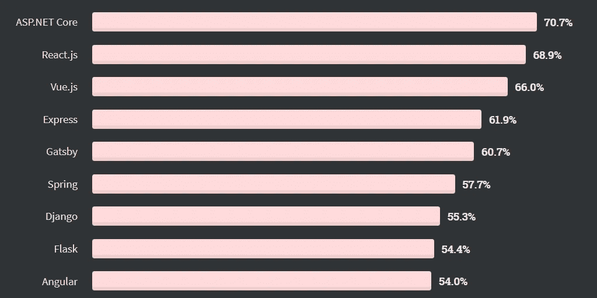
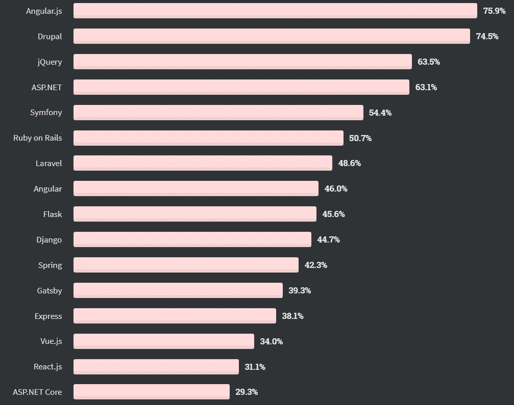
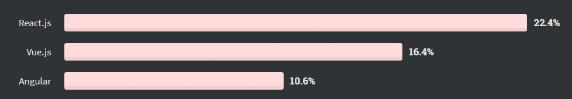

# Vue 3 评估概述

> 原文：<https://javascript.plainenglish.io/vue-3-evaluation-in-a-nutshell-4e36984f009d?source=collection_archive---------14----------------------->

## 聚光灯下的轻量级 JavaScript 框架。

[A custom Vue.js 3 logo.](https://nystudio107-ems2qegf7x6qiqq.netdna-ssl.com/img/blog/_1200x675_crop_center-center_82_line/vue-js-3.jpg)

# Vue.js 是什么？

> Vue 是一个用于构建用户界面的渐进式框架。

Vue.js 是一个用于 web 前端开发的 **JavaScript/TypeScript 前端框架**。它是进步的，因为它允许用户从基本的功能开始，并随着时间的推移发展所使用的功能。例如，从 JavaScript 开始并在以后添加对 TypeScript 的支持相对容易。

# 与其他前端框架的主要区别和相似之处

理解 Vue.js w.r.t .其他前端框架的主要区别很重要，这样才能**知道什么时候用，什么时候不**用。这种比较包括替代框架[角度](https://angular.io/)和[反应](https://reactjs.org/)。

从业务的角度来看，选择框架的主要动机是总拥有成本。[*w . r . t .前端框架的总拥有成本主要受以下因素影响:*](https://en.wikipedia.org/wiki/Total_cost_of_ownership)

*   实现功能需要多少努力，
*   设置和维护 CI 或 CD 基础架构需要多少工作量，
*   测试前端的潜在关键部分及其与后端的集成需要多少努力，
*   扩展项目需要多少努力，
*   将来将项目迁移到更好的技术需要多少努力，等等。

从技术的角度来看 ***一个软件产品的总拥有成本*****主要受**影响**受** [**质量属性**](https://en.wikipedia.org/wiki/List_of_system_quality_attributes) 影响，如可维护性等。正在使用的**前端框架**影响质量属性。矛盾的是，在我参与的几乎所有项目中，到目前为止，软件项目中的其他利益相关者对这些非功能性需求的兴趣很小。然而，从开发人员的角度来看，这些考虑可能是至关重要的。

## **框架与库**

Vue.js 和 Angular 是框架，旨在提供创建开箱即用项目所需的一切。**反应过来是一个库**。在我看来，这一事实经常被低估，例如，与 React 相比，Vue.js 和 Angular 拥有一套更好的标准工具和项目 skaffolding(包括设置 TypeScript 支持)。

## **生态系统**

一个 web 框架的生态系统暗示着**一个人要为一个项目投入多少努力才能获得框架所不能提供的功能**来推动它向前发展。

通常，生态系统(工具、集成、库等)规模的良好**指示。)对于框架来说**是“牛逼”的列表**。相关的有 [awesome-angular](https://github.com/PatrickJS/awesome-angular) 、 [awesome-react](https://github.com/enaqx/awesome-react) 和 [awesome-vue](https://github.com/vuejs/awesome-vue) 。**

**React 可能拥有最大的生态系统**因为它是一个依赖其他库来提供核心功能的库，如路由、全局状态管理(如 Redux)等。 **Angular 和 Vue 提供了许多现成的功能**，并且确实需要通过他们的生态系统提供较少的功能。因此，**角状和洞穴状的生态系统更小**。

## **学习曲线**

因为开发人员很少，这个话题对你来说可能很重要。根据我的经验，随着时间的推移，开发人员必须用不同的语言和框架来实现。为了限制开发人员的认知负荷，学习曲线应该尽可能的低。这允许**快速迭代，同时实现开发特性的最高可能可靠性**。

**Vue.js 是最简单易学的替代品**，与 React 非常相似。Angular 更难学，概念上与 React/Vue 非常不同。【React 和 Vue 之间的切换很容易。Angular 和 React/Vue 之间的切换不是。

## **《概念上的平等》**

框架不同或相似的程度会影响在它们之间移植的努力程度。

**Vue.js 和 React.js 有很多基本概念**(虚拟 DOM，通过 Veux/Redux 进行全局状态管理等。).Angular/Vue 和 React 之间的一个显著区别是 **Angular/Vue 允许清晰地分离关注点** w.r.t .结构化(HTML)、逻辑(JavaScript/TypeScript)和样式(CSS)。Angular 强制将代码放入不同的文件中。在 Vue 中，一个组件的代码可以放入一个[单文件组件](https://v3.vuejs.org/guide/single-file-component.html) `*.vue`文件中，该文件具有用于`<template></template>` (HTML)、`` (JavaScript/TypeScript)和`` (CSS)的单独区域，或者放入[单独的文件](https://v3.vuejs.org/guide/single-file-component.html#what-about-separation-of-concerns)。React.js 使用并依赖于 [JSX](https://reactjs.org/docs/introducing-jsx.html) ，它能够将渲染逻辑放入结构化部分(HTML)中。这是个人喜好，但我更喜欢关注点的严格分离(意味着角度/Vue 方式)。**组件和反应性 Vue 之间的 W.r.t .数据传递与反应性**相似。一般来说，**与 Angular** 的概念重叠很少。

为了比较 Angular、React 和 Vue 中实现的 TODO 应用程序与 [*中的应用程序，我在 React 和 Vue 中创建了完全相同的应用程序。下面是*](/i-created-the-exact-same-app-in-react-and-vue-here-are-the-differences-e9a1ae8077fd) 和 [*的区别我在 React 和 Vue (Part 2: Angular)*](/i-created-the-exact-same-app-in-react-and-vue-part-2-angular-39b1aa289878) 中创建了同一个 app。这个例子很棒，因为它使得透明地实现一个基本应用程序所需的 loc 数量不同。

## **跨平台支撑**

用 Vue.js 创建跨平台应用有几种方法，一段时间以来已经有了 [**Vue 原生**](https://vue-native.io/) 。然而，它[T5 已经被弃用 。它相当于](https://github.com/GeekyAnts/vue-native-core#readme) [React Native](https://reactnative.dev/) ，但很少为人所知和使用。据我所知，Angular 没有专门针对 Angular 的跨平台开发框架。有**通用** [**离子框架**](https://ionicframework.com/) 为 Angular 提供[离子 Angular](https://ionicframework.com/docs/angular/overview) 。当与 [**Ionic Vue**](https://ionicframework.com/docs/vue/overview) 一起使用时，可以用 Vue.js 开发跨平台项目

## **开发商接受度和可用性**

如今，开发人员是公司的关键资源。对开发人员的短缺和需求是如此之高，以至于公司应该考虑开发人员对技术的接受程度，以便能够为需要快速前进的项目雇用开发人员。

根据 Stack Overflow Developer Survey 2020， **React.js 和 Vue.js 是最受喜爱的前端 web 框架**。“喜爱”指的是使用该语言或技术进行开发并表示有兴趣继续使用该语言或技术进行开发的开发人员的百分比*,**表示接受**。*

[Stack Overflow Developer Survey 2020: Most Loved Web Frameworks (top 9).](https://insights.stackoverflow.com/survey/2020#technology-most-loved-dreaded-and-wanted-web-frameworks-loved2)

“令人畏惧的”意味着 *%的开发人员正在使用该语言或技术进行开发，但没有表示出继续这样做的兴趣*,**表示厌恶**。在 JavaScript 类别中， **Angular** 是**最不喜欢的**技术。显然，调查结果是一致的。“喜欢”和“讨厌”web 框架的结果是相反的。

[Stack Overflow Developer Survey 2020: Most Dreaded Web Frameworks (complete listing).](https://insights.stackoverflow.com/survey/2020#technology-most-loved-dreaded-and-wanted-web-frameworks-dreaded2)

“想要的”意味着 *%的开发人员没有使用该语言或技术进行开发，但表示有兴趣使用该语言或技术进行开发*。 **React 是最受欢迎的框架，其次是 Vue 和 Angular** 。对 Angular 开发人员相对较高的需求与这样一个事实有关:许多遗留企业前端的开发始于几年前，那时 Angular 可能是最合理的技术选择。

[Stack Overflow Developer Survey 2020: Most Wanted Web Frameworks (top 3).](https://insights.stackoverflow.com/survey/2020#technology-most-loved-dreaded-and-wanted-web-frameworks-wanted2)

如果将 **GitHub stars** 作为一个指示，另外 Vue.js (184k stars)和 React.js (169k stars)可以被认为具有相同的开发者接受度。Angular (73k 恒星)被甩在后面...

# 工具作业

Vue 提供了一个 [**CLI**](https://cli.vuejs.org/) **用于将标准工具和项目 skaffolding** 打包成一个工具。CLI 可使用[插件](https://cli.vuejs.org/guide/plugins-and-presets.html#plugins) ( [源代码](https://github.com/vuejs/vue-cli/tree/dev/packages/%40vue))进行扩展，并允许定制。然而，[开发团队的主要目标之一是](https://medium.com/the-vue-point/vue-cli-3-0-is-here-c42bebe28fbb)要

*   减少现代前端工具的配置疲劳，尤其是在混合使用多种工具时
*   “尽可能将最佳实践融入工具链，使其成为任何 Vue 应用的默认做法。”

最常用的**ide**要么是 [**VSCode**](https://code.visualstudio.com/) **要么是**[**WebStorm**](https://www.jetbrains.com/webstorm/)。 [**Vetur**](https://vuejs.github.io/vetur/) **是 VSCode IDE** 的扩展，它

*   增加了[语法高亮显示](https://vuejs.github.io/vetur/guide/highlighting.html)
*   为 JavaScript 和 TypeScript 添加了[语义高亮显示](https://vuejs.github.io/vetur/guide/semantic-highlighting.html)
*   允许定义和插入代码[片段](https://vuejs.github.io/vetur/guide/snippet.html)
*   允许使用 [Emmet](https://vuejs.github.io/vetur/guide/emmet.html)
*   增加对[林挺/错误检查](https://vuejs.github.io/vetur/guide/linting-error.html)(林挺:`js`，[暂不支持](https://github.com/vuejs/vetur/issues/170) `[ts](https://github.com/vuejs/vetur/issues/170)` [，](https://github.com/vuejs/vetur/issues/170) /错误检查:`hmtl`，`css`，`scss`，`less`，`js`，`ts`)
*   增加对[格式](https://vuejs.github.io/vetur/guide/formatting.html) ( `prettier`、`prettier-eslint`、`stylus-supremacy`、`vscode-typescript`、`sass-formatter`)的支持
*   增加对[智能感知](https://vuejs.github.io/vetur/guide/intellisense.html)功能的支持
*   允许从 VS 代码中调试运行在 Google Chrome 上的 JavaScript 代码
*   支持使用[组件数据](https://vuejs.github.io/vetur/guide/component-data.html)
*   支持[插值](https://vuejs.github.io/vetur/guide/interpolation.html)(通用语言特性→诊断、悬停、跳转到定义并查找引用、完成、JSDocs 类型检查、属性验证、属性类型验证)
*   尝试添加(工作正在进行中)对 Vetur 终端接口(VTI)的支持，使其能够捕获 Vue 模板中的类型错误，这些错误不能由 Vue 或 TypeScript 单独捕获。
*   支持[全局组件](https://vuejs.github.io/vetur/guide/global-components.html)。

相比之下， **WebStorm** 内置了 [**对 Vue.js**](https://www.jetbrains.com/help/webstorm/vue-js.html) 的支持。

[**Vue-devtools**](https://devtools.vuejs.org/) **是浏览器扩展**的集合，用于在浏览器中启用调试 Vue.js 应用。

很多其他的工具比如**[**story book . js**已经支持 Vue.js 3](https://storybook.js.org/blog/storybook-vue3/) 了。如果你还不知道 [Storybook.js](https://storybook.js.org/) 的话:它允许更快地构建**组件驱动的 ui**。**

# **UI 框架**

**有很多 UI 和组件框架。看看我的另一篇博文[哪些 UI 框架支持 Vue 3？](/ui-frameworks-for-vue-3-cef371317071)了解哪个**已经支持 Vue.js 的版本 3** 。**

# **结论**

**对于开发速度至关重要的公司，开发人员和开发人员的学习时间很少像在**初创公司** Vue.js 是一个合理的选择。如果一家公司不使用 React 或另一个与 Vue.js 提供的开发速度几乎相同的前端框架，它可能是速度很重要的 **MVP 项目的一个好选择**。项目的复杂程度和规模越小，Vue.js 就越适合。**

**我个人认为 Vue.js 非常适合嵌入式设备/服务器的 web 客户端。如果你需要一个**跨平台框架**你必须使用 **Ionic Vue** 。或者，你可以使用 **React + React Native 或 Flutter** ，这取决于你手头的应用和要求(FPS，动画的复杂性等)。).Vue.js 3 提供了许多与 Angular 类似的现成标准化，使开发人员不必评估最佳实践和替代工具，同时也不会让开发人员感到受到框架的限制。版本 3 的目标是**提高可维护性**，使其同样适用于更大规模的项目(例如考虑[组合 API](https://v3.vuejs.org/guide/composition-api-introduction.html) )。除此之外，它是**最容易学习的前端框架**。**

**感谢您的阅读。**

***更多内容看* [*说白了。在这里注册我们的*](http://plainenglish.io/) [*免费周报*](http://newsletter.plainenglish.io/) *。***