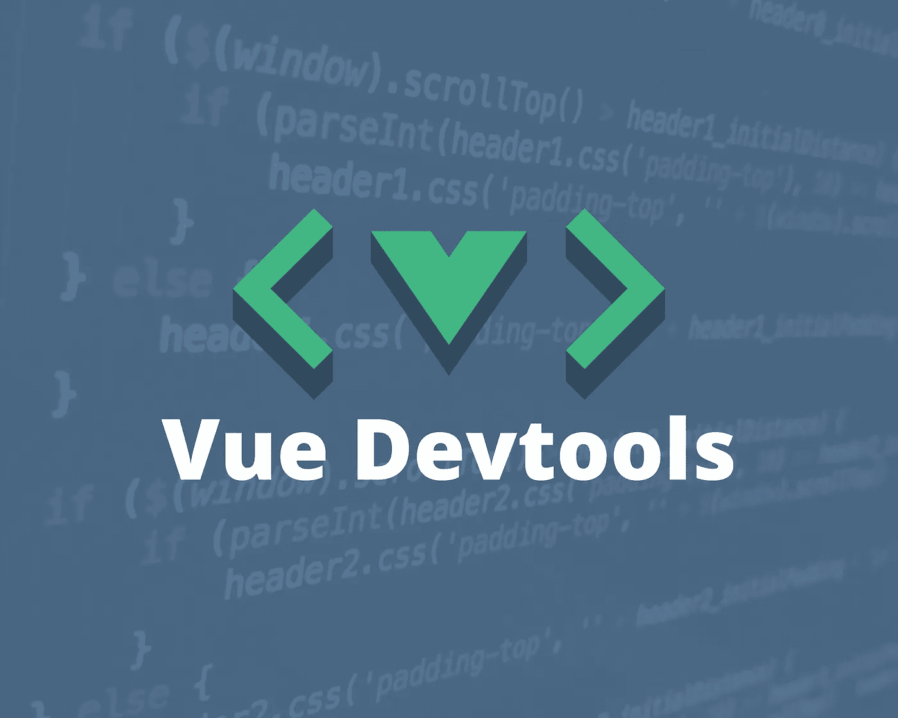
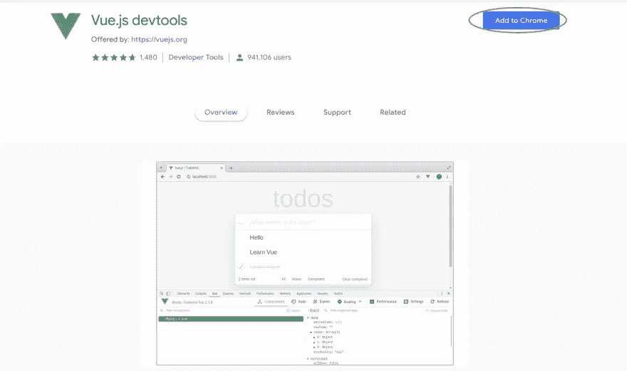
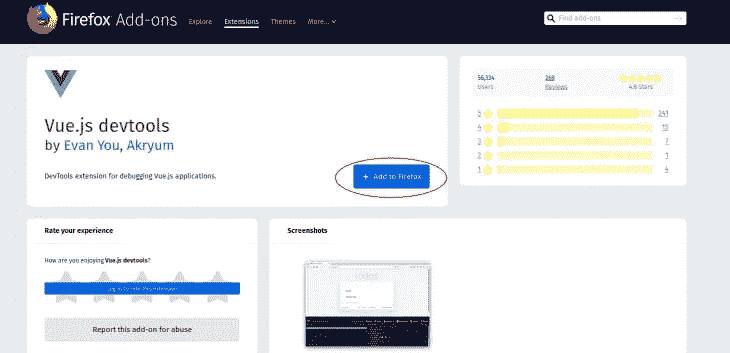
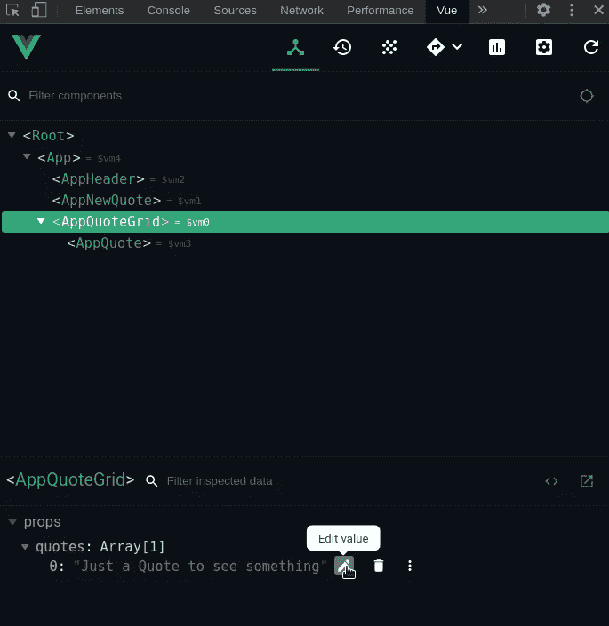
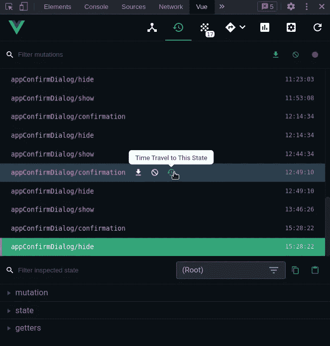
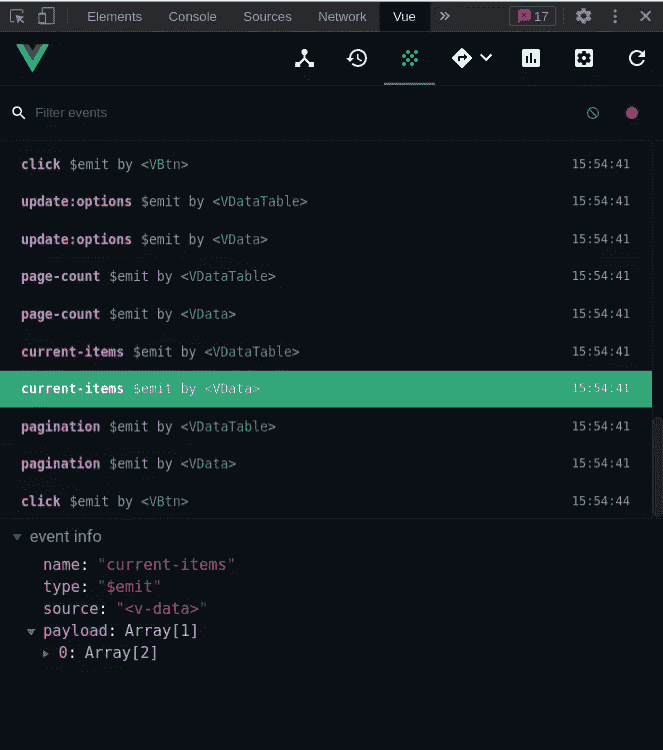
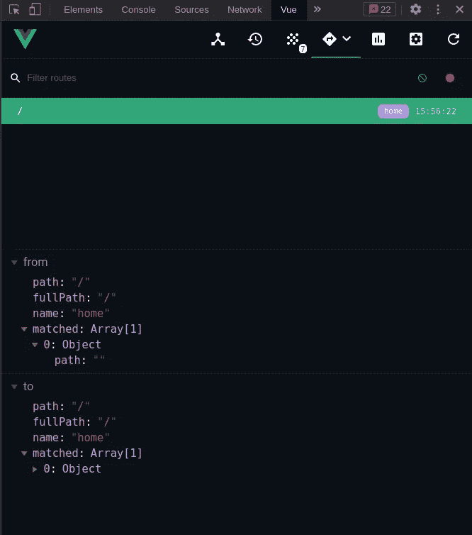
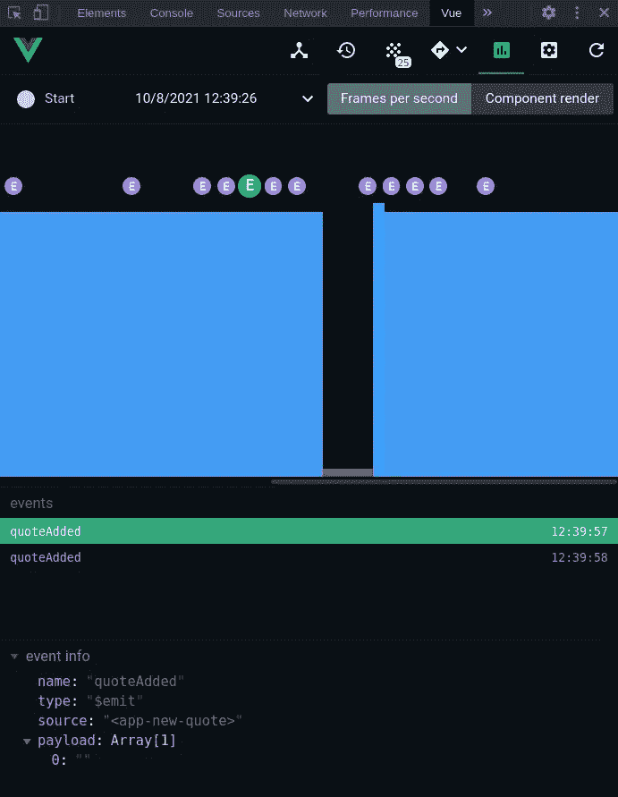
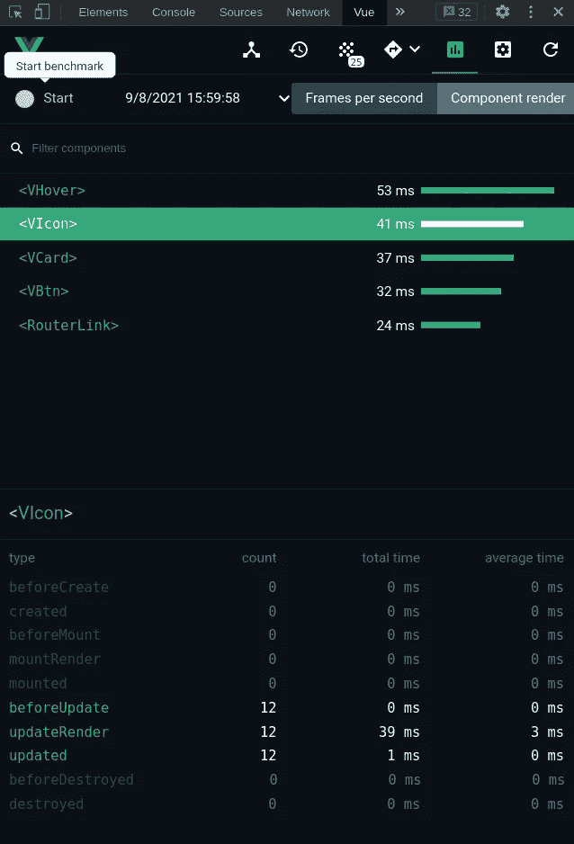

# Vue Devtools:调试 Vue.js 应用程序的最简单方法

> 原文：<https://javascript.plainenglish.io/vue-devtools-the-simplest-way-to-debug-your-vue-js-application-48694f7ad9e1?source=collection_archive---------10----------------------->

Vue.js 框架的优势之一是其 Devtools 的健壮性。它有一些非常酷的特性，可以让开发人员的生活变得更容易，这一点一直受到人们的赞赏。



应用程序开发的过程充满了尝试和错误，总有一点我们需要了解失败，检查应用程序在不同情况下的行为，或者只是确保一切都按预期运行。

使用 Vue Devtools，我们能够通过用户友好的界面检查和调试应用程序，但它的优势在于它带来的额外好处，如使您能够实时编辑数据属性并立即看到反映的变化，以及为 Vuex 进行时间旅行调试的能力。

在本文中，我们将看看这个工具，看看我们如何最大限度地利用它来改进我们的调试过程。所以让我们从安装开始。

# 装置

安装 Vue Devtools 有三种方法:

*   对于 **Chrome** 用户来说这里是 [*扩展*](https://chrome.google.com/webstore/detail/vuejs-devtools/nhdogjmejiglipccpnnnanhbledajbpd) *。*



*   对于 **Firefox** 用户这里是 [*扩展*](https://addons.mozilla.org/en-US/firefox/addon/vue-js-devtools/) 。



*   如果您正在使用**不支持的浏览器**，或者如果您有**其他特定需求**，您可以使用独立应用程序。有两种方法可以做到这一点，全局或本地安装软件包作为一个项目的依赖，在这里我向你解释两者:

1.全局安装软件包:

```
npm install -g @vue/devtools
```

全局安装后，运行:

```
vue-devtools
```

然后将这段代码添加到应用程序 HTML 文件的`<head>`部分:

```
<script src="http://localhost:8098"></script>
```

然后像你习惯的那样启动你的开发服务器，*而不用*终止`vue-devtools`命令(例如，打开一个新的终端)。两者需要并行运行。

2.将包作为项目依赖项安装在本地:

```
npm install --save-dev @vue/devtools
```

作为项目依赖项安装后，运行:

```
./node_modules/.bin/vue-devtools
```

你也可以使用全局`vue-devtools`来启动应用程序，但要检查本地版本是否与全局版本匹配，以避免任何不兼容。

然后将其直接导入您的应用程序:

```
import devtools from '@vue/devtools'
// import Vue from 'vue'
```

> 确保在 Vue 之前导入 devtools，否则它可能无法正常工作。

并连接到主机:

```
if (process.env.NODE_ENV === 'development') {
  devtools.connect(/* host, port */)
}
```

一旦我们正确安装了 Vue Devtools，我们就可以继续学习好的部分，让我们看看如何使用它。

# 实时编辑数据属性和属性

在 app 开发的过程中，你可能想要尝试不同的值来检查 app 在不同场景下的行为。通常，你在你的 IDE 上这样做，然后回到浏览器，但是 Vue Devtools 允许你编辑和操作组件数据和道具，并且实时看到你的 UI 中的变化。



默认情况下，属性数据不可编辑，但我们可以通过在设置选项卡中启用它来更改这一点。

# Vuex 时间旅行

使用 Vuex 进行状态管理可能需要您知道某个时间点的应用程序状态，以及分派了哪些突变。这对于 Vue Devtools 来说非常简单，因为有一个选项卡记录了所有这些信息，并允许我们穿越到 Vuex 状态的以前版本。



# 径赛

此功能允许您检查触发的事件，并检查它们所承载的有效负载。非常有助于查看自定义事件是否正常工作。



# 监控路线

Vue Devtools 有一个选项卡，允许您监控您的应用程序路由，在您的应用程序从一个路由转换到另一个路由时记录数据和历史。



# **性能检查**

这是一个非常酷的特性，它带来了 Vue Devtools。在此选项卡中，您可以检查应用程序的性能。

有两个选项，第一个是检查每秒帧数，因此一旦您单击“start benchmark”按钮，您就可以在条形图中查看性能，标签显示您在应用程序中导航时发生的情况(突变、事件、路由)，如果您单击其中一个条形图，您可以查看详细信息。



第二个选项是组件渲染，它显示了已经渲染的组件的日志和每个组件花费的时间，如果你点击其中的任何一个，你可以看到每个生命周期钩子的详细信息。



现在，我们有了 Vue Devtools 带给我们的所有特性的完整概述。我发现这对开发很有帮助，我必须说它简化了过程。我认为采用这些日益完善的工具并将其纳入我们的日常工作中以使工作流程更加高效是非常重要的。

我希望这是有帮助的，你可以在你的 Vue 应用程序开发之旅中有更好的调试体验。

*更多内容尽在*[***plain English . io***](http://plainenglish.io/)