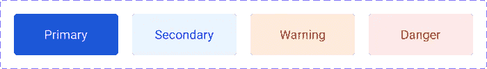
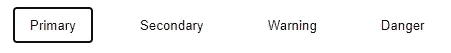
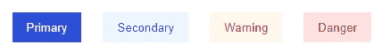
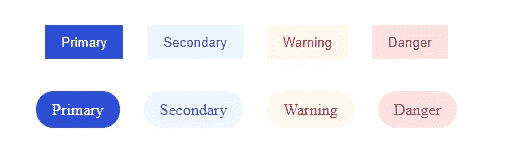

# Vue 企业模式——如何用设计系统变体构建组件

> 原文：<https://javascript.plainenglish.io/vue-enterprise-patterns-how-to-build-components-with-design-system-variants-and-share-variant-928dd4f338cf?source=collection_archive---------15----------------------->

## 并使用变体样式提供程序共享变体样式


本文原载于[企业之路](https://theroadtoenterprise.com/blog/how-to-build-components-with-design-system-variants-and-share-variant-styles-using-variant-style-provider) [。](https://theroadtoenterprise.com/blog/how-to-build-components-with-design-system-variants-and-share-variant-styles-using-variant-style-provider).*)

许多项目，尤其是较大的项目，都有一个设计系统来指导组件的外观和感觉。我们以纽扣为例。下面你可以看到在 [Figma](https://figma.com) 中完成的不同按钮变体的快速设计。



对于网站上的主要操作，按钮可以有不同的变体，如主要和次要。也可以有像警告或危险这样的变体，它们应该让用户对他们将要采取的行动保持谨慎。有多种方法可以实现变体。我想和你分享如何使用 CSS 变量和模块以高效和干净的方式实现这一点。

在本教程中，我们将涵盖:

*   如何基于设计系统创建带有变体的按钮和标签组件。
*   如何利用 CSS 变量和 CSS 模块实现组件变体？
*   如何使用 VariantStyleProvider 组件在多个组件之间共享变体样式。

# 项目设置

你可以在这里找到 GitHub 库和完整的代码示例[。我已经使用](https://github.com/ThomasFindlay/build-vue-component-with-variants-using-css-variables) [Vite](https://vitejs.dev) 为本教程搭建了一个新项目。如果您想学习本教程，您可以通过运行下面显示的命令之一，用 Vite 创建一个新项目:

与 NPM:

```
$ npm init @vitejs/app
```

带纱线:

```
$ yarn create @vitejs/app
```

创建项目后，安装依赖项并启动开发服务器。

让我们从创建一个新的`BaseButton.vue`组件开始。

**src/components/base button . vue**

```
<template>
  <button :class="[$style.baseButton]" v-bind="$attrs">
    <slot />
  </button>
</template>

<script>
export default {
  props: {
    variant: {
      type: String,
      validators: value =>
        ['primary', 'secondary', 'warning', 'danger'].includes(value),
    },
  },
}
</script>

<style module>
.baseButton {
  border: none;
  background: transparent;
  padding: 0.6rem 1rem;
}
</style>
```

这是一个非常简单的组件，只有一个道具— `variant`。现在，让我们替换`App.vue`组件的内容，并为每个变体添加四个按钮。

**src/App.vue**

```
<template>
  <div :class="$style.container">
    <BaseButton variant="primary"> Primary </BaseButton>
    <BaseButton variant="secondary"> Secondary </BaseButton>
    <BaseButton variant="warning"> Warning </BaseButton>
    <BaseButton variant="danger"> Danger </BaseButton>
  </div>
</template>

<script>
import BaseButton from './components/BaseButton.vue'
export default {
  components: {
    BaseButton,
  },
}
</script>

<style module>
.container {
  width: 300px;
  margin: 2rem auto;
  display: grid;
  gap: 1.5rem;
  grid-template-columns: repeat(4, 1fr);
  justify-content: center;
}
</style>
```

正如你在上面看到的，我们为每个变量渲染了四个`BaseButton`组件:主要、次要、警告和危险。

下图显示了按钮目前的样子。主要的一个是重点，所以有一个默认的轮廓颜色显示。



我知道这还不算什么，但我们会实现的。我们有了一个基本的设置，所以让我们为`BaseButton`组件中的每个变量添加 CSS 变量和样式。注意，我们没有使用作用域样式(`<style scoped>`)。相反，我们使用 CSS 模块:`<style module>`。以这种方式定义的任何样式都暴露给`$style`属性下的组件。

# CSS 变量和 BaseButton 组件变量

首先，创建一个名为`variables.css`的新文件，并添加如下所示的 CSS 变量。

**src/styles/variables . CSS**

```
:root {
  --primary-text-color: #eff6ff;
  --primary-bg-color: #1d4ed8;
  --secondary-text-color: #1d4ed8;
  --secondary-bg-color: #eff6ff;
  --warning-text-color: #c2410c;
  --warning-bg-color: #fff7ed;
  --danger-text-color: #b91c1c;
  --danger-bg-color: #fee2e2;
}
```

在`main.js`文件中导入`variables.css`文件，因为应用程序中的组件需要能够访问它们。

**src/main.js**

```
import { createApp } from 'vue'
import './styles/variables.css'
import App from './App.vue'

createApp(App).mount('#app')
```

接下来，我们需要更新`BaseButton`组件。我们需要做三件事:

1.  基于`variant`道具添加变体样式。
2.  将`color`和`background-color`属性添加到`baseButton`类。
3.  为每个变量类添加 CSS 变量。

**src/components/base button . vue**

首先，更改传递给`button`元素的类。除了`baseButton`类，它还应该接收一个适当的变量类。该等级将由`variant`道具决定。

```
<template>
  <button :class="[$style.baseButton, $style[variant]]" v-bind="$attrs">
    <slot />
  </button>
</template>
```

接下来，我们将`color`和`background-color`属性添加到`baseButton`类中。这些属性将有值的`--btn-text-color`和`--btn-bg-color`变量。这些将由每个变量类设置，并将对应于在`variables.css`文件中定义的 CSS 变量。

```
<style module>
.baseButton {
  border: none;
  padding: 0.6rem 1rem;
  color: var(--btn-text-color);
  background-color: var(--btn-bg-color);
}

.primary {
  --btn-text-color: var(--primary-text-color);
  --btn-bg-color: var(--primary-bg-color);
}

.secondary {
  --btn-text-color: var(--secondary-text-color);
  --btn-bg-color: var(--secondary-bg-color);
}

.warning {
  --btn-text-color: var(--warning-text-color);
  --btn-bg-color: var(--warning-bg-color);
}

.danger {
  --btn-text-color: var(--danger-text-color);
  --btn-bg-color: var(--danger-bg-color);
}
</style>
```

太好了，由`App.vue`组件渲染的每个按钮现在都应该应用了适当的颜色，如下图所示。



如果您愿意，您可以为不同的状态添加更多的变量，例如悬停、活动或禁用。

我们已经实现了第一个目标。我们现在有了一个支持多种变体的按钮组件。但是如果我们需要创建另一个也应该支持相同变体的组件呢？例如，一个标签组件？让我们看看如何处理它。

# 带有变体的 BaseTag 组件

让我们从创建一个`BaseTag.vue`组件并更新`App.vue`组件来呈现每个变体的标签开始。

**src/components/base tag . vue**

```
<template>
  <div :class="[$style.baseTag, $style[variant]]" v-bind="$attrs">
    <slot />
  </div>
</template>

<script>
export default {
  props: {
    variant: {
      type: String,
      validators: value =>
        ['primary', 'secondary', 'warning', 'danger'].includes(value),
    },
  },
}
</script>

<style module>
.baseTag {
  border: none;
  border-radius: 1.5rem;
  padding: 0.6rem 1rem;
  color: var(--tag-text-color);
  background: var(--tag-bg-color);
}

.primary {
  --tag-text-color: var(--primary-text-color);
  --tag-bg-color: var(--primary-bg-color);
}

.secondary {
  --tag-text-color: var(--secondary-text-color);
  --tag-bg-color: var(--secondary-bg-color);
}

.warning {
  --tag-text-color: var(--warning-text-color);
  --tag-bg-color: var(--warning-bg-color);
}

.danger {
  --tag-text-color: var(--danger-text-color);
  --tag-bg-color: var(--danger-bg-color);
}
</style>
```

**src/App.vue**

```
<template>
  <div :class="$style.container">
    <BaseButton variant="primary"> Primary </BaseButton>
    <BaseButton variant="secondary"> Secondary </BaseButton>
    <BaseButton variant="warning"> Warning </BaseButton>
    <BaseButton variant="danger"> Danger </BaseButton>
  </div>
  <div :class="$style.container">
    <BaseTag variant="primary"> Primary </BaseTag>
    <BaseTag variant="secondary"> Secondary </BaseTag>
    <BaseTag variant="warning"> Warning </BaseTag>
    <BaseTag variant="danger"> Danger </BaseTag>
  </div>
</template>

<script>
import BaseButton from './components/BaseButton.vue'
import BaseTag from './components/BaseTag.vue'
export default {
  components: {
    BaseButton,
    BaseTag,
  },
}
</script>
```

更新后，您应该会在屏幕上看到四个按钮和四个标签，如下图所示。



很管用，对吧？然而，你发现`BaseButton`和`BaseTag`的组件有多相似了吗？它们几乎是一样的，而且我们在样式上有相当多的代码重复。还有一个不同的问题。如果我们有两个以上有变体的组件，比如说 20 个，然后我们需要引入更多的变体或者更新现有的变体到不同的 CSS 变量，那该怎么办？每一个有变体的组件都需要单独更新。我们可以通过从`BaseButton`和`BaseTag`组件中取出变体样式来解决这些问题。相反，我们将创建一个新的组件，它将管理变量并通过`slots`传递适当的样式。


您想学习开发 Vue 应用程序的高级模式、技术和最佳实践吗？看看这本最先进的 Vue 书籍[Vue——企业之路](https://theroadtoenterprise.com/?utm_source=medium&utm_medium=article&utm_campaign=variant-style-provider)。

CSS 模块的一个真正伟大之处是我们可以轻松地传递和编写样式。这正是我们现在要做的。从创建一个名为`VariantStyleProvider.vue`的新组件开始。该组件将做 3 件事:

1.  接受一个`variant`道具
2.  定义`color`和`background-color`属性的变体样式
3.  呈现一个槽并向其传递`baseVariant`和一个适当的`variant`类。

**src/components/variantstyleprovider . vue**

```
<template>
  <slot :variantStyle="[$style.baseVariant, $style[variant]]" />
</template>

<script>
export default {
  props: {
    variant: {
      type: String,
      validators: value =>
        ['primary', 'secondary', 'warning', 'danger'].includes(value),
    },
  },
}
</script>

<style module>
.baseVariant {
  color: var(--variant-text-color);
  background-color: var(--variant-bg-color);
}

.primary {
  --variant-text-color: var(--primary-text-color);
  --variant-bg-color: var(--primary-bg-color);
}

.secondary {
  --variant-text-color: var(--secondary-text-color);
  --variant-bg-color: var(--secondary-bg-color);
}

.warning {
  --variant-text-color: var(--warning-text-color);
  --variant-bg-color: var(--warning-bg-color);
}

.danger {
  --variant-text-color: var(--danger-text-color);
  --variant-bg-color: var(--danger-bg-color);
}
</style>
```

由于`VariantStyleProvider`组件现在处理变体样式，我们将能够从`BaseButton`和`BaseTag`组件中移除它们。除了移除样式，我们还需要导入`VariantStyleProvider`并使用从它传递过来的`variantStyle`。下面你可以看到两个组件的最终版本。

**src/components/base button . vue**

```
<template>
  <VariantStyleProvider :variant="variant">
    <template #default="{ variantStyle }">
      <button :class="[$style.baseButton, variantStyle]" v-bind="$attrs">
        <slot />
      </button>
    </template>
  </VariantStyleProvider>
</template>

<script>
import VariantStyleProvider from './VariantStyleProvider.vue'

export default {
  components: {
    VariantStyleProvider,
  },
  props: {
    variant: {
      type: String,
      validators: value =>
        ['primary', 'secondary', 'warning', 'danger'].includes(value),
    },
  },
}
</script>

<style module>
.baseButton {
  border: none;
  padding: 0.6rem 1rem;
}
</style>
```

**src/components/base tag . vue**

```
<template>
  <VariantStyleProvider :variant="variant">
    <template #default="{ variantStyle }">
      <div :class="[$style.baseTag, variantStyle]" v-bind="$attrs">
        <slot />
      </div>
    </template>
  </VariantStyleProvider>
</template>

<script>
import VariantStyleProvider from './VariantStyleProvider.vue'

export default {
  components: {
    VariantStyleProvider,
  },
  props: {
    variant: {
      type: String,
      validators: value =>
        ['primary', 'secondary', 'warning', 'danger'].includes(value),
    },
  },
}
</script>

<style module>
.baseTag {
  border: none;
  border-radius: 1.5rem;
  padding: 0.6rem 1rem;
}
</style>
```

这两种成分现在都干净多了。我们设法删除了不必要的代码重复，因为变体样式是在`VariantStyleProvider`组件中管理的。这种模式对维护和扩展变体很有帮助。如果你需要更新它们或者添加新的，你只需要关注两个文件:`variables.css`和`VariantStyleProvider.vue`，而不是手动更新每一个使用变体的组件。

我希望你喜欢这篇文章。如果您想学习更多与 Vue 相关的高级模式、技术和最佳实践，您可能想看看[“Vue—通往企业之路”](https://theroadtoenterprise.com/?utm_source=medium&utm_medium=article&utm_campaign=variant-style-provider)这本书。