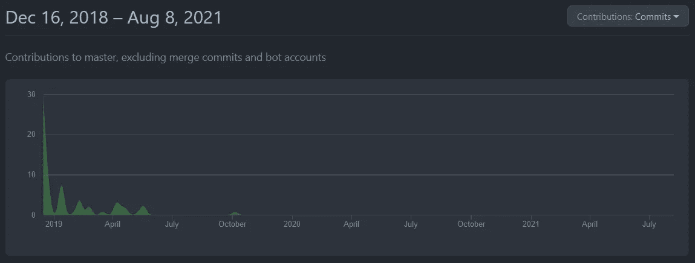
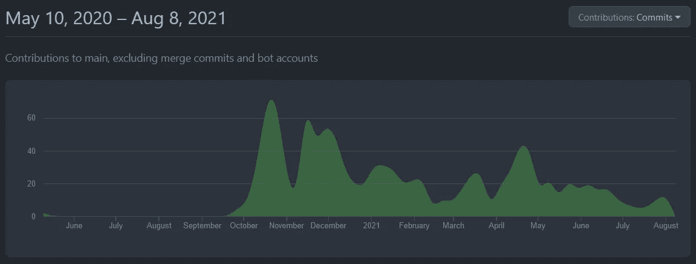

# Vue.js 3 静态站点生成器

> 原文：<https://javascript.plainenglish.io/vue-js-3-static-site-generators-25b7d855027f?source=collection_archive---------3----------------------->

## 关于 Vue.js 3 支持静态站点生成器的状态

根据 [Awesome Vue](https://github.com/vuejs/awesome-vue#static-website-generator) ，Vue.js 有相当多的静态网站生成器可供使用，它们是 [*Gridsome*](https://github.com/gridsome/gridsome) 、 [*徐伟贤*](https://github.com/egojump/peco) *、* [*Saber*](https://github.com/saberland/saber) 、 [*Servue*](https://github.com/futureaus/servue) *、*[Vuers、T25(按字母顺序)。此外还有](https://github.com/vuejs/vuepress) [Nuxt 3](https://v3.nuxtjs.org/) (Nuxt.js v3)。

# **Tl；dr**

在编写本报告时， *Vue 3* 的“转到”静态站点生成器是 [*VuePress v2*](https://v2.vuepress.vuejs.org/) 。一旦 [*Gridsome*](https://gridsome.org/) 支持 *Vue 3* 和 [*Nuxt 3*](https://v3.nuxtjs.org) 作为稳定版本上市，这两个都是其他合理的解决方案。

## Nuxt 3

[Nuxt 3 landing page animation and header.](https://v3.nuxtjs.org/)

[*nuxt . js*](https://nuxtjs.org/)([git hub 项目](https://github.com/nuxt/nuxt.js))是一个主要的 *Vue.js* 框架，支持[静态站点生成](https://nuxtjs.org/docs/concepts/static-site-generation#static-site-generation)。一段时间以来，有 *Nuxt.js v3* 又名[*Nuxt 3*](https://v3.nuxtjs.org/)([git hub 项目](https://github.com/nuxt/framework))可供测试版使用。

# Gridsome

[Gridsome logo.](https://gridsome.org/logos/logo-normal.svg)

[*grid some*](https://gridsome.org/)([GitHub 项目](https://github.com/gridsome/gridsome))是以 [*Netlify*](https://www.netlify.com/) 和 [*algolia*](https://www.algolia.com/) 为后盾的 Vue.js 的 Jamstack 框架。

*Netlify* 是为 web 应用和静态 JAM stack 网站提供托管和无服务器后端服务的主要提供商之一。 *algolia* 提供托管搜索 API ( [*algolia 搜索*](https://www.algolia.com/products/search-and-discovery/hosted-search-api/) )和托管推荐 API ( [*algolia 推荐*](https://www.algolia.com/products/recommendations/) )。与其他可用的静态网站生成器相比，就赞助量和长期支持而言， *Gridsome* 的支持可以被认为是最“稳定”的。

*Gridsome* 可以看作是 [React](https://reactjs.org/) 静态网站生成器 [*盖茨比*](https://www.gatsbyjs.com/) 的主要竞争对手。顺便说一下:在有[盖茨比云](https://www.gatsbyjs.com/products/cloud/) [之前，Netlify 也是盖茨比云](https://www.gatsbyjs.com/docs/how-to/previews-deploys-hosting/deploying-to-netlify/)的主要托管解决方案。

贡献频率不如 VuePress，但还可以。大部分贡献来自 Gridsome [的联合创始人 Hans-Jr gen ved vik](https://github.com/hjvedvik)。

[Contributions to Gridsome (29 July 2018–9 August 2021).](https://github.com/gridsome/gridsome/graphs/contributors)

**Gridsome 还不支持 Vue 3。**有关更多信息，请参考 GitHub 上用于 Vue 3 升级的[看板。](https://github.com/gridsome/gridsome/projects/3)

# 徐伟贤

[*徐伟贤*](https://github.com/upash/peco) 已存档**停止开发**。它的继任者是*军刀*。

# 军刀

[*Saber*](https://saber.land/)([GitHub 项目](https://github.com/saberland/saber))是*徐伟贤*的继任者。根据撰写本文时的[发布页面](https://github.com/saberland/saber/releases)(2021 年 8 月 8 日)，最后一次发布`saber@0.11.7`是在 2020 年 5 月 19 日，这意味着很久以前。此外，从 2020 年 10 月起，投稿频率几乎降至零。

[Contributions to Saber (20 January 2019–9 August 2021).](https://github.com/saberland/saber/graphs/contributors)

在我看来，项目**也可以被认为是死了**。

# **服务**

[*Servue*](https://github.com/futureaus/servue)[尚未发布一个正式版本](https://github.com/futureaus/servue/releases)并且自 2020 年 10 月以来没有显著的贡献。

在我看来，这个项目**也可以被认为是死了。**

# VuePress

[VuePress logo.](https://v2.vuepress.vuejs.org/images/hero.png)

[*Vue press*](https://vuepress.vuejs.org/)*(Vue press v1)([GitHub 项目](https://github.com/vuejs/vuepress))是知名的 Vue 静态站点生成器。**对 Vue 3 的支持可通过**[***Vue press-next***](https://github.com/vuepress/vuepress-next)***(Vue press v2)获得。****自 2020 年 12 月 24 日起，不再积极维护 VuePress 1。这意味着所有的开发工作都投入到 vuepress-next (VuePress v2)中。**

****

**[Contributions to vuepress-next (10 May 2020 — 8 August 2021).](https://github.com/vuepress/vuepress-next/graphs/contributors)**

**对了，主要贡献者[meteorloxy](https://github.com/meteorlxy)来自 Vue 开发团队。**

***更多内容请看*[***plain English . io***](http://plainenglish.io/)**