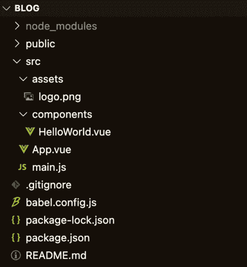
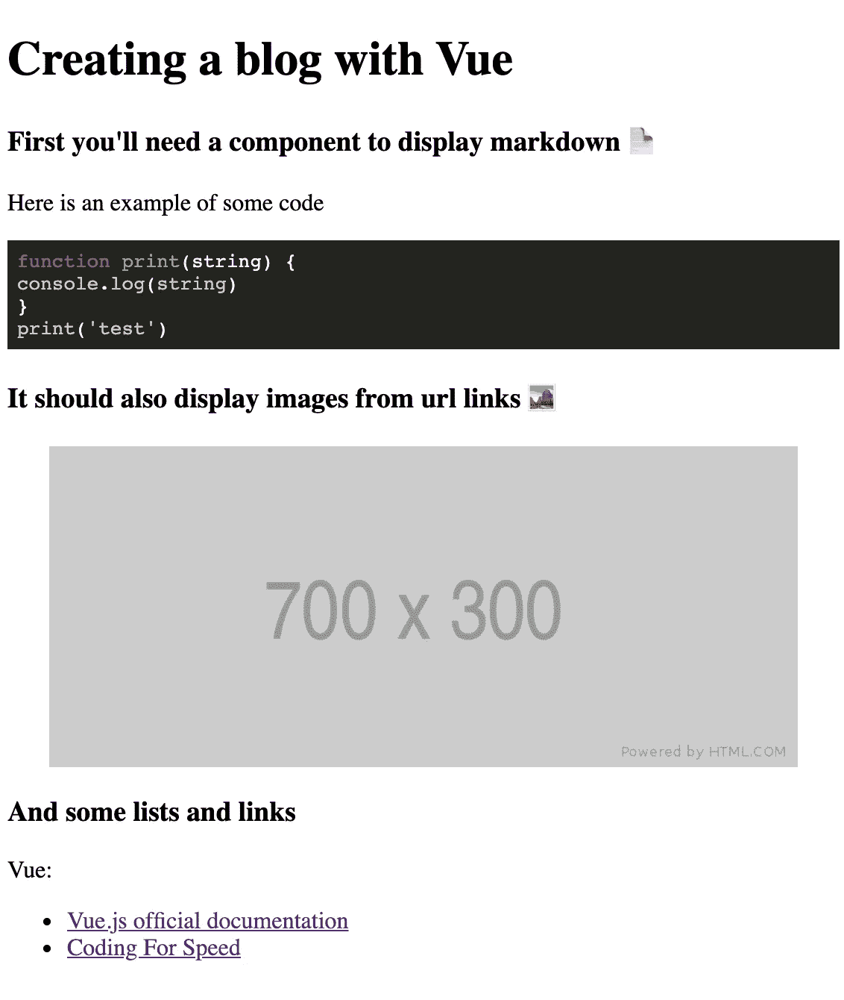

# 构建 Vue.js Markdown 渲染器组件

> 原文：<https://javascript.plainenglish.io/vue-js-markdown-renderer-component-with-code-highlight-support-5cde100f6e0d?source=collection_archive---------3----------------------->

## 带有代码突出显示支持

最终代码可以在这里找到[https://github . com/PS 1312/simple _ blog/tree/feature/markdown _ display](https://github.com/ps1312/simple_blog/tree/feature/markdown_display)，找`MarkdownDisplay.vue`看实现。

# **上下文**

我想开发我自己的博客作为一个辅助项目来提高我的 Vue.js 和 TDD 技能。我已经选择将博客内容保存在 markdown 中，我需要 Vue 中的一个组件来编译并以 HTML 格式呈现我保存的帖子。

经过一些研究，我发现了两个可以完成这项工作的库， [**marked.js**](https://github.com/markedjs/marked) 和 [**highlight.js**](https://highlightjs.org/) 。我最终没有做测试，但是我以后一定会再做的。我希望该组件能够编译并显示 HTML 元素的 markdown 字符串，我的 markdown 引用将是:

```
# Creating a blog with Vue### First you'll need a component to display markdown 📄Here is an example of some code```javascript
function print(string) {
 console.log(string)
};
print("test");
```### It should also display images from url links 🏞### And some lists and links ✅Vue:- [Vue.js official documentation](https://helloacm.com)- [Nuxt.js Server Side Rendering]([https://nuxtjs.org/](https://nuxtjs.org/))
```

# **初始设置**

我首先使用默认的 Vue 2 设置，通过[**Vue CLI**](https://cli.vuejs.org/)**创建了一个 Vue 应用。安装后，你可以用`vue create blog`创建一个项目，其中“博客”是你选择的应用程序名称，输出将是。**

****

**Vue CLI boilerplate for Vue 2 default settings**

**在删除了`HelloWorld.vue`组件并移除了其在`App.vue`上的引用后，我需要一个新的空组件来显示内容，它可以被称为`MarkdownDisplay.vue`。 **marked.js** 和 **highlight.js** 都还需要安装，可以用`npm install --save marked highlight.js`来做。**

# ****将 markdown 编译为原始 HTML****

**`MarkdownDisplay.vue`需要从父组件(本例中为`App.js`)接收一个作为道具传递的 markdown 字符串。为了显示想要的 HTML，markdown 字符串需要由 **marked.js** 解析和编译，通过通读[文档](https://marked.js.org/using_advanced#options.)我们看到它可以用`marked("## sample string" [,options])`完成。该组件将类似于:**

**我想在这里谈一些事情:**

1.  **返回一个原始的 HTML。我们可以在 Vue 的`v-html`指令中呈现这些内容，如[文档](https://vuejs.org/v2/guide/syntax.html#Raw-HTML)中所示。**
2.  **我已经选择使用`marked`作为 Vue 计算属性。该属性可以在 data 中设置，也可以在`mount`中编译，但是使用 computed 会给我们[基于 markdown 字符串依赖的自由缓存](https://vuejs.org/v2/guide/computed.html#Computed-Caching-vs-Methods)。**

**我们以当前预览结束:**

****

**这里有两个问题:**

1.  **调整窗口大小时，图像表现奇怪，我们需要添加一些 CSS 样式来解决这个问题。**
2.  **代码段没有正确突出显示。在小代码块中，这很好，但是对于复杂的逻辑，如果没有语法高亮，就很难阅读。**

# **代码突出显示**

**正如我们所看到的, **marked.js** 默认情况下不高亮显示代码，但是通过搜索它的文档，我们可以找到一个关于如何正确设置该功能的[示例](https://marked.js.org/using_advanced)(甚至使用 **highlight.js🙌).****

**但是首先，我们需要设置 **highlight.js，**我们可以通过在某个地方调用`hljs.highlightAll()`来完成。在我们的应用程序中，它将从`MarkdownDisplay.vue` `mounted`生命周期步骤开始调用。我们还必须选择我们的代码块将呈现什么样式，有各种样式[可供选择。为了避免歧义，我们需要从 npm 模块导入前缀为`~`的文件，你可以在这里](https://github.com/highlightjs/highlight.js/tree/master/src/styles)阅读更多关于它的信息[。我还将添加必要的 CSS 来修复调整大小时的图像元素。该组件将类似于:](https://cli.vuejs.org/guide/html-and-static-assets.html#static-assets-handling)**

**HTML 结果是:**

****

# **绩效调整+事后反思**

**在`webpack-bundle-analyzer`上运行项目后，我注意到 **highlight.js、**正在进行未使用的导入，从而使包变得更大，而为了解决这个问题，我们需要加载我们需要突出显示的语言，在本例中只有`javascript`。该组件将类似于:**

**就是这样。✅**

## **结论**

**这是学习 Vue 语法和第三方依赖用法的一个很好的组件。我还学习了如何正确地从单个页面组件导入 npm 模块。最后但同样重要的是，通过`webpack-bundle-analyzer`运行应用程序让我对包的创建和代码分割有了更多的了解，我将发布另一篇文章来展示我是如何做到这一点的。**

**感谢你阅读✋**