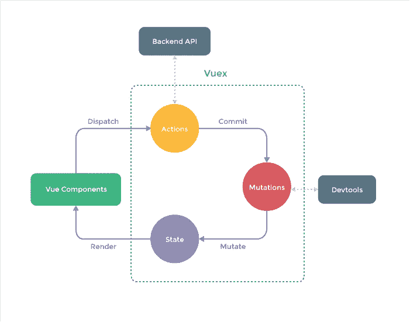
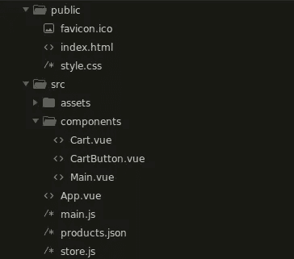

# 使用 Vuex 进行 Vue.js 状态管理

> 原文：<https://javascript.plainenglish.io/vue-js-state-management-with-vuex-3a87e1ae83c2?source=collection_archive---------7----------------------->

## 在这篇文章中，我们将学习使用 Vuex 在 Vue JS 中进行状态管理的概念，然后我将带你看一个使用它的真实例子。

# 介绍

在不断变化的开发技术环境中，开发人员经常发现自己被大量需要掌握的技术弄得不知所措。在学习了基本的 Vue JS 并使用它构建了一些 web 应用程序之后，开发人员觉得有必要学习状态管理只是时间问题。在了解了组件、状态、道具等之后，一开始可能会有点吓人。，现在你需要学习另一个神秘的概念…不要担心在这篇文章中我会试着给你一个温和的介绍这个新概念。

# Vuex 是什么？

*Vuex 是一个状态管理模式和库，它是应用程序中所有组件的集中存储。*在简单的 Vue JS 应用程序中，我们只有很少的组件可以非常简单地管理状态，我们可能只有一个父组件，从这个父组件我们将道具传递给它的子组件。我们还可以通过发出事件将数据从子组件向上传递到父组件。

然而，随着您的 web 应用程序的增长和组件数量的增加，您会发现许多组件将需要共享相同的数据，您的组件将变得更加嵌套，以至于您需要传递许多层深度的 props。想象一下，如果你需要将道具传递给一个 8 层深的组件…你需要将道具从一个组件传递到另一个组件。这将导致一个不可维护的混乱，或者更简单地说，一场噩梦！

幸运的是，Vuex 允许我们创建一个集中的存储，其中包含我们的应用程序需要的全局状态，并将其暴露给我们的所有组件，因此我们可以以简单和可预测的方式访问和修改它。事实上，它和 Vue JS 一样简单易用，使用起来也很方便。

# Vuex 概念

**存储** *存储*是一个保存应用程序状态的容器。Vuex 存储是反应性的，这意味着当组件从它那里检索状态时，存储状态的变化将在使用它的组件中得到反映和更新。

**State** State 是包含应用程序所有全局状态的对象。与单个组件的本地状态不同，这是项目中任何组件都将使用的状态。

**getters** 当我们需要从状态中计算特定数据时，我们会使用 Getters，在 todo 应用程序中，我们会有`completedTodos` 和`uncompletedTodos` getters，因此使用 Getters 我们可以从状态中过滤并获取我们需要的数据，我们可以对它们执行计算等。为了简单起见，你可以把 *getters* 看作是 Vue JS 中的*计算的*属性。

**突变** 在 Vuex 中，不能直接*突变*(改变状态)状态，只能通过提交*突变*来实现。突变是同步的，因此它们不能用于处理异步任务。

**动作** 动作不同于突变，因为它们是异步的，因此它们适用于获取数据和处理其他异步操作。然而，动作不能直接改变状态，它们应该只提交改变。调用一个动作的动作(见我在那里做的)叫做*调度*一个动作。

The Vuex flow taken from the official docs

在上图中，您可以看到 Vuex 流的可视化表示。这张图片完美地概括了我们迄今为止所学到的东西。让我们再消化一次。
状态在 Vue 组件中呈现。我们可以从我们的组件调度动作，反过来动作可以提交突变，然后突变状态。如此循环往复。

***我们如何访问组件中的商店？***

一旦我们定义了我们的 Vuex 存储并将其包含在 Vue 实例中(您将在下一节中看到如何实现)，我们就可以在任何组件中将它作为一个属性轻松地使用:
**this。$store** -访问状态:`this.$store.state.counter`-调度一个动作:`this.$store.dispatch(‘increment’)`
-提交一个突变:`this.$store.commit(‘increment’)`
-访问一个 getter 示例:`this.$store.getters.completedTodos`

不要让那个奇怪的美元符号吓到你，`$store`只是一个简单的属性，可以在我们的应用程序中的任何地方访问。

## **如何安装 Vuex？**

要安装 Vuex，你首先需要有一个 Vue JS app，如果你没有先在你的终端里创建一个 Vue JS app:
`vue create exampleapp`

完成后，您可以将光盘放入您的新应用文件夹:
`cd exampleapp`

然后就可以安装 Vuex:

# 购物车 web 应用程序——一个真实的例子

## **先决条件**

为了遵循这一节，我希望你:
-对 Vue.js
有很好的了解-了解 ES6，因为我将在这个示例应用程序中大量使用 ES6 功能

现在我们知道了基础知识，我们可以开始使用我们的示例应用程序了。在这一节中，我将采取不同的方法，引导您完成这个相当简单的项目的代码，而不是一步一步地指导您，我将尽可能清晰地解释它。乍一看，这似乎有悖常理，但主要思想是熟悉 Vuex 的工作方式和外观，所以到最后，您应该觉得已经准备好使用 Vuex 实现任何项目了。完整的代码将被上传到 Github，你会在文章的最后找到链接，如果你不能理解的话可以查看。

购物车将具有通常的功能，您有一个产品列表，您可以将它们添加到购物车。购物车商品出现在可以切换的侧边栏中。您可以查看购物车中有多少物品以及总价。如果你愿意，你可以预先查看 netlify 上的示例，这样你就可以看到它是如何工作的， [*点击这里查看*](https://shopping-cart-vuex.netlify.app) *。*

让我们开始吧，示例应用程序文件夹结构如下所示:

**store.js**

首先，我们将检查 *store.js* 文件中的代码，这是 Vuex 魔法发生的地方，在我们有了 store 之后，从任何组件引用/使用它将变得很简单。

在上面的代码中，你可以看到一个基本的 Vuex 商店。这段代码相当简单明了。我们已经导入了 vue 和 vuex，我们已经告诉 vue 使用 vuex，将商店初始化为一个对象。我们还可以看到状态、getters、突变和动作作为属性存在于存储中，它们现在是空的。最后，我们传递 store 对象来导出 Vuex 存储。

现在，显然我们需要为存储提供状态、getters 等。我们的应用程序将会消耗。我们从州开始:

**状态**

我们的状态非常简单，在`products`中，我们将产品数据存储为一个数组。产品将被存储为一个对象数组，该数组来自一个包含一些虚拟产品数据的 *products.json* 文件。您可以在这里查看带有产品数据[的文件。
`cartItems` 将只包含购物车中的产品，而`showCart`是一个布尔值，因为它将用于显示或隐藏购物车中的商品，这些商品将显示在侧栏中，单击即可切换。](https://github.com/floriand99/shopping-cart/blob/main/src/products.json)

**突变**

自然，这是我们应用程序的大部分逻辑发生的地方，因为突变负责改变状态。

突变是接收一个`state`参数和一个可选的`payload` *的函数。*所以在大多数情况下，你会看到第二个参数叫做`payload` *，*相反，我喜欢将有效载荷作为一个对象传递给变异函数，这样我就可以从对象中析构它，从而通过它的内容来引用它，这种方式对我来说似乎更有语义。请记住，有效载荷将从我们的组件中传递，稍后当我们提交它们的变体时，您会看到这一点…

这是一些突变:

在`setProducts` 变异中，我们将接收到的`products`有效载荷分配给我们状态中的`products`数组。

`toggleCart`没有接收到有效载荷，它简单地将`showCart`设置为其自身的倒数*。*

`addToCart`接受需要添加到购物车的产品，然后我们简单地使用产品 id 在`cartItems`中找到元素，并检查它是否存在于`cartItems` 数组中。如果它不存在，我们将产品添加到`cartItems`并添加一个`numOfItems`属性，默认为 1。如果产品已经存在于`cartItems` 中，我们只需增加`numOfItems` *。*我们需要这样做，如果用户添加了相同产品的 1 个以上的项目，它不会显示多次，而是我们会显示它的数量。

`removeFromCart`接受`productId`作为有效载荷。我们使用 id 在`cartItems` 中找到产品，如果它在购物车中有多个商品，我们减少产品*的`numOfItems` ，如果它只有一个商品，我们从`cartItems`中完全删除该产品。*

**吸气剂**

有两个 getters，顾名思义，将用于返回或获取购物车中商品的数量以及所有商品的总价。getters 接受状态作为参数，我们使用析构来获得我们需要的东西`cartItems`。我已经使用 reduce 数组方法计算了购物车中所有商品的`count`和`totalPrice`。如果您不能理解 reduce 方法，我还提供了注释代码，它使用一个简单的 for 循环来实现相同的功能。

我们不会使用动作，因为这个应用程序不会有任何异步代码，突变很简单，所以我们应该可以直接从我们的组件提交突变。

# 消耗国家

现在我们有了商店，我们如何将它插入到我们的 Vue 应用程序中呢？它应该在 main.js 文件中完成:

**main.js**

导入商店并将其传递给 Vue 实例，就是这样。万岁！现在，商店对我们应用程序中的所有组件都可用。现在我们可以转到我们的组件，看看这个商店的运行情况…

**App.vue**

这是我们的应用程序的根组件，作为其他组件的包装器。

在脚本标签的顶部，我们已经从 *products.json* 导入了产品数据，在`created`方法中，我们提交了`setProducts` 变异，并将从 *products.json* 获得的产品数据作为第二个参数传递给它。

*注意:在下面的组件中，我已经包含了 bootstrap(这样示例应用看起来就不会难看了)，所以如果看起来有很多代码，那么大部分都是 bootstrap 类。我们的重点将是 Vuex 零件，我将指导您完成！*

**Main.vue**

该组件显示产品列表，每个产品都有一个*添加到购物车*按钮。

*第 4 行* —我们迭代商店状态中的产品
*第 16 行* —在 v-for 循环中，我们有一个添加到购物车按钮，单击该按钮会提交变异，我们会将当前产品传递给它。其他一切都是标准的 Vue JS 程序，我们显示产品名称、等级等。

**CartButton.vue**

这个组件只是一个按钮，用来切换购物车侧边栏。它还在第 6 行使用了`count` getter，显示购物车中有多少商品。

**Cart.js**

*第 4 行* —我们检查购物车侧边栏是否应该显示
*第 6 行* —这是一个关闭按钮，如果单击，购物车侧边栏将被切换(隐藏)
*第 10 行* —我们检查是否有任何购物车项目
*第 11 行* —我们循环遍历购物车项目
*第 17 行* —是一个移除按钮，当它被单击时，我们提交`removeFromCart`变异并传递当前的

现在你知道了！我们已经了解了 Vuex 的状态管理概念，并回顾了一个真实世界的例子，现在您应该可以轻松地创建 Vuex 商店，并从您的 Vue 应用程序中的组件访问它。我希望你喜欢这篇文章！如果你对这篇文章有任何问题，请提出来，我会尽快回答。

到 github 的链接:[https://github.com/floriand99/shopping-cart](https://github.com/floriand99/shopping-cart)

**作业:** *克隆或分叉 GitHub 上的项目。然后在购物车物品侧边栏上添加一个“清除所有物品”按钮，当单击该按钮时，所有物品都应该从侧边栏中清除，添加必要的变异来这样做。*