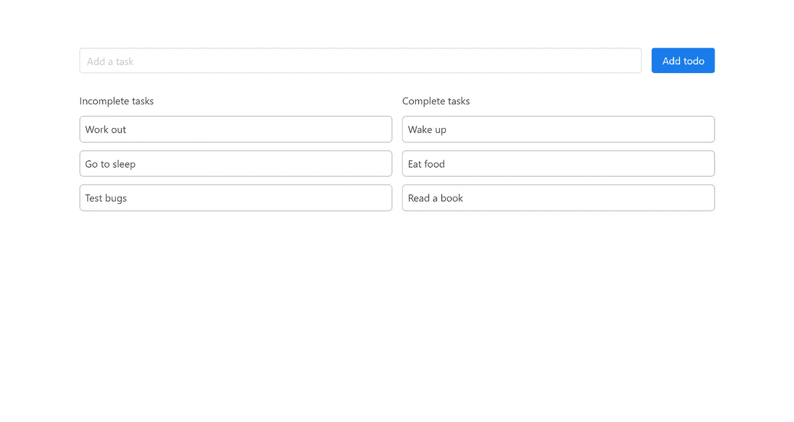

# Vue.js 使用 Vuex 进行状态管理:初学者指南

> 原文：<https://javascript.plainenglish.io/vue-js-state-management-with-vuex-a-beginners-guide-a1a281d7e91d?source=collection_archive---------8----------------------->


web 应用程序的状态管理是一个复杂的过程。做这件事本身没有正确的方法，但是如果你不遵循一定的规则，事情会很快变得一团糟。Vuex 是 VueJs 维护状态的方式。如果你已经熟悉像 Redux 这样的东西，它非常简单易懂。本文将带您了解 Vuex 的关键概念，最后我们将有一个利用所有这些概念的基本演示应用程序。让我们开始吧。

## Vuex 的基础知识

Vuex 本质上使用了一个**真实的单一来源**，这意味着你所有的应用程序状态将被存储在一个单一的对象中。然后，这个源被暴露给一组将使用它的组件。这种模式非常常见，因为它在整个应用程序中保持所有数据**的一致性。**在继续前进之前，你需要理解几个关键概念。

## 状态对象

这就是我之前提到的**真理的单一来源**。假设你正在开发一个笔记应用程序。笔记列表将是您的根状态。下面的例子是一个最简单的 Vuex 商店。

```
const store = new Vuex.store({
  state : {
    notes : []  //Always initialize your state properties
  }
})
```

## **突变**

现在，您想要向刚刚创建的 notes state 属性添加一个注释。您不能直接访问属性并向其推送注释。您将对状态执行的任何类型的更新都将借助于变异来完成。突变基本上看起来像一个帮助您更新状态属性的常规事件。突变可以访问状态，因此您可以使用它轻松地添加、更新或删除元素。除了状态之外，还可以传入一个有效负载对象，在我们的例子中是一个 note 对象。

```
const store = new Vuex.store({
  state : {
    notes : []  
  },
  mutations:{
    ADD_NOTE(state, note) {
      state.notes = [...state.notes, note]
    },
  },
})
```

让我们假设您有一个 Vue 组件想要向这个商店添加一个注释。你不能像对待一个事件那样简单地调用突变。您将使用商店的提交方法。

```
store.commit("ADD_NOTE", note) //The note that needs to be added
```

突变只负责更新状态，但是它们不处理异步操作。所以不能在突变内部进行 api 调用。这就是**动作**进入画面的地方。

## **动作**

动作处理异步操作。此外，您可以从一个动作提交一个变异，因此如果您想使用一个动作向数据库添加一个注释，您可以通过将添加的注释作为有效载荷传入来立即**提交(调用)**一个变异。

动作可以访问**上下文对象**。这个上下文对象公开了与 store 实例相同的一组方法和属性，这就是为什么您可以从一个动作内部提交一个变异。如果你愿意，你甚至可以调用不同的动作。

```
const store = new Vuex.store({
  state : {
    notes : []  
  },
  mutations:{
    ADD_NOTE(state, note) {
      state.notes = [...state.notes, note]
    },
  },
  actions:{
    async addNote(context, note) {
      const notes = await apiCallToAddANote(note)
      context.commit("ADD_NOTE", note) //Pass in the added note
    }
  }
})
```

通过使用 store 的 dispatch 方法，我们可以从组件树的任何地方访问这些操作。

```
store.dispatch("addNote", note)
```

## 吸气剂

当您需要状态的计算版本时，通常会使用 Getters。例如，假设我们需要所有突出显示的音符。因此，您可以定义一个 getter 来返回经过过滤的高亮显示的笔记列表。这非常有帮助，因为您可能在不同的组件中使用过滤列表，并且您不必在使用它的任何地方重复逻辑。

除了存储，Getters 本质上是计算属性。

```
const store = new Vuex.store({
  state : {
    notes : []  
  },
  getters: {
    redNotes(state) {
      return state.notes.filter(note => note.highlighted == true)
    }
  },   
  mutations:{
    ADD_NOTE(state, note) {
      state.notes = [...state.notes, note]
    },
  },
  actions:{
    async addNote(context, note) {
      const notes = await apiCallToAddANote(note)
      context.commit("ADD_NOTE", note) //Pass in the added note
    }
  }
})
```

## 模块

一旦您的应用程序开始增长，您的应用程序状态也会增长。不建议将所有东西都放在一个商店里，尤其是对于较大的项目。所以 Vuex 提出了**模块**作为解决方案。模块可以帮助你**将你的商店分成单独的“迷你商店”**，然后导入到你的主商店文件中。高效扩展应用的关键一步。

```
const notesModule = {
  state: () => ({ ... }),
  mutations: { ... },
  actions: { ... },
  getters: { ... }
}

const tagsModule = {
  state: () => ({ ... }),
  mutations: { ... },
  actions: { ... }
}

const store = new Vuex.Store({
  modules: {
    notes: notesModule,
    tags: tagsModule
  }
})

store.state.notes 
store.state.tags 
```

既然我们已经介绍了基础知识，那就让我们深入项目吧。

## 演示应用程序

我们将创建一个简单的待办事项列表应用程序，它将涵盖大多数 Vuex 概念。如果还没有安装 [Node.js](https://nodejs.org/en/) 和 [vue cli](https://cli.vuejs.org/) 并创建一个新项目。(可以跳过这一部分，在本文末尾获取源代码)

```
vue create vuex-demo
```

创建项目后，安装 Vuex

```
npm install vuex
```

安装完成后，在项目目录中打开一个名为 main.js 的文件，并粘贴以下代码。

```
import Vue from 'vue'
import App from './App.vue'
import { store } from './store'Vue.config.productionTip = falsenew Vue({
render: h => h(App),
store
}).$mount('#app')
```

这里发生的唯一额外的事情是，我们正在导入我们将在下一步中创建的商店，并将其公开给我们的整个应用程序。

在创建存储之前，我们将在源文件夹中创建一个虚拟数据库。为了简单起见，我们将不使用任何 API 或任何真实的数据库，而是尝试用本地数据库来模拟行为。

在 src 文件夹中创建一个名为 dataset.js 的文件，并复制以下代码

```
export const DATASET = [
  {
    id: 1,
    completed: false,
    task: "Wake up"
  },
  {
    id: 2,
    completed: false,
    task: "Work out"
  },
  {
    id: 3,
    completed: false,
    task: "Eat food"
  },
  {
    id: 4,
    completed: false,
    task: "Read a book"
  },
  {
    id: 5,
    completed: false,
    task: "Go to sleep"
  },
]
```

之后，再次在 src 文件夹中创建一个名为 store.js 的文件，并复制以下代码。

这可能看起来很多，但实际上非常简单。

1.  在我们的存储中，我们有一个名为 **todos** 的根状态，这是一个空数组。
2.  我们有 3 个 getters，一个用于**已完成的待办事项**，一个用于**未完成的待办事项**，最后一个具有**所有待办事项**。
3.  我们有 3 个变化
    - **SET_TODOS** :将当前为空的根 TODOS 数组设置为 todo 项的实际列表。
    - **ADD_TODO** :将 TODO 项添加到数组中。
    - **TOGGLE_TODO** :将待办事项设置为完成或未完成。
4.  我们还有 3 个动作
    - **setTodos** :从数据库中获取 Todos，然后将这个 todo 列表作为有效负载传递给 SET_TODOS 变异。
    - **addTodo** :将 Todo 项添加到数据库中，然后将 todo 项作为有效负载传递给 ADD_todo 变异
    - **toggleTodo** :编辑 TODO 项的 completed 属性，然后调用 TODO 项的 id 和 completed 属性作为有效负载的 TOGGLE_TODO 变异

由于这是一个小应用程序，我们将不使用模块。

现在，在 src 文件夹中，用以下内容替换 App.vue 文件的所有内容

```
<template>
  <div id="app"><Todos /></div>
</template><script>
import Todos from "./components/Todos.vue";
export default {
  name: "App",
  components: { Todos },
  mounted() {
    this.$store.dispatch("setTodos");
  },
};
</script>
```

我们基本上是导入和注入一个叫做 Todos 的组件。同样在挂载的生命周期挂钩中，我们**从存储中调度 setTodos 操作**。一旦组件被挂载，这将呈现一个待办事项列表。

因为商店是在 main.js 文件中导入的，所以它对整个应用程序公开。所以你可以像我们刚才做的那样，从组件树的任何地方调用任何动作。

现在，在我们的组件文件夹中删除所有组件(如果有的话),并创建一个名为 Todos.vue 的新文件

我们将单独查看每个模块。模板块有一个**表单**，该表单有一个基本输入和一个用于添加待办事项的**提交按钮。**

下面我们有两个列表，一个呈现未完成待办事项列表**另一个呈现已完成待办事项列表**。(最初所有的 todos 都是不完整的)

在脚本块中，我们有一个将 todo 初始化为空字符串的**数据属性。使用 v-model 将这个数据属性**映射到模板中的输入字段**。**

我们有两个计算属性，分别叫做**完成任务**和**未完成任务**。我们使用 Vuex 提供的 **mapGetters** 将这些计算属性的值映射到我们的存储 Getters。

我们有两个方法: **addTodo** 将接受 todo v-model 并将其传递给一个 id 和 completed 属性设置为 false 的对象。然后 **addTodo 动作被分派**，上面的对象作为有效载荷被传入。

**toggleTodo** 接收 id 和 Todo 的 completed 属性，并反转 computed 属性的值。然后**分派一个 toggleTodo 动作**并将上述对象作为有效载荷传递。

现在打开终端，运行`npm run serve` 命令。在你的浏览器上打开 **localhost:8080** ，你会看到一个类似这样的应用。


(还有一个 todos 组件的样式块。我没有把它包括在这里，因为它对这个主题来说并不重要，但是你可以在这里找到它。)

现在，您可以从输入框添加 todo 项。点击任何一个当前的待办事项，你会将它们设置为已完成。将呈现一个不同的列表，其中包含一组完整的待办事项。您可以将它们从完整切换到不完整，或者相反。



仅此而已。现在您有了一个基本的 vuejs 应用程序，它利用 vuex 来处理状态。你可以在这里找到应用[的源代码。随意克隆回购，并对应用程序进行自己的更改。另外还有几个额外的链接供你参考。干杯！](https://github.com/AkileshRao/vuex-demo)

*   [VueJS 文档 ](https://vuejs.org/v2/guide/)
*   [*Vuex 文档*](https://vuex.vuejs.org/)
*   [](https://buefy.org/documentation)
*   *[*使用上下文 API 进行状态管理*](/react-context-api-a-quick-guide-2065c040ae3d)*