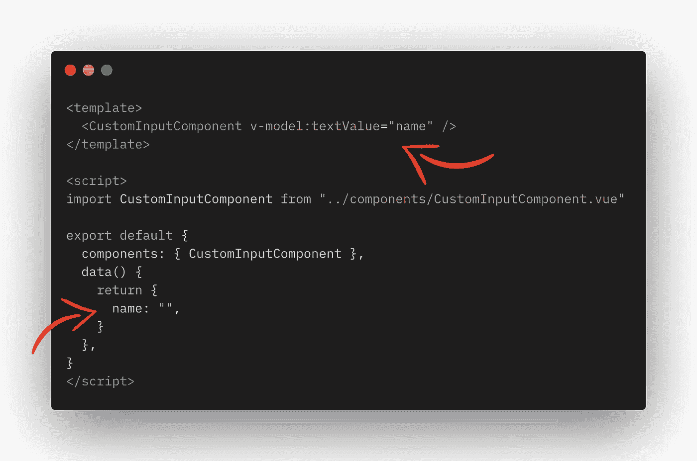

# Vue.js 提示 1:在定制组件上使用 V-Model

> 原文：<https://javascript.plainenglish.io/vue-js-tip-1-use-v-model-on-custom-components-be56401727e0?source=collection_archive---------6----------------------->

使用这个技巧可以简化创建组件的方式，并在父组件和子组件之间建立双向绑定。

Use the v-model directive to easily do two-way-binding between data and custom components

# 它是如何工作的

我们先来看看 v 型车的工作原理。从功能上讲，v-model 与设置 v-on:input 和 v-bind:value 没有什么不同，两者都连接到一个数据变量。

# 自定义组件中的双向绑定

说到“组件内绑定”，我看到人们一直在使用 v-model。然而，当谈到“外部组件绑定”时，几乎每个人都在使用某种“变通办法”，类似于上图中的选项 1。

但是，您可以非常容易地使用 v-model 来处理您的定制组件。你只要设置正确就行了！

让我们来看看它是如何工作的(嘘…你甚至可以添加多个 v 模型！).

假设我们有一个自定义输入组件。现在，让我们只添加一个输入字段。

让我们从添加一个 v-model 到我们的定制组件开始。

如你所见，v 型车看起来与你习惯的有点不同。

v-model***:text value***=“名称”

***:textValue*** 可以是任何东西，起到属性标识符的作用。
“name”只是我们想要进行双向绑定的数据变量。

# 好了，现在让我们来看看这个定制组件的内部。

如您所见，我们添加了一个:value 属性，它将组件中的输入链接到 textValue 属性，还添加了一个@input 侦听器，它在每次更改时发出输入的新值。它通过 update:textValue emit 发出它。就像上一步中的 v-model 一样， ***:textValue*** 仅作为顶层 v-model 将做出反应的属性标识符。

所以。你有它！现在，您可以在组件上使用 v-model 来更容易且可维护地创建组件之间的双向绑定。

因为从 Vue 3 开始，您可以使用这些唯一的属性标识符，所以我们可以添加任意多的 v-model。所以这也是可行的:

编码快乐！

*更多内容请看*[*plain English . io*](http://plainenglish.io/)