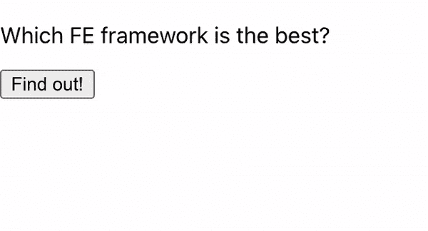
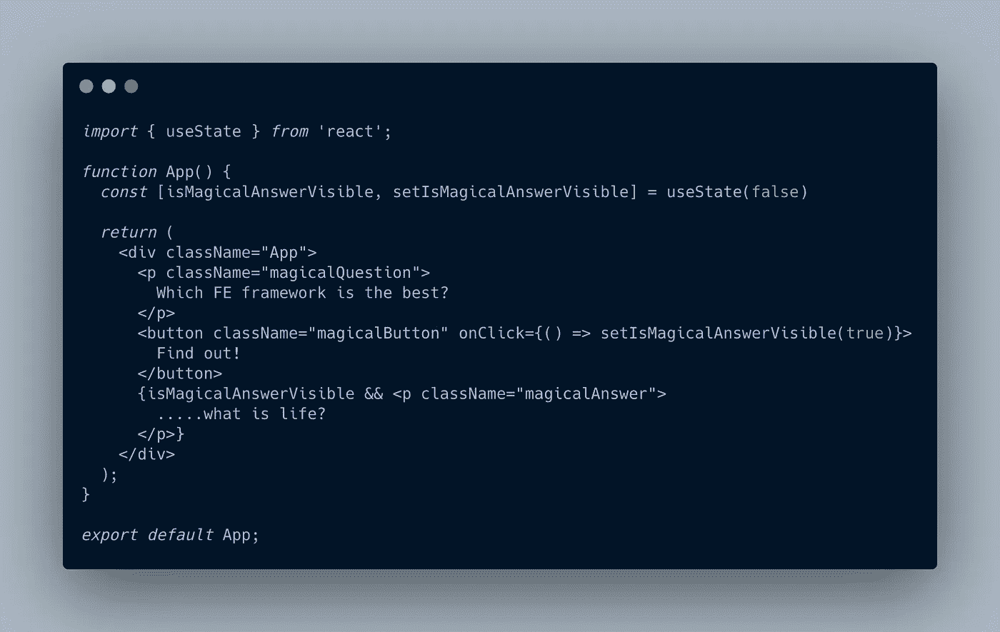
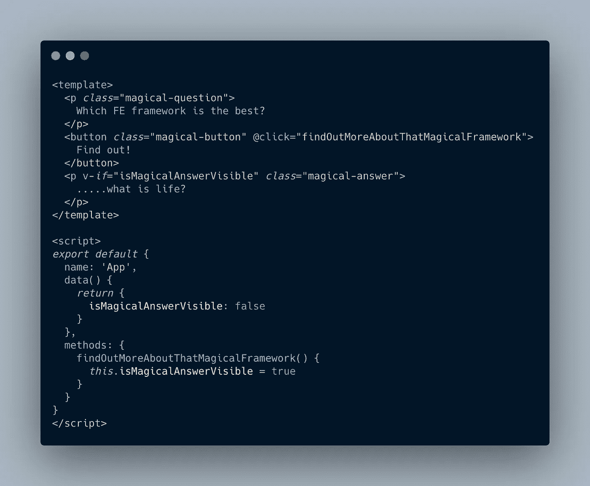

# Vue.js 与 React——不是你通常的比较

> 原文：<https://javascript.plainenglish.io/vue-js-vs-react-not-your-usual-comparison-46d572c5f481?source=collection_archive---------7----------------------->

## 为什么其中一个看起来这么眼熟？

Photo by [Rich Tervet](https://unsplash.com/@richtervet?utm_source=unsplash&utm_medium=referral&utm_content=creditCopyText) on [Unsplash](https://unsplash.com/s/photos/macbook-pro?utm_source=unsplash&utm_medium=referral&utm_content=creditCopyText)

从我开始学习 React 的那一刻起，我就彻底爱上了它。

我能用 JavaScript 创建漂亮的用户界面？突然，我在 HTML 和 CSS 中拥有了 JavaScript 的力量？

我非常喜欢它。太神奇了。

我使用该工具多年，但我忍不住观察 Vue.js 的宣传。显然，每个使用它的开发者都非常喜欢它！

这怎么可能呢？我喜欢反应，但有时它让我沮丧；为什么 Vue.js 世界的挫败感少了很多？

几个月前，我在一个商业项目中启动了 Vue，并完全从 React 中退出。

当我发现我已经离开了我心爱的工具时，我有点难过。

但是那些框架只是工具；我们永远不应该根据它们做出严格的职业决策。

这是前端世界——所有的工具都将很快消失；新的会很快出现。

现在，在有了大量前端开发和框架(如 Vue.js、React 和 Ember.js)的经验之后，让我解释一下为什么我认为 Vue.js 是最好的。

# 一个非常简单的应用程序

我们今天正在 React 和 Vue.js 中构建一个超级简单的应用程序。它看起来像这样:

Our really complex app

让我们深入研究这里的代码。反应过来，你先来。这是用`create-react-app`创建的项目；我在这里稍微修改了一下`App.js`。

App.js

我知道反应很好，所以我能理解这一切。但是让我们假设我对 React 一无所知——只是对 FE 开发和 Web 有所了解。

有了这些知识，我想知道屏幕上会呈现什么。当我查看浏览器时，我只看到样式化的 HTML 元素。不是 JavaScript。

这里——一切都是 JavaScript！我如何知道什么会真正呈现在屏幕上？

我可以看到这个`function App()`返回一些看起来像 HTML 的代码，但它不是 HTML。这是什么？

好的。我假设那东西会呈现。

这里的`useState`是什么？为什么需要立即将其结果赋给一个数组？

我不太在乎功能性。我想看和我在屏幕上看到的一样的东西。为什么先写这种奇怪的东西？

什么是`className`？为什么我不能只用`class`？

`onClick={() => setIsMagicalAnswerVisible(true)}`我为什么要这么做，我就不能做`onClick={setIsMagicalAnswerVisible(true)}`吗？哦，现在有一些错误。我将返回箭头函数，即使我不知道为什么。

`{isMagicalAnswerVisible && 
…..what is life?
}`这是什么？花括号是怎么回事？哦，JS 算子`&&`来了。`p`如果是真的会渲染？

想象一下这里有一个巨大的组件。我想看看我将在屏幕上看到的东西。但我不能，因为我必须滚动前 100 行代码才能找到`return`语句。

我相信函数的命名。我相信他们说到做到。我不想先看实现细节。

**让我看看会呈现什么！**

# Vue.js 能提供什么

这是一个使用 Vue CLI 创建的项目。我在这里稍微修改了一下`App.vue`:

App.vue

嗯，我在这里能看到什么？哦，模板！我想我会在屏幕上看到这个模板。

哦真好，`class`来了。这是 HTML 文件吗？

嗯，这里有`@click`，还有`v-if`。一开始有点奇怪，但实际上很有意义。

而且这么简单。

`<script>`标签在这里。等等，这真的不是 HTML 文件吗？我是否应该将扩展名从`*.vue`重命名为`*.html`？

不，可能没事。

这里的`export default`里面是什么？

`data()`；这是什么？我需要谷歌一下。哦，这只是组件的状态。

`methods`？很简单。

我确切地看到什么将首先呈现。我看到一个看起来像 HTML 的东西。

**其实不然。是一个极其强大的 Vue.js app。**

# Vue.js 看起来…好熟悉

我想设计我的组件的样式。我要做什么呢？

我假设它和 HTML 中的一样。我将在一个`*.vue.js`文件的底部添加一个`<style>`标签。不，那不行。

**但是很管用！**

React 的学习曲线可能很长，尤其是在处理更复杂的东西时。还记得胡克之前的时代吗？这么多的渲染道具，高阶组件，还有一堆其他的东西。

`this.handleClick = this.handleClick.bind(this)`怎么样？我知道很多 React 开发人员根本不知道幕后发生了什么。

另一方面，使用 Vue.js，一切都变得如此简单。这感觉就像是 HTML 的更新版本。

在过去的几个月里，我用 Vue.js 做了很多工作，沮丧的程度是最小的。

我只能关注真正的问题，而不是实际的实现。

我一直在想——这怎么可能？2 周就掌握了核心知识，现在几乎什么都能建了？

反应不是这样的。有时，这真的令人沮丧。但是我仍然喜欢它，因为它全是 JavaScript。

# JavaScript 中的一切都很神奇，但这并不真实

Web 由 HTML、CSS 和 JavaScript 组成。

如果我们想对它有深入的了解，就一定不能混淆视听，说什么都是 JavaScript。

有了 Vue.js，我有一种感觉，我学到了更多通用的 web 相关知识，而不仅仅是 Vue 相关的。

与 React 相反。你需要打破你对网络的深刻理解来接受这种心态。

问题是——网络会存在，而反应会消失。它不是编程语言，只是一个库。

脸书会发布新的东西；更好的东西。

你所有的知识都会随着反应本身而消失。

当然，除了 React 本身，你还会学到很多东西——但是有了 Vue，你会学到更多。

Vue 像网络一样工作。它是一堆组件，看起来像 HTML，像真实的 web 一样发出事件。

是的，你不要把一个函数当作道具来传递。您将捕获子组件发出的冒泡事件。

与真实网络中的一样。

# 我夸大其词了吗？

好吧，我知道我有点。

尽管如此，我还是爱反应。尽管我不同意只使用 JavaScript 的 web。

但是我有一种感觉，我可以用 Vue 更好地学习基础知识。

我可以专注于真正的业务问题，而不是实现。

一切都如此简单，却又如此强大。

也很有趣，因为没有挫败感。

对此你怎么看？我很想听听你的意见。

*更多内容尽在*[plain English . io](http://plainenglish.io/)