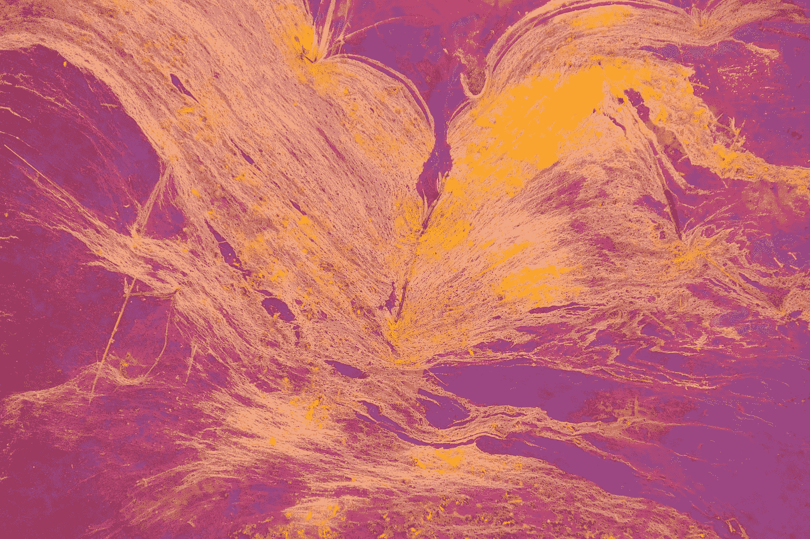

# Vue Konva —动画和缓存

> 原文：<https://javascript.plainenglish.io/vue-konva-animation-and-caching-222caacf2a53?source=collection_archive---------13----------------------->



Photo by [Daniele Levis Pelusi](https://unsplash.com/@yogidan2012?utm_source=medium&utm_medium=referral) on [Unsplash](https://unsplash.com?utm_source=medium&utm_medium=referral)

借助 Vue Konva 库，我们可以在 Vue 应用程序中更轻松地使用 HTML 画布。

在本文中，我们将了解如何使用 Vue Konva 来简化 Vue 应用程序中的 HTML 画布。

# 动画

我们可以用`Konva.Animation`构造函数制作形状的动画。

例如，我们可以写:

```
<template>
  <v-stage ref="stage" :config="stageSize">
    <v-layer ref="layer">
      <v-rect
        ref="rect"
        @dragstart="changeSize"
        @dragend="changeSize"
        :config="{
          width: 50,
          height: 50,
          fill: 'green',
          draggable: true,
        }"
      />
      <v-regular-polygon
        ref="octagon"
        :config="{
          x: 200,
          y: 200,
          sides: 8,
          radius: 20,
          fill: 'red',
          stroke: 'black',
          strokeWidth: 4,
        }"
      />
    </v-layer>
  </v-stage>
</template><script>
import Konva from "konva";
const width = window.innerWidth;
const height = window.innerHeight;export default {
  data() {
    return {
      stageSize: {
        width: width,
        height: height,
      },
    };
  },
  methods: {
    changeSize(e) {
      e.target.to({
        scaleX: Math.random() + 0.8,
        scaleY: Math.random() + 0.8,
        duration: 0.2,
      });
    },
  },
  mounted() {
    const vm = this;
    const amplitude = 100;
    const period = 5000;
    const centerX = vm.$refs.stage.getNode().getWidth() / 2;
    const octagon = this.$refs.octagon.getNode();
    const anim = new Konva.Animation((frame) => {
      octagon.setX(
        amplitude * Math.sin((frame.time * 2 * Math.PI) / period) + centerX
      );
    }, octagon.getLayer());
    anim.start();
  },
};
</script>
```

我们用回调函数调用`Konva.Animation`构造函数来改变带有`setX`的项目的 x 坐标。

然后我们调用`anim.start`开始动画。

当我们拖动矩形时会调用`changeSize`方法。

当我们拖动对象时，它会改变位置。

# 隐藏物

我们可以缓存用`cache`方法渲染的项目。

例如，我们可以写:

```
<template>
  <div>
    <v-stage ref="stage" :config="stageConfig">
      <v-layer ref="layer">
        <v-group ref="group">
          <v-star
            v-for="item in list"
            :key="item.id"
            :config="{
              x: item.x,
              y: item.y,
              rotation: item.rotation,
              id: item.id,
              numPoints: 5,
              innerRadius: 30,
              outerRadius: 50,
              fill: 'lightgreen',
              opacity: 0.8,
              shadowColor: 'black',
              shadowBlur: 10,
              shadowOpacity: 0.6,
              scaleX: item.scale,
              scaleY: item.scale,
            }"
          />
        </v-group>
      </v-layer>
    </v-stage>
    <div class="cache">
      <input type="checkbox" @change="handleCacheChange" /> cache shapes
    </div>
  </div>
</template><script>
const width = window.innerWidth;
const height = window.innerHeight;
export default {
  data() {
    return {
      list: [],
      dragItemId: null,
      stageConfig: {
        width: width,
        height: height,
        draggable: true,
      },
    };
  },
  methods: {
    handleCacheChange(e) {
      const shouldCache = e.target.checked;
      if (shouldCache) {
        this.$refs.group.getNode().cache();
      } else {
        this.$refs.group.getNode().clearCache();
      }
    },
  },
  mounted() {
    for (let n = 0; n < 300; n++) {
      this.list.push({
        id: n.toString(),
        x: Math.random() * width,
        y: Math.random() * height,
        rotation: Math.random() * 180,
        scale: Math.random(),
      });
    }
  },
};
</script><style>
body {
  margin: 0;
  padding: 0;
}.cache {
  position: absolute;
  top: 0;
  left: 0;
}
</style>
```

增加 300 颗星星。

在`handleCacheChange`方法中，如果复选框被选中，我们调用`v-group`的 ref 上的`cache`来缓存内容。

否则，我们用`clearCache`清除缓存。

# 结论

我们可以用 Vue Konva 制作形状动画并缓存它们。