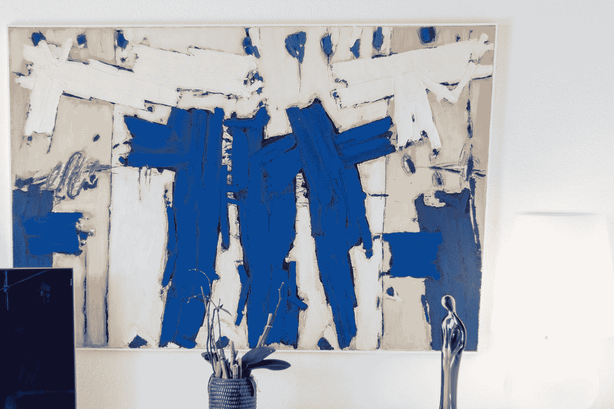

# Vue Konva —保存和加载画布和变换形状

> 原文：<https://javascript.plainenglish.io/vue-konva-saving-and-loading-canvas-and-transform-shapes-79e7ec7f9d4c?source=collection_archive---------13----------------------->



Photo by [Alexander Kovacs](https://unsplash.com/@ajk_th?utm_source=medium&utm_medium=referral) on [Unsplash](https://unsplash.com?utm_source=medium&utm_medium=referral)

借助 Vue Konva 库，我们可以在 Vue 应用程序中更轻松地使用 HTML 画布。

在本文中，我们将了解如何使用 Vue Konva 来简化 Vue 应用程序中的 HTML 画布。

# 保存和载入画布

我们可以很容易地保存画布内容，这样当我们重新加载页面时它将被保留。

例如，我们可以写:

```
<template>
  <div>
    <a href=".">Reload the page</a>.
    <v-stage ref="stage" :config="stageSize" @click="handleClick">
      <v-layer ref="layer">
        <v-circle
          v-for="item in list"
          :key="item.id"
          :config="{
            x: item.x,
            y: item.y,
            radius: 50,
            fill: 'green',
          }"
        ></v-circle>
      </v-layer>
      <v-layer ref="dragLayer"></v-layer>
    </v-stage>
  </div>
</template><script>
const width = window.innerWidth;
const height = window.innerHeight;export default {
  data() {
    return {
      list: [{ x: 100, y: 100, radius: 50, fill: "blue" }],
      stageSize: {
        width: width,
        height: height,
      },
    };
  },
  methods: {
    handleClick(evt) {
      const stage = evt.target.getStage();
      const pos = stage.getPointerPosition();
      this.list.push(pos);
      this.save();
    }, load() {
      const data = localStorage.getItem("storage") || "[]";
      this.list = JSON.parse(data);
    }, save() {
      localStorage.setItem("storage", JSON.stringify(this.list));
    },
  },
  mounted() {
    this.load();
  },
};
</script>
```

我们有`handleClick`方法，当我们点击舞台时，它会添加一个圆。

`list` reactive 属性有一个要渲染的圆形列表。

然后在`save`方法中，我们通过将`list`值保存到本地存储中来保存画布。

然后我们可以通过解析将它载入`load`方法。

模板中的`v-for`加载了`list`反应属性以重新创建圆。

# 拖放

我们可以使用 Vue Konva 轻松添加拖放功能。

我们所要做的就是在我们的形状中监听`dragstart`和`dragend`事件。

例如，我们可以写:

```
<template>
  <v-stage ref="stage" :config="stageSize">
    <v-layer ref="layer">
      <v-circle
        @dragstart="handleDragStart"
        @dragend="handleDragEnd"
        :config="{
          x: 200,
          y: 200,
          radius: 70,
          draggable: true,
          fill: isDragging ? 'green' : 'black',
        }"
      />
    </v-layer>
  </v-stage>
</template><script>
const width = window.innerWidth;
const height = window.innerHeight;export default {
  data() {
    return {
      stageSize: {
        width,
        height,
      },
      isDragging: false,
    };
  },
  methods: {
    handleDragStart() {
      this.isDragging = true;
    },
    handleDragEnd() {
      this.isDragging = false;
    },
  },
};
</script>
```

我们在拖动时设置了`isDragging`反应属性。

这会改变填充。

此外，我们将`draggable`属性设置为`true`以使圆可拖动。

# 调整形状大小

我们可以使用`v-transformer`组件轻松调整形状的大小。

例如，我们可以写:

```
<template>
  <v-stage
    ref="stage"
    :config="stageSize"
    [@mousedown](http://twitter.com/mousedown)="handleStageMouseDown"
    [@touchstart](http://twitter.com/touchstart)="handleStageMouseDown"
  >
    <v-layer ref="layer">
      <v-circle
        v-for="item in circles"
        :key="item.id"
        :config="item"
        [@transformend](http://twitter.com/transformend)="handleTransformEnd"
      />
      <v-transformer ref="transformer" />
    </v-layer>
  </v-stage>
</template><script>
import Konva from "konva";
const width = window.innerWidth;
const height = window.innerHeight;export default {
  data() {
    return {
      stageSize: {
        width: width,
        height: height,
      },
      circles: [
        {
          rotation: 0,
          x: 60,
          y: 60,
          width: 100,
          height: 100,
          scaleX: 1,
          scaleY: 1,
          fill: "red",
          name: "circ1",
          draggable: true,
        },
        {
          rotation: 0,
          x: 150,
          y: 150,
          width: 100,
          height: 100,
          scaleX: 1,
          scaleY: 1,
          fill: "green",
          name: "circ2",
          draggable: true,
        },
      ],
      selectedShapeName: "",
    };
  },
  methods: {
    handleTransformEnd(e) {
      const rect = this.circles.find((r) => r.name === this.selectedShapeName);
      rect.x = e.target.x();
      rect.y = e.target.y();
      rect.rotation = e.target.rotation();
      rect.scaleX = e.target.scaleX();
      rect.scaleY = e.target.scaleY();
      rect.fill = Konva.Util.getRandomColor();
    },
    handleStageMouseDown(e) {
      if (e.target === e.target.getStage()) {
        this.selectedShapeName = "";
        this.updateTransformer();
        return;
      }const clickedOnTransformer =
        e.target.getParent().className === "Transformer";
      if (clickedOnTransformer) {
        return;
      }
      const name = e.target.name();
      const rect = this.circles.find((r) => r.name === name);
      if (rect) {
        this.selectedShapeName = name;
      } else {
        this.selectedShapeName = "";
      }
      this.updateTransformer();
    },
    updateTransformer() {
      const transformerNode = this.$refs.transformer.getNode();
      const stage = transformerNode.getStage();
      const { selectedShapeName } = this; const selectedNode = stage.findOne(`.${selectedShapeName}`);
      if (selectedNode === transformerNode.node()) {
        return;
      } if (selectedNode) {
        transformerNode.nodes([selectedNode]);
      } else {
        transformerNode.nodes([]);
      }
      transformerNode.getLayer().batchDraw();
    },
  },
};
</script>
```

我们从`mousedown`处理程序开始，当我们单击形状时，它被调用。

`handleStageMouseDown`方法是`mousedown`处理程序。

我们用`getStage`方法得到状态。

如果我们找到了阶段，那么我们调用`updateTransformer`来删除任何选择

在那之后，我们得到了州名。

然后我们调用`updateTransformer`来选择形状。

然后当我们拖动手柄时，就会调用`handleTransformEnd`方法。

我们从`e`参数中获取所有事件数据，并更新通过名称找到的对象。

# 结论

我们可以保存和加载画布，并用 Vue Konva 变换形状。