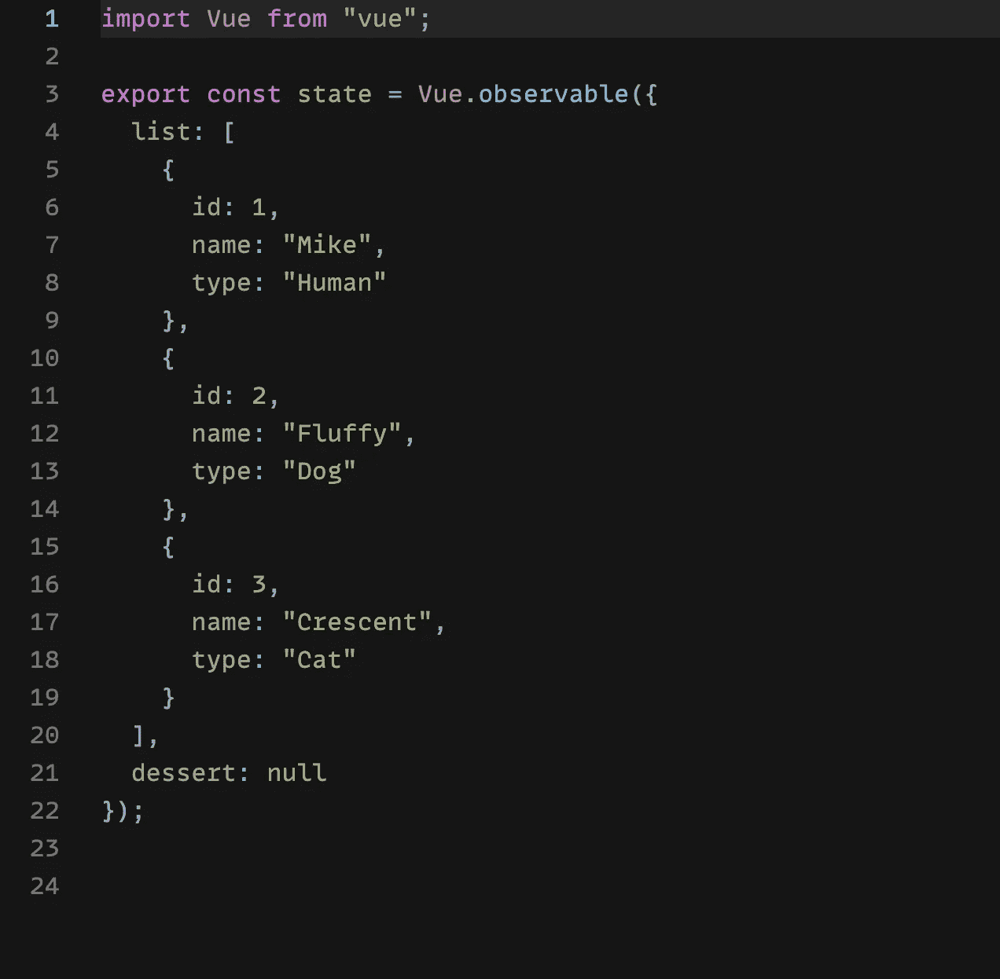
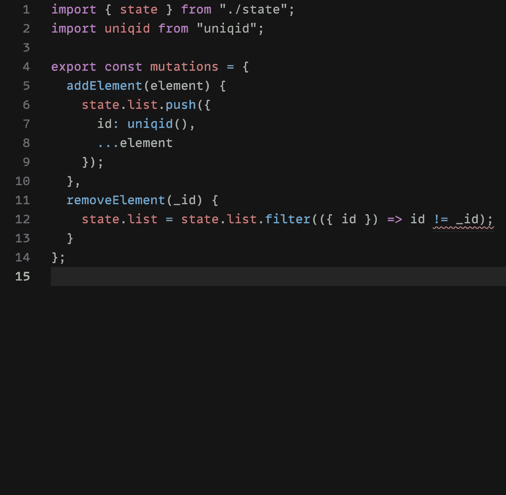
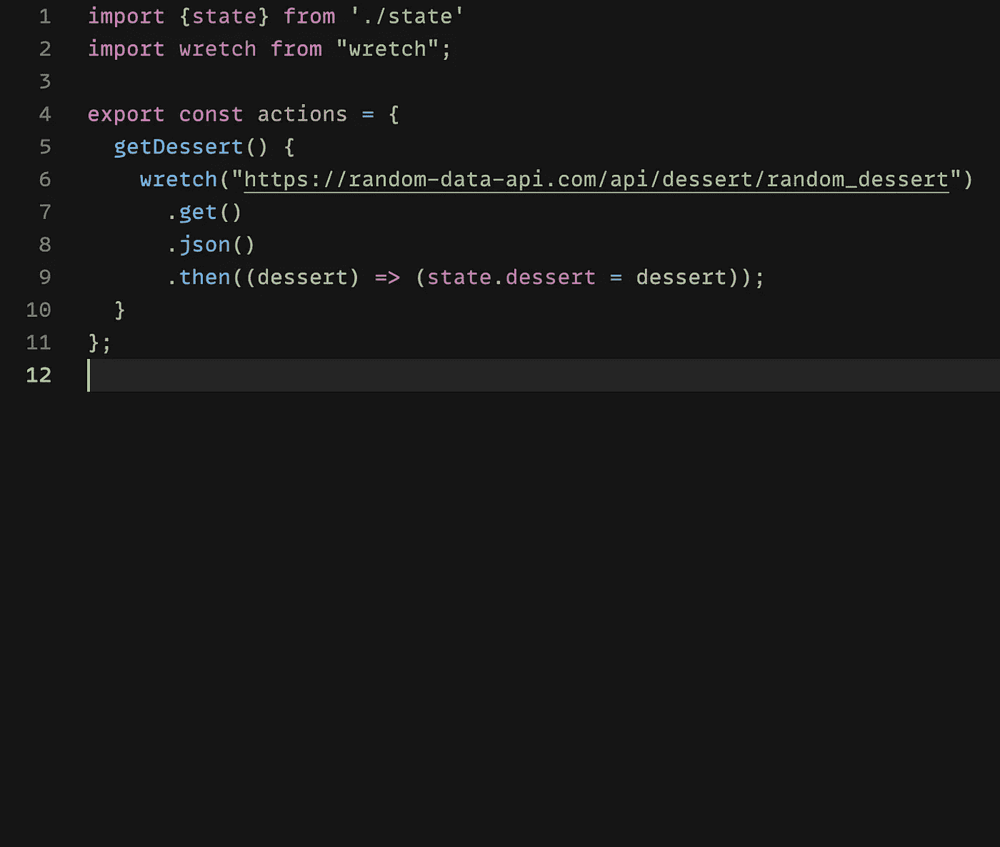

# 不使用 Vuex 设置 Vue 商店

> 原文：<https://javascript.plainenglish.io/vue-store-without-vuex-c5da1c6b3ba0?source=collection_archive---------20----------------------->

## 探索 Vue 2.6 的新功能，该功能允许在不使用 Vuex 的情况下设置 Vue 商店。

Photo by [Mohammad Rahmani](https://unsplash.com/@afgprogrammer?utm_source=medium&utm_medium=referral) on [Unsplash](https://unsplash.com?utm_source=medium&utm_medium=referral)

几年前我开始探索 Vue，探索的一部分涉及 Vuex。正如你可能知道的，有时它是完美的解决方案，有时它是多余的，应该避免。这完全取决于项目的要求。

不过今天，我了解到 Vue 2.6 中的一个新功能(至少对我来说是这样的)，叫做 *observables，*，我可能再也不会使用 Vuex 了。

我从 Vuedose 得到这个提示:[https://Vuedose . tips/creating-a-store-without-vuex-in-vue-js-2-6](https://vuedose.tips/creating-a-store-without-vuex-in-vue-js-2-6)

它允许我建立自己的数据存储，像 Vuex 一样工作，但没有 Vuex 库的开销。因为我熟悉 Vuex 命名法(状态、突变、动作)，所以我可以使用那些相同的命名约定，但我不是必须这样做。

State

Mutations

Actions

你可以在 [CodeSandbox](https://codesandbox.io/s/peaceful-keldysh-mmitu) 上看到一个功能示例的完整代码。细节和 Vuex 有一点不同，但感觉足够相似，这不是一个巨大的飞跃。

事实上，它以更少的开销提供了相同的功能，这是我的主要卖点，但如果我选择使用其他术语，我也喜欢将*而不是*绑定到 Vuex 术语的想法。

这个题目到此为止。感谢您的阅读。

*更多内容请看*[*plain English . io*](http://plainenglish.io/)*。在这里报名参加我们的* [*免费周报*](http://newsletter.plainenglish.io/) *。*