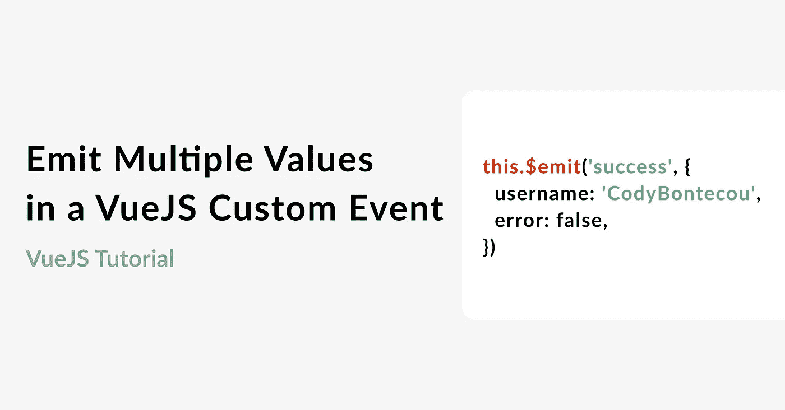

# 在 Vue.js 自定义事件中从子对象向父对象发出多个值

> 原文：<https://javascript.plainenglish.io/vuejs-custom-event-emit-multiple-values-4c082119a978?source=collection_archive---------7----------------------->



> Vue.js 自定义事件是子组件和父组件之间进行通信的一种很好的方式。

我最近需要一种在单个自定义事件中将多个值从子节点传递到父节点的方法。 [Vue.js 文档](https://vuejs.org/v2/guide/components-custom-events.html)没有提供任何展示这一点的例子，相反，我需要参考堆栈溢出线程中的一些注释。

这是我的发现。

## 要发出多个参数，最好将数据作为对象传递:

```
this.$emit('success', {
  username: 'CodyBontecou',
  error: false,
})
```

Vue.js 的自定义事件只接受两个参数:

1.  事件的名称。在这种情况下，事件名称为`success`。
2.  您想要传递的数据。这可以是字符串、对象、数字、布尔值或函数。

## 使用事件监听器从父组件访问参数:

我们从子组件发出了`success`事件。这个事件可以在父组件中捕获，在父组件中使用`@`符号呈现子组件，在本例中是`@success`。

1.  当从子组件发出成功时，@success 调用 onSuccess 方法。
2.  用户名和消息参数是从传递到成功发出的对象中析构的，现在可以在 onSuccess 函数中随心所欲地使用。

```
<LoginForm @success="onSuccess" />

methods: {
  onSuccess({ username, error }) {
    ...
  },
}
```

我花了一点时间才找到这个问题的解决方案，所以我认为最好将它记录在一篇博文中，让其他人从中受益。

希望有帮助！

*更多内容看* [***说白了就是***](http://plainenglish.io/) ***。*** *报名参加我们的**[***免费每周简讯点击这里***](http://newsletter.plainenglish.io/) ***。****