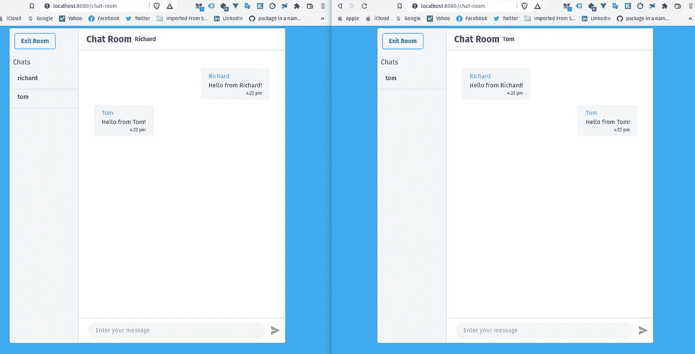

# Vue.js 为赶时间的人准备的动态组件/类

> 原文：<https://javascript.plainenglish.io/vuejs-dynamic-components-classes-for-people-in-a-hurry-1a86582e1d5e?source=collection_archive---------16----------------------->

## 用例子解释动态组件和动态类。


像其他 web 框架一样，Vue.js 必须被充分利用，而不使用它的动态特性是做不到的！

## **动态组件**

组件在 Vue.js 实例中是可重用的，在大多数情况下，除非你能向组件传递数据，否则组件是没有用的。

动态特征还使用户能够在两个或多个组件之间切换，而无需路由。

## **动态类**

这个想法与动态组件的想法是一样的，因此在本文中考虑了“一石二鸟”的想法。常见的需求是用 CSS 类操纵给定元素的外观，或者用[属性绑定](https://vuejs.org/v2/guide/class-and-style.html)操纵样式。

## 我们开始吧，好吗！🤓

我将使用我的项目(仍在开发中)中的例子，这些例子利用了动态组件和动态类。这个项目的回购你可以在这里找到它[。](https://github.com/Mozes721/Chat_App)

我们将从动态组件开始，然后是动态类。

```
<script>import EnterRoom from '@/components/EnterRoom.vue'import ChatRoom from '@/components/ChatRoom.vue' export default ({name:'App', components: {'Main Room': EnterRoom,'Chat Room': ChatRoom,}, data () {return {currentComponent: 'Main Room',username: '', }},
```

☝ ️Import 必须声明一个与当前组件对应的变量。

👇🏻将有一个房间选择，从而动态地改变当前组件。

```
methods: {updateRoom(room) {this.currentComponent = roomif (this.currentComponent === 'Main Room') {this.$router.push('/')}if (this.currentComponent === 'Chat Room') {this.$router.push('/chat-room')}},addUser(user) {this.username = user}}})
```

现在让我们将组件元素添加到模板中。

```
<div id="app"> 

<component v-bind:is="currentComponent" v-on:child-room="updateRoom($event)" v-on:user-to-room="addUser($event)"  :user="username">
</component> 

</div>
```

**V-bind** 指令*将属性组件 prop 绑定到元素*上，这样相应的组件将动态变化。 **v-on** 指令正在从一个组件接收数据，以使用 emit 事件更新所选房间。

发射事件不会在这里讨论，在我的另一篇文章中已经讨论过了，你可以在下面找到。

[](/vuejs-essentials-through-rock-paper-scissors-game-1eb8a41aeb7e) [## 通过石头剪子布游戏学习 Vue.js 基础知识

### 涵盖主要 Vue.js 特性:v-if，v-on，emit event 等等，附带简单的游戏机制。

javascript.plainenglish.io](/vuejs-essentials-through-rock-paper-scissors-game-1eb8a41aeb7e) 

# 类和样式绑定

```
<li class=”clearfix2"> 
    <div v-for=”(msg, index) in messages” :key=”index”> 
    <div class=”w-full flex “ v-bind:class=”{‘justify-end’:     User(msg.user)}”> 
    <div class=”bg-gray-100 rounded px-5 py-2 my-2 text-gray-700 relative” style=”max-width: 300px;”> 
    <span class=”block text-blue-400">{{ msg.user }}</span> 
    <span class=”block”>{{ msg.message }}</span> 
    <span class=”block text-xs text-right”>{{msg.timestamp}}</span>     </div> 
</div> 
</div> 
</li>
....methods: {User(User) {            
    if (this.user === User) {                
    return true            
      }        
   }    
},
```

**仅供参考，**我正在使用 [TailwindCSS](https://tailwindcss.com/) 。正如你所注意到的，第三行 **v-bind** 指令再次重复出现，唯一的区别是 **: class** 是添加的。

**justify-end** 是在满足条件时将被添加的类，在这种情况下，它运行该方法来检查发送消息的用户是否是您。



You as the user should see it on the right side of your send message while others appear on the right corner.

最后，你可以用组件和类/样式动态地做更多的事情。我希望这篇文章能有所帮助，如果你有任何问题，请随时提问，因为我们都在一起学习。❤

*更多内容看* [*说白了. io*](http://plainenglish.io/) *。报名参加我们的* [*免费每周简讯*](http://newsletter.plainenglish.io/) *。在我们的* [*社区*](https://discord.gg/GtDtUAvyhW) *获得独家写作机会和建议。*