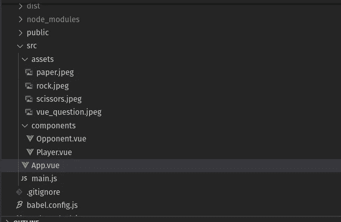
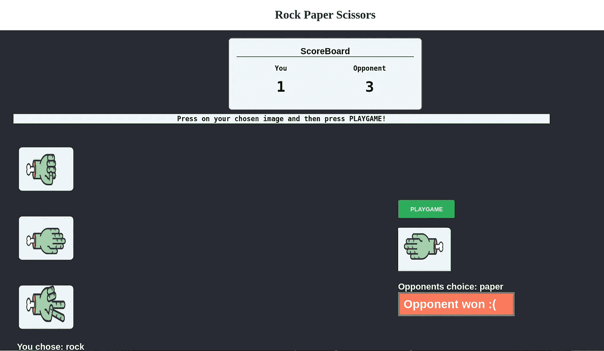
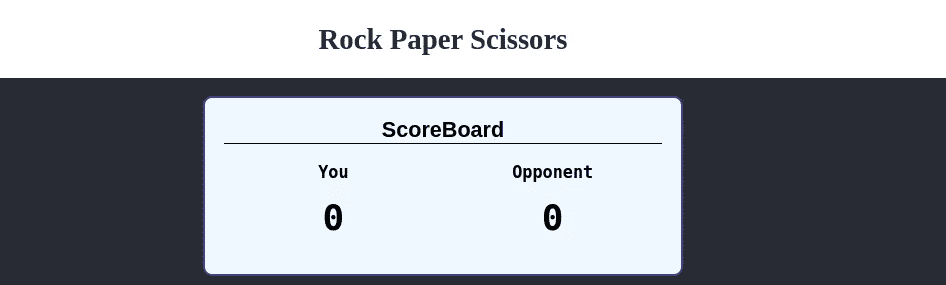
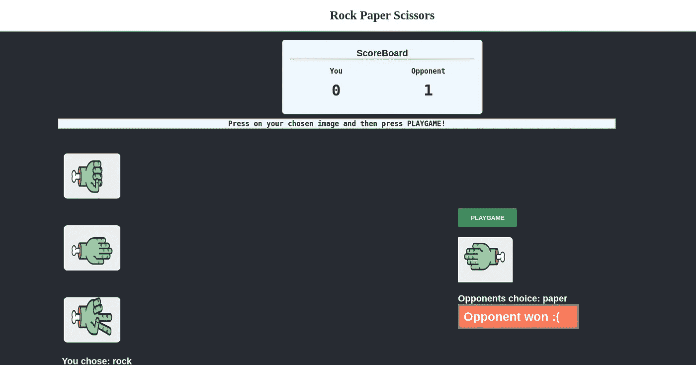
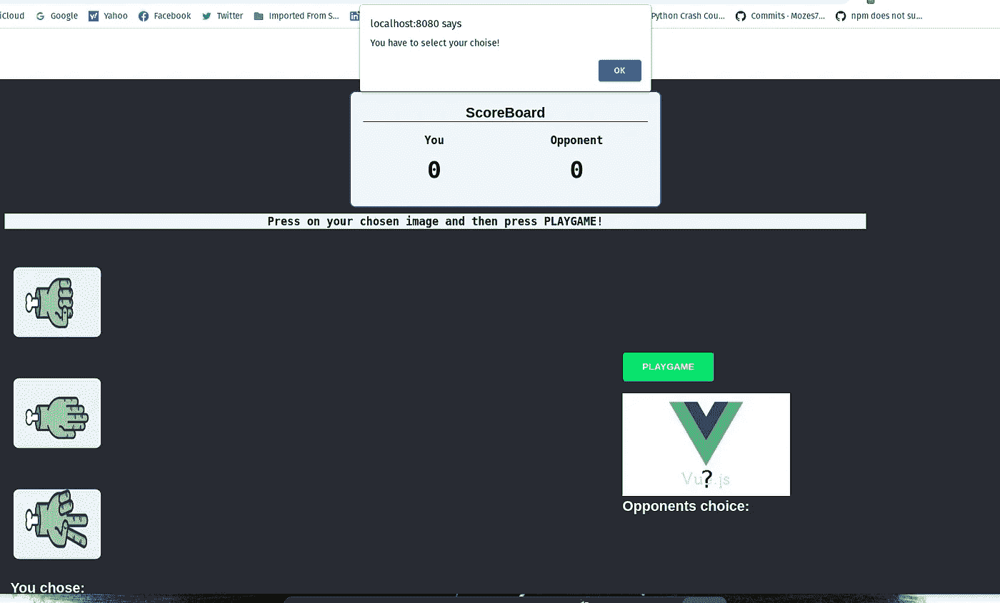

# 通过石头剪子布游戏学习 Vue.js 基础知识

> 原文：<https://javascript.plainenglish.io/vuejs-essentials-through-rock-paper-scissors-game-1eb8a41aeb7e?source=collection_archive---------12----------------------->


首先，我选择石头剪子布游戏，因为它背后的逻辑对于 JavaScript 来说非常简单，许多 Vue.js 的内置功能可以在这里以简单的方式使用。我们开始吧！

点击[此处](https://youtu.be/XJvwSnkg4gQ)查看 **YouTube** 指南。

> **注意**:在这篇文章中，期望你对基本的 web 开发( **HTML，CSS，JS** )有一个相当好的理解，当然还有 **Vue.js** 以便从中获得最大收益。

# 初始化 Vue.js 应用程序

我们将使用 [vue-cli](https://github.com/vuejs/vue-cli) 来搭建一个 Vue.js 项目。创建我们的 Vue 应用程序:

```
npm install -g vue-cli     
vue create Vue_rock_paper_scissors
```

和往常一样，`**npm run serve**`在你的终端。

# 目录

和往常一样，我们有一个预定义的目录，包含 **App.vue** 、 **packages.json、**等。在资产中，我们将放置游戏的图像，在组件中，我们创建两个组件文件**opposite . vue**和 **Player.vue** :



# 播放器组件

该容器已经有三个带有 [**v-on**](https://vuejs.org/v2/guide/events.html) **的图像:单击**指令，当按下相关方法被触发时就足够简单了。[望凡法，**此。$emit**](https://vuejs.org/v2/guide/components-custom-events.html) 正在被传入，因为这样我们就可以通过调用名称' **getChoice** '和值将值推回到父组件。

# 对手成分

模板 div 容器只包含一个按钮和 **v-on** 指令，当它被点击时触发 **randomChoice()** 方法。首先创建一个新的常量 **randomChoiceIndex** ，它从 choices 数组(0、1 或 2)中获取一个随机索引。

既然我们已经创建了一个空的选择变量，为什么不在这里使用它呢？使用 **this** 关键字作为选择变量，并从 **choices** 数组中选择从 **randomChoiceIndex 中选择的索引。**

这里**这个。$emit** 也是使用的，但是因为值总是变化，所以在 **this.choice** 中传递。



Seems I don’t fair well against random choice…

# **构建游戏**

我们将从主要组件(App.vue)开始，然后进入玩家和对手组件。风格将不会被覆盖，因为主要的焦点是覆盖**VueJS**GitHub 回购将在博客的结尾提供。

# 主应用程序组件

这比你想象的要容易理解，它分为三个部分:

1.  标题(仅包含造型)☺️
2.  记分板(显示当前得分)👨‍🏫
3.  游戏(从三个选项中选择一个，然后提示对手随机选择)👾

## 记分板

说到 HTML 部分，制作一个**记分牌**容器非常简单，它将为**玩家**和**对手**提供一个额外的浮动子容器，并将它们并排设置，并相应地设置样式。

**player_score** 和**opposite _ score**属性明显设置为 0，会根据比赛结果自动更新！



## 游戏部分

和以前一样，有两个**浮动子容器**并排放置

## 运动员

```
<div class="float-child1">      
<Player v-on:getChoice="updatePlayerChoice($event)" v-bind:choice="player_choice" />      
<h2 style="color:white">You chose: {{player_choice}}</h2>    
</div>
```

当**播放器**组件被导入时，我们再次从调用**get choice**[emit event](https://vuejs.org/v2/guide/components-custom-events.html)的组件发出一个 v-on 指令。然后 **updatePlayerChoice** 方法将使用一个 [v-bind](https://vuejs.org/v2/guide/class-and-style.html) 指令将值赋给 **player_choice** 变量。

## 对手

```
<div class="float-child2">      
<Opponent @click="play" v-on:getChoice="updateOpponentScore($event)" v-bind:choice="opponent_choice"/>            
 

  

<h2 style="color:white">Opponents choice: {{opponent_choice}}</h2>    </div>
```

当我们谈到**对手**组件时，你可以从**玩家**组件中看到两个小改动。

首先是 **@click** 指令，也可以称为 **v-on:click** 它只是触发方法调用。

另一个是**对手 _ 选择**为空时的 [v-if](https://vuejs.org/v2/guide/conditional.html) 指令(通过添加！变量的条件)，然后用？如果选择了一个值(在这种情况下！！否定符号)然后显示新图像。

如果有赢家，带有 v-if="winner "的 h1 标签将会显示谁赢了



## 逻辑概述

首先，像往常一样，组件被导入，在 **data()** 中，五个变量将根据事件结果而改变。

```
data() {    
    return {      
    player_choice: "",      
    opponent_choice: "",      
    player_score: 0,      
    opponent_score: 0,      
    winner: ""};  
},
```

四个方法创建后，前两个只是利用**这个**关键字更新**玩家 _ 选择**、**对手 _ 选择**。

```
updatePlayerChoice(choice) {        
this.player_choice = choice;      
},    
updateOpponentScore(choice) {        
this.opponent_choice = choice;      
},
```

然后一个简单的 img 变化方法基于**对手**的选择。

```
ImgSrc() {      
if (this.opponent_choice == "rock") {        
return "rock.jpeg"}      
else if (this.opponent_choice == "paper") {        
return "paper.jpeg"}      
else  {        
return "scissors.jpeg"}    
},
```

以**玩法**结束，最后检查谁赢了

```
play() {      
const {player_choice, opponent_choice } = this;      

if (player_choice === opponent_choice) {      
this.winner = "It is a tie!";    } 
else if 
((opponent_choice === "scissors" && player_choice === "paper") ||         (opponent_choice === "paper" && player_choice === "rock") ||         (opponent_choice === "rock" && player_choice === "scissors")) 
   { this.opponent_score++;          
this.winner = "Opponent won :("; } 
else if (player_choice === "") 
{alert("You have to select your choise!")}    
else { this.player_score++;      
this.winner = "You won!";} }    
}
```

const { } = this 就是为两种选择设置[破坏性赋值](https://developer.mozilla.org/en-US/docs/Web/JavaScript/Reference/Operators/Destructuring_assignment)。

在 **if** 语句中，当两者相等时，显然表明是平手，否则在**中是平手，否则在**中是平手在对手有获胜牌的情况下以的方式完成，从而将+1 加到 **this.oppoent_score** 并使 **this.winner** 对手。

如果不满足其他条件，玩家获胜时将满足 **else** 条款。

> 但是如果你作为一个玩家没有选择一手牌，那么提示一个选择一手牌的提示！



这是完整的 App.vue👇

完整的代码可以在🤖👇

[](https://github.com/Mozes721/Vue_rock_paper_scissors) [## GitHub-mozes 721/Vue _ Rock _ Paper _ Scissors:用 VueJS 实现的简单石头剪刀布游戏

### 简单的石头剪子布游戏。为 mozes 721/Vue _ rock _ paper _ scissors 开发做出贡献，创建一个…

github.com](https://github.com/Mozes721/Vue_rock_paper_scissors) 

感谢阅读和快乐编码❣️👩‍💻

# 相关故事

[](https://medium.com/codex/fetch-crypto-data-with-vue-js-and-tailwind-part-1-6a48083f6836) [## 用 Vue.js 和 Tailwind 获取加密数据(第 1 部分)

### 搜索和显示加密货币的实时价值，排名等获取 API 数据，等等…

medium.com](https://medium.com/codex/fetch-crypto-data-with-vue-js-and-tailwind-part-1-6a48083f6836) [](https://medium.com/codex/fetch-crypto-data-with-vue-js-and-tailwind-part-2-b32744952824) [## 用 Vue.js 和 Tailwind 获取加密数据(第 2 部分)

### 通过使用 Vuejs 第 2 部分获取 Nomics API，获得您想要的加密硬币数据

medium.com](https://medium.com/codex/fetch-crypto-data-with-vue-js-and-tailwind-part-2-b32744952824) [](/vanilla-js-simple-password-generator-87e02e5c506a) [## 普通 JavaScript 简单密码生成器

### 功能实现简单的 JavaScript 密码生成器

javascript.plainenglish.io](/vanilla-js-simple-password-generator-87e02e5c506a) [](/vuejs-dynamic-components-classes-for-people-in-a-hurry-1a86582e1d5e) [## Vue.js 为赶时间的人准备的动态组件/类

### 用例子解释动态组件和动态类。

javascript.plainenglish.io](/vuejs-dynamic-components-classes-for-people-in-a-hurry-1a86582e1d5e) 

*更多内容请看*[***plain English . io***](http://plainenglish.io/)