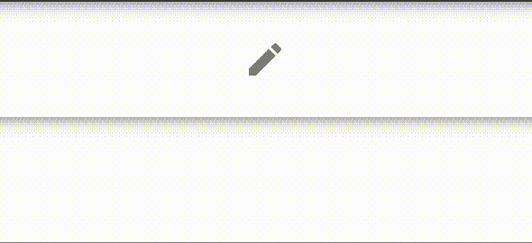

# Vuetify 组件:带工具提示的按钮

> 原文：<https://javascript.plainenglish.io/vuetify-component-button-with-tooltip-c042014b7121?source=collection_archive---------12----------------------->



我在我的大多数项目中都使用 Vue，现在，Vuetify 是我的首选 UI 框架。我经常创建只包含图标的按钮，尤其是在工具栏中，我希望它们有工具提示。组件很棒，但是把它放在每个按钮周围会很乏味。

所以，我构建了一个方便的组件:`ButtonWithTooltip.vue`

你可以从我的[要点](https://gist.github.com/mcasto/478e56cbd199bdf871607f040f42c80f)中看到代码(并复制)。如果你熟悉 Vuetify，那么它不需要任何解释就有意义。

使用它时，像平常一样导入组件。它接受三个属性:提示、图标和颜色。它还接受位置属性，可以是底部、左侧、右侧或顶部。如果不提供位置属性，则默认为 bottom。

`<button-with-tooltip tip="Edit" color="primary" icon="mdi-pencil" bottom></button-with-tooltip>`

会产生这样的结果:

```
<v-tooltip bottom>
  <template #activator="{ on }">
    <v-btn icon v-on="on">
      <v-icon> mdi-pencil </v-icon>
    </v-btn>
  </template>
  <span>Edit</span>
</v-tooltip>
```

*更多内容看* [***说白了就是***](http://plainenglish.io/) ***。*** *报名参加我们的* [***免费每周简讯点击这里***](http://newsletter.plainenglish.io/) ***。***