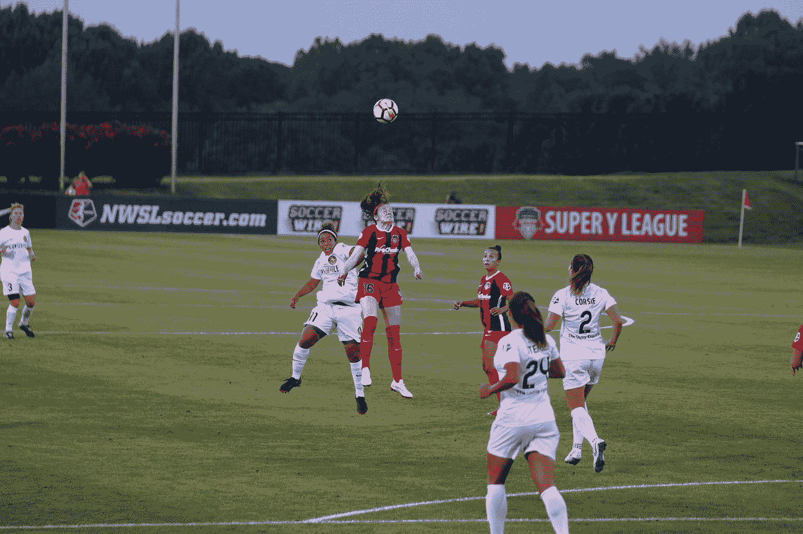

# 美化—副标题

> 原文：<https://javascript.plainenglish.io/vuetify-subheaders-87e0f77de857?source=collection_archive---------22----------------------->



Photo by [Jeffrey F Lin](https://unsplash.com/@jeffreyflin?utm_source=medium&utm_medium=referral) on [Unsplash](https://unsplash.com?utm_source=medium&utm_medium=referral)

Vuetify 是一个流行的 Vue 应用程序 UI 框架。

在本文中，我们将了解如何使用 Vuetify 框架。

# 副标题

组件用来分隔列表的各个部分。

例如，我们可以写:

```
<template>
  <v-col cols="12" sm="6" offset-sm="3">
    <v-card>
      <v-subheader :inset="inset">Subheader</v-subheader> <v-list>
        <template v-for="(item, index) in items">
          <v-list-item v-if="item.action" :key="item.title">
            <v-list-item-action>
              <v-icon>{{ item.action }}</v-icon>
            </v-list-item-action> <v-list-item-content>
              <v-list-item-title>{{ item.title }}</v-list-item-title>
            </v-list-item-content>
          </v-list-item> <v-divider v-else-if="item.divider" :key="index" :inset="inset"></v-divider>
        </template>
      </v-list>
    </v-card>
  </v-col>
</template>
<script>
export default {
  name: "HelloWorld",
  data: () => ({
    inset: true,
    items: [
      {
        action: "label",
        title: "List item 1",
      },
      {
        divider: true,
      },
      {
        action: "label",
        title: "List item 2",
      },
      {
        divider: true,
      },
      {
        action: "label",
        title: "List item 3",
      },
    ],
  }),
};
</script>
```

我们将`v-subheader`组件放在列表的顶部。

它将与带有`inset`道具的列表文本对齐。

# 网格副标题

我们可以在网格上添加副标题。

例如，我们可以写:

```
<template>
  <v-row>
    <v-col cols="12" sm="6" offset-sm="3">
      <v-card>
        <v-subheader>May</v-subheader>
        <v-container fluid>
          <v-row>
            <v-col v-for="i in 6" :key="i" cols="4">
              
            </v-col>
          </v-row>
        </v-container>
      </v-card>
    </v-col>
  </v-row>
</template>
<script>
export default {
  name: "HelloWorld",
  data: () => ({}),
};
</script>
```

我们将`v-subheader`放在网格的顶部。

# 菜单副标题

副标题也能自动适应菜单。

例如，我们可以写:

```
<template>
  <v-row>
    <v-col cols="12" sm="6" offset-sm="3">
      <v-card>
        <v-toolbar color="teal" dark>
          <v-app-bar-nav-icon></v-app-bar-nav-icon> <v-toolbar-title>Manage</v-toolbar-title> <v-spacer></v-spacer> <v-btn icon>
            <v-icon>mdi-dots-vertical</v-icon>
          </v-btn>
        </v-toolbar> <v-list>
          <template v-for="(item, index) in items">
            <v-list-item v-if="item.action" :key="item.title">
              <v-list-item-action>
                <v-icon>{{ item.action }}</v-icon>
              </v-list-item-action> <v-list-item-content>
                <v-list-item-title>{{ item.title }}</v-list-item-title>
              </v-list-item-content>
            </v-list-item> <v-divider v-else-if="item.divider" :key="index"></v-divider> <v-subheader v-else-if="item.header" :key="item.header">{{ item.header }}</v-subheader>
          </template>
        </v-list>
      </v-card>
    </v-col>
  </v-row>
</template>
<script>
export default {
  name: "HelloWorld",
  data: () => ({
    items: [
      {
        action: "move_to_inbox",
        title: "Inbox",
      },
      {
        action: "send",
        title: "Sent",
      },
      { divider: true },
      { header: "Labels" },
      {
        action: "label",
        title: "Family",
      },
    ],
  }),
};
</script>
```

我们用这些物品创建了一个`v-list`。

`v-subheader`是我们在`v-list`组件中循环的项目类型之一。

副标题将与菜单文本对齐，没有任何额外的样式。

# 结论

副标题对列表标题很有用。

喜欢这篇文章吗？如果有，通过 [**订阅我们的 YouTube 频道**](https://www.youtube.com/channel/UCtipWUghju290NWcn8jhyAw?sub_confirmation=true) **获取更多类似内容！**