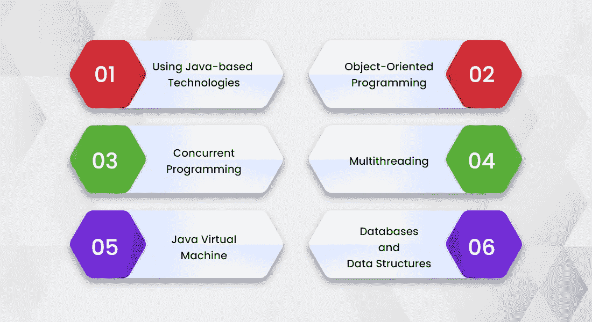

# 想要在不倾家荡产的情况下构建一个简单的 Web 应用程序吗？

> 原文：<https://javascript.plainenglish.io/want-to-build-a-simple-web-app-without-breaking-the-bank-a53ec30f619b?source=collection_archive---------20----------------------->

许多公司使用 Java 来完成开发任务，主要是因为它提供的开发便利性和语言的多功能性。我们可以用 Java 构建一个简单的 web 应用程序到复杂的软件或企业应用程序，并确保无缝的运营效率，而不会影响产品的质量。

这是可能的，因为 Java 是一种高度灵活的编程语言，在工作中使用它的组织可以很容易地在市场中获得竞争优势。

这是因为 Java 给了开发人员更多的空间来创新和构建独特的解决方案，同时有效地解决用户的问题。由于它的受欢迎程度，您还会发现业内有很多 Java 开发人员希望分享他们的知识和专业技能来构建您的解决方案。

然而，并不是每个 Java 开发人员都是一样的，您需要了解为您的组织雇用最好的 Java 开发人员来构建一个简单的 web 应用程序的各个方面。即使你雇佣了一家 Java 软件开发公司来完成你的项目，选择一家理想公司的要素也必须被注意到。

在本文中，我们将找到雇佣 Java 开发人员的成本和流程。

# 什么是 Java，Java 开发者是做什么的？

Java 是一种基于一次编写、随处运行(WORA)的编程语言，具有平台独立性、简单语法和功能安全性等优点。使用 Java 意味着开发人员只需编写一次代码，就可以在不同的解决方案中重复使用。

因此，一个应用程序中与某个特性或功能相关的代码结构可以用作其他应用程序的构建块，如果需要的话，可以进行一些编辑。Java 开发人员是编写代码并帮助您构建所需解决方案的人。

根据 2021 年的[栈溢出调查，35.35%的开发者喜欢用 Java 工作。使用这种技术的 Java 开发人员每年可以赚到 51，888 美元。](https://insights.stackoverflow.com/survey/2021#technology)

开发人员应该在创建解决方案时分享他们的经验和专业知识。一个 [Java 开发者可以创建可移植的和安全的应用程序](https://www.inexture.com/hire-java-developers-for-application-development/),只要这个人具备相同的知识。

# 一个简单的 Web 应用程序由什么组成？

一个简单的 web 应用程序是一个存储在远程服务器的 web 上的程序，可以通过 web 浏览器重定向到用户的设备上。因为它是基于 web 的，所以 web 应用程序是独立于平台的，给企业更好的拓展和与更广泛的受众互动的能力。

我们可以用几种技术来设计和开发一个 web 应用，其中一种就是 Java。Servlet 和 JSP 等基于 Java 的技术主要用于构建 web 应用程序。除此之外，我们还可以使用 Spring 和 Spring Boot，它们旨在简化开发工作，提高开发人员的效率。

web 应用程序可以采用不同的形式和结构。有静态 web 应用、动态 web 应用、电子商务、门户 web 应用、CMS 应用和[渐进式 web 应用](https://www.inexture.com/services/progressive-web-application-development/)。

构建这些应用程序中的任何一个都可以称为 web 应用程序。然而，构建它们的复杂性可能会有所不同。这就是为什么雇佣合适的 Java 开发人员来创建所需的解决方案是至关重要的，这些开发人员了解技术和流程。

**一个 Java 开发者的工作:**

*   Java 开发人员致力于设计、部署和维护用这种编程语言构建的 web 应用程序。
*   开发人员致力于完成 web 应用程序开发生命周期的所有阶段。
*   进行产品分析、编程和测试，同时调试整个 web 应用程序以获得最佳性能。
*   使用[基于 Java 的框架](https://www.inexture.com/top-javascript-frameworks/)和库。

除此之外，Java 开发人员或 Java 软件开发公司还必须具备一些其他的技术和能力；

*   IntelliJ
*   系统驱动开发
*   面向对象编程
*   理解关系数据库
*   结构化查询语言
*   对象关系映射
*   春天和 Spring Boot

您会在行业中找到各种水平的 Java 开发人员，但并不是每个人都有在组织中使用这些技术的经验。在发现雇佣一个这样的人需要多少钱之前，让我们简单地了解一下是什么造就了一个优秀的 Java 开发人员。

# 优秀 Java 开发人员的素质

一个组织雇用任何人都需要根据他们的技术和人际交往能力对候选人进行彻底的审查。

# Java 开发人员需要注意的技术技能

*   **使用基于 Java 的技术:**很多现代开发技术都是基于 Java 的。其中包括 Maven、Spring、JUnit 等。你必须雇佣有使用这些技术经验的 Java 开发人员。
*   面向对象编程: OOP 是当今开发中最好的东西之一，Java 支持 OOP。这意味着一个理想的 Java 开发人员应该了解这个系统，并且理解如何实现 OOP 开发模式。
*   **并发编程:**5.0 以后的每个 Java 版本都支持并发，应用程序都是用高级 API 构建的。
*   **多线程:**除了拥有并发方面的知识和经验，你想要雇佣的 Java 开发人员还必须了解多线程。多线程和并发性与单个字符串相关联，前者有助于完成后者的处理。
*   Java 虚拟机:除了现代的开发技术，雇佣那些了解 Java 虚拟机并能在你的项目中使用它的 Java 开发人员。
*   **数据库和数据结构:**Java 开发人员必须使用过 CRUD 操作系统，并且应该了解索引以及 SQL 查询的广泛知识。

这几点凸显了优秀 Java 开发人员的素质。然而，一个人在这些领域的知识程度取决于他们的工作经验，这是一个主观方面。

# 雇佣 Java 开发人员的成本

在您的组织中，您可以采用两种形式来雇佣 Java 开发人员；

*   小时工资
*   固定薪金

在这两种安排中，你会发现很多个人 Java 开发者和 [Java 开发公司](https://www.inexture.com/services/java-development/)。

# 小时工资

一些 Java 开发人员会按小时向你收取开发费用。大多数情况下，你会发现自由职业者采用这种方式工作，一些公司也采用同样的成本计算方法。

因此，你需要为一个人在你的项目上工作的小时数付费，这取决于每小时的价格。因此，如果你以每小时 50 美元的价格雇佣了一名 Java 开发人员，完成这项工作花了 100 个小时，你将向该开发人员支付 5000 美元。

这里需要注意的另一点是，高级 Java 开发人员的收费会高于初级或中级开发人员。

如果你雇佣的离岸 Java 开发人员来自欠发达国家，主要来自亚洲和拉丁美洲，价格可能会有所不同。这意味着印度的初级开发人员比美国的初级开发人员收费更低。

这同样适用于 Java 开发服务公司。与位于乌克兰、中国、印度等亚洲国家的公司相比，来自美国的开发组织将收取过高的时薪。

平均来说，构建一个简单的 web 应用程序需要大约 1762 个小时。因此，根据开发人员、设计人员、质量分析师和部署专家所报的每小时成本，您可以计算出总成本。

# 固定薪金

第二种安排是根据行业费率以固定月薪雇用一个人。因此，为此，我们去 Glassdoor 寻找一个 Java 开发人员的平均实得工资。

所以要[以固定工资雇佣 Java 开发人员](https://www.inexture.com/hire-java-app-developers/)，你需要摆脱；

*   **初级开发人员每年 87，000 美元**
*   **100，000 美元一年**中级开发人员
*   高级开发人员每年高达**15 万美元**。

这里也一样，如果你有来自美国以外的国家的人，每年的 CTC 会更少。但是，用固定工资雇佣开发人员的另一件事是，你可能还必须提供其他福利。

这包括保险、津贴、加班、带薪休假等等。但是当你和一个自由职业者一起工作时，这些都不适用。

# 哪里能找到好的 Java 开发人员？

要雇佣精通其艺术的 Java 开发人员，你还需要知道你会在哪些平台上找到这样的人。“张贴和祈祷”的日子已经一去不复返了。现在你需要主动为你的项目雇佣优秀的人才，随着零工经济的飞速发展，事情变得更加复杂。

考虑到这一点，这里有一些你必须查看的平台，以便为 Java 开发服务雇佣人员和公司。

**面向自由开发者**

*   **顶部总计**
*   **向上工作**
*   **堆栈溢出**
*   **GitHub 乔布斯**

**针对受薪员工**

*   领英
*   **玻璃门**
*   **的确**

# 结论

Java 已经发展成为一种通用语言。它的伟大之处在于 Java 易于使用和构建。另外，它具有向后兼容性，这意味着前几年用 Java 编写的程序可以与现代技术兼容。

使用 Java 是有益的，雇佣懂这种技术的人需要你的细心关注。总是雇佣技术过硬，同时拥有良好沟通和人际交往能力的 Java 开发人员。

*更多内容请看*[*plain English . io*](http://plainenglish.io/)*。报名参加我们的* [*免费每周简讯*](http://newsletter.plainenglish.io/) *。在我们的* [*社区*](https://discord.gg/GtDtUAvyhW) *获得独家写作机会和建议。*