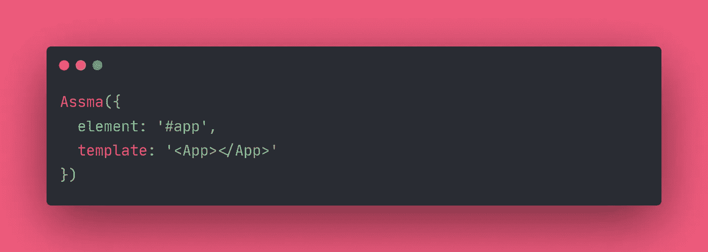

# 想了解 JavaScript 框架在幕后是如何工作的吗？

> 原文：<https://javascript.plainenglish.io/want-to-discover-how-javascript-frameworks-work-behind-the-scenes-bc93cf602b83?source=collection_archive---------18----------------------->

Photo by [krakenimages](https://unsplash.com/@krakenimages?utm_source=medium&utm_medium=referral) on [Unsplash](https://unsplash.com?utm_source=medium&utm_medium=referral)

你有没有想过 JavaScript 框架背后的魔力？

如果是这样，那么这篇文章会吸引你的注意力。这将是处理许多概念、理论和算法的系列文章的一部分。同时，这些文章中将要介绍的所有源代码都是[即将推出的](https://www.producthunt.com/upcoming/assma-js)开源框架的代码基础的一部分，它将是最小的，并且是为教育目的而设计的。

# 我们开始吧

让我们从讨论构成我们框架核心的概念开始。

## 汇编

Photo by  [Jason Leung](https://unsplash.com/@ninjason) on [Unsplash](https://unsplash.com?utm_source=medium&utm_medium=referral)

如果你已经有了计算机科学的学术背景，那很好，因为你应该熟悉编译理论。但即使不是这样，也不用担心，那是绝对没有必要的，我们在讨论这个话题的时候会有一个实际的例子。

一般来说，编译是一个理论计算概念，是一个将以高级源语言编写的特定输入转换为以目标系统可理解的目标语言编写的输出的过程。每一种形式语言都包括一组称为字母表的符号(字符)，称为字符串的符号序列，以及一组称为语言的字符串。一种语言中的句子描述了一种语言可以产生的字符串的每一种可能的排列，同时遵守一套称为语法的规则。

## 履行

让我们看看这个常见的例子，您可能已经在使用流行的框架时见过了。

关注带“模板”属性的值，你可能会认为那是用超文本标记语言写的，不是吗？不幸的是，答案是否定的。正如你已经知道的，HTML 标准中没有名为 App 的标签。所以我们可以认为这是一种新的语言，在这种情况下，我们需要一个编译器来将其转换为浏览器可以理解的语言。

要做到这一点，我们需要开始分析以开始标记开始的句子，所以首先，让我们定义什么是开始标记。开始标记是一个“小于号”字符序列，后跟一个值(任意数量的字符)，再后跟一个“大于号”字符。现在我们需要一种正式的方式来描述语法规则，让我们看看下面提到的规则:

S -> <v>V - > ([$\w.])+</v>

> { S，V }:没有结束符号
> S:开始符号
> ([$\w.])+ : RegEx

上面每一行都称为重写规则，由两部分组成；在左侧，我们有一个“无终端”符号，后面是一个箭头，后面是一串“无终端”和终端符号。终端是不能再细分的符号，另一方面，“无终端”是可以再细分的符号。

## 例子

让我们使用 JavaScript 作为编程语言来重写我们在上一节中看到的内容。为此，我们需要在分析整个句子之前准备一些基本函数:

*   char(param: String):分析指定字符是否存在的函数。
*   value():分析由正则表达式定义的值的存在性的函数。
*   and(firstAnalyse: Function，secondAnalyse: Function):模拟两个解析函数之间的“and”运算符的函数。

要进行更多的实践，请遵循“CodeSandbox”上的这个示例，在这里您可以找到这些函数的实现，每个函数都有文档。

正如您已经注意到的，该示例演示了由前一节中详述的两个语法规则定义的“open_tag”标记的解析过程。我们的解析程序的输出被称为抽象语法树或缩写“AST ”,我们将在本系列的下一篇文章中定义它。

# 结论

我希望你喜欢阅读这篇短文，这是第一部分，我们将在下一部分更深入🙂。

感谢您的时间，如果您想收到作者的更新，可以在乳齿象 [@sayfessyd](https://indieweb.social/web/@sayfessyd) 上关注他。此外，如果你喜欢这个帖子，你可以在 Patreon [页面](https://www.patreon.com/sayfessyd)支持他。

*更多内容尽在*[*plain English . io*](http://plainenglish.io/)