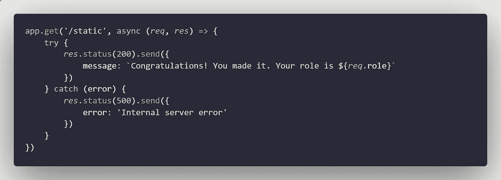
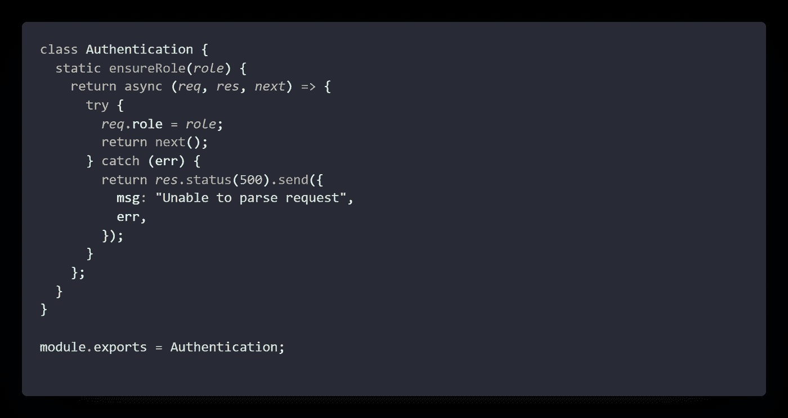
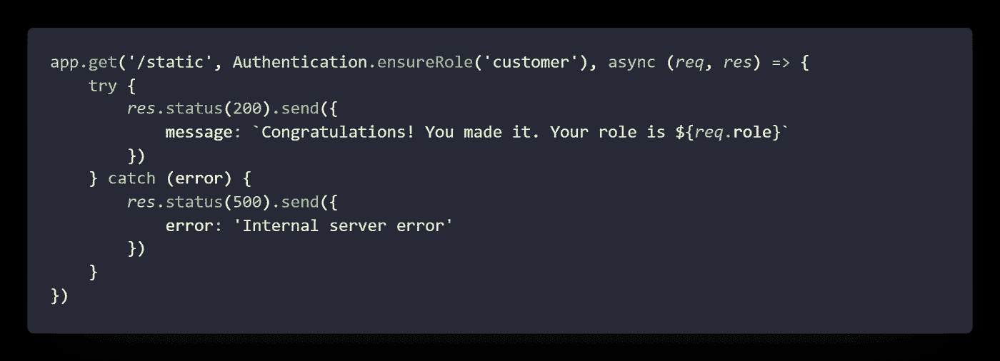
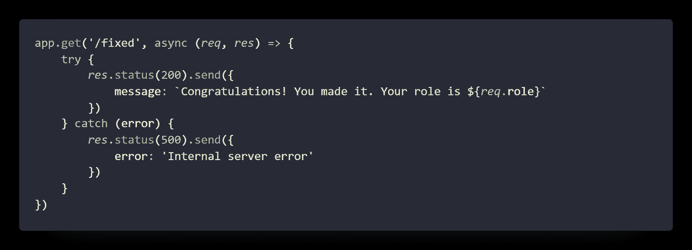
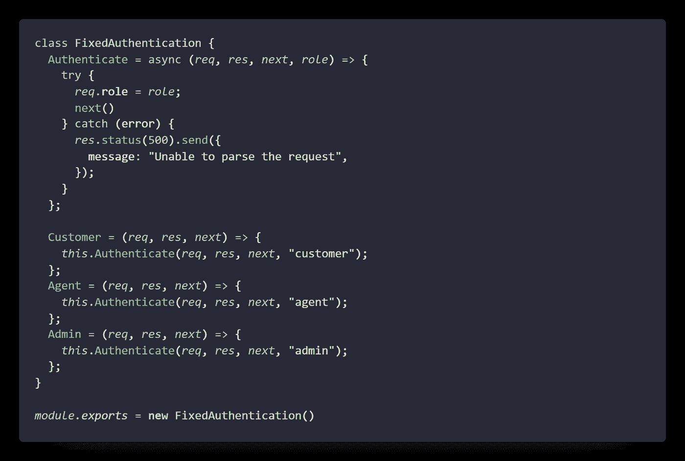
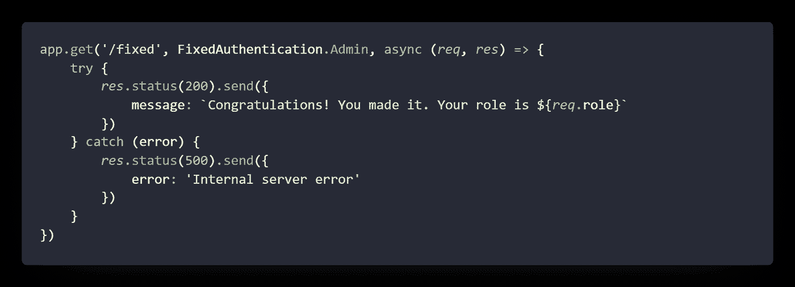

# 如何使用 Express 中间件传递参数

> 原文：<https://javascript.plainenglish.io/ways-to-pass-parameter-in-express-middleware-cc0d9d088be4?source=collection_archive---------2----------------------->

Photo by [Samantha Borges](https://unsplash.com/@samich_18?utm_source=medium&utm_medium=referral) on [Unsplash](https://unsplash.com?utm_source=medium&utm_medium=referral)

# 介绍

嘿，今天我们将讨论如何在 Express 中间件中传递参数。我们将明确讨论两种方式。第一种是使用静态和异步方法，第二种是常规变量。敬请关注最后。那些不喜欢多读书的人，[这里的](https://github.com/Piyush-Use-Personal/middlewares-sample)是这个的源代码

# 形式定义

这是对中间件的正式描述，中间件是一种在 API 端点和控制器之间调用的方法。您可以添加任意数量的中间件。例如，检查授权、速率限制、减速等等。它将包含一个常规的 HTTP 请求和响应，以及传递给下一个调用者的回调

# 开始

我不会深入讲解如何设置 express 之类的东西，所以我把它留给你。有这些简单的任务

*   创建服务器文件
*   分配端口
*   听那个港口

至少做到这一点，我们就可以走了

## 方法 1

让我们开始我们的第一步。我们需要首先创建一个端点

这是一条没有中间件的路由。如果我运行服务器并转到端点`localhost:<port>/static`,我会看到角色未定义的消息。我们将在中间件中添加角色

现在让我们创建一个名为`middleware`的文件夹，并在其中归档为`static.js`。您可以根据自己的选择对其进行重命名，这是该文件的内容

让我先解释一下代码，这里我们创建了一个名为`Authentication`的类，并添加了一个静态方法`ensureRole`，该方法将一个参数作为`role`。现在最酷的部分来了，我们从静态方法中返回了另一个异步方法，看起来像一个路由。由于角色有一个上限范围，我们可以很容易地访问内部方法中的变量。

优点:你可以通过这种方式传递任意数量的参数

让我们转到端点，并在中间添加这个中间件，如下所示

现在，如果我们回到浏览器中的端点，您将会看到角色不再是未定义的，而是包含了一个客户

## 方法 2

到了创建第二个端点的时候了，让我们使用上面相同的方法创建一个简单的路由。这是路线的参考

我将它命名为`/fixed`,但是你可以随意命名。就像上面的路线走这条路线会给一个空的角色所以不要浪费你的时间

让我们移动到中间件文件夹并创建另一个文件`fixed.js`。将内容放入文件

这里我们有一个名为`Authentication`的类，有趣的是我们不再仅仅坚持 3 个参数，而是向实际的中间件角色传递一个参数

**劣势**:参数数量非常有限

让我们更新路由，并在中间放置任何中间件。

*注意*:你可以改变导入方法，因为我没有展示我是如何需要这些文件的

现在，如果您返回到路由，您将看到角色已经更新，您可以通过替换其中的方法将其更改为任何内容。这看起来比上面的方法干净多了，但是它受限于假设要传递的参数数量

## 结论

希望这篇文章能帮助你得到你想要的东西，如果你错过了文章的开头，那么这里是源代码的[链接](https://github.com/Piyush-Use-Personal/middlewares-sample)

*更多内容请看*[***plain English . io***](http://plainenglish.io)