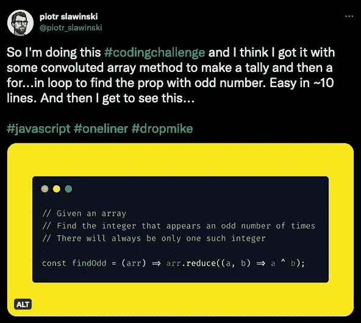

# 我们需要谈谈俏皮话。

> 原文：<https://javascript.plainenglish.io/we-need-to-talk-about-the-one-liners-58f460c05fc5?source=collection_archive---------1----------------------->

## 在我多年的开发生涯中，似乎每个人都在努力缩短代码。如果你能用更少的代码行做同样的事情，那就更好了。但是是吗？


嗯……不。通常写更短的代码并不是更好。博文结束？

嗯……还是没有。我认为需要澄清一下。为什么要推动短代码，为什么它不好？或者更好的是，为什么*能让*更短的代码变坏。我说*可以*，因为更长的代码会造成混乱。这都是关于代码质量的。

让我们来看一个简单的 if-else 语句

```
if (numberOfThings > 5) {
 proceed();
} else {
 showError();
}
```

这很清楚了吧？容易阅读，容易跟随，它 *f* lows 好。通常这种代码会被替换成类似这样的代码

```
numberOfThings > 5 ? proceed() : showError();
```

或者这个

```
(numberOfThings > 5 ? proceed : showError)();
```

功能是相同的，但它是一行程序。它更短，但是它更好吗？在简单的情况下，如上图所示，它可能会更好，但已经很难阅读了。阅读代码可能需要 2 秒，而不是 1 秒，如果你不太熟悉 if-else 语句的简写形式，可能需要更多时间。

我们仍然只处理 2 个函数调用，所以这实际上可能不算太糟，但是如果它被挤在 100 行代码之间，使所有代码都变得更短，会不会更好？

但是，如果它调用的函数本身很短，而您决定省略这些函数，只将逻辑放入 if-else 中，那么我们会得到更可怕的东西。

```
numberOfThings > 5 ? $.form.submit() : $.errormessage.text = “error message”; $.errormessage.show();
```

所以现在它已经不适合在媒体上的一行。它仍然是简单的代码，但是你喜欢看到这个吗？还是更喜欢有自己功能的函数调用？

当像这样的一行程序开始返回值时，当有数据转换发生时，或者以上所有情况一起发生时，事情会变得更糟。我见过一些非常糟糕的一行程序，它们是“好”代码，因为它们短小精悍。

为了便于阅读，是时候收回结构并重新引入更长的代码了。毕竟，人类关心结构，浏览器或你的服务器不考虑结构，或者关心代码是否更长。对于前端来说，我们已经有了缩小来使事情变得更短，而且在很多情况下，你已经有了编译器来把它变成别的东西。在许多生产环境中，您编写的代码*实际上*以完全相同的形式出现在运行代码的设备上的情况非常罕见。

那么，为什么所有的努力都是为了完美的一句话呢？

## 要注重可读性！

生产代码中最重要的是可读性。真的，这是编写代码最重要的方面，尤其是如果你在团队中工作。

当然，你可能是高级开发人员，而*字面上的意思是*知道这种语言的所有细节，但是你真的希望你的初级同事能够理解这种代码并能够在此基础上进行开发吗？我不是在谈论你的语言所提供的功能。例如，JavaScript 提供了一些非常好的数组函数。



[https://twitter.com/piotr_slawinski/status/1257634325127999488](https://twitter.com/piotr_slawinski/status/1257634325127999488)

*在上面的例子中，* `*Array.reduce*` *不是一个初级开发人员可能理解的东西，也不知道它为什么会这样工作，但它不会在一行中塞进太多内容。尽管如此，为了清楚起见，回调函数也可以在单独的行上。*

但是将相同的功能压缩在一行中，而*应该在多行中，仅仅因为这样你就可以声称它是一行程序？这从来都不是一个好兆头！它降低了代码的可维护性，使代码越来越难维护，尤其是在团队中工作的时候。*

好的代码都是关于团队合作，以及当你提交代码时理解它的能力。在过去，我们都(有点)同意写不具描述性的变量名是不好的，我们应该用更少的行来压缩所有代码。

所以下次当你写代码的时候，问问你自己，你认为你的同事直觉上能理解代码吗？他们不需要理解内部的工作原理，但是他们能理解代码在做什么吗？这当然可以归结为自文档化的代码，所以这是你应该记住的事情。

我推荐几条规则，它们可以极大地帮助代码变得更加清晰

*   编写在上下文中有意义的变量和函数名(自文档化代码)
*   如果一行做多件事，将代码分散在多行中
*   确保任何查看代码的人都能理解代码的*流程*

我说的*流程*是指，能够理解代码*如何表现*，而不是每个函数意味着什么。

如果你是编程新手，你应该知道代码一般是如何工作的，但这并不意味着你知道这种语言提供的每一个功能。只要您能够不太麻烦地探索代码，并检查文档中来自该语言的未知(对代码读者而言)函数，那么我们都很好。

[](/the-ultimate-guide-to-writing-self-documenting-code-998ea9a38bd3) [## 编写自文档化代码的终极指南

### 厌倦了在代码中写注释吗？我们停止这样做，而是编写自文档化的代码

javascript.plainenglish.io](/the-ultimate-guide-to-writing-self-documenting-code-998ea9a38bd3) 

*更多内容请看*[***plain English . io***](http://plainenglish.io)

[](/5-ways-to-improve-your-functions-in-javascript-fea32984122e) [## 提高 JavaScript 功能的 5 种方法

### 通过将这些方法应用到您的函数中，让您的 JavaScript 生活变得更加简单

javascript.plainenglish.io](/5-ways-to-improve-your-functions-in-javascript-fea32984122e)