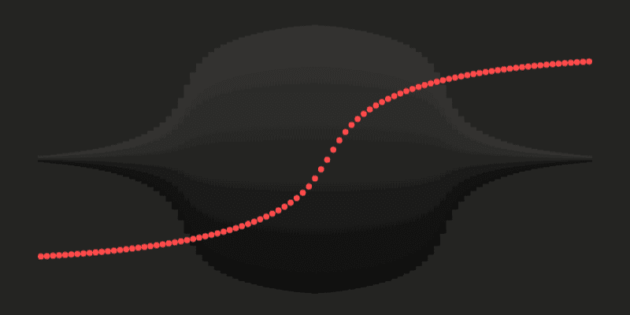

# 用 anime.js 编织 Fabric.js

> 原文：<https://javascript.plainenglish.io/weaving-fabric-js-with-anime-js-df23e0537b27?source=collection_archive---------6----------------------->

source: animejs.com

我们大多数人在从事一个涉及摆弄画布的项目时都使用过/遇到过 Fabric.js。它可以拖动简单的形状或者在上面定义动画。

让我们从看一个织物对象开始。这是一个简单的织物物体的样子。

上面的对象是一个具有不同属性的结构矩形类型，这些属性定义了对象在画布上的呈现方式。

在第 17 行，我们用这个矩形对象的一些值来定义动画。[这是](http://fabricjs.com/animation-easing)制作动画后的样子。

让我们看看 anime.js 如何在不同的对象上创建动画，特别是时间轴功能。因为有了时间线，我们可以像控制视频一样更舒适地控制动画。

在上面的片段中，我们从定义动画的类型开始，我们还在这里定义了整个动画的持续时间。

这里我们正在处理时间线动画。

*   一旦我们创建了一个动画，我们就可以添加对象或子对象。
*   变量`tl`是一个时间线对象，有一堆不同的属性，比如暂停、播放、重启、当前时间等。这就去。借助这些属性，用户可以控制动画的播放方式。

上面的代码片段显示了一个简单的平移动画，其中对象从左向右移动。

在 anime.js 库中提供的关键帧的帮助下，可以定义更细粒度的动画。

**关键帧是一组对象，定义对象在该时刻的行为。**

*   关键帧中的每个对象都可以有不同的属性，包括位置、不透明度、比例以及对象动画的延迟。

一个示例关键帧看起来与此类似。

我们现在对使用 fabric.js 和 anime.js 的动画有了一个基本的了解，而 anime.js 更适合像动画这样的视频，fabric.js 用于处理画布并控制对象的行为。

现在，问题是我们如何将这些结合在一起，使用 anime.js 中的时间轴来创建动画？

我们需要时间轴来支持所有基本的视频类控件。

这可以通过在 fabric 对象上定义自定义属性来实现。例如:

1.  从第一个代码片段开始，您可以使用`rect.setOptions({name:value}).`在 rect 对象上添加自己的属性
2.  我们可以利用这些属性来定义织物对象本身的关键帧。
3.  我们可以有一个类似于`_anim`的属性，它包含了构成该对象动画的所有关键帧。带有动画关键帧的示例对象如下所示

不仅是图像/形状，你甚至可以添加视频作为织物对象，这在`fabric.util.createClass`的帮助下是可能的。你可以在[面料文档](http://fabricjs.com/polaroid)中找到更多相关信息。

我们可以使用这样不同的对象创建一个 visualJson。一个 visualJson 看起来像这样

我们可以利用这个 JSON 在画布上呈现对象并播放动画。因此，问题是我们如何在`_anim`属性上制作属性动画。

我们可以从创建一个时间线对象开始，然后播放我们需要关键帧的动画，这样我们就可以遍历对象数组并将关键帧添加到时间线对象中。一个简单的实现如下所示:

在上面的代码片段中，第一部分创建了一个时间轴对象，然后我们将对象关键帧添加到时间轴对象中。

每次对象更新时，画布都必须重新渲染，以反映这些变化。有了这个，我们可以在画布上以动画的形式播放 visualJson。与在画布上加载 visualJson 相关的部分非常简单，可以用 fabric canvas 实例的`loadFromJSON`方法来实现。

## 更新动画:

到目前为止，我们已经学习了如何将 visualJson(一组 fabric 对象)作为动画来播放。

但是，如果我们想要更新/创建动画或删除现有的动画/对象呢？我们如何解释这些变化？

让我们试着问一问，当我们执行这些操作中的任何一个而不考虑时间线对象时，visualJson 会发生什么。

*   当我们在结构对象本身中进行改变时，时间线对象不知道这些改变，因为它已经被初始化了。
*   为了在画布上正确呈现动画对象的任何改变，时间轴对象必须被重新初始化。这意味着用新的 fabric 对象和它们的`_anim`属性创建一个不同的时间轴对象。
*   如果处理不当，这可能是非常迂腐的。必须进行仔细的设计考虑，以确保捕捉到与织物对象相关的任何变化。

## 结合视频:

在本文的最后一部分，让我们看看如何将视频作为 fabric 对象添加，并与其他动画一起管理它们。

**对于视频，我们需要做的是根据视频的延迟和持续时间来播放视频，也就是说，根据时间轴对象的** `**currenTime**` **属性，我们应该决定在画布上播放和显示哪个视频。**在暂停/播放/重启时间线时，我们应该确保与视频同步。

我希望这能帮助你对 fabric.js 和 anime.js 的协同工作有一个基本的了解，这应该是你开始为复杂的功能做设计决策的一个很好的起点。

我做过一个非常大的项目，涉及到使用 Fabric.js，anime.js，React with Typescript 制作不同种类的动画。因此，如果您有任何问题/疑问，请随时在我的 Twitter 上联系我。我把我的推特账号放在下面。

 [## JavaScript 不可用。

### 编辑描述

twitter.com](https://twitter.com/shash__wat) 

*更多内容尽在*[*plain English . io*](http://plainenglish.io/)