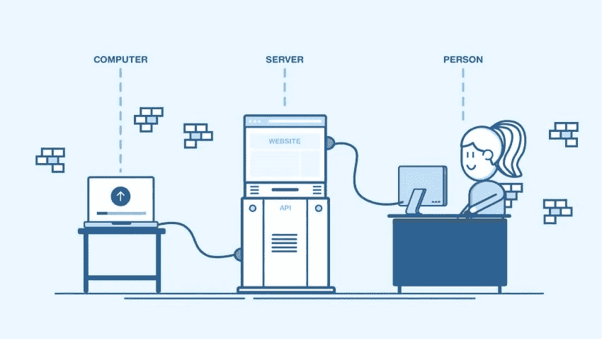
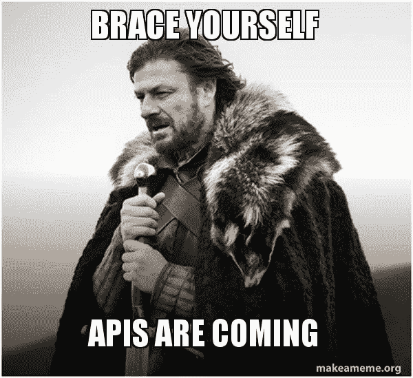

# web API——初学者简介

> 原文：<https://javascript.plainenglish.io/web-apis-a-brief-introduction-for-beginners-75dae32e68a8?source=collection_archive---------26----------------------->

你知道围绕着开发人员生活的事情吗？振作起来…API 来了。

Source — [callr blog](https://www.callr.com/blog/what-is-an-api/)

上面的视觉表现太好了。看两次、三次或更多次。

如果你是一名开发人员，那么 API 将融入你的工作生活。告诉我他们不在哪里。即使在写这篇文章的时候，我们两个人都在与 API 进行交互。我——用于写作和发布。你——为了阅读和获取。对我来说，有足够的理由去了解它(对你来说也是)。

让我们定义一个 API …

> API(应用程序编程接口)通过抽象底层实现和只暴露开发者需要的对象或动作来简化编程

技术保镖？让我换个说法…

一个界面可以帮助你得到你想要的东西，而不会被它背后复杂的机制所困扰。《出埃及记》，中，你(我)不知道这是如何在幕后工作，但我们在这里，使用它太好了。更清楚地说，你点击某个东西，结果就出现了，这是怎么回事？。就拿浏览器本身来说，你知道如何打开新网站吗？是的，通过键入网站名称。不，你打字的动作背后有东西。这就是应用程序编程接口的意义所在。您(您的计算机)和您要访问的站点(另一台计算机)之间的媒介。

这是一个我喜欢的现实生活场景定义，

> 想想你的房子、公寓或其他住处的电力供应。如果你想在你的房子里使用一个电器，你把它插到一个插座上，它就工作了。你不要试图将它直接连接到电源上——这样做是非常低效的，如果你不是电工，尝试这样做是困难和危险的。~救世主 Mozilla Docs

安全，确定吗？

现在，我为什么要写 Web API 作为文章主题呢？整个 API 是一个复杂的东西——无法用一篇文章来概括。也就是说，肯定有不同的类型和不同的方面——业务、架构等。Web API 就是这样一种核心类型。

Coming through

# **Web API**

处理 Web 的 API 虽然简单。现在，它在网络上到底是做什么的？—它创建了一个跨设备共享(或使用)数据的界面。怎么会？

API 有两种基础——

1.  浏览器(这是一个应用程序)
2.  服务器(只是另一个设备)

全世界的开发人员都在开发这样的接口，以便更流畅地使用应用程序。

# **网络服务器**

后端人的竞技场。这些开发人员创建可以在整个网络上共享的 API(有或没有直接的公共访问)。为什么他们首先要创造它？

假设，你是一个羽毛球爱好者。你想知道你最喜欢的球员的细节——p . v .辛杜。你在谷歌上输入——普萨拉统计数据。您将看到所需输入的网站链接。其中一个可能是——BWF 网站(羽毛球世界联合会)。这个网站有所有的数据，包括排名，下一场/上一场比赛，以及许多其他类似的内容。数据。这就是你需要的。要做到这一点，后端人员必须全心全意地确保——当你键入一个玩家名字时，应该给出正确的数据。API 没错！他们创建了一个方法或函数，当用户输入他/她最喜欢的球员名字时，它可以处理所有的请求。现场拉力赛。

现在你可能会想，我能自己创建这样一个函数吗？当然可以。这就是 Node、Python 等酷技术发挥作用的地方，不管数据是什么。仅供参考，这些类型的 API 称为第三方 API。

现在最精彩的部分来了…

# 浏览器 API

是的，浏览器有自己的 API，或者更确切地说是 API。这些 API 公开了来自浏览器和系统的数据。

等等，什么浏览器适合我？什么样的数据？

你的老板叫你去参加一个紧急会议，你必须准备并做一个演示。谷歌会议来电。你打开它&一个弹出窗口出现了——*允许 google meet 访问你的相机*。你点击了允许&继续。暂停。

你记得吗？这是 API 之一。google meet 建立了那个吗？不，是浏览器的问题。他们使用了一种名为 WebRTC 的技术，这种技术在常规 JavaScript 中提供 API(本地的情况不同)。它存在于浏览器中。

这样的 API 有很多。如果您是一名 JavaScript 开发人员(即使只工作了很短时间)，您可能会遇到这种类似 DOM 的东西。使用 DOM，您可以添加、更新、更改或删除 HTML 元素。有没有想过它是一个 API？是的，它是一个 API &不是 JavaScript 所拥有的。JavaScript 就是你用来处理它的东西。浏览器是理解这种 JavaScript 语言的东西&让你操纵 DOM。如果你有兴趣，那么，读读 [**这个**](https://developer.mozilla.org/en-US/docs/Web/API/Document_Object_Model) 。

我可以在这里举出更多的例子，

1.  画布 API —用于绘制图形
2.  控制台 API —用于调试
3.  获取 API —用于通过网络获取数据

存储、屏幕捕获、全屏、流、服务人员、历史、性能等等。详细指南可在[这里](https://developer.mozilla.org/en-US/docs/Web/API)找到。觉得好奇去探索。

等等，我有个问题。(你可能会有同样的想法)

**为什么我把 web 服务 API 称为第三方 API？**

因为它们不是浏览器的一部分。不是默认。你从网上的某个地方收到的。上述案例中的 BWF 网站。

哇，这是一个很好的简报。一起联系和探索几个更有趣的事情怎么样？

 [## TidbitsJS -概述

### 很高兴见到你，我是 Sujata Gunale 又名 TidbitsJS🤓自学开发者👩‍💻从事 Web 开发📝正在写作…

github.com](https://github.com/TidbitsJS) 

那个卡通人物就是我。向伟大的人工智能艺术家致敬。

**亚肯达·古尔吕兹**👋

*更多内容尽在*[***plain English . io***](http://plainenglish.io/)