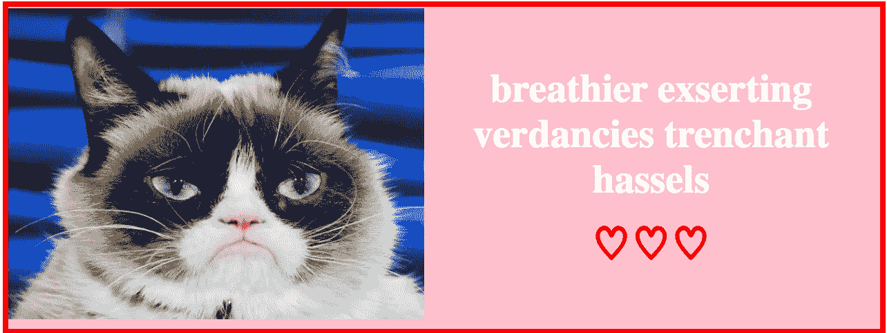

# 如何从 API 请求(获取、异步/等待)

> 原文：<https://javascript.plainenglish.io/web-dev-coding-problem-request-from-an-api-fetch-async-await-cab222657a68?source=collection_archive---------11----------------------->

## 经典的 Web 开发人员面试问题:情人节版

# 提示

用一张随机的猫图片和 5 个随机的单词制作一张情人节卡片。一个警告:仅当两个 API 都成功返回数据时才呈现内容。

随机猫图片 API
端点:[https://api.thecatapi.com/v1/images/search](https://api.thecatapi.com/v1/images/search)文档:[https://docs.thecatapi.com/](https://docs.thecatapi.com/)

随机词生成器 API
端点:[https://random-word-api.herokuapp.com/](https://random-word-api.herokuapp.com/)
文档:[https://random-word-api.herokuapp.com/home](https://random-word-api.herokuapp.com/home)



## 基本 HTML:

```
<div id="card">
  <div id="image-wrapper"></div>
  <div id="text-wrapper"></div>
</div>
```

在你向下滚动看到我的解决方案之前，我建议你试一试！

# 解决方案 1。使用获取

因为我们只想在两个 API 都返回数据的情况下呈现内容，所以我决定将两个 GET 请求一个接一个地链接起来，因为如果第一个承诺(从 cat API 获取)被拒绝(网络问题、无效的 JSON 等)，`.catch`将运行，而不会运行第二个 GET 请求或任何其他承诺`.then`处理程序。

## 解释:

*   (第 1-2 行)将长端点字符串设置为易于阅读的常量变量。
*   (第 4–7 行)`function checkStatus`检查请求的响应——如果不是则抛出一个错误`ok`(布尔值表示请求响应是否成功)并拒绝承诺。解析承诺，否则返回转换为 JSON 对象的响应。
*   (第 9–14 行和第 16–21 行)两个箭头函数，它们的唯一目的是呈现图像/文本。
*   (第 23-35 行)事情开始发生的地方。
*   (第 23 行)首先，向随机 cat image API 端点发出 GET 请求，或者用其他术语“获取”响应。接下来，每次给`.then`或`.catch`打电话都会产生一个新的承诺，这个新的承诺与之前的承诺联系在一起。`.then` promise 处理程序在承诺被解析之前运行，并将前一个承诺的返回值作为参数。`.catch` promise 处理程序仅在获取出错时运行，但不会检查网络错误。(见下一条如何处理该问题)。)
*   (第 24 行)如果一个解决的承诺从获取中返回，下一步是检查响应的状态是否成功(参见第 4–7 行)。还有，如果你不知道，这一行是写`.then(res => checkStatus(res))`的简写方式。
*   (第 25–34 行)如果第 24 行的承诺得到了解析，那么下一个`.then`将猫图像 url 设置为一个常量变量，以便于阅读。然后，向随机单词 API 发出第二个 GET 请求。再次检查它的状态，如果请求状态显示成功，那么将图像文本追加到 DOM。

在下一节中，使用 async/await 的相同解决方案。

# 解决方案 2。使用异步/等待

我们可以使用 async/await 重写它，而不是像前面的解决方案那样使用承诺链。这实现了相同的结果，但是格式更清晰，可读性更好(跳到第 23–40 行)。

Only difference are lines 23–40.

# 结论

所以`fetch`和`.then` / `.catch`确实有用，但我个人认为利用`async` / `await`可以更清晰地阅读代码。检查运行中的代码:

Happy Valentine’s Day!

## 资源

[](https://developer.mozilla.org/en-US/docs/Web/API/Fetch_API/Using_Fetch) [## 使用获取

### Fetch API 提供了一个 JavaScript 接口，用于访问和操作 HTTP 管道的各个部分，例如…

developer.mozilla.org](https://developer.mozilla.org/en-US/docs/Web/API/Fetch_API/Using_Fetch) [](https://www.digitalocean.com/community/tutorials/how-to-use-the-javascript-fetch-api-to-get-data) [## 如何使用 JavaScript Fetch API 获取数据| DigitalOcean

### 曾经有一段时间，XMLHttpRequest 用于发出 API 请求。它不包括承诺，也没有…

www.digitalocean.com](https://www.digitalocean.com/community/tutorials/how-to-use-the-javascript-fetch-api-to-get-data) [](https://javascript.info/async-await) [## 异步/等待

### 有一种特殊的语法以更舒适的方式处理承诺，称为“async/await”。令人惊讶的是…

javascript.info](https://javascript.info/async-await)