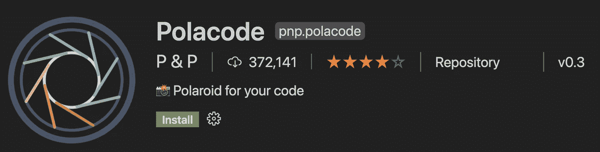
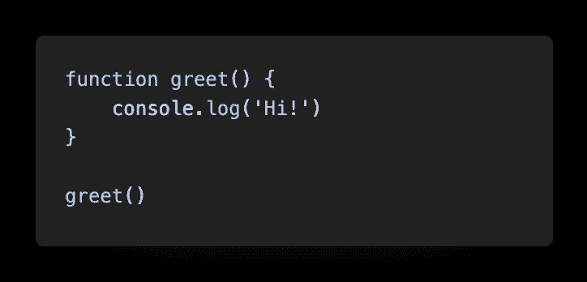
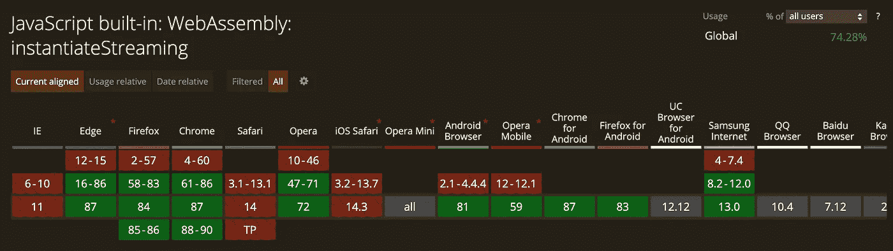
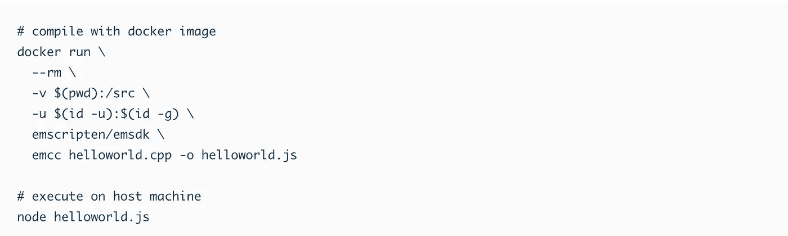
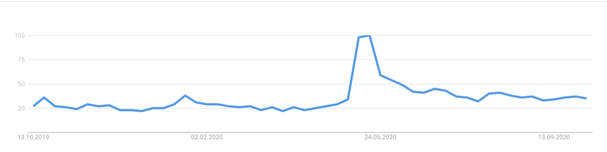

# 让你成为更好的网络开发博客作者的 7 个工具

> 原文：<https://javascript.plainenglish.io/web-development-blog-fdcf5a7e33db?source=collection_archive---------12----------------------->

## 我所有黑暗的小秘密

Photo by [KOBU Agency](https://unsplash.com/@kobuagency?utm_source=medium&utm_medium=referral) on [Unsplash](https://unsplash.com?utm_source=medium&utm_medium=referral)

我写关于编码的博客已经整整一年了——主要是关于 web 开发。当然，随着时间的推移，你会学到很多。这里有一些我不想再错过的工具——也许它们也会对你有所帮助！

# 1.VS 代码的 Polacode

每个人都喜欢代码片段。不幸的是，并不是所有的博客平台都提供正确的语法高亮显示。解决这个问题的方法是图像。
[在两篇很受好评的](https://medium.com/better-programming/go-4f365468dbd5)文章中，我用了一些来显示代码。

创建代码片段是小菜一碟——多亏了 VS 代码扩展。

Source: the author

在编辑器中，您必须通过命令面板选择 Polacode。然后你简单地标记你的代码；在右边的窗口中，您将看到完成的图像。这样，您可以轻松地创建可爱的代码片段:

# 2.GitHub Gists

将代码显示为图像的缺点很明显。你不能复制文本&大小比例不会保持不变。一个解决方法可以是 GitHub Gists。

在 GitHub 的起始页上，你只需点击加号。在“New Repository”和“Import Repository”下，您会发现创建新要点的选项。只需输入一个文件名(名称并不重要，只有扩展名是必不可少的)，然后您就可以将您的代码写入其中。

如果你创建了一个秘密要点，你在 GitHub 上的关注者将看不到它。

在嵌入按钮中，你只需复制 HTML 标签。在 Medium 这样的平台上，你只需要链接，不需要周围的脚本标签。

但是使用 Gists，您不仅可以显示代码，还可以正确显示 Markdown。许多博客平台不支持表格。

降价是一个很好的解决方案。只要点击“raw”就可以看到下表的纯 markdown 代码。

# 3.Caniuse.com

作为博主，你有一定的责任。毕竟，你在向人们展示如何使用技术。重要的是，你只教他们什么是好的，什么是有效的。

这些年来，网络发生了巨大的变化。新功能来了，老功能被弃用了。(真希望有人在 2018 年之前告诉我，他们停止使用

标签)。

Source: [caniuse.com](https://caniuse.com/?search=instantiatestreaming)

# 4.码头工人

Docker 是一个容器虚拟化的应用程序。在专业领域，是不可或缺的。但是我也喜欢用 docker 做我自己的项目和实验。

该软件解决了一个问题:流行的“但它在我的机器上运行”的错误不再发生。当然，创建 Docker 图像总是需要一点工作。像其他技术一样，你必须首先学习它——但既然它在专业上如此受欢迎，它绝对值得。

与传统安装相比，Docker 通常要快得多。例如，安装 emscripten 需要很多步骤—但相应的 Docker 映像是用一个命令安装的；已经给出了执行的例子:

Source: [hub.docker.com](https://hub.docker.com/r/emscripten/emsdk)

Docker 非常适合简单地尝试一个新的数据库、编程语言或框架。您还可以将自己的图片推送到 docker hub——您的读者可以自己试用代码，享受 Docker 的好处。
我在这里展示了如何将 Node.js 图像发布到 Docker Hub [。](https://medium.com/javascript-in-plain-english/node-js-docker-5b76778830c3)

# 5.JavaScript 基准测试

用代码解决问题有很多方法。问题是，通常只有一种解决方案运行得最快。如何才能找出代码最快的实现是什么？有了标杆。

虽然有一些模块，例如 Node.js 中的 *perf_hooks* 模块，可以用来进行性能测试，但这需要一些努力。【JSBEN 这样的网站。CH 提供更简单的解决方案。

只需输入两个或多个代码变体，运行它们，看看哪个更快。重要:JSBEN。CH 在浏览器中执行—会有波动。

我建议在不同的浏览器中多次运行基准测试。用于基准代码的网页不是最精确的解决方案——但却是一个简单的解决方案。它们最适用于粗略的性能差异。

一个很好的例子就是普通 JS 中的 jQuery 与 createElement 的对比。

# 6.发现一个常见的写作错误

这也是必须的——因为我总是注意到这一点:
科技博客并不太重视好的写作。当然，代码是不言自明的——但是一个长句子肯定会让许多读者不理解内容。几周前，我做了一个实验。

我观察了一些非常成功的博客作者，目的之一是:他们平均每句话用多少单词。结果是:10 到 12 个单词——不多。这就是为什么许多人会犯简单地写太长句子的错误。
好消息？一个免费的网站可以帮你避免这些:[https://wordcounter.net/](https://wordcounter.net/)。

将您的文本复制到页面上，然后单击“详细信息”选项卡中的“更多”。
在那里你可以选择“平均。句(词)”作为另一种选择。试着保持你的句子简短——即使是作为一个科技博客。

# 7.用谷歌趋势寻找趋势

技术就是潮流。还有谁比谷歌更适合判断趋势呢？多亏了免费的网络应用程序谷歌趋势，任何人都可以看到现在什么是热门。你可以输入一个主题或搜索词，然后选择地理位置&时间段——Google Trends 会告诉你有多少人对此感兴趣。

这款应用是我写这篇关于 [Deno 是否已经死了](https://medium.com/javascript-in-plain-english/is-deno-already-dead-661ce807338a)的文章的原因。根据谷歌趋势，你可以清楚地看到，炒作已经没有多少了。

Source: [Google Trends](https://trends.google.com/trends/explore?q=deno)

感谢您的阅读！

## [加入我的时事通讯，了解最新消息](http://eepurl.com/hacY0v)