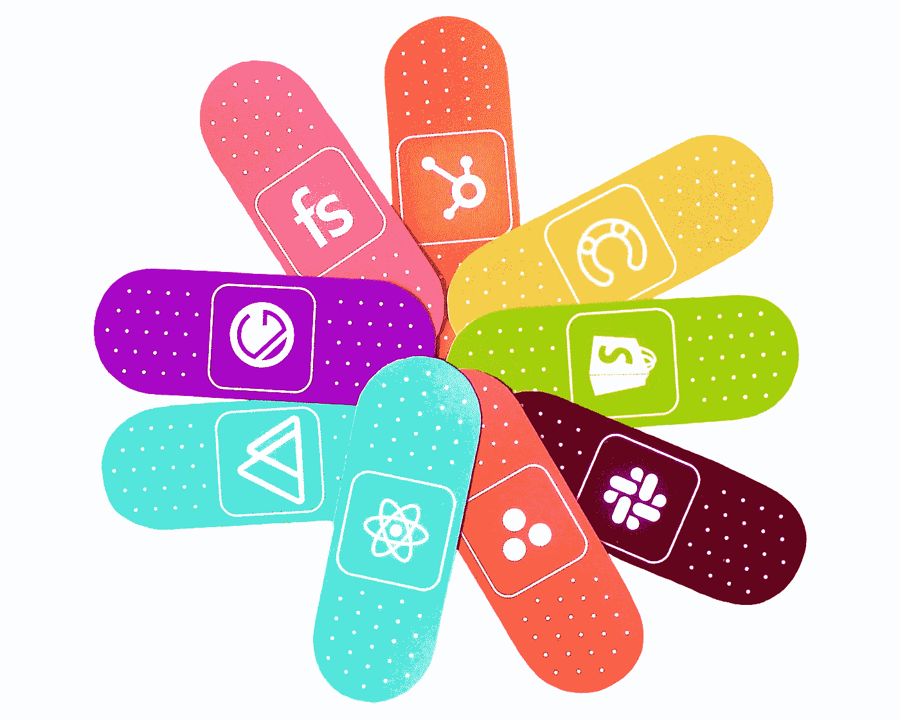

# 2021 年网络发展趋势为你的用户带来更好的用户界面/UX

> 原文：<https://javascript.plainenglish.io/web-development-trends-for-2021-to-bring-your-users-a-better-ui-ux-7f4282a77018?source=collection_archive---------7----------------------->

## 如果你不想被落下，就去看看吧

Photo by [Webstacks](https://unsplash.com/@webstacks?utm_source=medium&utm_medium=referral) on [Unsplash](https://unsplash.com?utm_source=medium&utm_medium=referral)

web 开发世界变化如此之快。一些今天诞生的网络技术可能明天就会消失。

要在这个世界上生存，你必须保持领先。跟上最新的趋势是最好的方法之一。

以下是 2021 年你可以追随的 7 个网络发展趋势。

# 1.JavaScript 继续保持它的位置

今天，如果不启用 JavaScript，你甚至无法打开一个网站。

2021 年，另一种语言不可能取代 JavaScript。与 HTML 和 CSS 一起，JavaScript 继续统治着 web 开发领域。

我不知道另一种语言将如何进入游戏并击败 JavaScript。我的意思是，基于 JavaScript 构建的框架和库数量惊人，没有人敢挑战它。像 React、Vue 和 Angular 这样的库仍然会在 2021 年进行迁移。

# 2.简单

设计的演变正从现实主义走向极简主义。说那个，设计不一定花里胡哨。相机图标不需要像真正的相机一样设计。设计应该少到多。

你可能认为在网站上放大量的酷动画会吸引用户。事实并非如此。尤其是当人们被像今天这样的信息轰炸时，他们会选择简单易用的东西。更不用说极简设计现在是一种趋势。所以，保持你的网站简单明了。

# 3.运动设计

动作设计是 2021 年主要的网页发展趋势之一。将动作设计应用到你的网站上会吸引用户，给他们带来独特的体验。

动作设计不仅仅是在你的网站上制作动画元素，还包括每一个动作背后的意义。不要仅仅为了花哨的 UI 而使用动作设计。每个动作都应该有一个特定的目的。它创造了一个流畅的流程，吸引并吸引你的用户。

2021 年，让我们在你的网站中加入动作设计，为你的用户提供更好的 UI/UX。

# 4.人工智能

如果你给一个网店发消息后马上得到回复，你是什么感受？

还是某个网站的信息只是为你个人优化的？

都是 AI。这是一时的趋势，在 2021 年仍将发挥重要作用。

作为一个网站所有者，如果把 AI 应用到你的网站上，你得到了什么好处？嗯，很多。

你会知道你的顾客会寻找什么。既然你能预测到，你就会主动把产品放在顾客眼前，以促进你的销售。

你会知道什么样的客户在买什么样的产品。这样你就可以优化为顾客个人展示产品。

我喜欢人工智能的一点是，它减少了手动做事的工作量。人工智能可以为你做所有这些。以回复信息为例，人工智能聊天机器人一天比一天聪明，因此它们可以像真正的人一样与人类互动。客户甚至不知道他们正在与一个非人类系统对话。

越来越多的企业开始接触人工智能，以建立客户和品牌之间的长期关系。这使得它成为 2021 年最重要的网络发展趋势之一。

# 5.静态站点生成器的兴起

我们都知道静态网站是网站的早期。现在，他们回来了。是网站降级还是什么？当然不是。事实上，随着 Gatsby、Next.js 或 Nuxt.js 等静态网站生成器的兴起，静态网站被认为是一种趋势。

与动态网站相比，静态网站有许多突出之处。它们便宜且易于开发。最棒的是:它们超级快。

不要像早期那样认为现在是静态网站。那时的网站只不过是一个简单的 HTML 文档文件夹。然后静态网站生成器出现，把静态网站带到下一个层次。

想了解更多关于静态站点生成器的信息，请查看下面的文章:

 [## 构建最快的 Web 应用程序的 14 大静态站点生成器

### 让我们进入最快网站的世界。

medium.com](https://medium.com/javascript-in-plain-english/top-14-static-site-generators-for-building-fastest-web-applications-c17cf7c9c929) 

# 6.单页应用程序(spa)

如果你讨厌当你点击链接时页面被一次又一次地加载，那么你会喜欢单页应用程序。从字面上看，一个 SPA 只有一个页面。

这类网站在使用过程中不需要重新加载。如果你想要例子，想想 Gmail 或 Trello。

你可能想知道如何在温泉中漫游。事实上，你可以。它会给你一种感觉，网站正在重新加载，但它不是。唯一改变的是数据，UI 将根据新数据重新呈现。

如果你要为你的企业建立一个网站，考虑 spa，因为它们会给你的用户带来一个独特的无缝 UX。

# 7.渐进式网络应用(PWAs)

我们有温泉。那么什么是 PWA 呢？

你可以把它想象成一个标准网站和一个移动应用的混合体。考虑到这一点，您可以将 PWA 用作网站，并拥有一些以前只在本机应用程序中提供的功能。

PWAs 可以安装在你的手机甚至桌面上。当您打开一个 PWS 时，它应该在任何浏览器上渐进显示。

在某种程度上，使用 PWA 与使用原生应用没有太大区别。它继承了原生应用程序的几个功能，甚至是推送通知。您也可以在离线模式下使用它。

想象一下，如果 pwa 主宰了移动应用，应用商店将什么都不是，只是装饰你手机的图标。

# 结论

Web 开发变化如此之快。上述一些趋势可能并不真实。然而，它们不会在一天内消失或真实。所以，你应该跟踪他们，并尝试他们。

在取悦我们的用户方面，没有比在你的网站上采用流行趋势更好的方法了。通过这样做，你将为你的用户带来更多的价值，并为他们提供令人惊叹的体验。最终，你的网站会成为他们在这个领域的首选。

希望你喜欢这篇文章。

[***和我一起分享更多关于编程的有益见解。***](https://bracketshack.substack.com/)