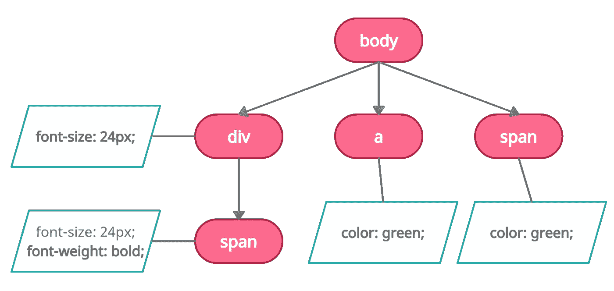

# 浏览器中的 HTML、CSS 解析和网页渲染过程|关键渲染路径

> 原文：<https://javascript.plainenglish.io/web-performance-understanding-critical-rendering-path-72283caefc1f?source=collection_archive---------2----------------------->

## *关键呈现路径*是浏览器为了在屏幕上呈现网页而执行的一系列动作或步骤。

*关键渲染路径*是浏览器为了在屏幕上渲染网页而执行的一系列动作或步骤。这些步骤包括从服务器获取资源(HTML、CSS、JavaScript)，解析接收到的 HTML 以创建 *DOM* ，解析 CSS 以创建 *CSSOM* ，创建由 DOM 和 CSSOM 组合而成的渲染树，计算所有元素的位置和尺寸(*布局*，最后 P *在屏幕上绘制实际的*像素。

我们将使用下面的例子来理解整个过程

## 文档对象模型

在从服务器获取 HTML 之后，浏览器开始解析它并创建 DOM，这个过程本身被分成需要执行的许多进一步的步骤，以便创建 DOM 树，这些步骤包括:将接收到的 HTML 字节转换成令牌，使用这些令牌创建节点，然后连接这些节点以创建 DOM 树。

**创建令牌**

浏览器开始逐字符读取获取的 HTML，并在遇到 HTML 标记时创建一个令牌。有两种类型的标记， *StartTag* 标记和 *EndDate* 标记，顾名思义 *StartTag* 标记是在遇到 HTML 开始(开始)标记时创建的，而 *EndTag* 标记是在遇到任何 HTML 结束(结束)标记时创建的。

解析上面示例中显示的 HTML 后，将创建以下标记

**创建节点和 DOM 树**

第一步中创建的标记用于为每个 HTML 标记创建节点。节点包含特定标记的完整信息，如属性、类等。

令牌的顺序也非常重要，因为它用于识别节点之间的关系，即一个节点是否是另一个节点的子节点。一旦解析了所有的标签并创建了节点，下一步就是通过使用它们的序列识别它们之间的关系来连接这些节点。

在上一步创建的令牌中， **span** 的 *StartTag* 和 *EndTag* 位于 *StartTag* 和 **div** 的 *EndTag* 之间，这意味着 *span* 节点将是 DOM 树中 *div* 节点的子节点，如下所示。

## CSS 对象模型

解析 HTML 时，如果浏览器遇到任何引用样式表的样式标签或链接标签，它就开始获取(在外部 CSS 的情况下)并解析这些样式，然后将它们转换为包含所有页面样式信息的 CSS 对象模型。

CSSOM 的创建过程类似于 DOM 的创建，也就是说，CSS 字节首先被转换成字符，然后字符被转换成令牌，然后是节点，最后我们在链接这些节点后得到 CSSOM。

父节点中的每个样式也应用于子节点，正如您在上面的示例中看到的，span 节点具有从父 div 节点继承的 font-size 属性。

## 渲染树

渲染树是 DOM 和 CSSOM 的结合。为了创建渲染树，浏览器开始遍历 DOM 并在 CSSOM 中寻找匹配的样式，然后将这两者结合起来创建一个包含内容和样式信息的渲染树节点。

渲染树仅包含在屏幕上可见的节点，例如，meta、script、link 等标签的节点，或者使用 CSS 样式隐藏的节点(如 display: none)不包括在内。

## 布局

在这一步中，渲染树用于查找视口中每个元素的尺寸和位置。在上面的例子中，如果我们给 *div，*加上 50%的宽度，那么 div 的最终计算宽度将是 body 标签宽度的 50%。百分比值根据视口大小转换为像素。

## 颜料

现在我们有了每个元素的所有内容、样式、尺寸和位置，是时候进行最后的绘制步骤了，该步骤将渲染树中的每个节点渲染到屏幕上。

现在你知道了。感谢您的阅读。

*更多内容看* [***说白了。报名参加我们的***](http://plainenglish.io/) **[***免费周报***](http://newsletter.plainenglish.io/) *。在我们的* [***社区获得独家访问写作机会和建议***](https://discord.gg/GtDtUAvyhW) *。***