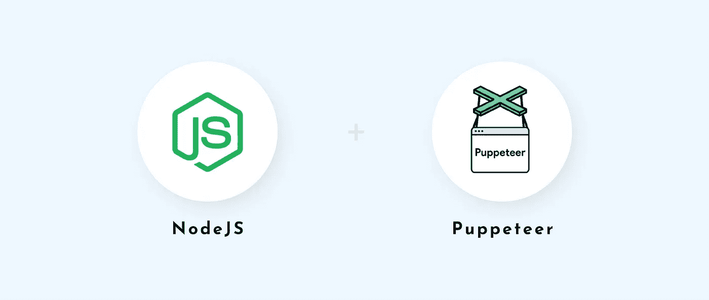

# 网络搜集 101:木偶师简介

> 原文：<https://javascript.plainenglish.io/web-scraping-101-intro-to-puppeteer-790ead85dd2?source=collection_archive---------10----------------------->



*这篇文章使用 Node.js 和 Puppeteer 进入了网络抓取的水深火热之中。首先，我们将在 VS 代码中介绍* ***设置木偶项目*** *的基础知识。然后，我们将编写一些代码来执行* ***登录，数据抓取，以及用*[*【http://quotes.toscrape.com】*](http://quotes.toscrape.com/)*上的傀儡师进行*** *。*

如果你已经找到了这篇文章，你可能知道什么是木偶师。但是对于那些刚刚入门的人来说，木偶师是全新的— *木偶师是一个节点库，它为用户提供了一个简单易用的 API 来控制 Chrome，或者它不太为人所知的孪生兄弟 Chrome，没有真正的浏览器窗口(无头)*。对于黑客和开发人员来说，无头浏览器功能有各种各样的使用案例。但是，在这个入门演示中没有任何用处！相反，我们将使用完整的浏览器配置。

对于这个演示，您需要在您的计算机上安装 [Node.js](https://nodejs.org/en/download/) 以及 [VS Code](https://code.visualstudio.com/download) ，或者您喜欢的 IDE。(需要下载？单击该链接。)另外，打开[木偶师文档](https://devdocs.io/puppeteer/)参考。

我们还是直接说代码吧。

## 首要任务:项目设置

**创建您的项目文件夹**

> 只有在使用终端时，才需要以下命令；您当然可以使用 VS 代码 GUI 来代替。

```
$ mkdir i-love-webscraping
$ cd i-love-webscraping
```

**初始化项目**

在刚刚创建的项目文件夹中运行这行代码。您可以在所有初始化提示中按“Enter”键。该命令将在项目的根目录下生成一个“package.json”文件。

```
$ npm init
```

**安装木偶师**

该命令从节点安装 puppeter 包，在项目的根目录下生成一个“node_modules”文件夹，并更新“package.json”中的依赖项以包含最新版本的 puppeter。

```
$ npm install puppeteer
```

**创建 javascript 文件**

这个文件将保存你所有的代码。

```
$ touch iLoveToScrape.js
```

## 第二件事第二:木偶表演时间

让我们了解一下木偶师的基本情况。

继续将这段代码添加到 JS 文件中:

```
*const* puppeteer = require("puppeteer");
(async () *=>* { *const* browser = await puppeteer.launch({
    headless: false, 
    slowMo: 250,
  }); *const* page = await browser.newPage();
  //
  //add code here
  //
  await browser.close();
})();
```

然后使用以下命令运行它:

```
$ node iLoveToScrape 
```

如果运行该文件时一切正常，您应该看到 Chromium 打开一个新的浏览器窗口，然后大约半秒钟后自动关闭它。

这段代码在做什么？

首先，我们要求在木偶师，并分配给一个变量。接下来，我们创建一个异步函数来包含我们所有的逻辑。由于许多 Puppeteer 方法异步运行，我们将需要使用 await——将我们的代码包装在异步函数中允许我们使用 await 关键字。在我们的异步函数中，使用 await 和 launch()方法创建一个浏览器实例。为了在程序运行时查看浏览器窗口，我们将 headless 选项设置为“false”。我们还将 slowMo 选项设置为 250，这将使操纵木偶者的操作慢 250 毫秒。(一旦有更多的代码要处理，尝试删除或调整 sloMo 和/或 headless，看看会发生什么！)然后，我们在 browser 实例上调用 newPage()方法来获得一个新的 Page 对象，我们将在整个代码中使用它。最后，在异步函数的最后，我们调用浏览器实例上的 close()方法来关闭浏览器。

## 好的。现在让我们给这些骨头添加一些肉:

在调用`newPage()`之后，在异步函数中添加以下代码

```
await page.goto("http://quotes.toscrape.com", {
waitUntil: "networkidle2",
});await page.click(".col-md-4 a");await page.focus("#username");
await page.keyboard.type("rei.ayanami@hotmail.com");await page.focus("#password");
await page.keyboard.type("123");
await page.keyboard.press("Enter");
```

请尝试再次运行您的代码。如果它仍然正常运行，您应该会看到 Puppeteer 打开浏览器，重定向到网页，单击登录按钮，使用用户名和密码登录，重定向到主页，最后关闭浏览器。(顺便说一句，现在是使用 sloMo 选项的好时机。)

**该解剖肉了。有关更多信息，请查阅木偶师文档。**

`goto()` —获取您要转到的网站的 url。传递给第二个参数的实参告诉程序等待 500 毫秒，直到没有超过两个网络连接，换句话说，它说“等到页面完全加载。”

`click()` —接受一个选择器并模拟元素上的点击。

`focus()` —取一个选择器并聚焦于它。焦点意味着任何键盘输入都将被聚焦的元素接收。(即。输入字段)

`keyboard.type()` —接受文本以键入焦点元素。

`keyboard.press()` —接受一个带有按键名称的字符串(即。输入'，'向下箭头')

**很酷的方法，但是它们对我们的例子有什么作用呢？**

首先，我们导航到站点，等待页面加载`goto()`。一旦页面完全加载，我们使用`click()`获取登录页面的链接并点击它。在重定向到登录页面后，我们在用户名输入字段上`focus()`，并进入字段。然后，我们重复`focus()`，并在密码字段中键入()。最后，我们使用`keyboard.press()`点击“Enter ”,提交表单，让我们登录，并重定向到主页。

## **该给这顿饭加点料了:**

在我们按下“Enter”并重定向到主页后添加此代码…

```
//you may or may not need to include this first line depending on the sloMo value you have chosen
//await page.waitForNavigation("networkidle2");
*let* data = await page.evaluate(() *=>* {
  *let* quoteDivs = document.querySelectorAll(".quote");
 *let* quotes = [];
  quoteDivs.forEach((*quote*) *=>* {
 *let* text = *quote*.querySelector(".text").innerHTML;
 *let* author = *quote*.querySelector(".author").innerHTML;
    quotes.push({ text, author });
  });
  return quotes;
});
console.log(data);
```

当您用这些添加的代码运行程序时，您不会在浏览器中看到任何变化。然而，你*将* *看到*所有从控制台登录的第一页刮下的报价。

**这里没什么疯狂的…**

尽管这是我们实际抓取逻辑的主要部分，但我们只使用了两个新的操纵方法。

`waitForNavigation()` —当页面重定向到不同的 URL 或重新加载时使用。*有必要*包括*未*使用 sloMo 时，以等待新内容加载。

`evaluate()` —接受一个函数作为参数，让我们在浏览器中执行 JS。

那么，我们如何收集数据呢？在我们的 evaluate 函数中，我们首先用 class '获取页面上的所有 div。引用。接下来，我们使用 forEach 遍历 HTML 集合中的所有元素。对于每个报价，我们选择文本和作者*元素。我们使用 innerHTML 属性获取这些元素中的字符串，然后保存到文本和作者变量中。我们将这些变量作为对象属性推送到引号数组中，并返回该数组。您会注意到`page.evaluate()`被设置为变量‘data’，我们在最后一行对其进行了 console.log。这是因为 evaluate()方法返回自变量函数*的*返回值。因为我们返回一个引号数组，所以该数组被设置为数据变量。最后，我们在最后一行 console.log 包含引号数组的数据变量。瞧啊。网页抓取。*

## **加个装饰怎么样，只是为了好玩:**

假设您想要分页以获取前三页的所有引用，并且您想要将数据保存在一个文本文件中，而不仅仅是记录在控制台中。

第一步是去掉`console.log()`并用下面的代码替换它…

我们将遍历对象的数据数组，并将数据作为字符串添加到一个新文件中。这将在项目文件夹中生成一个新的文本文件，其中包含所有引文和作者姓名，用空行隔开。

```
*let* dataAsText = "";
data.forEach((*quote*) *=>* {
  dataAsText += `${*quote*.text} \n ${*quote*.author} \n\n`;
});
fs.appendFileSync("TopQuotes.txt", dataAsText);
```

您还需要在文件的最顶部安装 fs 模块:

```
*const* fs = require("fs");
```

现在要分页…在浏览器上方添加以下代码。close()调用:

我们在页面上滚动，直到“下一页”链接出现，然后我们点击它。

```
await page.evaluate(() *=>* {
  window.scrollBy(0, window.innerHeight);
});
await page.waitForSelector(".pager");
await page.click(".next a");
```

将从 page.evaluate()到 browser.close()之前的所有内容放在 for 循环中，以遍历您想要抓取的任意多个页面的代码。

在运行之前，请确保清除文本文件或提供一个新的路径，否则，它将追加到已经存在的内容。

## 总之+ TLDR

本文向您展示了如何建立一个简单的木偶项目。包括:导航到页面、自动登录、从多个页面抓取数据以及将数据保存到文本文件。

恭喜你，因为你成功了，所以我在下面附上了完整的代码。如果你通过跳过阅读来节省时间，不要忘记做这些最初的几个准备步骤！

**设置:**

```
$ mkdir scraping-is-cool
$ cd scraping-is-cool
$ npm init
$ npm install puppeteer
```

**完整代码:**

```
*const* puppeteer = require("puppeteer");
*const* fs = require("fs");(async () *=>* {*//initialize browser 
  const* browser = await puppeteer.launch({
    headless: false,
    slowMo: 250,
  }); *const* page = await browser.newPage();//goes to url, waits until no more network requests being made
  await page.goto("http://quotes.toscrape.com/", {
    waitUntil: "networkidle2",
  });//click login link to navigate to login page
  await page.click(".col-md-4 a");//complete login form
  await page.focus("#username");
  await page.keyboard.type("shinji.ikari@email.com"); await page.focus("#password");
  await page.keyboard.type("123");
  await page.keyboard.press("Enter");//uncomment following line if you remove slowMo option
  //await page.waitForNavigation("networkidle2");//loop for number of pages you want to scrape
  for (*let* i = 0; i < 3; i++) { *let* data = await page.evaluate(() *=>* {
//get all quote divs from page
 *let* quoteDivs = document.querySelectorAll(".quote");
 *let* quotes = []; quoteDivs.forEach((*quote*) *=>* {
//get quote text and author for each quote
 *let* text = *quote*.querySelector(".text").innerHTML;
 *let* author = *quote*.querySelector(".author").innerHTML;
        quotes.push({ text, author });
      }); return quotes;
    });//Outputting scraped data// console.log(data);
 *let* dataAsText = "";
  data.forEach((*quote*) *=>* {
    dataAsText += `${*quote*.text} \n ${*quote*.author} \n\n`;
  });
  console.log(dataAsText);
  fs.appendFileSync("TopQuotes.txt", dataAsText);//scroll to the bottom of the page and go to next page
  await page.evaluate(() *=>* {
    window.scrollBy(0, window.innerHeight);
  });
  await page.waitForSelector(".pager");
  await page.click(".next a");
}await browser.close();
})();
```

感谢您的阅读！

*更多内容尽在*[*plain English . io*](http://plainenglish.io/)