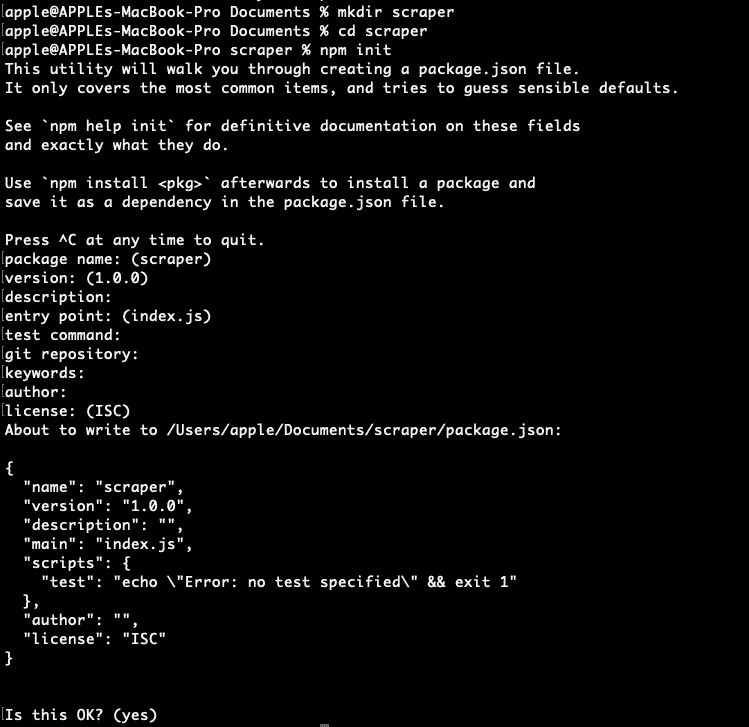
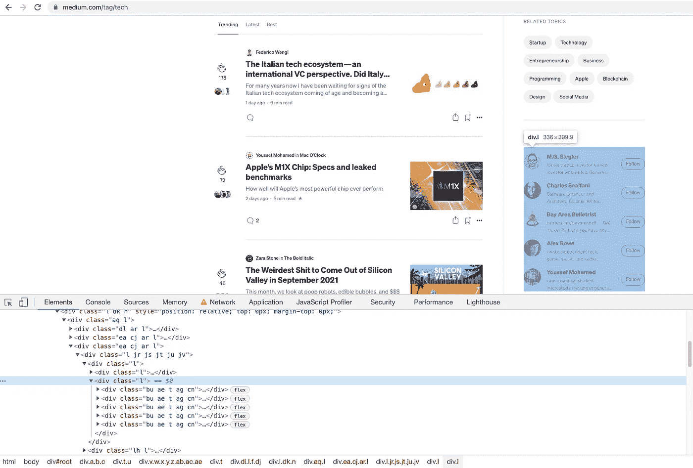

# 用 Node.js 和 ScrapingAnt 在 5 分钟内学会网页抓取

> 原文：<https://javascript.plainenglish.io/web-scraping-with-nodejs-and-javascript-10e6b4268be1?source=collection_archive---------2----------------------->

## [网页抓取](https://rakiabensassi.medium.com/list/software-engineering-7a179a23ebfd)

## 如何使用 JavaScript 收集数据并自动化您的任务


Photo by [cottonbro](https://www.pexels.com/@cottonbro?utm_content=attributionCopyText&utm_medium=referral&utm_source=pexels) from [Pexels](https://www.pexels.com/photo/man-people-woman-laptop-6803522/?utm_content=attributionCopyText&utm_medium=referral&utm_source=pexels)

JavaScript 是一种流行且广泛使用的语言，我们可以利用它的运行时 Node.js 作为工具来抓取 web、收集数据、自动化我们的生活或发展业务。

在今天的帖子中，我将分解如何使用 JavaScript 有效地收集公共数据，作为一个案例研究，我将执行提取该平台上顶级作家(或博客)列表及其追随者数量的场景。这种做法有很多好处，比如选择影响者营销作为数字营销策略。

> “数据抓取或网页抓取是从网站或应用程序(人类可读的输出)中提取信息并将其保存在电子表格或本地文件中的一种形式。这种技术并不违法，但其目的和应用方式可能违法。”
> — [什么是数据抓取？](https://betterprogramming.pub/data-scraping-tools-7cb76eeab89e)

读完这篇文章后，你将对如何创建和运行 Node.js 项目(如果你还没有的话)以及如何使用库来抓取 web 有一个功能性的了解。

所以，事不宜迟，我们开始吧。

# 为什么要刮擦？

作为一个网页抓取者，你正在执行具有挑战性的任务。例如，您需要确保您的请求不会被目标站点阻止。

但是好消息是你不需要自己做这些。市场上有一些工具可以提供必要的基础设施和技术来实现你的努力。通过使用网页抓取工具，您将受益于以下功能:

*   绕过验证码
*   自动 IP 轮换，防止 IP 被封锁。
*   JavaScript 渲染
*   将提取的数据导出到 JSON、文本文件、HTML、CSV 等。


[ScrapingAnt](https://scrapingant.com/?ref=rakiabensassi)

[ScrapingAnt](https://scrapingant.com/?ref=rakiabensassi) 是一种刮削工具，具有以下优点:

*   一个 web 抓取 API，运行数百个 Chrome 浏览器集群，以执行 Web 抓取任务。
*   代理多样性和轮换。
*   支持 Python，JavaScript 和**任何可以进行 API 调用的编程语言**。
*   **10.000 API 积分的免费计划**，包括:JavaScript 渲染、自定义 cookies、输出预处理、基本电子邮件支持和文档。

空谈不值钱。让我们创建一些代码，看看如何用一个简单的脚本实现我们的目标。如果你喜欢看，这里有一个视频:

# 步骤 1:创建 Node.js 项目

要创建一个包含`package.json`文件的新 [Node.js](https://levelup.gitconnected.com/7-nodejs-vulnerabilities-149094e441c2) 项目，您需要创建一个新文件夹，转到该文件夹，然后运行`npm init`并根据需要给出一些细节，如下面的截图所示:

```
mkdir web-scrappingcd web-scrappingnpm init
```



The output of running the “npm init” command to create a new Node.js project (image by author)

# 步骤 2:安装并调用所需的库

然后安装我们的应用程序所需的两个依赖项:

```
npm install @scrapingant/scrapingant-client
npm install cheerio
```

## 报废客户

我们不使用 HTTP 客户端来查询目标网站或 web 应用程序，而是使用`scrapingant-client`库，因为它已经在其实现中利用了 HTTP 客户端，正如您在`ScrapingAntClient`类中看到的:

The [ScrapingAnt](https://scrapingant.com/?ref=rakiabensassi) client class

## 再见

在向我们的目标网页发送请求并收到响应之后，我们需要解析 DOM 以便提取我们想要的数据。

`cheerio`是一个高效的轻量级库，它公开了一个 API 来解析和操作 DOM。它允许您在服务器端使用丰富而强大的 jQuery API:

Example of using cheerio to parse the DOM

## @类型/节点

安装`@types/node`以便能够使用`require()`方法导入依赖项:

```
npm install --save-dev @types/node
```

转到您的项目入口点——它是项目根文件夹下的`index.js`文件，如果您没有给它起不同的名字的话(在我的项目中，我把它命名为`scraper.js`)——并调用其中所需的库:

```
const client  = require('@scrapingant/scrapingant-client');
const cheerio = require('cheerio');
```

# 第三步:选择你需要刮的目标

我选择了这个网页`https://medium.com/tag/**${tag}**`,并想收集顶级作家的名单以及他们的追随者数量。

在将参数`**${tag}**`替换为适当的标签名称后，例如 *leadership* 、 *startup* 、 *technology* 、*creative*等等，我们将得到正确的列表，如下图所示，右侧显示了标签“ *tech* 的顶级作者列表:



Medium Top Writers web page (image by author)

# 步骤 4:设置 URL 并检查响应

在我的 Node JS 项目的根文件夹下，我有一个包含以下代码的脚本`scraper.js`——在亲自尝试之前，您只需要将您的 [ScrapingAnt](https://scrapingant.com/?ref=rakiabensassi) API 键设置为常量`SCRAPINT_ANT_KEY`的值:

Node.JS Web scraper with [ScrapingAnt](https://scrapingant.com/?ref=rakiabensassi) for Medium Top Writers

# 第五步:运行它

现在，您所要做的就是启动您的终端，并在命令提示符下调用 node 脚本:

```
node scraper.js
```

根据您在脚本中设置的标签数量，以及每个标签的顶级作者列表的长度，您会注意到返回结果需要一些时间。请耐心等待，然后您将在控制台上获得类似以下摘录的 JSON 数据:


An extract of the JSON list of Top Writers (image by author)

感谢阅读！希望你能对一些商业想法或如何自动化一些令人生畏的任务获得一些见解或灵感。

# 想要更多吗？

我为一群聪明、好奇的🧠人写关于工程、技术和领导力的文章💡。 [**加入我的免费电子邮件简讯**](https://rakiabensassi.substack.com/) 或者在这里注册 Medium [如果你还没有做的话🤗](https://rakiabensassi.medium.com/membership)

[](https://entrepreneurshandbook.co/how-to-make-it-big-in-data-industry-44893d7381fe) [## 危机时刻奥列格和安德鲁如何在数据行业大展拳脚

### 每片乌云都有一线光明。只要有点创造力，你就可以将危机转化为机遇。

entrepreneurshandbook.co](https://entrepreneurshandbook.co/how-to-make-it-big-in-data-industry-44893d7381fe) [](https://levelup.gitconnected.com/how-to-become-a-legitimate-system-architect-3ccf686e9712) [## 如何从一个代码猴子变成一个合法的系统架构师

### 如何进入软件工程师的下一阶段的 6 个技巧

levelup.gitconnected.com](https://levelup.gitconnected.com/how-to-become-a-legitimate-system-architect-3ccf686e9712) 

## 进一步阅读

[](/automate-web-scraping-with-an-easy-to-use-browser-extension-cb6073f1e61d) [## 使用易于使用的浏览器扩展自动抓取网页

### 如何使用 Listly，一个初学者友好的无代码工具，轻松实现 web 抓取过程的自动化。

javascript.plainenglish.io](/automate-web-scraping-with-an-easy-to-use-browser-extension-cb6073f1e61d) 

*更多内容看* [***说白了就是 io***](https://plainenglish.io/) *。报名参加我们的* [***免费周报***](http://newsletter.plainenglish.io/) *。关注我们关于* [***推特***](https://twitter.com/inPlainEngHQ) ， [***领英***](https://www.linkedin.com/company/inplainenglish/) *，*[***YouTube***](https://www.youtube.com/channel/UCtipWUghju290NWcn8jhyAw)*[***不和***](https://discord.gg/GtDtUAvyhW) *。**