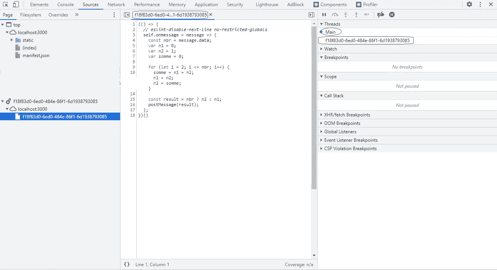

# 如何在 React 中使用 Web Workers

> 原文：<https://javascript.plainenglish.io/web-worker-in-react-9b2efafe309c?source=collection_archive---------0----------------------->

## 什么是 web workers，为什么使用它们，如何在 React 中实现它们？


JavaScript 是单线程的。这是什么意思，什么是线程？

线程是一个执行上下文，它是 CPU 执行指令流所需的所有信息。所以通常情况下，JavaScript 应用程序包含在一个线程中。

# 缺点？

想象一下，在您的 web 应用程序中，您需要处理一个很长的任务。DOM，也就是通用语言中的网页，将会冻结，因为解释器需要在转到下一个任务之前完成这个任务。它不能同时处理两个任务，所以当它完成长任务时，只有那时它才能更新 DOM 并起死回生。为了避免这种情况，解决方案是使用 web worker。

# 什么是网络工作者？

web worker 是在后台独立执行的 JavaScript 脚本。网络工作者通常能够利用多个 CPU。

在这种情况下，我们将看到如何在 React 中使用 web worker。

设置:

*   安装 Node.js，让我们可以访问 npm 和 npx:[https://nodejs.org/en/download/](https://nodejs.org/en/download/)
*   通过在终端中运行生成一个 React 项目:

```
**npx create-react-app replace-me-with-the-name-of-the-app — template typescript**
```

如果该命令不起作用，请验证节点和 npm 的版本。您的计算机上需要有节点> = 10.16 和 npm >= 5.6。

让我们玩得开心。

为了能够与 worker 通信，我们将使用 onMessage 和 postMessage()。

现在我们要编写将由 web worker 执行的 Fibonacci 函数。

```
//fibo.worker.js
// eslint-disable-next-line import/no-anonymous-default-export
export default () => {
  // eslint-disable-next-line no-restricted-globals
  self.onmessage = (message) => {
    const nbr = message.data;
    var n1 = 0;
    var n2 = 1;
    var somme = 0;

    for (let i = 2; i <= nbr; i++) {
      somme = n1 + n2;

      n1 = n2;

      n2 = somme;
    }

    const result = nbr ? n2 : n1;

    postMessage(result);
  };
};
```

为了让 linter 开心，我们需要添加一些线。

```
// eslint-disable-next-line import/no-anonymous-default-export

// eslint-disable-next-line no-restricted-globals
```

现在我们要编写我们的 Workerbuilder，因为在构建 WebPack 之后，所有东西都将被捆绑成 f18 f83d 0–6ed 0–484 e-86 f1–6d 1938793085。例如，在这种情况下。我们将失去与文件的链接。

```
//woker-builder.js
export default class WorkerBuilder extends Worker {
  constructor(worker) {
    const code = worker.toString();
    const blob = new Blob([`(${code})()`]);
    return new Worker(URL.createObjectURL(blob));
  }
}
```

现在我们有我们的工人和工人建设者。让我们使用它们。

```
import WorkerBuilder from './worker/woker-builder';
import Worker from './worker/fibo.worker'; instance = new WorkerBuilder(Worker);
```

我们将添加一个按钮，以便能够为工作者触发消息，并且我们将添加一个侦听器来显示来自工作者的回复。

```
componentDidMount() {
    instance.onmessage = (message) => {
      if (message) {
        console.log("Message from worker", message.data);
      }
    };
  }<button onClick   ​={() => instance.postMessage(5)}>
  Send Message
</button>
```

**App.tsx** 应该是这样的:

```
import React, { Component } from "react";
import logo from "./logo.svg";
import "./App.css";
import WorkerBuilder from "./worker/woker-builder";
import FiboWorker from "./worker/fibo.worker"; const instance = new WorkerBuilder(FiboWorker);class App extends Component {
  componentDidMount() {
    instance.onmessage = (message) => {
      if (message) {
        console.log("Message from worker", message.data);
      }
    };
  }
 render() {
    return (
      <div className="App">
        <header className="App-header">
          
          <p>
            Web worker in React
          </p>
          <button
            onClick={() => {
              instance.postMessage(5);
            }}
          >Send Message</button>
        </header>
      </div>
    );
  }
} export default App;
```


当我们点击发送消息时，控制台应该是这样的。


如果我们深入到控制台，在 sources 选项卡中，我们可以看到右上角有两个线程—主线程和名为 f18f 83d 0–6ed 0–484 e-86 f1–6d 1938793085 的 fibo 工作线程。



我希望你能从这篇文章中学到一些东西，谢谢你的阅读。