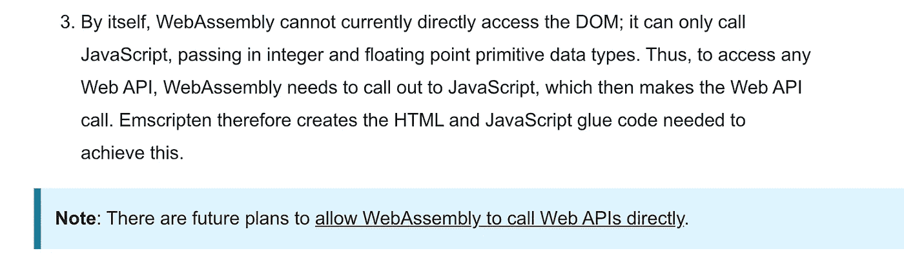

# WebAssembly 在 Web 上会有什么变化？

> 原文：<https://javascript.plainenglish.io/webassembly-javascript-b3eefb1f0228?source=collection_archive---------9----------------------->

## 机会、用例&这对我们热爱的 JavaScript 意味着什么

Photo by [Damir Spanic](https://unsplash.com/@spanic?utm_source=medium&utm_medium=referral) on [Unsplash](https://unsplash.com/?utm_source=medium&utm_medium=referral), edited by the author

WebAssembly 在这里。并且它在实践中是有用的。像 Figma 这样的公司已经在生产中应用它了。

但是这对 JavaScript 意味着什么呢？WebAssembly 目前能做什么？又有哪些大的机会？

你可以在这里找到答案，玩得开心！

# 流行框架的巨大机遇

当一项新技术出现时，它通常会引起对旧技术的存在性恐惧。但是不要担心——web assembly 肯定不会取代我们心爱的框架，比如 React(是的，它是一个库，但你明白这一点)、Vue 和 Angular。事实是，他们可以从 WebAssembly 中受益匪浅。

让我们以 React.js 为例来看看这一点。当想到与 WebAssembly 结合的 React 时，一件事浮现在脑海中:用 WebAssembly 编写组件。也许有一天。我要提前说一声——不，可能不会是这样。以下是更有可能发生的情况。

在 React 中，有一种东西我们称之为**和解**。Angular 和 Vue 也有类似的地方。底层算法确保 DOM 中的元素可靠地更新，并且只在需要时更新。我们可以用一个点击事件来改变状态，受影响的部分被更新——这是所有框架都熟悉的机制。

Source: the author

下面是它的简化工作方式。当呈现页面时，React.js 创建一个元素树。这棵树被放在 DOM 中——用户看到了一些东西。如果状态或道具发生变化，它们会被再次渲染，从而创建一个新的树。现在，我们有两棵树。

移除 DOM 中的元素并重新呈现它们非常耗时。因此，React.js 试图尽可能精确地找出这两棵树的不同之处。通过这种方式，可以在大树中更新单个元素——因为，毕竟，替换一整棵树是很紧张的。

你肯定会问自己，这些比较是否也非常昂贵？是的，他们是。如果该算法不使用启发式(表面简化)，它将具有 O(n)的大 O 复杂度。

这意味着，对于 1000 个元素，要进行 10 亿次比较。

感谢上帝，算法没有以这种方式实现——但仍然有大量的工作要做。WebAssembly 开始发挥作用了。

WebAssembly 为框架带来了巨大的潜在机会。通过外包复杂的算法获得更好的性能——在使用框架时，我们不会注意到很大的不同。巨大的计算工作量可以通过 WebAssembly 更快地完成。

通过 JavaScript，字节码可以在正确的地方流动。因此，框架代码的 JS 样板文件可以保留。单个任务交给 WebAssembly。

用 C ++或 C 写组件——可能没人想这么做。
如果只外包计算密集型任务，我们可以继续用 JavaScript 编写组件。

## 普通 JS 与框架的新视角

使用框架非常有趣。尽管这基本上是过度杀戮。是的，DOM 操作的抽象和大量的代码包绝对是一个性能限制。因此，在许多情况下，只依赖普通的 JS 是有意义的——特别是对于简单的应用程序。

有了框架引擎中的 WebAssembly，可能会有显著的性能提升。由于字节码只是内置的，所以在用框架编写代码时，一切都可能保持不变。

与 WebAssembly 一样，流传输相应字节码的可能性也可以为初始加载和执行带来性能提升。

# 前端如此，后端也是如此

Node 已经相当快了。然而，一些模块被写成所谓的**本地模块**。原生模块通常用 C++和 C 编写。这两种语言是性能的同义词，这就是为什么它们被用于在 Node.js 中实现计算密集型的东西。

但是写一个原生模块并不好玩。任何看过 Node.js 文档的人都知道这是一项复杂的工作。
WebAssembly 可能会有所帮助。这些模块的代码可以被编译成字节码，从而直接执行。

目前，WebAssembly 只缺乏访问系统的能力。在 Node.js 世界中，文件系统和对套接字和 HTTP 的访问是有意义的。

后端 WebAssembly 的好处是我们不必太担心兼容性。虽然在不同的浏览器中处理 WASM 仍然有所不同，但是我们可以从 Node.js 开始

如果你想在 Node.js 中试用 WebAssembly，可以在这里找到教程[。](https://medium.com/javascript-in-plain-english/assemblyscript-4c68a3c3ecf7)

# 保持简单愚蠢

是的，JavaScript 是一个迷因。不幸的是，网络开发者有时会被取笑。JavaScript 甚至不是一种像样的编程语言。对于曾经用 C++、Rust 或 Java 编写过 *Hello World* 的人来说，取笑网络语言似乎是礼貌的一部分。

即使 JavaScript 没有其他语言的复杂，但它表明了一件事——简单有时是最好的。

对于大多数 web 应用程序，JavaScript 已经足够了。复杂对象、函数重载和指针通常是多余的。

与其他编程语言相比，我们通常更擅长使用 JavaScript。一旦从 JS 切换到 C++或 Java 之类的语言，您会立即注意到您有更多的东西要写。

Web 汇编代码最终是用不太高级的语言编写的。C++，C 还有 Rust 和 Golang 都比较流行。在使用我用 C 代码生成的 WebAssembly 时，我注意到一件事:在 95%的情况下，使用 WebAssembly 不会给应用程序带来性能优势。

对于下拉菜单、表单、后端请求和 JavaScript 的许多其他用例，web 组装是不值得的。

相反，设置和编写代码要复杂得多。WebAssembly 已经被用于渲染 2D 画布或 3D 动画。例如，Figma 依赖于 WebAssembly。然而，对于互联网上的大多数网站来说，这完全是矫枉过正。

# 你无法越过 JavaScript——至少现在还不行

WebAssembly 非常强大，但是有一点它还不能做到:独立访问 DOM。JavaScript 仍然必须用于此。

我们还需要一个 JavaScript API 来运行 WebAssembly。

因此，直接访问 DOM 是不可能的，只能间接访问。我们可以从 JavaScript 调用 web 组装方法，反之亦然。

缺少 DOM 访问让许多对 WebAssembly 感兴趣的人感到失望。但是有计划可以通过 WASM 直接访问网络应用编程接口。

Source: [developer.mozilla.org](https://developer.mozilla.org/en-US/docs/WebAssembly/Concepts)

本质上，WebAssembly 旨在接管 JavaScript 的大型计算任务。然而，可能的 DOM 访问会发生很大的变化。

# 总结

WebAssembly 已经存在。但是它还没有取代 JavaScript。

当然，它将在某些地方取代 JS 代码，但是如果没有 JS，它可能永远不会完全工作。在我看来，这不是坏消息。

因为 JavaScript 通常正是我们在网络上需要的。在 95%的网站上，网页组装并不是一个可行的选择。到目前为止，它主要用于 2D 和 3D 应用。

用 Node.js 或 React、Vue 和 Angular 等框架编写 JS 代码可能仍将是标准。唯一的区别可能是，WebAssembly 随后会在幕后接管计算密集型算法。

我个人对此感到非常兴奋。复杂应用程序在浏览器中可用的趋势可能会更加强劲。

感谢您的阅读——如果您想试用 WebAssembly，请查看:

 [## Testosterones 上的 TypeScript 什么是 AssemblyScript？

### 轻松开始使用 WebAssembly

medium.com](https://medium.com/javascript-in-plain-english/assemblyscript-4c68a3c3ecf7) 

## [加入我的免费简讯，了解最新消息](http://eepurl.com/hacY0v)