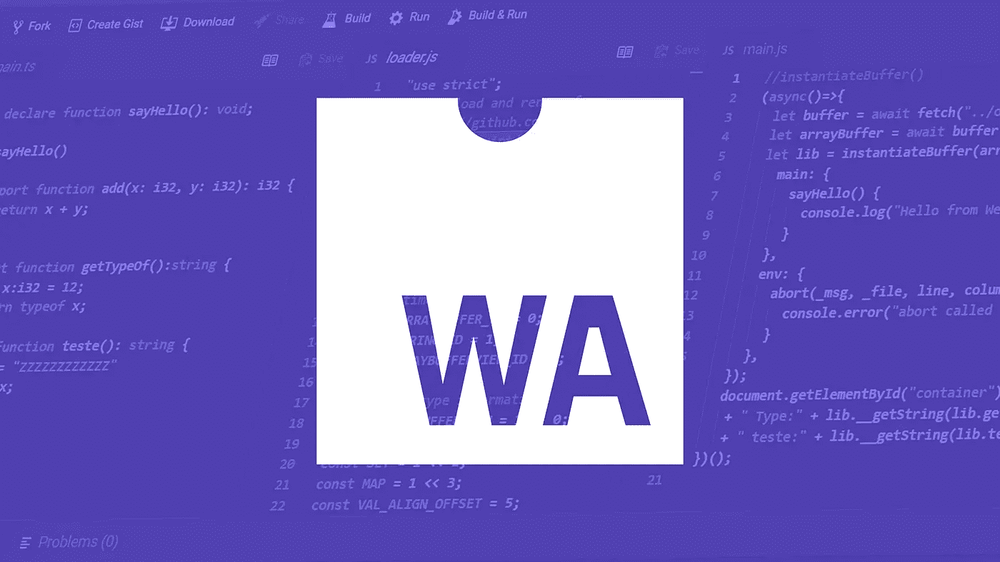
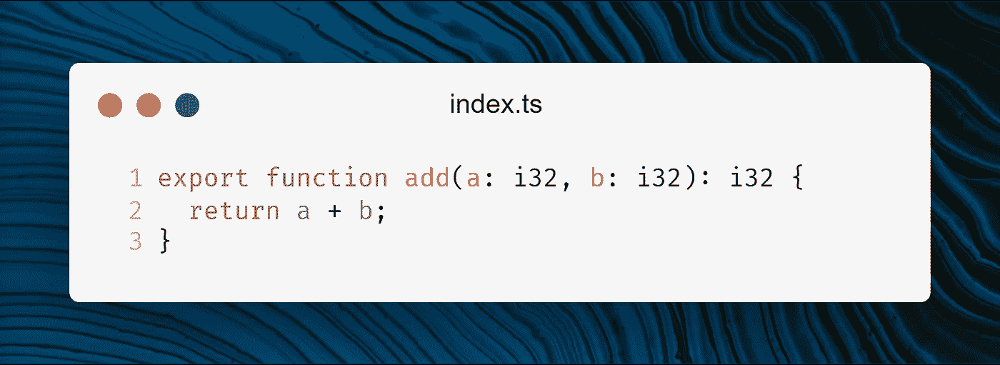
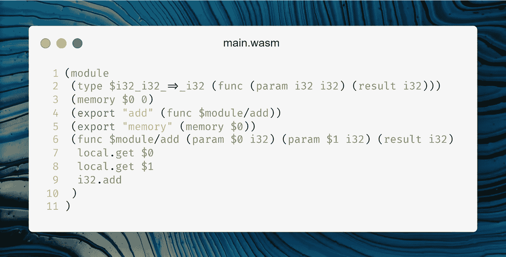
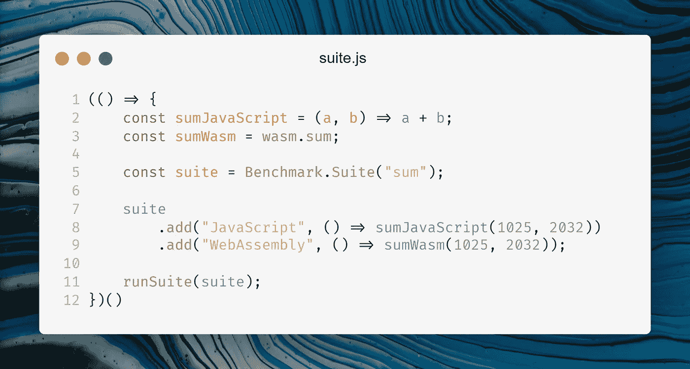
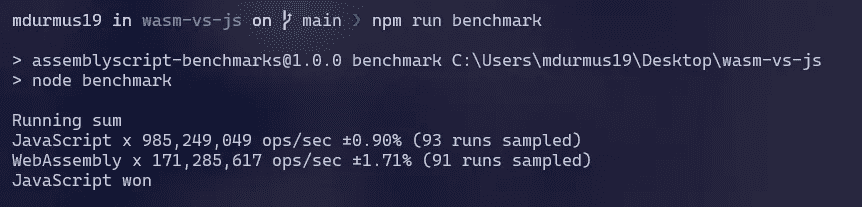
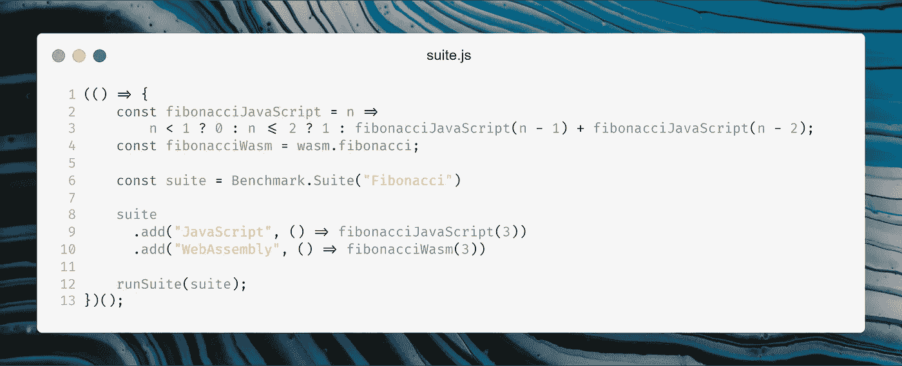
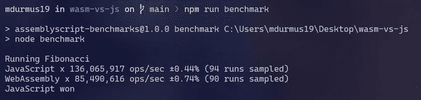
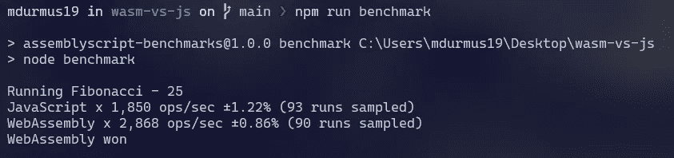

# 网络组装与 JavaScript:WASM 能在基准测试中击败 JavaScript 吗？

> 原文：<https://javascript.plainenglish.io/webassembly-vs-javascript-can-wasm-beat-javascript-in-benchmark-cd7c30faaf7a?source=collection_archive---------2----------------------->

## 许多人认为 WASM 速度极快，最终会淘汰 JavaScript。但是，有几点需要考虑。

WASM is an Assembly-like low-level language developed for the web.

很有可能您至少听说过 WebAssembly，因此您来到了这里。根据 W3C 的说法，除了 HTML、CSS 和 JavaScript，网络汇编是允许代码在浏览器中运行的第四种网络语言。对于 web 开发来说，这是一个非常重大的事件，因为自 1996 年(CSS)以来，没有任何语言被添加到这个列表中。因此，在这一点上，提出了 3 个重要问题。

*   什么是网络组装，它是如何工作的？
*   它真的像它的介绍所说的那样照明很快吗？
*   它会取代 JavaScript 吗？

让我们从第一个问题开始。

# 什么是网络组装？

WebAssembly 是一种低级的编译语言，可以在所有主要的浏览器上运行。这是相当新的，所以它的影响在我们每天使用的网站上不是很明显。

网络组装最关心的是速度。如您所知，JavaScript 是一种使用 JIT(即时编译器)在浏览器上运行的解释语言。这种方法的主要缺点是，在运行时编译代码之前，计算机无法理解代码。这显著减慢了执行过程。

此时，WebAssembly 非常方便，因为与 JavaScript 不同，WebAssembly 一直被编译成二进制代码，因此，它的运行速度非常快，是 JavaScript 无法比拟的。但是故事还没有结束。令人惊讶的是，出于速度的考虑，仍然有一些地方应该让你更喜欢 JavaScript 而不是 WebAssembly。

WebAssembly 带来的另一个创新是在 web 上提供诸如 C、C++、Rust 或 TypeScript 之类的语言。因为 WebAssembly 是非常低级的，所以很难编码。幸运的是，有编译器可以将我提到的语言编译成 WebAssembly。所以，你可以在网上用你最喜欢的语言来开发网络应用程序。

这是一个用 TypeScript 编写的求和函数。因为我们将把这个函数编译成 WebAssembly，所以类型定义应该是相应的(AssemblyScript)。

An AssemblyScript function to add two numbers.

正如您所看到的，它很容易被人理解和阅读，因为 TypeScript 是一种高级语言。现在我们将把这个 TypeScript 函数转换成 WebAssembly。

对于大多数开发人员来说，这个 WebAssembly 代码看起来很复杂，尽管它的逻辑很简单，加了两个数字。这就是为什么我们不直接编写 WebAssembly，而是使用其他语言的原因。

# 它真的像介绍中所说的那样照明快吗？

简单的答案是肯定的。与 JavaScript 相比，它速度非常快。因为，与 JavaScript 不同，当浏览器运行它时，不需要编译它，因为它是在构建时编译的。但是让我们在 JavaScript 和 WebAssembly 上做一个基准测试，看看有什么有趣的结果。

首先，我将在 JavaScript 和 WebAssembly 中创建一个 sum 函数。然后我会测试一下，看哪一个更快。为了测试它，我将使用`Benchmark`库。

我创建了一个基准测试套件来测试两个数的相加，如下所示。

结果非常有趣，出乎意料。因为不知何故 JavaScript 比我们钟爱的 WebAssembly 快了将近 6 倍。

In sum test, JavaScript performed way better than WebAssembly.

让我们创建另一个斐波那契函数，看看这是否依赖于我们使用的函数。作为参数，我将使用 3。

Fibonacci sequence until 3 using WASM and JS.

结果和上一个案例一样。JavaScript 又一次击败了 WebAssembly。然而，在这次运行中，差异仅为 1.5 倍。我们使计算变得复杂，差异变小了。也许，我们把计算方式变得复杂了，以至于我们看不到不同的结果。

然后，让我们用非常复杂的计算进行基准测试，看看结果是否相同。我不会创建一个更复杂的函数，而是会再次使用`fibonacci`并让参数传递得更大。因为斐波纳契数列中的参数越大，计算时间就越长。所以，我选择参数为 25。

现在，我们终于看到了 WebAssembly 超过 JavaScript 的速度。当我们使计算变得更复杂时，它赢得了基准测试。但是为什么 WebAssembly 从一开始就没有赢得基准测试呢？嗯，这是因为在使用 WebAssembly 模块之前，应该先加载它们，但 JavaScript 不是这样。因此，当 JavaScript 开始执行时，WASM 模块首先被加载，然后被执行。如果计算不复杂，那么 JavaScript 可以很好地处理它，但是如果复杂，那么加载 WASM 模块和利用它的速度会更快。

# 它会取代 JavaScript 吗？

取代 JavaScript 是一件巨大的事情，即使几十年也不可能完成，因为整个*万维网*都依赖于它。此外，它背后有一个庞大的社区在不断努力改进它。是的，与其他语言相比，JavaScript 确实有一些缺点，如`null`和`==`，但这些不能成为取代所有技术的理由。

因此，WebAssembly 不会取代 JavaScript，但这并不意味着 WASM 在未来将不复存在。相反，它的使用会越来越多。因为 WASM 为网络提供了大量计算的能力，如图像处理或游戏。使用 WASM，人们可以构建一个运行良好的网页版 Photoshop，或者创建一个可以在浏览器上以 60 FPS 甚至更高的速度玩的 3D 游戏。

然而，JavaScript 总是会把 WASM 粘在浏览器上，处理除繁重处理之外的任何事情。所以，你可以继续学习 JavaScript，而不用担心它的未来。

如果想尝试 WebAssembly，可以使用 [WebAssembly Studio](https://webassembly.studio/) 在线体验。如需进一步了解，您可以访问 WebAssembly 的[官方网站。](https://webassembly.org/)

Subscribe to get your **free *subscriber-exclusive*** story.

谢谢你们的阅读。在这个故事中，我们从性能和概率方面比较了 WASM 和 JS。如果你有什么问题，请留下评论，如果你喜欢，一定要鼓掌。下一个故事再见。

***延伸阅读***

 [## JetBrains 的新 IDE: Fleet 上的真实体验

### JetBrains 试图通过 Fleet 保持与 VS 代码的竞争。它会成功还是会被遗忘在…

medium.com](https://medium.com/fractions/real-life-experience-on-jetbrains-new-ide-fleet-5dde41b90a75)  [## 3 个 Visual Studio 代码提示来改进您的工作流程

### VS 代码是一个万能的工具，只要你知道如何使用它。

medium.com](https://medium.com/fractions/3-visual-studio-code-tips-to-boost-your-workflow-b107ec573d75)  [## 你知道 HTML 认为查克·诺里斯是一种颜色吗？

### 很奇怪，不是吗？原因如下

better 编程. pub](https://betterprogramming.pub/did-you-know-html-thinks-chuck-norris-is-a-color-9f67edf4c34) 

*更多内容请看*[***plain English . io***](http://plainenglish.io/)