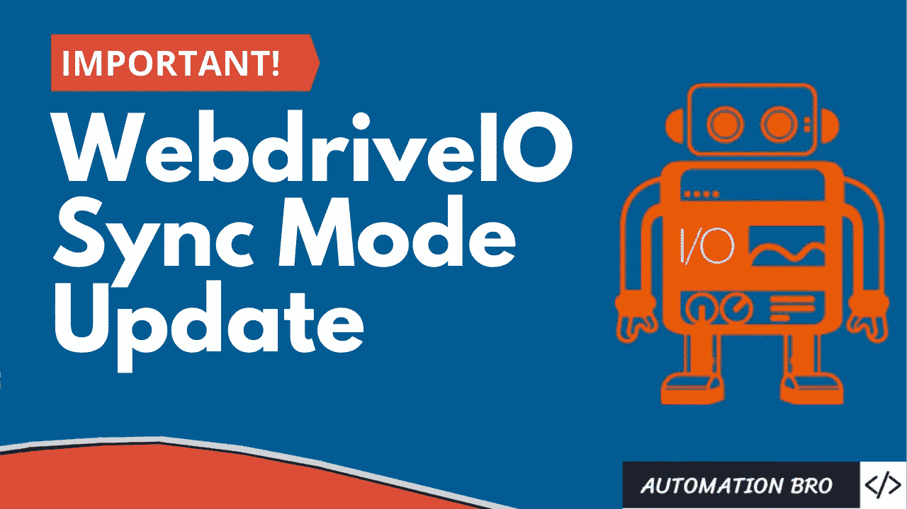
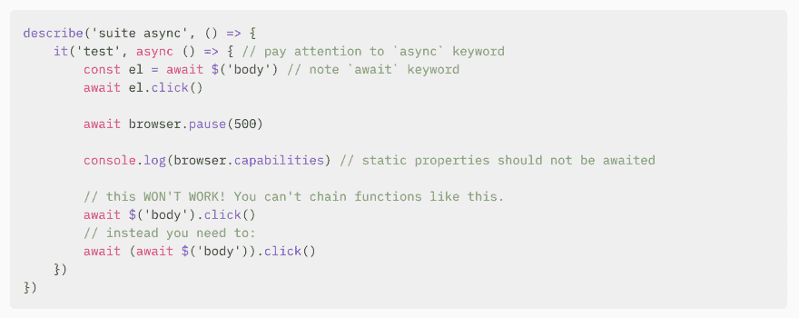
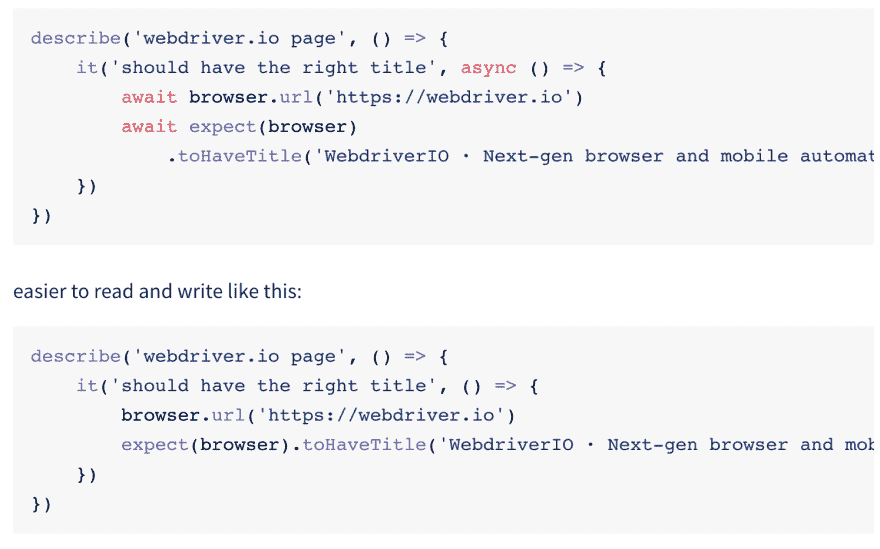
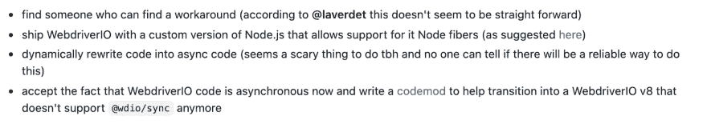
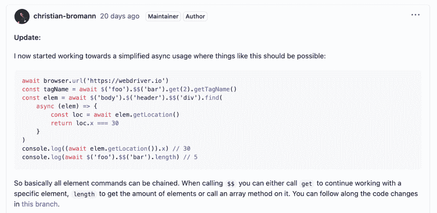

# 网络驱动重要同步模式更新

> 原文：<https://javascript.plainenglish.io/webdriverio-important-sync-mode-updates-90f59762949d?source=collection_archive---------6----------------------->

[https://youtu.be/Jk6giesyECA](https://youtu.be/Jk6giesyECA)

在本帖中，我们将回顾一些与 WebdriverIO 同步模式相关的重要更新。我们还将介绍 WebdriverIO v8 中可能出现的一些变化。但是，在我们开始讨论 WebdriverIO 同步模式之前，理解 WebdriverIO 异步模式是如何工作的很重要。

# WebdriverIO 异步模式

默认情况下，WebdriverIO 使用异步模式与浏览器或移动设备进行交互。它运行一组异步命令，这些命令通过 JavaScript 中的`async/await`来处理。然而，使用`async/await`有一些缺点

*   那些不熟悉 JavaScript 或异步编程的人可能会觉得 async/await 令人困惑
*   async/await 相当冗长，因为它用于大多数 WebdriverIO 命令

让我们看看下面的示例代码——

这里有几件事需要注意——

*   我们用 async 关键字启动“it”块，然后所有命令都使用 await 关键字，例如在查找元素或单击元素或任何其他 WebdriverIO 命令时。
*   我们也不能将这些函数相互链接，因为那样也会引发错误。相反，需要等待每个单独的命令。

# WebdriverIO 同步模式

所以为了解决上面的一些问题，WebdriverIO 提出了同步模式，并创建了一个 [@wdio/sync 插件](https://www.npmjs.com/package/@wdio/sync)，它允许你通过 [node-fibers](https://www.npmjs.com/package/fibers) 同步运行命令。这个插件有以下一些优点

*   它从代码中去掉了所有的 async/await，因为现在命令是同步的
*   测试看起来更容易阅读和理解(初学者友好)

让我们看看下面的示例代码——

在上面简化的例子中，您会注意到第二个块中不再有 async/await，这对于阅读和理解更加用户友好。

# 为什么 WebdriverIO 停止同步模式？

WebdriverIO 在其网站上发布了一个警告，提到自 2021 年 4 月 14 日起将不再支持同步模式，因为 Chromium 中的一些突破性[变化](https://chromium-review.googlesource.com/c/v8/v8/+/2537690)将不允许使用节点光纤。因此，从 Node v16 开始，他们将正式停止对 WebdriverIO 同步模式的支持。

也就是说，有一个活跃的 [GitHub 线程](https://github.com/webdriverio/webdriverio/discussions/6702)正在讨论下面列出的可能选项

指导委员会最终选择的方案是最后一个接受 WebdriverIO 将异步向前发展的方案。

# WebdriverIO v8 中的代码是什么样子的？

你将继续使用`async/await`,然而，一个可能发生的主要变化是你将能够链接 WebdriverIO 命令，这在 WebdriverIO v7 中是不可能的。这样做的好处是，它会使代码看起来更整洁，更简洁。

**注意:**在撰写本文时，它仍在开发中，因此可能会有一些更新或更改。您可以跟随[线索](https://github.com/webdriverio/webdriverio/discussions/6702)获取最新信息。

# 您仍然可以使用同步模式

对于那些仍然想使用同步模式的人来说，现在仍然可以这样做。以下是您需要做的事情

检查 package.json 以查看是否安装了 [@wdio/sync](https://www.npmjs.com/package/@wdio/sync) 包

*   如果安装了，您可以像往常一样继续使用同步模式
*   如果没有安装，那么您可以安装该软件包
*   `npm i @wdio/sync`

**注意:** WebdriverIO 将继续支持同步模式，直到他们决定放弃对节点 v15 的支持。从节点 v16 开始，不再支持同步模式。

# 我对所有这些变化的看法

我知道这将是一个相当大的变化，因为很多人喜欢同步版的 WebdriverIO，因为它很简单，就像我一样。但是，我建议您**开始为您的新项目**使用异步模式，以避免将来进行任何类型的迁移。

对于那些已经有同步模式项目的人，你需要使用由 WebdriverIO 团队开发的 codemod 来完成从同步模式到异步模式的迁移。

# WebdriverIO 教程系列

对于那些在 YouTube 上关注我的[web drivero 视频系列](https://www.youtube.com/watch?v=e8goAKb6CC0&list=PL6AdzyjjD5HBbt9amjf3wIVMaobb28ZYN)的人来说，在该系列中，我使用的是同步模式的 WebdriverIO v6。因此，您可以通过安装@wdio/sync 包来继续使用同步模式，或者决定使用异步模式。

我还将在未来制作视频，展示在 WebdriverIO v8 发布后如何正确使用异步模式。

感谢阅读！

*更多内容请看*[*plain English . io*](http://plainenglish.io/)