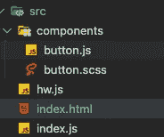
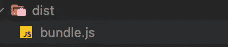
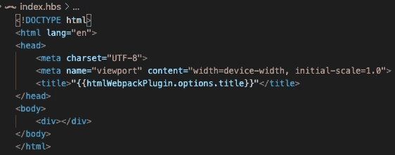
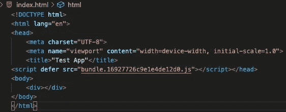

# Webpack 5 简介

> 原文：<https://javascript.plainenglish.io/webpack-5-9256d45f7b83?source=collection_archive---------1----------------------->


## *一步步介绍捆绑 JavaScript 应用的世界。*

**Webpack** 是最著名的捆扎机之一，拥有 *rollup* 。你可能会在不知不觉中使用它，例如，create-react-app 使用 webpack 来捆绑它所有的依赖项。它帮助开发人员专注于开发，并将所有资产、模块和依赖项捆绑成一个包。现在有了 webpack 5，我认为向每个人介绍这个令人敬畏的工具是个好主意。

使用 *webpack* ，你可以创建自己的定制解决方案/样板，这完全取决于你在网上找到的东西。

## 那么为什么是 webpack 呢？

Webpack 是一个用于现代 JavaScript 应用的静态模块捆绑器。当 *webpack* 处理你的应用程序时，它会递归地构建一个包含应用程序中每个模块的依赖图。没有隐藏的依赖关系。最好的部分是，我们只需要包含一个 JS 文件，所有其他的依赖项，内部的和外部的，都打包在这个打包文件中。

简而言之， **webpack** 是一个单一的工具，用于在一个地方管理你所有的代码和资产。

## 我们开始吧

打开一个新文件夹，首先使用“ *npm init* ”启动一个新的 npm 项目。

一旦完成，就该添加**网络包了。由于它是一个开发依赖项，我们在安装时使用-D 选项。**

```
npm i -D webpack webpack-cli
```

我创建了两个单独的 JS 文件 hw.js 和 button.js，index.js 充当应用程序的入口点。你可以在这里找到回购[。](https://github.com/devAbhimanyu/webpack-configs)



第二个任务是创建我们的*配置文件*，它将用于构建和捆绑应用程序。文件命名约定为 **webpack.config.js** 。

```
const path = require('path');module.exports={
 entry:'./src/index.js', the entry point to the application
 //this is where the bundled files will be placed
 output:{
  filename:'bundle.js',
  path:path.resolve(__dirname,'./dist'),
 },
 mode:'none'
}
```

现在在 *package.json* 中添加构建脚本，告诉 webpack 构建我们的应用程序。这将生成包含 bundle.js 文件的 dist 文件夹

```
"build": "webpack",
```



现在我们需要将这个 bundle.js 导入到我们的 HTML 文件中来使用它。

## 装载机

在构建任何前端应用程序时，都有多个依赖项，如 HTML、JS、样式文件(CSS、SASS 或更少)和其他可选资产(图像)。默认情况下， *webpack* 理解 JS，如果我们试图导入默认情况下 webpack 不知道的依赖项，必然会发生构建错误。所以我们需要告诉 webpack 如何导入不同的模块。这就是**装载机**发挥作用的地方。

为了定义*加载器*，需要在 webpack.config 中添加一个新的属性**模块**，在模块对象内部，需要添加**规则**。正是*规则*映射了文件扩展名和加载器。

一个基本规则有一个**测试**属性，它是*正则表达式*(使用文件的扩展名)，而**使用**属性，它是一个数组，您可以在其中定义不同的*加载器*。

```
module:{
 rules:[{
 test:/\.ext$/,
 use:[loader]
 }]
}
```

让我们看一些场景:

**1)加载图像**:由于图像是文件，我们需要安装“*文件加载器*

```
module:{
 rules:[ {
 test:/\.(png|jpg)$/,
 use:['file-loader']
}]}
```

使用 *webpack 5* 时， **publicPath** 属性默认设置为“ **auto** ”但是如果你把图片放在某个 CDN 里会怎么样呢？您可以将公共路径指向该地址。Webpack 会通过将 publicPath 附加到图像上来自动构建 src 路径。

```
module.exports={
 entry:'./src/index.js', the entry point to the application
 //this is where the bundled files will be placed
 output:{
  filename:'bundle.js',
  path:path.resolve(__dirname,'./dist'),
  **publicPath:'https://www.someCdn.com/'**
 },
 mode:'none'
}
```

2) **加载样式**:使用 css 或 sass/scss 添加样式，需要安装所需的加载器。“ *style-loader* ”和“ *css-loader* ”是 sass 和 css 都需要的加载器。对于 sass/scss 文件，需要“ *sass-loader* ”和“ *node-sass* ”(处理 sass 到 CSS 的依赖关系)。

```
{
  test:/\.css$/,
  use:[style-loader', 'css-loader']
},
{
  test:/\.(scss|sass)$/,
  use:[style-loader', 'css-loader','sass-loader']
}
```

加载器是从右向左解析的，所以 scss->css->然后 style-loader 使用 style 标签将它们添加到 html 中。

3) **加载现代 javascript 特性:**JS 遵循的 ECMA 标准，每年更新。但是并不是所有的浏览器都可以更新和支持这些功能。为此，我们需要使用一个叫做 **transpiler** 的东西。transpiler 将最新的代码从例如从 *ES7* 转换成标准 JavaScript。 **Babel** 是 JS transpilers 中最著名的，它提供了一个“ *babel-loader* ”添加到 webpack 配置中。

所需的 devDependencies 是:“@babel/core”、“babel/plugin-proposal-class-properties”、“babel/preset-env”和“babel-loader”，

```
{
 test:/\.js$/,
 exclude:/node_modules/,
 use:{ 
  loader:'babel-loader', 
  options:{
   presets:['@babel/preset-env'],
   plugins:['@babel/plugin-proposal-class-properties']
  }
 }
}
```

**@ babel/plugin-proposal-class-properties:**是一个插件，用来支持 JS 类特性。在 Babel 中，**预置**是一组用于支持特定语言特性的插件。

定义加载器后，模块对象应该看起来像这样:

```
module:{
 rules:[
 {
  test:/\.(png|jpg)$/,
  use:['file-loader']
 },
 {
  test:/\.css$/,
  use:[style-loader', 'css-loader']
 },
 {
  test:/\.(scss|sass)$/,
  use:[style-loader', 'css-loader','sass-loader']
 },
 {
  test:/\.js$/,
  exclude:/node_modules/,
  use:{ 
   loader:'babel-loader', 
   options:{
    presets:['@babel/preset-env'],
    plugins:['@babel/plugin-proposal-class-properties']
   }
  }
 },
{
 test:/\.hbs$/,
 use:['handlebars-loader']
 }
]}
```

**注意:在下面的 html 模板示例中，我将使用* ***手柄*** *。你需要安装"***"作为开发依赖，安装"* ***车把*** *"作为普通依赖。**

## *插件*

*使用加载器，你告诉 webpack 如何加载不同的依赖模块和文件。但是，如果您需要在应用程序的捆绑方式中添加某些行为，该怎么办呢？这就是**插件**发挥作用的地方。*

*插件可以帮助修改包本身的创建方式。例如 [*uglifyJSPlugin*](https://www.npmjs.com/package/uglifyjs-webpack-plugin) 获取 bundle.js 并缩小内容以减小包的大小。*

*插件可以在配置中通过添加**插件**属性来定义，这是一个数组:*

```
*module.exports={
 entry:'./src/index.js',
 output:{
  filename:'bundle.[contenthash].js',
  path:path.resolve(__dirname,'./dist'),
  publicPath:'/dist/'
 },
 mode:'none',
 module:{},
 plugins:[]
}*
```

*让我们看一些场景:*

*1) **缩小:**通过缩小应用，应用的包大小减小，并且消耗更少的互联网流量。为了简化，我们需要使用 webpack 5 中内置的“ *terser-webpack-plugin* ”。*

```
*const **TerserPlugin** =  require('terser-webpack-plugin')plugins:[new TerserPlugin()]*
```

*2) **将 CSS 提取到单独的包中:**通过将 CSS 提取到单独的包中，可以进一步减小 JS 包的大小。“*mini-CSS-extract-plugin*”是一个 webpack 插件，可以帮助我们实现这个目标。*

```
*const **MiniCSSPlugin** = require('mini-css-extract-plugin');plugins:[
 new MiniCSSExtractPlugin({
      filename:'style.css'
 })
]*
```

*使用 extract 插件时，我们需要将规则中的 style-loader 替换为，*minicssplugin . loader***。***

```
*{
 test:/\.css$/,
 use:[MiniCSSPlugin.loader, 'css-loader']
}*
```

***3)在构建之前清理输出文件夹:**可以观察到，每次创建一个新的构建，输出文件夹都会变得更加拥挤。这里唯一的解决方案是在运行构建脚本之前清空文件夹。最好的方法是自动化这个过程，我们有一个插件来帮助做到这一点" *clean-webpack-plugin* "*

```
*const { CleanWebpackPlugin } = require('clean-webpack-plugin');plugins:[
 new CleanWebpackPlugin({
  cleanOnceBeforeBuildPatterns:['**/*',path.join(process.cwd(),
  'extra/**/*')]
 })
]*
```

***注意:***** */*****"指的是 dist 文件夹(输出路径)，如果想清除不同的文件夹与输出路径之外的文件夹，可以使用" path.join(process.cwd()，' extra/* */*)"**

***4)自动化 HTML 模板:**到目前为止，index.html 必须手动生成和更新。Webpack 有一个插件来自动完成这个过程，我们可以使用我们自己的模板或者它生成一个默认的模板。插件是“ **html-webpack-plugin** ”。*

```
*const HtmlWebpackPlugin = require('html-webpack-plugin')plugins:[new HtmlWebpackPlugin(
{
 title:"Test App",
 template:"src/index.hbs", //handlebar file
 filename:'index.html'
})]*
```

*使用*htmlwebpackplugin . options*变量可以访问选项中定义的属性。*

**

*生成的模板:*

**

## *使用浏览器缓存*

*浏览器缓存帮助浏览器缓存应用程序的一部分，使第二次加载更容易、更快。这可以通过为文件名提供一个散列键来实现，使浏览器更容易索引文件。如果一个新的散列被识别，应用程序从开始加载。*

*要添加缓存，可以在定义文件名时使用“*【content hash】*”关键字:*

```
*output:{
 filename:'**bundle.[contenthash].js**',
 path:path.resolve(__dirname,'./dist'),
 publicPath:'/dist/'
},
plugins:[
 new MiniCSSExtractPlugin({
      filename:'**style.[contenthash].css**'
 })
]*
```

## ***为生产和开发环境定义单独的配置***

*根据环境类型(开发或生产)有不同的配置是一个标准，因为需求是不同的。在生产中，我们希望所有的东西都缩小以加快加载速度，但是这样调试就变得很困难。所以 *TerserPlugin* 可以在 dev 模式下从插件列表中删除。*

***注:默认情况下****TerserPlugin****用于* ***生产模式*** *中，一般情况下可以从两个配置中删除。**

*要定义构建类型，可以使用“**模式”**:模式:*开发*或模式:*生产*，*

*对于单独的配置，我们需要在包中定义新的脚本。*

```
***“dev**”: “webpack — config webpack.dev.config.js”,
**“build**”: “webpack — config webpack.prod.config.js”*
```

## ***添加开发服务器***

*在构建任何应用程序时，都会进行多项更改。但是，在每次小的改动之后手动构建应用程序会变得令人头疼。这可以通过添加“*web pack-dev-server*”(-D)来实现。*

*一旦安装了 webpack-dev-server，我们就可以更新配置了。*

```
*devServer:{
 contentBase:path.resolve(__dirname,'./dist'),
 index:'index.html',
 port:8081,
 writeToDisk:true
},*
```

*随着 devServer 的配置，应用程序也提供了一个端口，它将在那里托管，删除需要单独托管它。该脚本也需要为开发更新:*

```
***“dev**”: “webpack serve — config webpack.dev.config.js —-hot”-- hot: is for hot reloading, so that every time a changes is made it would update the application build*
```

*webpack config for dev*

*如果您到达这里，感谢您的阅读。我花了一些时间准备这个。您可以在此处找到最终配置和回购[。](https://github.com/devAbhimanyu/webpack-configs)*

**更多内容请看*[***plain English . io***](http://plainenglish.io/)***。*** *报名参加我们的* [***免费每周简讯这里***](http://newsletter.plainenglish.io/) ***。****