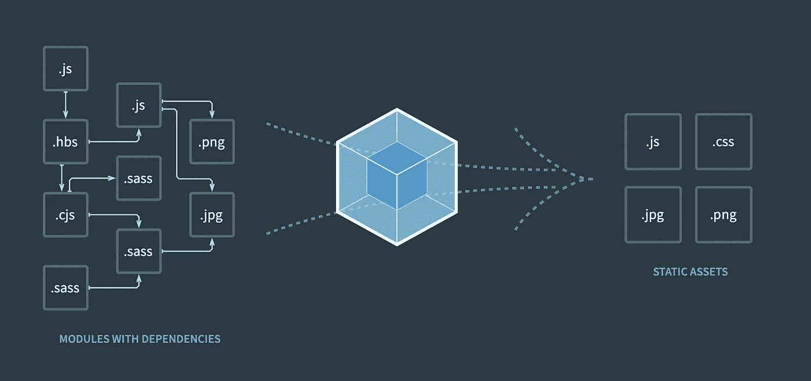
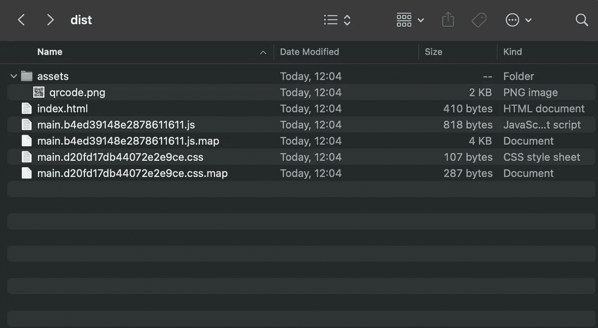

# 2023 年的 web pack:TypeScript+Jest+Sass+ESLint

> 原文：<https://javascript.plainenglish.io/webpack-in-2021-typescript-jest-sass-eslint-7b4640842e27?source=collection_archive---------0----------------------->

## 如何在 2023 年用 Webpack 5 构建你的项目



Webpack 5

几乎每年，我都会遇到需要建立一个新的 javascript 项目的情况。像 Angular 这样的现代框架项目已经为我们配置好了。但是更简单的应用程序或小部件呢，它们应该是框架不可知的？通常，我们需要:一个肝脏重装程序、类型脚本、CSS 预处理器、一个单元测试框架和一个 linter。本指南将介绍如何构建一个生产就绪的初学者工具包，它将满足我们的所有需求。

我将使用:Webpack 5、Jest、SCSS 和 ESLint。您可以滚动到末尾查看 seed 项目链接，或者一步一步地阅读，了解如何从头开始设置它。

***最近更新时间:2023 年 1 月 14 日***

## 初始化项目

首先，我们需要创建一个 npm 项目，但是如果你愿意，你可以用 yarn 代替。

`npm init -y`

重命名项目，如果需要，在`package.json`中提供更多细节。

创建一个 src 文件夹，并在其中创建 **index.ts** 文件。这个文件将是我们应用程序的入口点。

# 网络包

现在我们需要安装构建过程的核心工具— **Webpack 5** (这是写作日的最新版本)。

`npm install webpack webpack-cli --save-dev`

为了更好地准备生产，我们将创建多个 webpack 配置，一个用于开发，另一个用于构建生产工件。

**webpack.common.js** 将包含设置，这将被两个配置使用。

加载器和插件的规则现在是空的，但不会很久。

基于这个文件，我们可以实现两种配置:

和

我用 ESLint 规则添加了第一行，因为在接下来的步骤中，在我们的项目中将禁止使用 require。

# 以打字打的文件

支持 typescript webpack 需要两件事:

1.  tsconfig.json
2.  ts-loader

在我们项目的根创建`tsconfig.json`。

然后安装 typescript 和 ts-loader。这是一个 webpack 加载器，它将向 webpack 解释如何处理 ts 文件。

`npm install --save-dev typescript ts-loader`

安装之后，我们可以将第一个 Webpack 加载器添加到公共配置中。

这时，我们已经可以构建我们的主`index.ts`文件了。但这只是开始。

# 厚颜无耻

为了支持 sass，我们需要做与处理 typescript 几乎相同的事情。

安装 sass 和加载程序:

`npm install --save-dev sass-loader style-loader css-loader node-sass`

另外，我们需要安装 MiniCssExtractPlugin。我们需要这个插件来为 dist 文件夹生成单独的 CSS 文件。

`npm install --save-dev mini-css-extract-plugin`

将 MiniCssExtractPlugin 添加到 Webpack 插件数组:

```
plugins: [
   new MiniCssExtractPlugin({
     // Options similar to the same options in webpackOptions.output
     // both options are optional
     filename: '[name].[contenthash].css',
     chunkFilename: '[id].css'
   }),
]
```

然后将加载程序添加到 webpack.common.js 配置中，紧挨着 ts-loader:

正如您所看到的，对于产品构建，我们使用 MiniCssExtractPlugin 将样式编译为单独的文件。对于开发，我们将把它们直接添加到 HTML 中。

现在您可以创建任何 scss 文件并将其导入 index.ts.
例如，让我们在 src 文件夹中创建 styles.scss。

添加到`index.ts`的下一行:


万岁！我们支持萨斯。如果你需要使用 less，你需要安装 less-loader 而不是 sass 和 sass-loader。

# Webpack 插件

我们需要添加一些有用的插件，对我来说它们是强制性的:

**clean-webpack-plugin** —每次 webpack 进行新构建时清理 dist 文件夹。

**html-webpack-plugin** —从带有脚本和样式标签的模板生成 index.html 文件。

**fork-ts-checker-web pack-plugin**—这个插件允许我们作为一个单独的过程来检查打字稿的打字情况。它将提高构建性能。

**copy-webpack-plugin** —这个插件让我们能够将 assets 文件夹及其内容复制到 dist 文件夹。

使用 npm 安装它们:

`npm install clean-webpack-plugin copy-webpack-plugin fork-ts-checker-webpack-plugin html-webpack-plugin --save-dev`

并将它们添加到 Webpack 公共配置:

# 玩笑

我惊讶于添加这个框架来为我们的项目进行单元测试是如此的容易。

您需要安装它:

`npm install --save-dev jest ts-jest @types/jest`

又跑:
`npx ts-jest config:init`

它会生成一个简单的`jest.config.js file`，但是足够开始测试了！

```
module.exports = {
 preset: 'ts-jest',
 testEnvironment: 'node',
};
```

创建一个 spec 文件夹，并在其中创建任何*.spec.ts 文件。Jest 会找到它并运行单元测试。

要启动测试，您需要运行一个小命令:

`npx jest`

将其添加到`package.json`文件中的 npm 脚本:
`“test”: “npx jest”`

您的测试应该在 spec 文件夹中，名称格式为 ***.spec.ts** 。

# 埃斯林特

最后一件事是林挺。不是强制性的，但是它可以显著提高代码的一致性和风格。

安装它:

`npm i @typescript-eslint/eslint-plugin @typescript-eslint/parser — save-dev`

然后更新 webpack.common.js 配置:

```
const ESLintPlugin = require('eslint-webpack-plugin');module.exports = {
  ...
  plugins: [
     ...
     new ESLintPlugin({
        extensions: ['.tsx', '.ts', '.js'],
        exclude: 'node_modules'
     })
  ],
  ...
};
```

用棉绒配置创建`.eslintrc.js`。以下是默认示例:

# NPM 剧本

向 package.json 添加一些脚本来简化构建过程:

```
"scripts": {
  "start": "webpack serve --open --config webpack.dev.js",
  "build": "NODE_ENV=production webpack --config webpack.prod.js",
  "test": "npx jest"
}
```

# 决赛成绩

这里是[到最终源代码](https://github.com/Golosay/webpack-seed)的链接。您可以将它用作示例或种子项目。

在运行`npm run build`之后， **dist** 文件夹应该看起来像这样:



Dist folder structure example

感谢您的阅读，祝您愉快！

[](/vite-vs-webpack-a-look-at-vite-as-a-replacement-for-webpack-in-2023-eca90d70aa42) [## Vite VS Webpack:看看 2023 年 Vite 作为 Webpack 的替代品

### 从头开始构建项目:TypeScript + Jest + Sass + ESLint

javascript.plainenglish.io](/vite-vs-webpack-a-look-at-vite-as-a-replacement-for-webpack-in-2023-eca90d70aa42) 

如果你不是一个中型成员，并想支持我，你可以通过[以下这个链接](https://golosay.medium.com/membership)这样做。中型会员将允许你阅读我的帖子和其他人的帖子。再次感谢大家的支持！