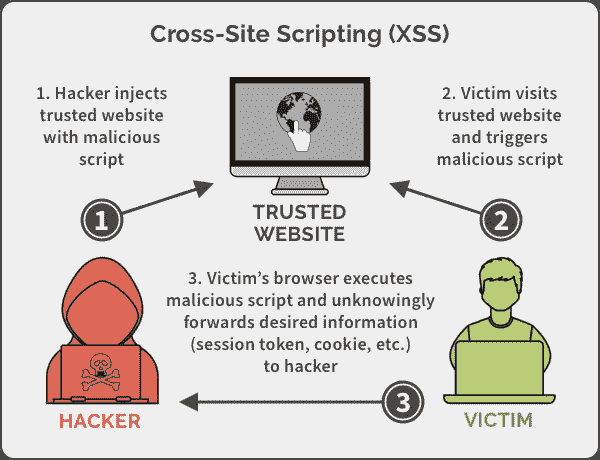

# 网站安全—综合指南

> 原文：<https://javascript.plainenglish.io/website-security-a-comprehensive-guide-3888684afac6?source=collection_archive---------3----------------------->

## 网站威胁-跨站点脚本(XSS)、跨站点请求伪造(CSRF)和 SQL 注入


Web 安全是一个经常被前端开发人员忽略的话题。当我们评估网站的质量时，我们通常会查看性能、搜索引擎优化友好性和可访问性等指标，而网站抵御恶意攻击的能力通常会被忽略。

尽管敏感的用户数据存储在服务器端，并且后端开发人员必须采取重要措施来保护服务器，但最终，保护数据安全的责任由后端和前端共同承担。虽然敏感数据可能被安全地锁定在后端仓库中，但前端掌握着前门的钥匙，窃取它们通常是获得访问权限的最简单方法。网站安全*更正式的定义是:*

> "保护网站免受未经授权的访问、使用、修改、破坏或中断的行为/实践."

# 网站漏洞和威胁

本节仅列出几个最常见的网站威胁—跨站点脚本(XSS)、跨站点请求伪造(CSRF)和 SQL 注入。此外，还有它们是如何工作的，以及它们是如何缓解的。

# 跨站点脚本(XSS)

跨站脚本(XSS)是 web 应用中的一个漏洞，**允许第三方代表 web 应用**在用户的浏览器中执行脚本。跨站点脚本是当今网络上最普遍的漏洞之一。针对用户的 XSS 攻击可导致各种后果，如帐户受损、帐户删除、权限提升、恶意软件感染等。

在最初的日子里，它被称为 CSS，并不完全是今天的样子。最初，人们发现恶意网站可以利用 JavaScript 从其他网站的响应中读取数据，方法是将这些数据嵌入到 iframe 中，运行脚本并修改页面内容。当时它被称为 CSS(跨站点脚本)。当 Netscape 引入相同来源策略时，定义发生了变化，并且跨站点脚本被限制启用跨来源响应读取。很快就有人建议将这个漏洞称为 XSS，以避免与级联样式表(CSS)混淆。



## XSS 攻击是如何运作的？

*   当攻击者将他们自己的代码注入网页时，通常是通过利用网站软件上的漏洞来实现的，然后他们可以注入自己的脚本，由受害者的浏览器执行。
*   由于 JavaScript 在受害者的浏览器页面上运行，**关于认证用户的敏感细节可以从会话**中被窃取，这实质上允许一个不良行为者瞄准网站管理员并完全危及网站。
*   跨站点脚本攻击的另一个常见用途是当漏洞出现在网站最公开的页面上时。在这种情况下，攻击者可以通过**添加他们自己的广告、网络钓鱼提示或其他恶意内容来注入他们的代码，以网站的访问者为目标。**
*   另一种导致 XSSed 的可能性是，在将用户提供的输入插入到响应中之前，网站没有正确处理这些输入。在这种情况下，可以给出一个精心制作的输入，当嵌入到响应中时，该输入充当 JS 代码块并由浏览器执行。

## 跨站点脚本攻击的类型

既然我们已经介绍了基础知识，让我们再深入一点。根据他们的目标，坏演员可以以多种不同的方式使用跨站点脚本。让我们看看一些最常见的攻击类型。

## ①XSS 的反映

*   当有效负载存储在从浏览器发送到服务器的数据中时，会发生反射式跨站点脚本攻击。如果每次执行都必须提供输入，这种 XSS 称为反射。**这些攻击大多通过直接向受害者发送有效载荷来实施**。受害者用包含有效负载的请求请求页面，有效负载作为脚本嵌入到响应中
*   反射 XSS 攻击的例子包括攻击者在从网站的搜索或联系表单发送的数据中存储恶意脚本。一个典型的例子是**搜索表单**，访问者将他们的搜索查询发送到服务器，只有他们能看到结果。
*   反射 XSS 有时也被称为**非持久性**或**二型 XSS** 。

下面是一个反映 XSS 漏洞的简单示例:

`https://insecure-website.com/status?message=All+is+well
<p>Status: All is well.</p>`

该应用程序不执行任何其他数据处理，因此攻击者可以很容易地构建这样的攻击:

`https://insecure-website.com/status?message=<script>/*+Bad+stuff+here...+*/</script>`

`<p>Status: <script>/* Bad stuff here... */</script></p>`

如果用户访问攻击者构建的 URL，那么攻击者的脚本将在用户的浏览器中，在用户与应用程序的会话上下文中执行。此时，脚本可以执行任何操作，并检索用户有权访问的任何数据。


## 2)存储的 XSS

*   当**攻击者将他们的有效负载存储在一个受损的服务器**上，导致网站向其他访问者发送恶意代码时，就会发生存储跨站点脚本攻击。
*   由于这种方法只需要攻击者的一个初始操作，之后会危及许多访问者的安全，因此这是最危险也是最常用的跨站点脚本类型。
*   存储跨站点脚本攻击的示例包括配置文件字段，如您的用户名或电子邮件，它们保存在服务器上并显示在您的帐户页面上。
*   储存的 XSS 有时也被称为**持续型**或**I 型 XSS。**

下面是一个存储 XSS 漏洞的简单示例。留言板应用程序允许用户提交消息，并显示给其他用户:

`<p>Hello, this is my message!</p>`

该应用程序不执行任何其他数据处理，因此攻击者可以很容易地发送攻击其他用户的消息:

`<p><script>/* Bad stuff here... */</script></p>`


## 3)基于 DOM 的 XSS

*   当服务器本身不容易受到 XSS 攻击，而是页面上的 JavaScript 容易受到攻击时，基于 DOM 的跨站脚本攻击就会发生。
*   由于 JavaScript 用于增加页面的交互性，URL 中的参数可用于在页面加载后修改页面。通过在 DOM 没有净化来自用户的值时修改 DOM，攻击者可以向页面添加恶意代码。
*   基于 DOM 的跨站点脚本攻击的一个例子是，当网站将语言选择从默认语言更改为 URL 中提供的语言时。


## 如何防止 XSS 袭击？

在某些情况下，防止跨站点脚本编写是微不足道的，但根据应用程序的复杂性和它处理用户可控制数据的方式，这可能要困难得多。

一般来说，有效预防 XSS 漏洞可能涉及以下措施的组合:

*   **到达时过滤输入-** 在接收用户输入时，尽可能严格地根据预期的或有效的输入进行过滤。
*   **Allowlist 值-** 将用户输入限制到特定的 Allowlist。这种做法确保了只有已知的安全值被发送到服务器。限制用户输入只有在您知道将接收什么数据(如下拉菜单的内容)时才有效，对于自定义用户内容来说并不实用。
*   **在输入中避免和限制 HTML-**虽然 HTML 可能是丰富内容所必需的，但它应该仅限于可信用户。如果您允许对输入进行样式化和格式化，那么您应该考虑使用其他方法来生成内容，比如 Markdown。
    最后，如果您确实使用 HTML，请确保使用强大的杀毒软件(如 [**DOMPurify**](https://github.com/cure53/DOMPurify) )来清除所有不安全的代码。
*   **对输出数据进行编码-** 在 HTTP 响应中输出用户可控制的数据时，对输出进行编码，以防止它被解释为活动内容。根据输出上下文，这可能需要应用 HTML、URL、JavaScript 和 CSS 编码的组合。
*   **使用适当的响应头-** 为了防止 HTTP 响应中不包含任何 HTML 或 JavaScript 的 XSS，您可以使用`Content-Type`和`X-Content-Type-Options`头来确保浏览器按照您想要的方式解释响应。
*   **在 cookie 上使用 HTTPOnly 标志** -会话 cookie 是一种允许网站在请求之间识别用户的机制，攻击者经常通过渗透他们的 cookie 来窃取管理会话。一旦 cookie 被盗，攻击者就可以在没有凭据或授权访问的情况下登录他们的帐户。
    使用 HttpOnly cookies 来防止 JavaScript 读取 cookie 的内容，使攻击者更难窃取会话。
    *注意:*这种方法只是防止攻击者读取 cookie。攻击者仍然可以作为管理员用户使用活动的浏览器会话发送请求。这种方法也只有在依赖 cookies 作为主要识别机制时才有用。
*   **内容安全策略。**作为最后一道防线，您可以使用内容安全策略(CSP)来降低仍然发生的任何 XSS 漏洞的严重性。`<meta>`元素可用于配置策略，例如:

```
<meta http-equiv="Content-Security-Policy"
      content="default-src 'self'; 
      img-src https://*; child-src 'none';">
```

# 跨站点请求伪造(CSRF)

跨站点请求伪造(CSRF)是一种攻击，它迫使经过身份验证的用户向他们当前正在进行身份验证的 Web 应用程序提交请求。 **CSRF 攻击利用了 Web 应用程序对经过身份验证的用户的信任。(相反，跨站点脚本(XSS)攻击利用了用户对特定 Web 应用程序的信任)**。如果 Web 应用程序不能区分单个用户生成的请求和未经用户同意而由用户生成的请求，那么 CSRF 攻击就利用了 Web 应用程序中的漏洞。

攻击者实施 CSRF 攻击的目的是迫使用户提交状态更改请求。例子包括:

*   提交或删除记录。
*   提交交易。
*   购买产品。
*   更改密码。
*   传递信息。

攻击者经常利用社交工程平台发起 CSRF 攻击。这会诱使受害者单击包含恶意创建的、对特定 Web 应用程序的未授权请求的 URL。然后，用户的浏览器将这个恶意创建的请求发送到目标 Web 应用程序。该请求还包括与特定网站相关的任何凭证(例如，用户会话 cookies)。如果用户正在与目标 Web 应用程序进行活动会话，应用程序会将这个新请求视为用户提交的授权请求。因此，攻击者成功利用了 Web 应用程序的 CSRF 漏洞。


## CSRF 攻击是如何运作的？

*   CSRF 攻击的目标是无法区分有效请求和攻击者控制的伪造请求的 Web 应用程序。攻击者可以通过多种方式尝试利用 CSRF 漏洞。
*   举个例子，假设鲍勃在 samplebank.com 有一个网上银行账户。他定期访问该网站，与他的朋友 Alice 进行交易。鲍勃不知道 samplebank.com 容易受到 CSRF 的攻击。与此同时，攻击者试图利用这个漏洞从 Bob 的帐户中转移 5000 美元。要成功发起攻击:

1.  攻击者必须构建一个漏洞利用 URL。
2.  攻击者还必须诱骗 Bob 点击漏洞利用 URL。
3.  鲍勃需要与 samplebank.com 进行一次积极的对话。

假设使用 GET 方法构建在线银行应用程序来提交转账请求。因此，Bob 向 Alice(账号为 213367)转账 500 美元的请求可能如下所示:

*获取*[*https://samplebank.com/onlinebanking/transfer?amount=500&账号=213367*](https://samplebank.com/onlinebanking/transfer?amount=500&accountNumber=213367) *HTTP/1.1*

与成功发起 CSRF 攻击的第一个要求一致，攻击者必须创建一个恶意的 URL 来向帐户 425654 转账 5000 美元:

[https://samplebank.com/onlinebanking/transfer?amount=5000&账号=425654](https://samplebank.com/onlinebanking/transfer?amount=5000&accountNumber=425654)

利用各种社会工程攻击方法，攻击者可以诱骗 Bob 加载恶意 URL。这可以通过多种方式实现。例如，在表单中包含恶意的 HTML 图像元素，在用户登录应用程序时经常访问的页面上放置恶意的 URL，或者通过电子邮件发送恶意的 URL。

以下是伪装 URL 的一个示例:

**

考虑这样一种情况:攻击者在发给 Bob 的特制电子邮件中包含一个图像标记。收到后，Bob 的浏览器应用程序会自动打开该 URL，无需人工干预。结果，在未经 Bob 允许的情况下，一个恶意请求被发送到在线银行应用程序。如果鲍勃与 samplebank.com 有一个活动会话，应用程序会将其视为来自鲍勃的授权金额转账请求。然后，它会将金额转移到攻击者指定的账户。

## 如何防止 CSRF 袭击？

从用户的角度来看，最佳实践包括注销 web 应用程序、不允许浏览器记住密码、自动下载图像、保护用户名和密码等。

对于网络应用和网站来说，这是防止 CSRF 黑客攻击的两种流行方式:

1.  **反 CSRF 令牌-** 防止 CSRF 漏洞最常见的方法是基于令牌的缓解，称为*反 CSRF* 或*同步器*令牌。它是一个加密的安全令牌，作为隐藏字段添加到表单中。然后，反 CSRF 令牌被包含在任何需要 cookie 的经过身份验证的状态更改请求中。只有令牌通过验证，web 应用程序才会接受请求。由于令牌位于隐藏字段中，并且在每次提供页面时随机生成，因此它可以保护 web 应用程序免受 CSRF 攻击。
2.  CSRF 攻击之所以奏效，是因为他们利用了这样一个事实:当网站 A 向网站 B 发出请求时，属于网站 A 的 cookie 会被附加到请求中。为了防止这种情况，Google Chrome 团队引入了同站点 cookies 的概念。Set-Cookie 标头中添加了一个新属性，以标记来自同一来源的 Cookie。因此，只接受来自与 cookie 相关的源的请求，而不是跨域的请求。

# SQL 注入

SQL 注入，也称为 SQLI，是一种常见的攻击媒介，它使用**恶意 SQL 代码进行后端数据库操作，以访问不打算显示的信息****。这些信息可能包括任意数量的项目，包括敏感的公司数据、用户列表或私人客户详细信息。**

**SQL 注入对企业的影响是深远的。成功的攻击可能导致未经授权查看用户列表、删除整个表，在某些情况下，攻击者还会获得数据库的管理权限，所有这些都会对企业造成极大的损害。在计算 SQLi 的潜在成本时，如果电话号码、地址和信用卡信息等个人信息被盗，考虑客户信任的损失是很重要的。**

****

## **SQL 注入是如何工作的？**

**要进行 SQL 注入攻击，攻击者必须首先在网页或 web 应用程序中找到易受攻击的用户输入。具有 SQL 注入漏洞的网页或 web 应用程序直接在 SQL 查询中使用这种用户输入。攻击者可以创建输入内容。此类内容通常被称为恶意负载，是攻击的关键部分。攻击者发送这些内容后，就会在数据库中执行恶意的 SQL 命令。**

**SQL 是一种查询语言，旨在管理存储在关系数据库中的数据。您可以使用它来访问、修改和删除数据。许多 web 应用程序和网站将所有数据存储在 SQL 数据库中。在某些情况下，您还可以使用 SQL 命令来运行操作系统命令。因此，成功的 SQL 注入攻击会造成非常严重的后果。**

*   **攻击者可以使用 SQL 注入来查找数据库中其他用户的凭据。然后他们可以模拟这些用户。被模拟的用户可以是具有所有数据库特权的数据库管理员。**
*   **SQL 允许您从数据库中选择和输出数据。SQL 注入漏洞可能允许攻击者完全访问数据库服务器中的所有数据。**
*   **SQL 还允许您更改数据库中的数据并添加新数据。例如，在一个金融应用程序中，攻击者可以使用 SQL 注入来更改余额、取消交易或将资金转移到他们的帐户。**
*   **您可以使用 SQL 从数据库中删除记录，甚至删除表。即使管理员备份了数据库，删除数据也会影响应用程序的可用性，直到数据库恢复。此外，备份可能不会覆盖最新的数据。**
*   **在某些数据库服务器中，您可以使用数据库服务器访问操作系统。这可能是有意的，也可能是偶然的。在这种情况下，攻击者可以使用 SQL 注入作为初始媒介，然后攻击防火墙后面的内部网络。**

**SQL 注入攻击有几种类型:**带内 SQLi (** 使用数据库错误或联合命令)、**盲 SQLi** 和**带外 SQLi** 。**

**假设您的应用程序有一个如下所示的 SQL 命令，其中 uname 和 pwd 是用户的 POST 输入。**

```
SELECT * FROM users WHERE user_name = ’” + uname + “’ AND password=’” + pwd + “’”
```

**攻击者输入密码为“密码”或 1 = 1；翻桌**

**因为“1=1”总是成立的，所以当查询运行时，整个用户表都将被删除。**

## **如何预防 SQL 注入？**

**以下是一些基本的编码卫生实践，以保护您的组织的网站免受 SQL 注入攻击:**

*   **将您的查询参数化，而不是直接将用户输入嵌入其中。**
*   **对 SQL 中有特殊含义的字符进行转义。**
*   **模式-检查您的参数。**
*   **使用数据库权限限制对敏感表的访问**

****网络应用防火墙(WAF)** 通常用于过滤 SQLI 以及其他在线威胁。为了做到这一点，WAF 通常依赖于一个庞大的、不断更新的、精心制作的签名列表，该列表允许它像外科手术一样清除恶意的 SQL 查询。通常，这种列表包含针对特定攻击媒介的签名，并定期进行修补，以引入针对新发现漏洞的阻止规则。**

# **结论**

**网站安全需要成为你的首要任务之一。保持警惕并实施正确的系统将有助于你、你的网站和你的企业在避免不良行为时取得成功。但是，您可以通过采取上面概述的安全措施，让他们很难做到这一点。**

**最终，如果网络犯罪分子很难入侵一个网站，他们就会转移到其他没有实施我们谈到的网站安全策略的网站。**

**希望这能让你对网站安全感到更放心。感谢您的阅读:)**

***更多内容尽在*[***plain English . io***](http://plainenglish.io/)**