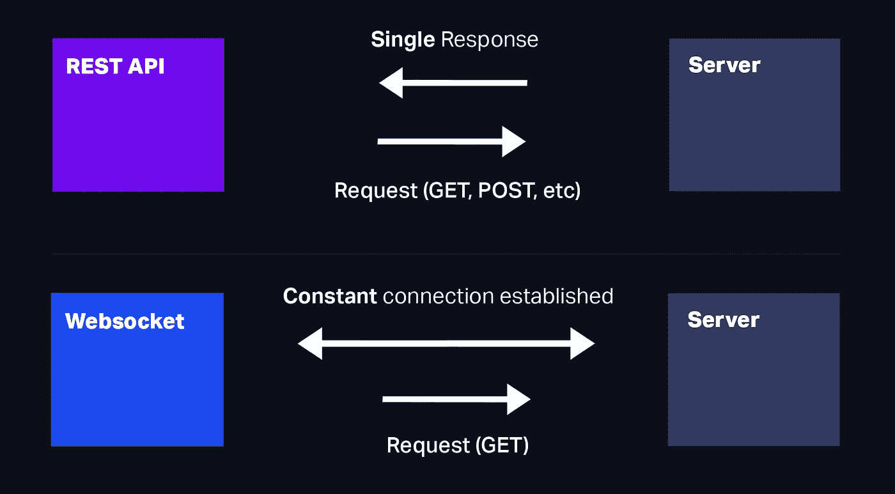
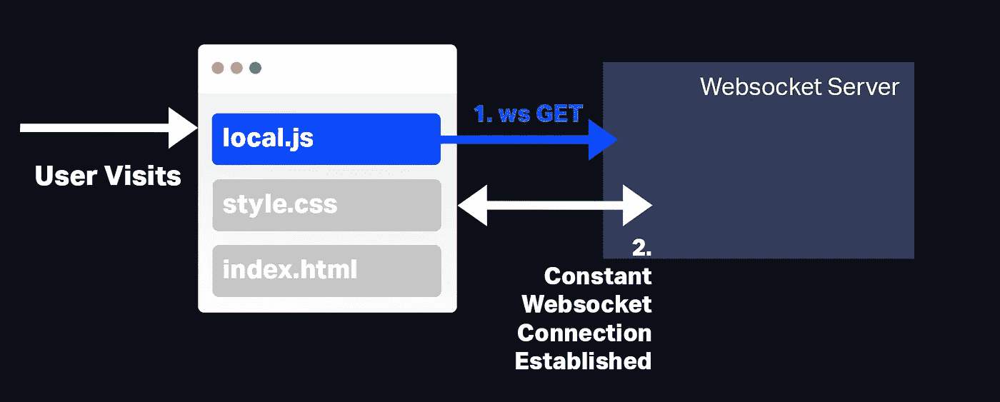

# WebSockets 教程:创建实时 WebSocket 服务器

> 原文：<https://javascript.plainenglish.io/websockets-tutorial-creating-a-real-time-websocket-server-86508661b104?source=collection_archive---------13----------------------->

Photo by [Skylar Kang](https://www.pexels.com/@skylar-kang?utm_content=attributionCopyText&utm_medium=referral&utm_source=pexels) from [Pexels](https://www.pexels.com/photo/armchair-near-floor-lamp-in-empty-house-6044969/?utm_content=attributionCopyText&utm_medium=referral&utm_source=pexels)

我们用 JavaScript 做的很多工作都涉及到从服务器来回发送信息。你可能熟悉 API 的**概念，**以特定的格式向服务器或网站发送数据，以获得特定的响应。

这些被称为 REST APIs。虽然有用，但它们不太擅长持续的数据流。如果你试图用 REST APIs 做一些实时的事情，你会有一段不好的时间。幸运的是，**如果我们想要与用户**实时连接，我们有一个替代方案，称为 **WebSockets** 。

# WebSockets 如何工作

Websockets 本质上是服务器和计算机之间的持续连接。当你访问一个网站时，它可以向服务器发送一个`GET`请求，启动用户和服务器之间的 WebSocket 连接。

# WebSockets vs REST API

如果用户离开网站，连接就会被切断，因此只要用户继续使用网站，他们就只能访问 WebSocket。

# WebSocket 可以保持开放多长时间？

一旦 WebSocket 被创建，理论上它可以永远保持开放。对此有一些例外:

*   服务器关闭——这将中断 WebSocket，但是我们可以尝试重新连接它。
*   停电或互联网连接问题—如果用户的互联网中断，连接将会中断。
*   不活动—如果用户不通过 WebSocket 进行交互或发送数据，连接不可避免地会超时。

因此，当我们设计 WebSockets 时，我们需要考虑如果用户的连接由于某种原因停止，我们如何重新连接到它们，以便不中断用户的体验。

# 制作 WebSocket

因此，WebSocket 由两部分组成——服务器和用户使用的本地机器。对于我们正在做的事情，我们将使用 Node.js 作为我们的服务器，但是其他语言也支持 WebSockets。

当用户访问我们的网站时，我们加载一个带有 JavaScript 的文件，该文件包含一个到 WebSocket 的连接字符串。同时，在我们的后端，我们将设置用户将连接到的 WebSocket。如下图所示:

# 步骤 1:创建我们的服务器 [#](https://fjolt.com/article/javascript-websockets#step-1:-creating-our-server)

让我们首先为 WebSocket 连接创建 Node.js web 服务器。为此，我们将使用一个带有名为`express-ws`的附加包的 express 服务器。这个额外的包将允许我们像使用`get`一样使用`ws`。

最后一个子句`app.ws`，指的是 WebSocket，这是我们将尝试在前端连接到的。目前，WebSocket only 控制台记录一条消息，只要它从前端接收到一条消息。让我们改变它，让它发送一些东西回来:

现在，每当这个 WebSocket 连接接收到数据时，它都会发送回一个对象，我们已经在上面定义过了。然后，我们可以在前端操作这个对象，为用户显示或更改视图。

# 步骤 2:在前端连接

正如我们之前提到的，当用户访问我们的网站时，我们在 HTML 文档中为他们提供一些本地 JavaScript。我在 index.html 文件中为我们的演示添加了一些其他元素:

接下来，我们需要在我们的`local.js`文件中放入一些连接细节。我已经创建了一个连接文件，我们在文档加载后运行它。看起来是这样的:

要连接到 WebSocket，我们必须使用 ws://，而不是 HTTP，以及 wss://，而不是 HTTPS。我们将它放入我们的`new WebSocket()`函数中来生成我们的连接。在我们的连接函数中，我们有三个事件监听器:

*   `socket.onopen` -如果连接成功并打开，将触发此操作。
*   `socket.onmessage` -每当服务器向我们发送信息时，就会触发。在我们的例子中，如果用户接收到将`append`设置为`true`的数据，我们将在用户的 HTML 中添加一个新元素。
*   `socket.onerror` -如果连接失败，或者发生错误，这将触发。

让我们把它们联系在一起——因为我们将套接字变量存储在全局范围内，所以我们可以在连接成功后发送数据。下面的事件监听器连接到 WebSocket，然后在用户单击我们的 HTML 按钮时向服务器发送数据。

当服务器接收到这些数据时，它会在服务器的 message 事件触发时发送回自己的数据。这返回给用户，然后用户向他们的文档添加一个新元素。

# 结论

就是这样！现在我们有了一个正常工作的 WebSocket，它允许你向服务器发送数据，然后返回给用户。如果您想了解更多或下载源代码，这里有一些有用的链接:

*   [通过 Github 下载代码](https://github.com/smpnjn/express-websocket)
*   [web socket 规范](https://html.spec.whatwg.org/multipage/web-sockets.html)

*更多内容请看*[*plain English . io*](http://plainenglish.io/)