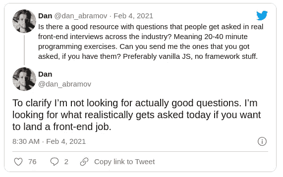
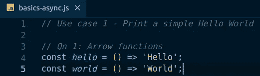

# 有效的 20 分钟 JavaScript 面试应该是什么样的

> 原文：<https://javascript.plainenglish.io/what-an-effective-20-minute-javascript-interview-should-look-like-a7dba1daa910?source=collection_archive---------3----------------------->


Photo by [Clément Hélardot](https://unsplash.com/@clemhlrdt?utm_source=unsplash&utm_medium=referral&utm_content=creditCopyText) on [Unsplash](https://unsplash.com/s/photos/work?utm_source=unsplash&utm_medium=referral&utm_content=creditCopyText)

在面试过程中，面试官和被面试者的脑子里会发生很多事情。一般来说，面试官的目标是挑选一个潜在的候选人，帮助项目团队和组织交付价值。



Source: [https://twitter.com/dan_abramov/status/1357161250057240579?lang=en](https://twitter.com/dan_abramov/status/1357161250057240579?lang=en)

偶尔会给资深前端或者后端开发者做面试。我正在分享一个这样的关于 JavaScript 面试的经历，以帮助面试官和被面试者。

***免责声明:*** *观点分享均为我个人观点，不一定是我组织的*

在我进入采访的细节之前，我想强调以下几点

**对面试官**

*   避免提供代码难题，并询问输出。因为我们面试的是候选人(人)，而不是编译器/运行时引擎。
*   为候选人创造机会，展示他们解决问题/使用案例的方法。他们的互动是至关重要的，而不是你的确切代码或答案。

**对受访者**

*   每个机会都是学习的机会。
*   学习是一个持续的过程。改进的范围和要采取的步骤由您决定。所以不要根据面试结果得出任何结论。
*   面试的选择基于你今天能做什么。有时，一个好的面试官能发现你的潜力(你将来能做的不同)并选择你。

一个简单的“hello world”方法可以帮助评估候选人的 JavaScript 流利程度。最初的问题可能听起来很简单，但请继续。我更喜欢在候选人详述解决方案时对其进行编码。如果他/她的系统准备好了 IDE，候选人可以直接编码。

*💡如今，采访都是通过 WebEx/Zoom 进行的，在这里你可以很容易地分享你的 IDE 来进行讨论*

**用例 1:打印一个简单的 hello world 消息**。我已经创建了两个简单的箭头函数。



“Hello World” in JS

我将利用这段时间讨论箭头函数、“this”的范围、模板字符串、控制台日志与调试器方法，以及其他一些基本特性。

```
**// *Qn 2: Template string***// *Solution for Use case 1
console.log*(`Ans 1 & 2: ${*hello*()} ${*world*()}`);
```

**用例 2——延迟响应**,对于“你好”延迟 300 毫秒，对于“世界”延迟 200 毫秒

```
**// *Qn 3: setTimeout***const *helloTimeout* =()=> *setTimeout*(hello,300);
const *worldTimeout* =()=> *setTimeout*(world,200);// *Incomplete solution
console.log*(`Ans 3: ${*helloTimeout*()} ${*worldTimeout*()}`); 
```

输出将是整数，而不是预期的“Hello World”。候选人可以马上指出不完整的地方，并提出解决方案。有时我们可能会引导他们找到解决方案。我将利用这个机会谈论 setTimeout 与 setInterval，clearInterval 的重要性等等。

```
**// *Qn 4: Promise***const *delayedHello* =()=> new *Promise*((*resolve*, *reject*)=> *setTimeout*(()=> *resolve*(*hello*()),300));const *delayedWorld* =()=> new *Promise*((*resolve*, *reject*)=> *setTimeout*(()=> *resolve*(*world*()),200));// *Incomplete solution
console.log*(`Ans 4: ${*delayedHello*()} ${*delayedWorld*()}`); 
```

输出将是一个 Promise 对象，而不是预期的“Hello World”。同样，交互是至关重要的，但不是精确的解决方案。

```
**// *Qn 5: Promise.then().catch()***// *Solution for Use case 2
delayedHello*()*.then*((h) => 
  *delayedWorld*()*.then*((w) => *console.log*(`Ans 5: ${h} ${w}`))
);
```

探索另一种解决方案。抓住机会讨论承诺所有/任何/比赛、承诺拒绝和错误处理、回拨地狱等。候选人建议异步/等待的可能性很高。

```
**// *Qn 6: Async/Await*** // *Alternate solution for Use case 2**async* function *greet*() {
  const *h* = *await delayedHello*();
  const *w* = *await delayedWorld*(); *console.log*(`Ans 6: ${h} ${w}`); }*greet*();
```

**用例 3——创建一个效用函数**,它接受“另一个函数”及其参数，但在指定的延迟后执行。

检查创建可重用功能/组件的本能，对不同编程模型的兴趣等。讨论高阶函数、currying、spread 和 rest 运算符、默认参数等等。

```
**// *Qn 7: High-order function and Currying
// Qn 8: Spread vs Rest operators
// Qn 9: Default parameters*** const *delayedExec* =(***fn***, *sleep*)=>{
  *return* (**...*args***)=>{
    *return* new *Promise*((*resolve*, *reject*)=> 
        *setTimeout*(()=> *resolve*(***fn***(**...args**)),sleep)
    );
  };
};const *helloFn* =()=>'Hello';
const *worldFn* =(*msg*)=>msg;*async* function *greetV2*() {
  const *h* = *await delayedExec*(helloFn,300)**()**;
  const *w* = *await delayedExec*(worldFn,200)**('World')**;
  *console.log*(`Ans 7 & 8: ${h} ${w}`);}*greetV2*();
```

回忆整个交互过程，并将其与直接询问 JavaScript 问题进行比较

Q1:箭头函数
Q2:模板字符串
Q3:setTimeout vs setInterval
Q4:承诺和错误处理
Q5: Promise.then()。catch()
Q6:Async/Await
Q7:高阶函数和 curry
Q8:Spread vs rest 运算符
Q9:默认参数

## **结论**

我分享过我的一次面试经历。我更喜欢基于“用例”的讨论，而不是选择过程中的理论问答。我希望这个博客能帮助面试官和被面试者成功地进行面试。欢迎通过评论分享你的经验。

**完整代码:**

Basic Async — JS Code Sample

*更多内容看* [***说白了. io***](http://plainenglish.io)